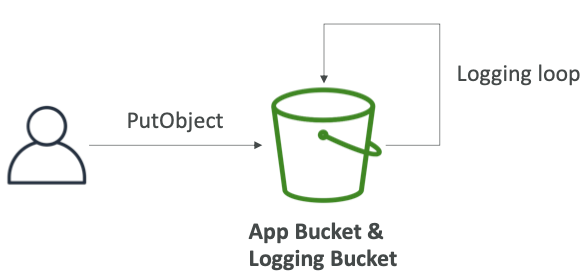
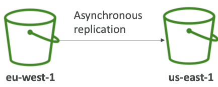
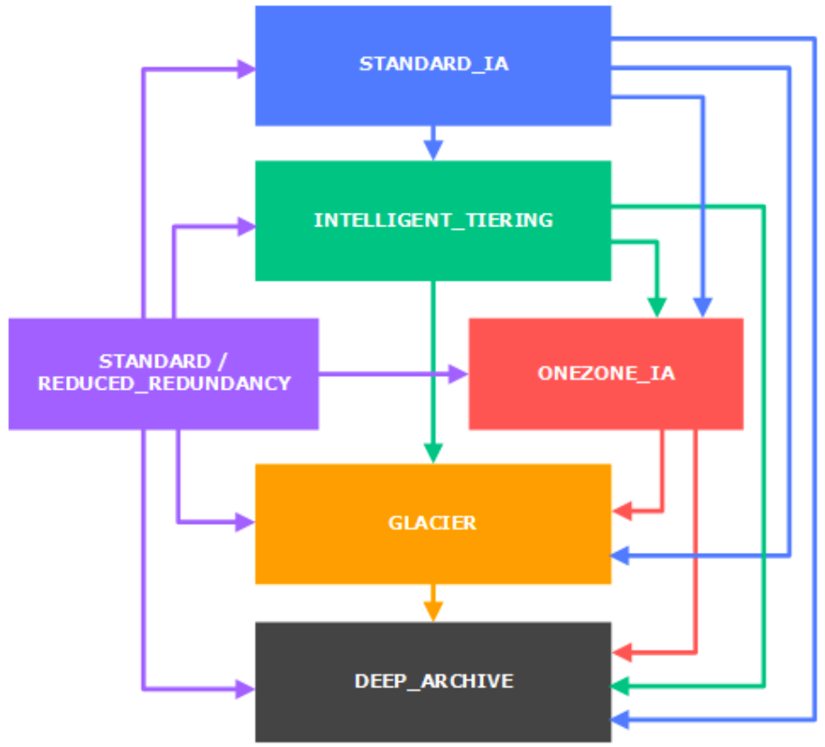
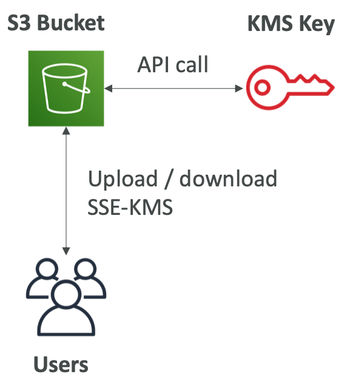
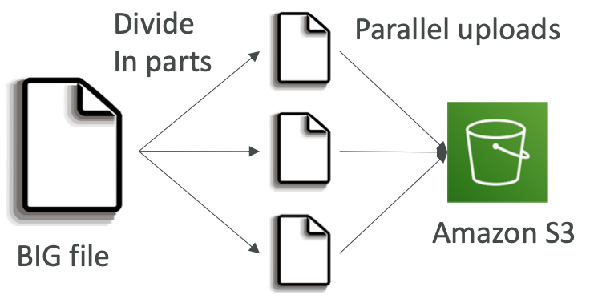
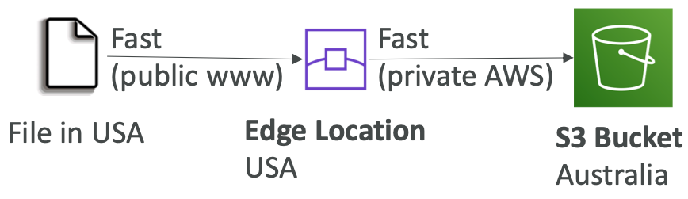
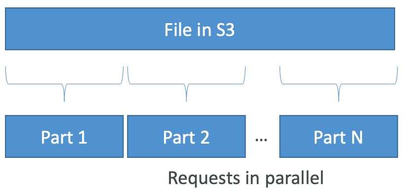
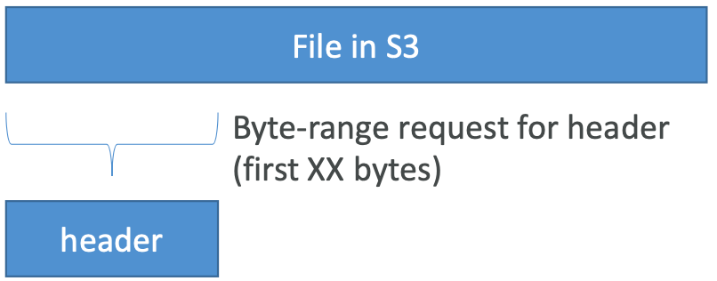
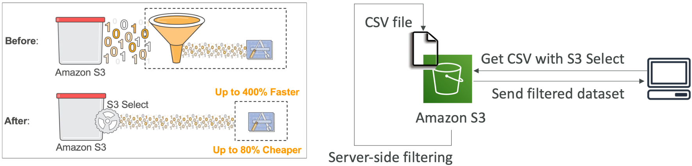
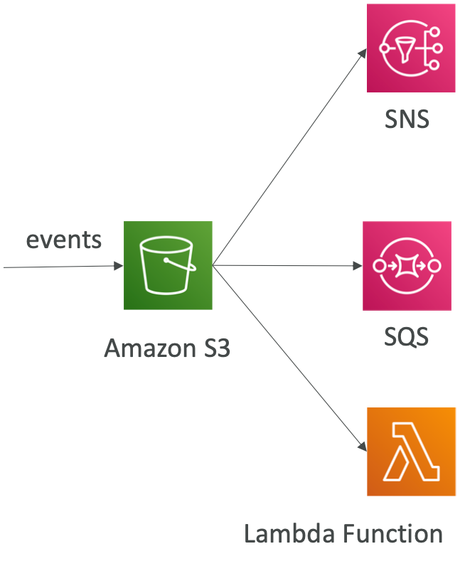

# Section 11: Advanced Amazon S3 & Athena

## S3 MFA-Delete

- MFA (multi factor authentication) forces user to generate a code on a device (usually a mobile phone or hardware) before doing important operations on S3

- To use MFA-Delete, enable Versioning on the S3 bucket

- You will need MFA to

  - permanently delete an object version
  - suspend versioning on the bucket

- You won’t need MFA for

  - enabling versioning
  - listing deleted versions

  

- **Only the bucket owner (root account) can enable/disable MFA-Delete**

- MFA-Delete currently can only be enabled using the CLI

[#aws-saa]() [#S3]() 

## S3 Access Logs:Warning

* **Do not set your logging bucket to be the monitored bucket**

* It will create a logging loop, and your bucket will grow in size exponentially

  

[#aws-saa]() [#S3]() 

## S3 Replication (CRR & SRR)

- **Must enable versioning in source and destination**
- Cross Region Replication (CRR)
- Same Region Replication (SRR)
- Buckets can be in different accounts
- Copying is asynchronous
- Must give proper IAM permissions to S3

- <u>CRR - Use cases</u>: compliance, lower latency access, replication across accounts

- <u>SRR – Use cases</u>: log aggregation, live replication between production and test accounts

  

- After activating, only new objects are replicated (not retroactive)

- **For DELETE** operations:

  - If you delete without a version ID, it adds a delete marker, not replicated
  - If you delete with a version ID, it deletes in the source, not replicated

- **There is no “chaining” of replication**

  - If bucket 1 has replication into bucket 2, which has replication into bucket 3
  - Then objects created in bucket 1 are not replicated to bucket 3

- 

  

[#aws-saa]() [#S3]() 

## S3 Pre-Signed URLs

- Can generate pre-signed URLs using SDK or CLI 
- For downloads (easy, can use the CLI)
  - For uploads (harder, must use the SDK)
- Valid for a default of 3600 seconds, can change timeout with --expires-in [TIME_BY_SECONDS] argument
- Users given a pre-signed URL inherit the permissions of the person who generated the URL for GET / PUT
- Examples :
  - Allow only logged-in users to download a premium video on your S3 bucket
  - Allow an ever changing list of users to download files by generating URLs dynamically
  - Allow temporarily a user to upload a file to a precise location in our bucket

[#aws-saa]() [#S3]() 

## S3 Storage Classes

1. Amazon S3 Standard-General Purpose
2. Amazon S3 Standard-Infrequent Access (IA) 
3. Amazon S3 One Zone-Infrequent Access
4. Amazon S3 Intelligent Tiering
5. Amazon Glacier
6. Amazon Glacier Deep Archive

* Amazon S3 Reduced Redundancy Storage (deprecated - omitted)

[#aws-saa]() [#S3]() 

## S3 Standard – General Purpose

- High durability (99.999999999%) of objects across multiple AZ

- If you store 10,000,000 objects with Amazon S3, you can on average expect to incur a loss of a single object once every 10,000 years

- 99.99% Availability over a given year

- Sustain 2 concurrent facility failures

  

- <u>Use Cases:</u> Big Data analytics, mobile & gaming applications, content distribution...

[#aws-saa]() [#S3]() 

## S3 Standard – Infrequent Access (IA)

- Suitable for data that is less frequently accessed, but requires rapid access when needed

- High durability (99.999999999%) of objects across multiple AZs

- 99.9% Availability

- Low cost compared to Amazon S3 Standard

- Sustain 2 concurrent facility failures

  

- <u>Use Cases</u>: As a data store for disaster recover y, backups...

[#aws-saa]() [#S3]() 

## S3 One Zone - Infrequent Access (IA)

- Same as IA but data is stored in a single AZ

- High durability (99.999999999%) of objects in a single AZ; data lost when AZ is destroyed

- 99.5% Availability

- Low latency and high throughput performance

- Supports SSL for data at transit and encryption at rest

- Low cost compared to IA (by 20%)

  

- <u>Use Cases</u>: Storing secondary backup copies of on-premise data, or storing data you can recreate

[#aws-saa]() [#S3]() 

## S3 Intelligent Tiering

- Same low latency and high throughput performance of S3 Standard
- Small monthly monitoring and auto-tiering fee
- Automatically moves objects between two access tiers based on changing access patterns
- Designed for durability of 99.999999999% of objects across multiple Availability Zones
- Resilient against events that impact an entire Availability Zone
- Designed for 99.9% availability over a given year

[#aws-saa]() [#S3]() 

## Amazon Glacier

* Low cost object storage meant for archiving / backup 
* Data is retained for the longer term (10s of years)
* Alternative to on-premise magnetic tape storage
* Average annual durability is 99.999999999%

* Cost per storage per month ($0.004 / GB) + retrieval cost
* Each item in Glacier is called “**Archive**” (up to 40TB)
* Archives are stored in ”**Vaults**”

[#aws-saa]() [#S3]() 

## Amazon Glacier & Glacier Deep Archive

* Amazon Glacier – 3 retrieval options:
  *  Expedited (1 to 5 minutes)
  * Standard (3 to 5 hours)
  * Bulk (5 to 12 hours)
  * Minimum storage duration of 90 days

* Amazon Glacier Deep Archive – for long term storage – cheaper:
  * Standard (12 hours)
  * Bulk (48 hours)
  * Minimum storage duration of 180 days

[#aws-saa]() [#S3]()

## S3 – Moving between storage classes

- You can transition objects between storage classes

- For infrequently accessed object, move them to STANDARD_IA

- For archive objects you don’t need in real-time, GLACIER or DEEP_ARCHIVE

- Moving objects can be automated using a **lifecycle configuration**

  

[#aws-saa]() [#S3]()

## S3 Lifecycle Rules

- **Transition actions**: It defines when objects are transitioned to another storage class.

  - Move objects to Standard IA class 60 days after creation
  - Move to Glacier for archiving after 6 months

- **Expiration actions**: configure objects to expire (delete) after some time

  - Access log files can be set to delete after a 365 days
  - **Can be used to delete old versions of files (if versioning is enabled)**
  - Can be used to delete incomplete multi-part uploads

  

- Rules can be created for a certain prefix (ex - s3://mybucket/mp3/*)

- Rules can be created for certain objects tags (ex - Department: Finance)

[#aws-saa]() [#S3]()

## S3 Lifecycle Rules – Scenario 1

Q: **Your application on EC2 creates images thumbnails after profile photos are uploaded to Amazon S3.These thumbnails can be easily recreated, and only need to be kept for 45 days. The source images should be able to be immediately retrieved for these 45 days, and afterwards, the user can wait up to 6 hours. How would you design this?**

A:

- S3 source images can be on STANDARD, with a lifecycle configuration to transition them to GLACIER after 45 days.
- S3 thumbnails can be on ONEZONE_IA, with a lifecycle configuration to expire them (delete them) after 45 days.

[#aws-saa]() [#S3]()

## S3 Lifecycle Rules – Scenario 2

Q: **A rule in your company states that you should be able to recover your deleted S3 objects immediately for 15 days, although this may happen rarely. After this time, and for up to 365 days, deleted objects should be recoverable within 48 hours.**

A:

- You need to enable S3 versioning in order to have object versions, so that “deleted objects” are in fact hidden by a “delete marker” and can be recovered

- You can transition these “noncurrent versions” of the object to S3_IA

- You can transition afterwards these “noncurrent versions” to

  DEEP_ARCHIVE

[#aws-saa]() [#S3]()

## S3 – Baseline Performance

- Amazon S3 automatically scales to high request rates, latency 100-200 ms
- Your application can achieve at least **3,500 PUT/COPY/POST/DELETE and 5,500 GET/HEAD requests per second per prefix in a bucket.**
- There are no limits to the number of prefixes in a bucket.
- <u>Example (object path => prefix):</u>
  - bucket/folder1/sub1/file => /folder1/sub1/
  - bucket/folder1/sub2/file => /folder1/sub2/
  - bucket/1/file => /1/
  - bucket/2/file => /2/
- If you spread reads across all four prefixes evenly, you can achieve 22,000 requests per second for GET and HEAD

[#aws-saa]() [#S3]()

## S3 – KMS Limitation

- If you use SSE-KMS, you may be impacted by the KMS limits

- When you upload, it calls the **GenerateDataKey** KMS API

- When you download, it calls the **Decrypt** KMS API

- Count towards the KMS quota per second (5500, 10000, 30000 req/s based on region)

- As of today, you cannot request a quota increase for KMS

  

  [#aws-saa]() [#S3]()

  ## S3 Performance

- **Multi-Par t upload:**

  - recommended for files > 100MB, 

    must use for files > 5GB

  - Can help parallelize uploads (speed up transfers)

    

* **S3 Transfer Acceleration (upload only)**
  * Increase transfer speed by transferring file to an AWS edge location which will forward the data to the S3 bucket in the target region

  * Compatible with multi-part upload

    

[#aws-saa]() [#S3]()

## S3 Performance – S3 Byte-Range Fetches

* Parallelize GETs by requesting specific byte ranges

* Better resilience in case of failures 

<u>Can be used to speed up downloads</u>

<u>Can be used to retrieve only partial data (for example the head of a file)</u>

[#aws-saa]() [#S3]()

## S3 Select & Glacier Select

* Retrieve less data using SQL by performing server side filtering 

* Can filter by rows & columns (simple SQL statements)

* Less network transfer, less CPU cost client-side

  

https://aws.amazon.com/blogs/aws/s3-glacier-select/

[#aws-saa]() [#S3]()

## S3 Event Notifications

- S3:ObjectCreated, S3:ObjectRemoved, S3:ObjectRestore, S3:Replication...

- Object name filtering possible (*.jpg)

- <u>Use case</u>: generate thumbnails of images uploaded to S3

- **Can create as many “S3 events” as desired**

- S3 event notifications typically deliver events in seconds but can sometimes take a minute or longer

  

- If two writes are made to a single non-versioned object at the same time, it is possible that only a single event notification will be sent

- If you want to ensure that an event notification is sent for every successful write, you can enable versioning on your bucket.

  

[#aws-saa]() [#S3]() [#Athena]() 

## AWS Athena

- Serverless service to perform analytics directly against S3 files

- Uses SQL language to query the files

- Has a JDBC / ODBC driver

- Charged per query and amount of data scanned

- Supports CSV, JSON, ORC, Avro, and Parquet (built on Presto)

- Use cases: Business intelligence / analytics / reporting, analyze & query

  VPC Flow Logs, ELB Logs, CloudTrail trails, etc...

- Exam Tip: Analyze data directly on S3 => use Athena

[#aws-saa]() [#S3]()

## S3 Object Lock & Glacier Vault Lock

* **S3 Object Lock**
  * Adopt a WORM (Write Once Read Many) model
  * Block an object version deletion for a specified amount of time
* **Glacier Vault Lock**

- Adopt a WORM (Write Once Read

  Many) model

- Lock the policy for future edits (can no longer be changed)

- Helpful for compliance and data retention

[#aws-saa]() [#S3]()

