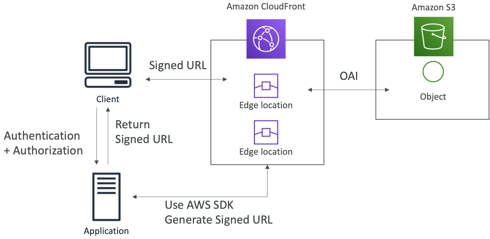
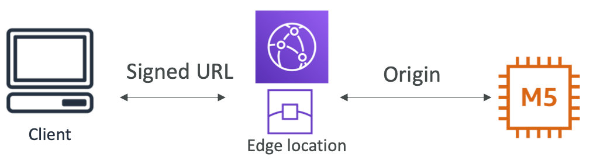
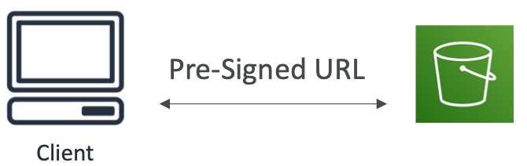
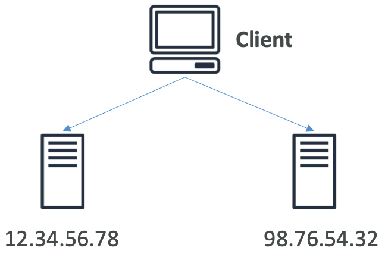
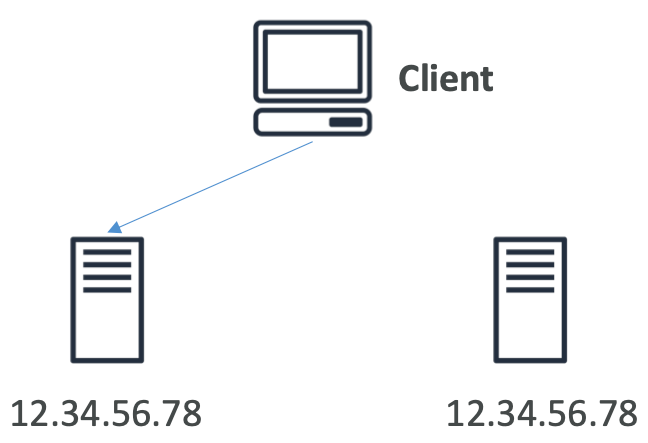
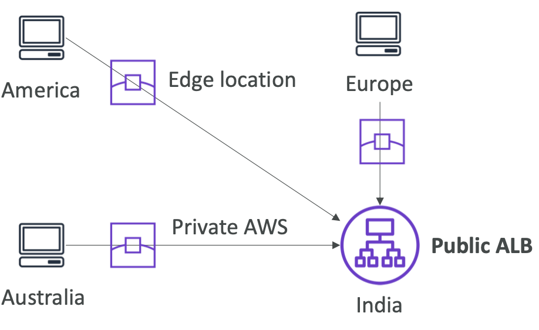

# Section 12: CloudFront & AWS Global Accelerator

## CloudFront – Origins

* **S3 bucket**
  * For distributing files and caching them at the edge
  * Enhanced security with CloudFront Origin Access Identity (OAI)
  * CloudFront can be used as an ingress (to upload files to S3)
* **Custom Origin (HTTP)**
  * Application Load Balancer
  * EC2 instance
  * S3 website (must first enable the bucket as a static S3 website)
  * Any HTTP backend you want

[#aws-saa]() [#CloudFront]()

## CloudFront Geo Restriction

* You can restrict who can access your distribution
  * **Whitelist**: Allow your users to access your content only if they're in one of the countries on a list of approved countries.
  * **Blacklist**: Prevent your users from accessing your content if they're in one of the countries on a blacklist of banned countries.

* The “country” is determined using a 3rd party Geo-IP database
* <u>Use case</u>: Copyright Laws to control access to content

[#aws-saa]() [#CloudFront]()

## CloudFront vs S3 Cross Region Replication

*  CloudFront:
  * Global Edge network
  *  Files are cached for a TTL (maybe a day)
  * **Great for static content that must be available everywhere**

* S3 Cross Region Replication:

  * Must be setup for each region you want replication to happen
  * Files are updated in near real-time
  * Read only
  * **Great for dynamic content that needs to be available at low-latency in few regions**

[#aws-saa]() [#CloudFront]()

## CloudFront Signed URL / Signed Cookies

* You want to distribute paid shared content to premium users over the world
* We can use CloudFront Signed URL / Cookie.We attach a policy with:
  * Includes URL expiration
  * Includes IP ranges to access the data from
  * Trusted signers (which AWS accounts can create signed URLs)

* How long should the URL be valid for?
  * Shared content (movie, music): make it short (a few minutes)
  * Private content (private to the user): you can make it last for years

* Signed URL = access to individual files (one signed URL per file)
* Signed Cookies = access to multiple files (one signed cookie for many files)

[#aws-saa]() [#CloudFront]()

## CloudFront Signed URL Diagram

[#aws-saa]() [#CloudFront]()

## CloudFront Signed URL vs S3 Pre-Signed URL

**CloudFront Signed URL:**

- Allow access to a path, no matter the origin

- Account wide key-pair, only the root can manage it

- Can filter by IP, path, date, expiration

- Can leverage caching features

  

**S3 Pre-Signed URL:**

* Issue a request as the person who pre-signed the URL

* Uses the IAM key of the signing IAM principal

* Limited lifetime

  

[#aws-saa]() [#CloudFront]()

## AWS Global Accelerator: Unicast IP vs Anycast IP

* **Unicast IP**: one server holds one IP address

  

* **Anycast IP**: all servers hold the same IP address and the client is routed to the nearest one

  

[#aws-saa]() [#Global Accelerator]()

## AWS Global Accelerator

- Leverage the AWS internal network to route to your application

- **2 Anycast IP** are created for your application

- The Anycast IP send traffic directly to Edge Locations

- The Edge locations send the traffic to your application

  

- Works with **Elastic IP, EC2 instances, ALB, NLB, public or private**

- Consistent Performance

  - Intelligent routing to lowest latency and fast regional failover
  - No issue with client cache (because the IP doesn’t change) 
  - Internal AWS network

- Health Checks

  - Global Accelerator performs a health check of your applications
  - Helps make your application global (failover less than 1 minute for unhealthy)
  - Great for disaster recovery (thanks to the health checks)

- Security

  - only 2 external IP need to be whitelisted
  - DDoS protection thanks to AWS Shield

[#aws-saa]() [#Global Accelerator]()

## AWS Global Accelerator vs CloudFront

* Same:
  * They both use the AWS global network and its edge locations around the world
  * Both services integrate with AWS Shield for DDoS protection.

* **CloudFront**
  * Improves performance for both cacheable content (such as images and videos)
  * Dynamic content (such as API acceleration and dynamic site delivery)
  * Content is served at the edge

* **Global Accelerator**
  * Improves performance for a wide range of applications over TCP or UDP
  * Proxying packets at the edge to applications running in one or more AWS Regions.
  * Good fit for non-HTTP use cases, such as gaming (UDP), IoT (MQTT), or Voice over IP
  * Good for HTTP use cases that require static IP addresses
  * Good for HTTP use cases that required deterministic, fast regional fail over

[#aws-saa]() [#Global Accelerator]()