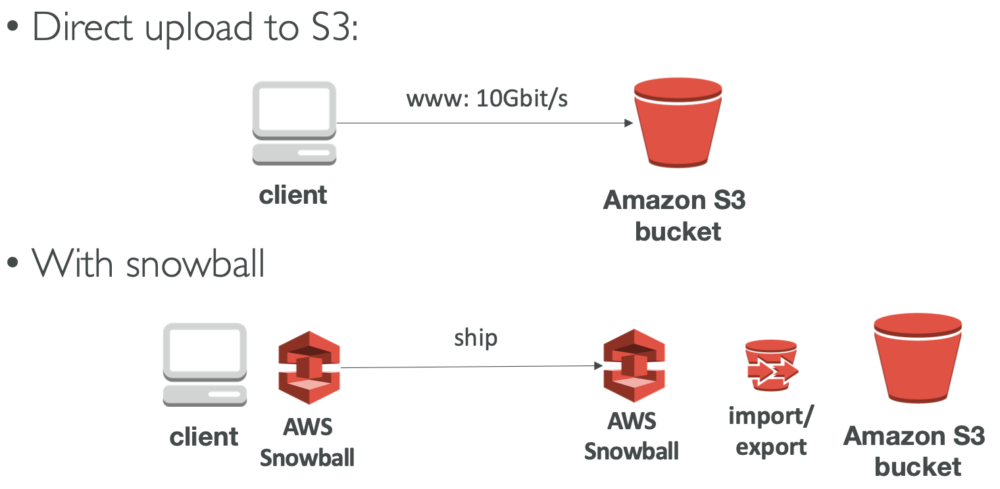
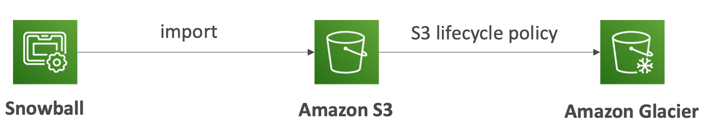
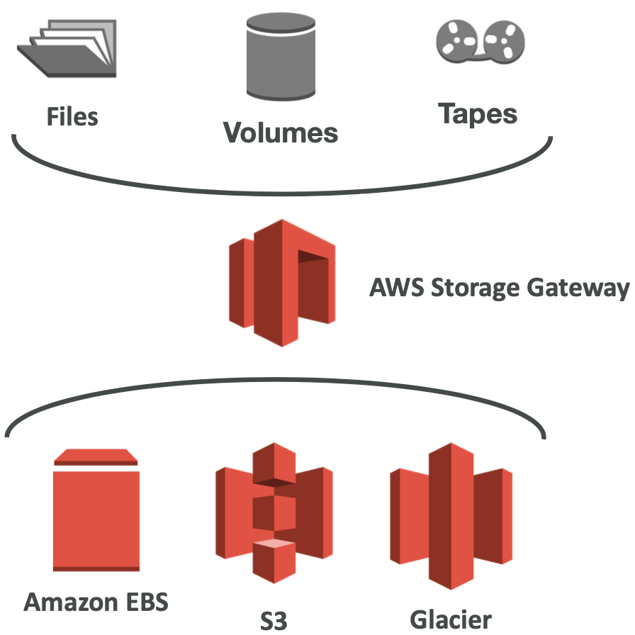
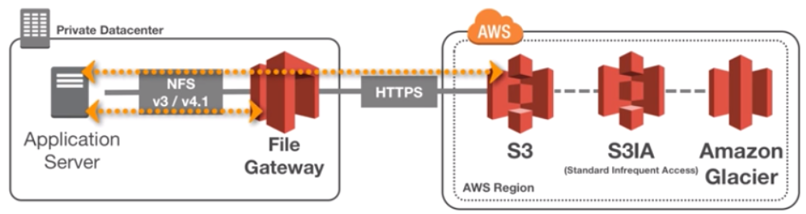
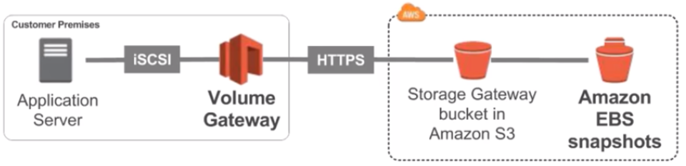
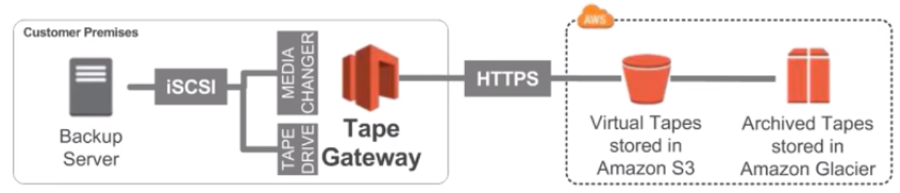

# Section 13: AWS Storage Extras

## Snowball

- Physical data transport solution that helps moving TBs or PBs of data in or out of AWS
- Alternative to moving data over the network (and paying network fees)
- Secure, tamper resistant, uses KMS 256 bit encr yption
- Tracking using SNS and text messages. E-ink shipping label

- Pay per data transfer job
- Use cases: large data cloud migrations, DC decommission, disaster recovery
- If it takes more than a week to transfer over the network, use Snowball devices!

[#aws-saa]() [#Snowball]()

# Snowball Process

1. Request snowball devices from the AWS console for delivery

2. Install the snowball client on your servers

3. Connect the snowball to your servers and copy files using the client

4. Ship back the device when you’re done (goes to the right AWS facility)

5. Data will be loaded into an S3 bucket

6. Snowball is completely wiped

7. Tracking is done using SNS, text messages and the AWS console

   

[#aws-saa]() [#Snowball]()

## Snowball Edge

- Snowball Edges add computational capability to the device
- 100TB capacity with either:
  * Storage optimized – 24 vCPU
  * Compute optimized – 52 vCPU & optional GPU
- Supports a custom EC2 AMI so you can perform processing on the go
- Supports custom Lambda functions
- Very useful to pre-process the data while moving
- Use case: data migration, image collation, IoT capture, machine learning

[#aws-saa]() [#Snowball]()

## AWS Snowmobile

* Transfer exabytes of data (1 EB = 1,000 PB = 1,000,000 TBs)
* Each Snowmobile has 100 PB of capacity (use multiple in parallel)
* Better than Snowball if you transfer more than 10 PB

[#aws-saa]() [#Snowball]()

## Solution Architecture: Snowball into Glacier

* **Snowball cannot import to Glacier directly**

* You have to use Amazon S3 first, and an S3 lifecycle policy

  

[#aws-saa]() [#Snowball]()

## Hybrid Cloud for Storage

- AWS is pushing for ”hybrid cloud”
  - Part of your infrastructure is on the cloud
  - Part of your infrastructure is on-premise
- This can be due to
  - Long cloud migrations
  - Security requirements
  - Compliance requirements 
  - IT strategy
- S3 is a proprietary storage technology (unlike EFS / NFS), so how do you expose the S3 data on-premise?
- AWS Storage Gateway!

[#aws-saa]() [#Storage Gateway]()

## AWS Storage Gateway

- Bridge between on-premise data and cloud data in S3

- Use cases: disaster recovery, backup & restore, tiered storage

- 3 types of Storage Gateway:

  - File Gateway
  - Volume Gateway
  - Tape Gateway

- Exam Tip: You need to know the differences between all 3!

  

[#aws-saa]() [#Storage Gateway]()

## File Gateway

* Configured S3 buckets are accessible using the NFS and SMB protocol
* Supports S3 standard, S3 IA, S3 One Zone IA
* Bucket access using IAM roles for each File Gateway
* Most recently used data is cached in the file gateway

* Can be mounted on many servers

  

[#aws-saa]() [#Storage Gateway]()

## Volume Gateway

* Block storage using iSCSI protocol backed by S3

* Backed by EBS snapshots which can help restore on-premise volumes!

* **Cached volumes:** low latency access to most recent data

* **Stored volumes:** entire dataset is on premise, scheduled backups to S3

  

[#aws-saa]() [#Storage Gateway]()

## Tape Gateway

* Some companies have backup processes using physical tapes (!)

* With Tape Gateway, companies use the same processes but in the cloud

* VirtualTape Library (VTL) backed by Amazon S3 and Glacier

* Back up data using existing tape-based processes (and iSCSI interface)

* Works with leading backup software vendors

  

[#aws-saa]() [#Storage Gateway]()

## AWS Storage Gateway Summary

- Exam tip: Read the question well, it will hint at which gateway to use

- On premise data to the cloud => Storage Gateway

  

- File access / NFS => File Gateway (backed by S3)

- Volumes / Block Storage / iSCSI => Volume gateway (backed by S3 with EBS snapshots)

- VTLTape solution / Backup with iSCSI = >Tape Gateway (backed by S3 and Glacier)

[#aws-saa]() [#Storage Gateway]()

## Amazon FSx for Windows (File Server)

* *EFS is a shared POSIX system for Linux systems.*

* **FSx for Windows** is a fully managed Windows file system share drive
* Suppor ts SMB protocol & Windows NTFS
* Microsoft Active Directory integration, ACLs, user quotas
* Built on SSD, scale up to 10s of GB/s, millions of IOPS, 100s PB of data
* Can be accessed from your on-premise infrastructure
* Can be configured to be Multi-AZ (high availability) 
* Data is backed-up daily to S3

[#aws-saa]() [#Amazon FSx]()

## Amazon FSx for Lustre

* Lustre is a type of parallel distributed file system, for large-scale computing

* The name Lustre is derived from “Linux” and “cluster”

  

* Machine Learning, **High Performance Computing (HPC)**
* Video Processing, Financial Modeling, Electronic Design Automation

* Scales up to 100s GB/s, millions of IOPS, sub-ms latencies

* **Seamless integration with S3**
  * Can “read S3” as a file system (through FSx)
  * Can write the output of the computations back to S3 (through FSx)

* Can be used from on-premise servers

[#aws-saa]() [#Amazon FSx]()

## Storage Type Comparison

1. **S3:** Object Storage
2. **Glacier**: Object Archival
3. **EFS**: Network File System for Linux instances, POSIX filesystem
4. **FSx for Windows**: Network File System for Windows servers
5. **FSx for Lustre**: High Performance Computing Linux file system
6. **EBS volumes:** Network storage for one EC2 instance at a time
7. **Instance Storage**: Physical storage for your EC2 instance (high IOPS)
8. **Storage Gateway**: File Gateway,Volume Gateway (cache & stored),Tape Gateway 
9. **Snowball / Snowmobile**: to move large amount of data to the cloud, physically
10. **Database:** for specific workloads, usually with indexing and querying

[#aws-saa]() 