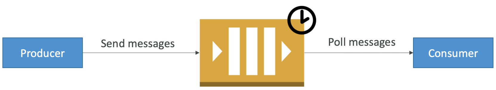
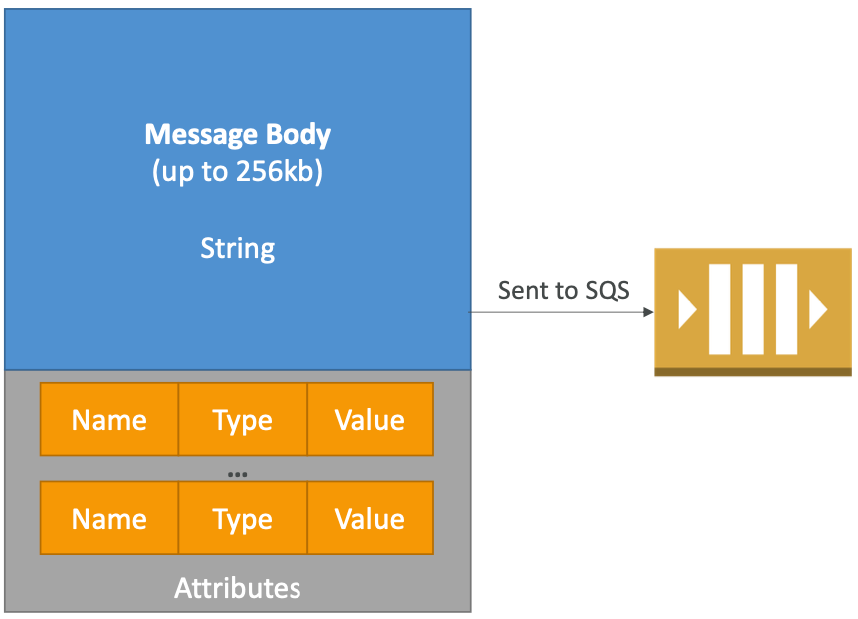
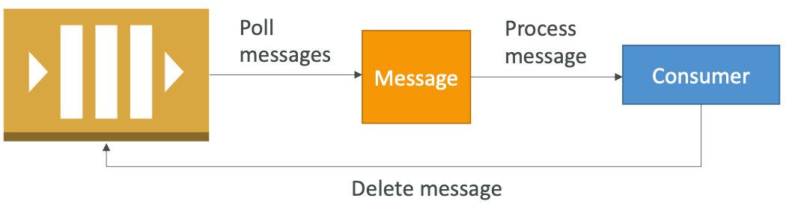
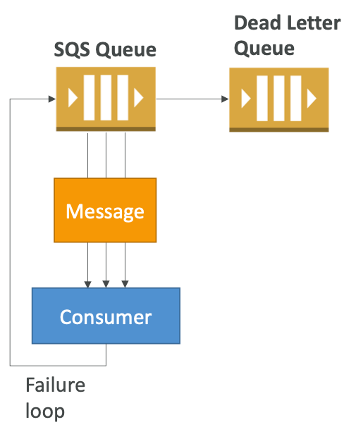
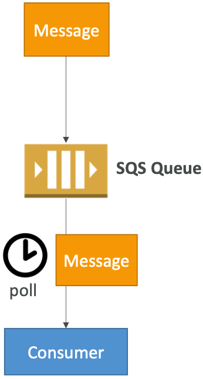
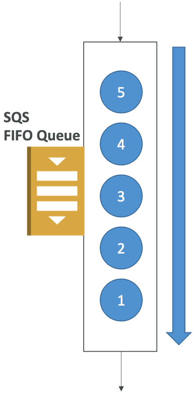
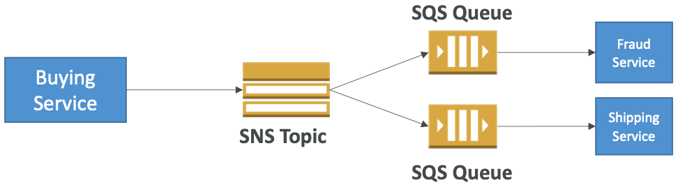

# Section 14: Decoupling applications: SQS, SNS, Kinesis, Active MQ

## AWS SQS – Standard Queue

* Oldest offering (over 10 years old)
* Fully managed
* Scales from 1 message per second to 10,000s per second
* Default retention of messages: 4 days, maximum of 14 days
* No limit to how many messages can be in the queue
* Low latency (<10 ms on publish and receive)
* Horizontal scaling in terms of number of consumers
* Can have duplicate messages (at least once delivery, occasionally)
* Can have out of order messages (best effort ordering)
* Limitation of 256KB per message sent

[#aws-saa]() [#SQS]()

## AWS SQS – Delay Queue

* Delay a message (consumers don’t see it immediately) up to 15 minutes

* Default is 0 seconds (message is available right away)

* Can set a default at queue level

* Can override the default using the **DelaySeconds** parameter

  

[#aws-saa]() [#SQS]()

## SQS – Producing Messages

- Define Body

- Add message attributes (metadata – optional)

- Provide Delay Delivery (optional)

  

- Get back

  -  Message identifier

  - MD5 hash of the body

    

[#aws-saa]() [#SQS]()

## SQS – Consuming Messages

* Consumers...

* Poll SQS for messages (receive up to 10 messages at a time)

* Process the message within the visibility timeout

* Delete the message using the message ID & receipt handle

  

[#aws-saa]() [#SQS]()

## SQS – Visibility timeout

* When a consumer polls a message from a queue, the message is “invisible” to other consumers for a defined period... th**e Visibility Timeout:**
  * Set between 0 seconds and 12 hours (default 30 seconds)
  * If too high (15 minutes) and consumer fails to process the message, you must wait a long time before processing the message again
  * If too low (30 seconds) and consumer needs time to process the message (2 minutes), another consumer will receive the message and the message will be processed more than once

  * **ChangeMessageVisibility** API to change the visibility while processing a message
  * **DeleteMessage** API to tell SQS the message was successfully processed

[#aws-saa]() [#SQS]()

## AWS SQS – Dead Letter Queue

- If a consumer fails to process a message within the Visibility Timeout...

   the message goes back to the queue!

- We can set a threshold of how many times a message can go back to the queue – it’s called a “redrive policy”

- After the threshold is exceeded, the message goes into a dead letter queue (DLQ)

- We have to create a DLQ first and then designate it dead letter queue

- Make sure to process the messages in the Failure DLQ before they expire!

  

[#aws-saa]() [#SQS]()

## AWS SQS - Long Polling

- When a consumer requests message from the queue, it can optionally “wait” for messages to arrive if there are none in the queue
- This is called Long Polling
- **LongPolling decreases the number of API calls made to SQS while increasing the efficiency and latency of your application.**
- The wait time can be between 1 sec to 20 sec (20 sec preferable)

- Long Polling is preferable to Short Polling

- Long polling can be enabled at the queue level or at the API level using **WaitTimeSeconds**

  

[#aws-saa]() [#SQS]()

## AWS SQS – FIFO Queue

- Newer offering (First In - First out) – not available in all regions!

- Name of the queue must end in .fifo

- Lower throughput (up to 3,000 per second with batching, 300/s without)

- Messages are processed in order by the consumer

- Messages are sent exactly once

- No per message delay (only per queue delay)

- Ability to do content based de-duplication

- 5-minute interval de-duplication using “Duplication ID”

- Message Groups:

  - Possibility to group messages for FIFO ordering using “Message GroupID”

  - Only one worker can be assigned per message group so that messages are processed in order

  - Message group is just an extra tag on the message!

    

[#aws-saa]() [#SQS]()

## AWS SNS

* The “event producer” only sends message to one SNS topic
* As many “event receivers” (subscriptions) as we want to listen to the SNS topic notifications
* Each subscriber to the topic will get all the messages (note: new feature to filter messages)
* Up to 10,000,000 subscriptions per topic
* 100,000 topics limit

* Subscribers can be:
  * SQS
  * HTTP / HTTPS (with delivery retries – how many times)
  * Lambda
  * Emails
  * SMS messages
  * Mobile Notifications

[#aws-saa]() [#SNS]()

## AWS SNS – How to publish

* Topic Publish (within your AWS Server – using the SDK)
  * Create a topic
  * Create a subscription (or many)
  * Publish to the topic

* Direct Publish (for mobile apps SDK)
  * Create a platform application
  * Create a platform endpoint
  * Publish to the platform endpoint
  * Works with Google GCM, Apple APNS, Amazon ADM...

[#aws-saa]() [#SNS]()

## SNS + SQS: Fan Out

* Push once in SNS, receive in many SQS
* Fully decoupled
* No data loss
* Ability to add receivers of data later
* SQS allows for delayed processing
* SQS allows for retries of work
* May have many workers on one queue and one worker on the other queue

[#aws-saa]() [#SNS]()

## AWS Kinesis Overview

* Kinesis is a managed alternative to Apache Kafka

* Great for application logs, metrics, IoT, clickstreams

* Great for “real-time” big data

* Great for streaming processing frameworks (Spark, NiFi, etc...)

* Data is automatically replicated to 3 AZ

  

* **Kinesis Streams**: low latency streaming ingest at scale
* **Kinesis Analytics**: perform real-time analytics on streams using SQL
* **Kinesis Firehose**: load streams into S3, Redshift, ElasticSearch...

[#aws-saa]() [#Kinesis]()

## Kinesis Streams Overview

*  Streams are divided in ordered Shards / Partitions  
* Data retention is 1 day by default, can go up to 7 days
* Ability to reprocess / replay data
* Multiple applications can consume the same stream
* Real-time processing with scale of throughput
* Once data is inserted in Kinesis, it can’t be deleted (immutability)

[#aws-saa]() [#Kinesis]()

## Kinesis Streams Shards

* One stream is made of many different shards
* 1MB/s or 1000 messages/s at write PER SHARD
* 2MB/s at read PER SHARD
* Billing is per shard provisioned, can have as many shards as you want
* Batching available or per message calls.
* The number of shards can evolve over time (reshard / merge)
* **Records are ordered per shard**

[#aws-saa]() [#Kinesis]()

## AWS Kinesis API – Put records

- PutRecord API+Partition key that gets hashed
- The same key goes to the same partition (helps with ordering for a specific key)
- Messages sent get a “sequence number”
- Choose a partition key that is highly distributed (helps prevent “hot partition”)
  - user_id if many users
  - **Not** country_id if 90% of the users are in one country
- Use Batching with PutRecords to reduce costs and increase throughput
- **ProvisionedThroughputExceeded** if we go over the limits
- Can use CLI, AWS SDK, or producer libraries from various frameworks

[#aws-saa]() [#Kinesis]()

## Kinesis Security

* Control access / authorization using IAM policies
* Encryption in flight using HTTPS endpoints
* Encryption at rest using KMS
* Possibility to encrypt / decrypt data client side (harder)
* VPC Endpoints available for Kinesis to access within VPC

[#aws-saa]() [#Kinesis]()

## AWS Kinesis Data Firehose

* Fully Managed Service, no administration, automatic scaling, serverless

* Load data into Redshift / Amazon S3 / ElasticSearch / Splunk

* **Near Real Time**

  * 60 seconds latency minimum for non full batches
  * Or minimum 32 MB of data at a time

* Supports many data formats, conversions, transformations, compression

  

* Pay for the amount of data going through Firehose

[#aws-saa]() [#Kinesis]()

## Kinesis Data Streams vs Firehose

* Streams
  * Going to write custom code (producer / consumer)
  * Real time (~200 ms)
  * Must manage scaling (shard splitting / merging)
  * Data Storage for 1 to 7 days, replay capability, multi consumers

* Firehose
  * Fully managed, send to S3, Splunk, Redshift, ElasticSearch
  * Serverless data transformations with Lambda
  * Near real time (lowest buffer time is 1 minute)
  * Automated Scaling
  * No data storage

[#aws-saa]() [#Kinesis]()

## Kinesis Data Analytics

*  Perform real-time analytics on Kinesis Streams using SQL
* Kinesis Data Analytics:
  * Auto Scaling
  * Managed: no servers to provision
  * Continuous: real time

* Pay for actual consumption rate
* Can create streams out of the real-time queries

[#aws-saa]() [#Kinesis]()

## Kinesis vs SQS ordering

* Let’s assume 100 trucks, 5 kinesis shards, 1 SQS FIFO

* <u>Kinesis Data Streams:</u>
  *  On average you’ll have 20 trucks per shard
  * Trucks will have their data ordered within each shard
  * The maximum amount of consumers in parallel we can have is 5
  * Can receive up to 5 MB/s of data

* <u>SQS FIFO</u>
  * You only have one SQS FIFO queue
  * You will have 100 Group ID
  * You can have up to 100 Consumers (due to the 100 Group ID)
  * You have up to 300 messages per second (or 3000 if using batching)

[#aws-saa]() [#Kinesis]()

## SQS vs SNS vs Kinesis

<u>**SQS:**</u>

- Consumer “pull data”

- Data is deleted after being

  consumed

- Can have as many workers (consumers) as we want

- Noneedtoprovision throughput

- Noorderingguarantee (except FIFO queues)

- Individual message delay capability

<u>**SNS:**</u>

- Push data to many subscribers
- Up to10,000,000 subscribers
- Data is not persisted (lost if not delivered)
- Pub/Sub
- Up to100,000 topics
- No need to provision throughput
- Integrates with SQS for fan-out architecture pattern

<u>**Kinesis:**</u>

- Consumers “pull data”
- As many consumers as we want
- Possibility to replay data
- Meant for real-time big data, analytics and ETL
- Ordering at the shard level
- Data expires after X days
- Must provision throughput

[#aws-saa]() [#Kinesis]()

## Amazon MQ

- SQS, SNS are “cloud-native” services, and they’re using proprietary protocols from AWS.

- Traditional applications running from on-premise may use open protocols such as: **MQTT, AMQP, STOMP, Openwire, WSS**

- **When migrating to the cloud**, instead of re-engineering the application to use SQS and SNS, we can use Amazon MQ

- **Amazon MQ = managed Apache ActiveMQ**

  

- Amazon MQ doesn’t “scale” as much as SQS / SNS

- Amazon MQ runs on a dedicated machine, can run in HA with failover

- Amazon MQ has both queue feature (~SQS) and topic features (~SNS)

[#aws-saa]() [#Amazon MQ]()

