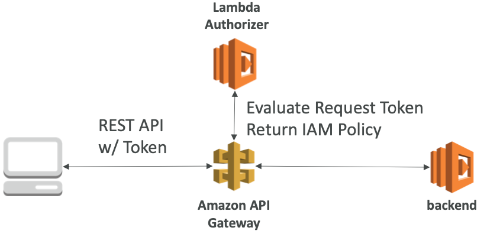
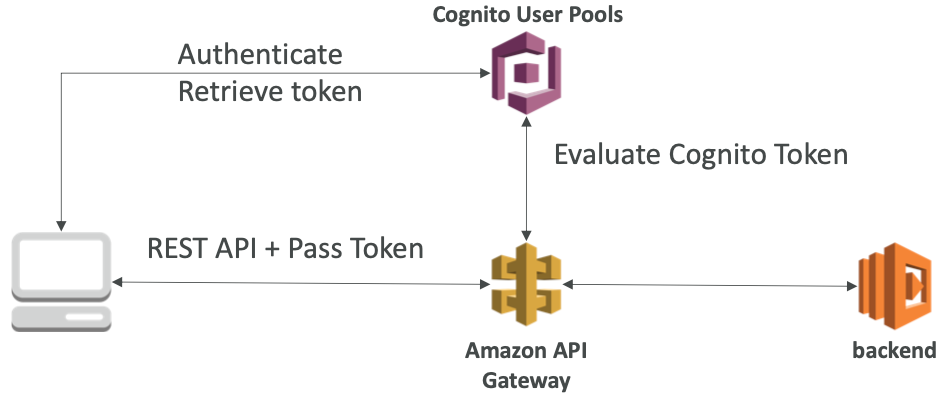

# Section 15: Serverless Overviews from a Solution Architect Perspective

## What’s serverless?

- Serverless is a new paradigm in which the developers don’t have to manage servers anymore...
- They just deploy code
- They just deploy... functions !
- Initially... Serverless == FaaS (Function as a Service)
- Serverless was pioneered by AWS Lambda but now also includes anything that’s managed: “databases, messaging, storage, etc.”
- Serverless does not mean there are no servers...
   it means you just don’t manage / provision / see them

## Why AWS Lambda

**Amazon EC2**

* Virtual Servers in the Cloud
* Limited by RAM and CPU
* Continuously running
* Scaling means intervention to add / remove servers

**Amazon Lambda**

* Virtual **functions** – no servers to manage!
* Limited by time - **short executions**
* Run **on-demand**
* **Scaling is automated**!

[#aws-saa]() [#AWS Lambda]()

## AWS Lambda Limits to Know - per region

* **Execution Limits:**
  * Memory allocation: 128 MB – 3008 MB (64 MB increments)
  * Maximum execution time: 900 seconds (15 minutes)
  * Environment variables (4 KB)
  * Disk capacity in the “function container” (in /tmp): 512 MB
  * Concurrency executions: 1000 (can be increased)

* **Deployment Limits:**
  * Lambda function deployment size (compressed .zip): 50 MB
  * Size of uncompressed deployment (code + dependencies): 250 MB
  * Can use the /tmp directory to load other files at startup
  * Size of environment variables: 4 KB

[#aws-saa]() [#AWS Lambda]()

## Lambda@Edge

- You can use Lambda to change CloudFront requests and responses:

  - After CloudFront receives a request from a viewer (viewer request)

  - Before CloudFront forwards the request to the origin (origin request)

  - After CloudFront receives the response from the origin (origin response)

  - Before CloudFront forwards the response to the viewer (viewer response)

    

- You can also generate responses to viewers without ever sending the request to the origin

[#aws-saa]() [#AWS Lambda]()

## Lambda@Edge: Use Cases

- Website Security and Privacy
- Dynamic Web Application at the Edge
- Search Engine Optimization (SEO)
- Intelligently Route Across Origins and Data Centers
- Bot Mitigation at the Edge
- Real-time Image Transformation
- A/BTesting
- User Authentication and Authorization
- User Prioritization
- User Tracking and Analytics

[#aws-saa]() [#AWS Lambda]()

## DynamoDB

- Fully Managed, Highly available with replication across 3 AZ
- NoSQL database - not a relational database
- Scales to massive workloads, distributed database
- Millions of requests per seconds, trillions of row, 100s of TB of storage
- Fast and consistent in performance (low latency on retrieval)
- Integrated with IAM for security, authorization and administration
- Enables event driven programming with DynamoDB Streams
- Low cost and auto scaling capabilities

[#aws-saa]() [#DynamoDB]()

## DynamoDB - Basics

- DynamoDB is made of **tables**
- Each table has a **primary key** (must be decided at creation time)
- Each table can have an infinite number of items (= rows)
- Each item has **attributes** (can be added over time – can be null) • Maximum size of a item is 400KB
- Data types supported are:
  - Scalar Types: String, Number, Binary, Boolean, Null
  - DocumentTypes:List,Map
  - Set Types: String Set, Number Set, Binary Set

[#aws-saa]() [#DynamoDB]()

## DynamoDB – Provisioned Throughput

- Table must have provisioned read and write capacity units
- **Read Capacity Units (RCU):** throughput for reads ($0.00013 per RCU) 
  - 1 RCU = 1 strongly consistent read of 4 KB per second
  - 1 RCU = 2 eventually consistent read of 4 KB per second
- **Write Capacity Units (WCU):** throughput for writes ($0.00065 per WCU)
  - 1WCU=1writeof1KBpersecond
- Option to setup auto-scaling of throughput to meet demand
- Throughput can be exceeded temporarily using “burst credit”
- If burst credit are empty, you’ll get a “ProvisionedThroughputException”. 
- It’s then advised to do an exponential back-off retry

[#aws-saa]() [#DynamoDB]()

## DynamoDB - DAX

- DAX = DynamoDB Accelerator

- Seamless cache for DynamoDB, no application re- write

- Writes go through DAX to DynamoDB

- Micro second latency for cached reads & queries

- Solves the Hot Key problem (too many reads)

- 5 minutes TTL for cache by default

- Up to 10 nodes in the cluster

- Multi AZ (3 nodes minimum recommended for production)

- Secure (Encryption at rest with KMS,VPC, IAM, CloudTrail...)

  

[#aws-saa]() [#DynamoDB]()

## DynamoDB Streams

- Changes in DynamoDB (Create, Update, Delete) can end up in a DynamoDB Stream

- This stream can be read by AWS Lambda, and we can then do:

  - React to changes in real time (welcome email to new users)
  - Analytics
  - Create derivative tables / views
  - Insert into ElasticSearch

- Could implement cross region replication using Streams

- Stream has 24 hours of data retention

  

[#aws-saa]() [#DynamoDB]()

## DynamoDB - New Features (Transactions, on demand, global tables)

* **Transactions (new from Nov 2018)**
  * All or nothing type of operations
  * Coordinated Insert, Update & Delete across multiple tables
  * Include up to 10 unique items or up to 4 MB of data

* **On Demand (new from Nov 2018)**
  * No capacity planning needed (WCU / RCU) – scales automatically
  * 2.5x more expensive than provisioned capacity (use with care)
  * Helpful when spikes are un-predictable or the application is very low throughpu

* **Global Tables: (cross region replication)**

  * Active Active replication, many regions

  * Must enable DynamoDB Streams

  * Useful for low latency, DR purposes

    

* **Capacity planning:**

  - Planned capacity: provision WCU & RCU, can enable auto scaling
  - On-demand capacity: get unlimited WCU & RCU, no throttle, more expensive

[#aws-saa]() [#DynamoDB]()

## DynamoDB – Security & Other Features

- Security:
  - VPC Endpoints available to access DynamoDB without internet
  - Access fully controlled by IAM
  - Encryption at rest using KMS
  - EncryptionintransitusingSSL/TLS
- Backup and Restore feature available
  - Point in time restore like RDS
  - No performance impact

* Capacity planning:
  - Planned capacity: provision WCU & RCU, can enable auto scaling
  - On-demand capacity: get unlimited WCU & RCU, no throttle, more expensive
* Amazon DMS can be used to migrate to DynamoDB (from Mongo, Oracle, MySQL, S3, etc...)

* You can launch a local DynamoDB on your computer for development purposes

[#aws-saa]() [#DynamoDB]()

## AWS API Gateway

- AWS Lambda + API Gateway: No infrastructure to manage
- Support for the WebSocket Protocol
- Handle API versioning (v1, v2...)
- Handle different environments (dev, test, prod...)
- Handle security (Authentication and Authorization)
- Create API keys, handle request throttling
- Swagger / Open API import to quickly define APIs
- Transform and validate requests and responses
- Generate SDK and API specifications
- Cache API responses

[#aws-saa]() [#API Gateway]()

## API Gateway – Integrations High Level

- **Lambda Function**
  - Invoke Lambda function
  - Easy way to expose REST API backed by AWS Lambda
- **HTTP**
  * Expose HTTP endpoints in the backend
  * Example: internal HTTP API on premise, Application Load Balancer...
  * Why? Add rate limiting, caching, user authentications, API keys, etc...
- **AWS Service**
  - Expose any AWS API through the API Gateway?
  - Example: start an AWS Step Function workflow, post a message to SQS
  - Why? Add authentication, deploy publicly, rate control...

[[#aws-saa]() [#API Gateway]()

## API Gateway - Endpoint Types

* **Edge-Optimized (default):** For global clients
  * Requests are routed through the CloudFront Edge locations (improves latency)
  * The API Gateway still lives in only one region

* **Regional:**
  * For clients within the same region
  * Could manually combine with CloudFront (more control over the caching strategies and the distribution)
* **Private:**
  * Can only be accessed from your VPC using an interface VPC endpoint (ENI)
  * Use a resource policy to define access

[#aws-saa]() [#API Gateway]()

## API Gateway – Security: IAM Permissions

- Create an IAM policy authorization and attach to User / Role

- API Gateway verifies IAM permissions passed by the calling application

- Good to provide access within your own infrastructure

- Leverages “Sig v4” capability where IAM credential are in headers

  

[#aws-saa]() [#API Gateway]()

## API Gateway – Security: Lambda Authorizer (formerly Custom Authorizers)

- Uses AWS Lambda to validate the token in header being passed

- Option to cache result of authentication

- Helps to use OAuth / SAML / 3rd party type of authentication

- Lambda must return an IAM policy for the user

  

[#aws-saa]() [#API Gateway]()

## API Gateway – Security: Cognito User Pools

- Cognito fully manages user lifecycle

- API gateway verifies identity automatically from AWS Cognito

- No custom implementation required

- <u>Cognito only helps with authentication, not authorization</u>

  

[#aws-saa]() [#API Gateway]()

## API Gateway – Security – Summary

- **IAM:**
  - Great for users / roles already within your AWS account
  - Handle authentication + authorization
  - Leverages Sig v4
- **Custom Authorizer:**
  - Great for 3rd party tokens
  - Very flexible in terms of what IAM policy is returned
  - HandleAuthentication+Authorization
  - Pay per Lambda invocation
- **Cognito User Pool:**
  - You manage your own user pool (can be backed by Facebook, Google login etc...)
- - No need to write any custom code
  - Must implement authorization in the backend

[#aws-saa]() [#API Gateway]()

## AWS Cognito

- We want to give our users an identity so that they can interact with our application.
- **Cognito User Pools:**
  - Sign in functionality for app users • Integrate with API Gateway
- **Cognito Identity Pools (Federated Identity):**
  - Provide AWS credentials to users so they can access AWS resources directly
  - Integrate with Cognito User Pools as an identity provider
- **Cognito Sync:**
  - Synchronize data from device to Cognito.
  - May be deprecated and replaced by AppSync

[#aws-saa]() [#AWS Congnito]()

## AWS Cognito User Pools (CUP)

- Create a serverless database of user for your mobile apps

- Simple login: Username (or email) / password combination

- Possibility to verify emails / phone numbers and **add MFA**

- Can enable Federated Identities (Facebook, Google, SAML...)

- Sends back a JSON Web Tokens (JWT)

- **Can be integrated with API Gateway for authentication**

  

[#aws-saa]() [#AWS Congnito]()

## AWS Cognito – Federated Identity Pools

- **Goal:**

  - Provide direct access to AWS Resources

- **How:**

  - Log in to federated identity provider – or remain anonymous
  - Get temporary AWS credentials back from the Federated Identity Pool

  - These credentials come with a pre-defined IAM policy stating their permissions

- **Example:**

  - provide (temporary) access to write to S3 bucket using Facebook Login

    

[#aws-saa]() [#AWS Congnito]()

## AWS Cognito Sync

- **Deprecated – use AWS AppSync now**

  

- Store preferences, configuration, state of app

- Cross device synchronization (any platform – iOS, Android, etc...)

- Offline capability (synchronization when back online)

- **Requires Federated Identity Pool in Cognito (not User Pool)**

- Store data in datasets (up to 1MB)

- Up to 20 datasets to synchronise

[#aws-saa]() [#AWS Congnito]()

## AWS SAM - Serverless Application Model

- **SAM = Serverless Application Model**
- Framework for developing and deploying serverless applications
- All the configuration is YAML code
  - Lambda Functions
  - DynamoDB tables
  - API Gateway
  - Cognito User Pools
- **SAM can help you to run Lambda, API Gateway, DynamoDB locally**
- **SAM can use CodeDeploy to deploy Lambda functions**

[#aws-saa]() [#AWS SAM]()