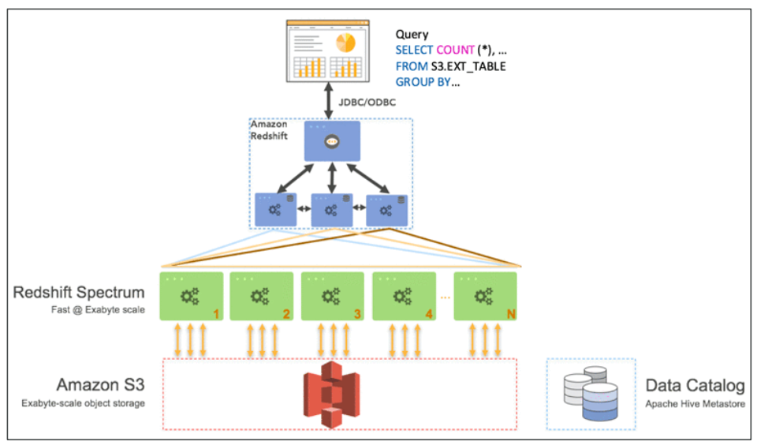
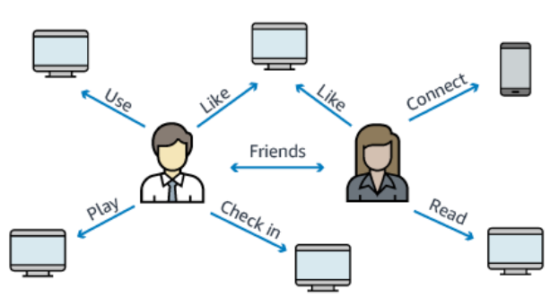

# Section 17: Databases in AWS

## Choosing the Right Database

*  We have a lot of managed databases on AWS to choose from
* Questions to choose the right database based on your architecture:
  * Read-heavy, write-heavy, or balanced workload? Throughput needs? Will it change, does it need to scale or fluctuate during the day?
  * How much data to store and for how long? Will it grow? Average object size? How are they accessed?
  * Data durability? Source of truth for the data ?
  * Latency requirements? Concurrent users?
  * Data model? How will you query the data? Joins? Structured? Semi-Structured?
  * Strong schema? More flexibility? Reporting? Search? RDBMS / NoSQL?
  * License costs? Switch to Cloud Native DB such as Aurora?

[#aws-saa]() [#databases]()

## DatabaseTypes

- **RDBMS** (= SQL / OLTP): RDS, Aurora – great for joins

- **NoSQL database:** DynamoDB (~JSON), ElastiCache (key / value pairs),

  Neptune (graphs) – no joins, no SQL

- **Object Store:** S3 (for big objects) / Glacier (for backups / archives)

- **Data Warehouse** (= SQL Analytics / BI): Redshift (OLAP), Athena

- **Search:** ElasticSearch (JSON) – free text, unstructured searches

- **Graphs:** Neptune – displays relationships between data

[#aws-saa]() [#databases]()

## RDS Overview

- Managed PostgreSQL / MySQL / Oracle / SQL Server

- Must provision an EC2 instance & EBS Volume type and size

- Support for Read Replicas and Multi AZ

- Security through IAM, Security Groups, KMS , SSL in transit

- Backup / Snapshot / Point in time restore feature

- Managed and Scheduled maintenance

- Monitoring through CloudWatch

  

- **Use case**: Store relational datasets (RDBMS / OLTP), perform SQL queries, transactional inserts / update / delete is available

[#aws-saa]() [#databases]() [#RDS]()

## RDS for Solutions Architect

- **Operations**: small downtime when failover happens, when maintenance happens, scaling in read replicas / ec2 instance / restore EBS implies manual intervention, application changes

- **Security**: AWS responsible for OS security, we are responsible for setting up KMS, security groups, IAM policies, authorizing users in DB, using SSL

- **Reliability**: Multi AZ feature, failover in case of failures

- **Performance**: depends on EC2 instance type, EBS volume type, ability to add Read Replicas. Doesn’t auto-scale

- **Cost**: Pay per hour based on provisioned EC2 and EBS

[#aws-saa]() [#databases]() [#RDS]()

## Aurora Overview

- Compatible API for PostgreSQL / MySQL 

- Data is held in 6 replicas, across 3 AZ

- Auto healing capability

- Multi AZ, Auto Scaling Read Replicas

- Read Replicas can be Global

- Aurora database can be Global for DR or latency purposes

- Auto scaling of storage from 10GB to 64 TB

- Define EC2 instance type for aurora instances

- Same security / monitoring / maintenance features as RDS

- “Aurora Serverless” option

  

- **Use case**: same as RDS, but with less maintenance / more flexibility / more performance

[#aws-saa]() [#databases]() [#Aurora]()

## Aurora for Solutions Architect

- **Operations**: less operations, auto scaling storage
- **Security**: AWS responsible for OS security, we are responsible for setting up KMS, security groups, IAM policies, authorizing users in DB, using SSL
- **Reliability**: Multi AZ, highly available, possibly more than RDS, Aurora Serverless option.
- **Performance:** 5x performance (according to AWS) due to architectural optimizations. Up to 15 Read Replicas (only 5 for RDS)
- **Cost:** Pay per hour based on EC2 and storage usage. Possibly lower costs compared to Enterprise grade databases such as Oracle

[#aws-saa]() [#databases]() [#Aurora]()

## ElastiCache Overview

- Managed Redis / Memcached (similar offering as RDS, but for caches)

- In-memory data store, sub-millisecond latency

- Must provision an EC2 instance type

- Support for Clustering (Redis) and Multi AZ, Read Replicas (sharding)

- Security through IAM, Security Groups, KMS, Redis Auth

- Backup / Snapshot / Point in time restore feature

- Managed and Scheduled maintenance

- Monitoring through CloudWatch

  

- **Use Case**: Key/Value store, Frequent reads, less writes, cache results for DB queries, store session data for websites, cannot use SQL.

[#aws-saa]() [#databases]() [#ElasticCache]()

## ElastiCache for Solutions Architect

- **Operations**: same as RDS

- **Security**: AWS responsible for OS security, we are responsible for setting

  up KMS, security groups, IAM policies, users (Redis Auth), using SSL

- **Reliability**: Clustering, Multi AZ

- **Performance**: Sub-millisecond performance, in memory, read replicas for sharding, very popular cache option

- **Cost**: Pay per hour based on EC2 and storage usage

[#aws-saa]() [#databases]() [#ElasticCache]()

## DynamoDB Overview

- AWS proprietary technology, managed NoSQL database
- Serverless,provisionedcapacity,autoscaling,ondemandcapacity(Nov2018)
- Can replace ElastiCache as a key/value store (storing session data for example)
- HighlyAvailable,MultiAZbydefault,ReadandWritesaredecoupled,DAXforreadcache
- Reads can be eventually consistent or strongly consistent
- Security, authentication and authorization is done through IAM
- DynamoDB Streams to integrate with AWS Lambda
- Backup/Restorefeature,GlobalTablefeature
- Monitoring through CloudWatch
- Can only query on primary key, sort key, or indexes

- **Use Case**: Serverless applications development (small documents 100s KB), distributed serverless cache, doesn’t have SQL query language available, has transactions capability from Nov 2018

[#aws-saa]() [#databases]() [#DynamoDB]()

## DynamoDB for Solutions Architect

- **Operations**: no operations needed, auto scaling capability, serverless
- **Security**: full security through IAM policies, KMS encryption, SSL in flight
- **Reliability**: Multi AZ, Backups
- **Performance**: single digit millisecond performance, DAX for caching reads, performance doesn’t degrade if your application scales
- **Cost**: Pay per provisioned capacity and storage usage (no need to guess in advance any capacity – can use auto scaling)

[#aws-saa]() [#databases]() [#DynamoDB]()

## S3 Overview

- S3 is a... key / value store for objects
- Great for big objects, not so great for small objects
- Serverless, scales infinitely, max object size is 5 TB
- Eventually consistency for overwrites and deletes
- Tiers: S3 Standard, S3 IA, S3 One Zone IA, Glacier for backups
- Features:Versioning, Encryption, Cross Region Replication, etc...
- Security: IAM, Bucket Policies, ACL
- Encryption: SSE-S3, SSE-KMS, SSE-C, client side encryption, SSL in transit

- **Use Case**: static files, key value store for big files, website hosting

[#aws-saa]() [#databases]() [#S3]()

## S3 for Solutions Architect

- **Operations**: no operations needed
- **Security**: IAM, Bucket Policies, ACL, Encryption (Server/Client), SSL
- **Reliability**: 99.999999999% durability / 99.99% availability, Multi AZ, CRR
- **Performance**: scales to thousands of read / writes per second, transfer acceleration / multi-part for big files
- **Cost**: pay per storage usage, network cost, requests number

[#aws-saa]() [#databases]() [#S3]()

## Athena Overview

- Fully Serverless database with SQL capabilities
- Used to query data in S3
- Pay per query
- Output results back to S3
- Secured through IAM

- **Use Case**: one time SQL queries, serverless queries on S3, log analytics

[#aws-saa]() [#databases]() [#Athena]()

## Athena for Solutions Architect

* **Operations**: no operations needed, serverless
* **Security**: IAM + S3 security
* **Reliability**: managed service, uses Presto engine, highly available
* **Performance**: queries scale based on data size
* **Cost**: pay per query / per TB of data scanned, serverless

[#aws-saa]() [#databases]() [#Athena]()

## Redshift Overview

- Redshift is based on PostgreSQL, but it’s not used for OLTP
- **It’s OLAP – online analytical processing (analytics and data warehousing)**
- 10x better performance than other data warehouses, scale to PBs of data
- **Columnar** storage of data (instead of row based)
- Massively Parallel Query Execution (MPP), highly available
- Pay as you go based on the instances provisioned
- Has a SQL interface for performing the queries
- BI tools such as AWS Quicksight or Tableau integrate with it
- Data is loaded from S3, DynamoDB, DMS, other DBs...
- From 1 node to 128 nodes, up to 160 GB of space per node
- Leader node: for query planning, results aggregation
- Compute node: for performing the queries, send results to leader
- Redshift Spectrum: perform queries directly against S3 (no need to load)
- Backup & Restore, Security VPC / IAM / KMS, Monitoring
- Redshift Enhanced VPC Routing: COPY / UNLOAD goes through VPC

[#aws-saa]() [#databases]() [#Redshift]()

## Redshift – Snapshots & DR

- Snapshots are point-in-time backups of a cluster, stored internally in S3
- Snapshots are incremental (only what has changed is saved)
- You can restore a snapshot into a **new cluster**
- Automated: every 8 hours, every 5 GB, or on a schedule. Set retention
- Manual: snapshot is retained until you delete it

- **You can configure Amazon Redshift to automatically copy snapshots (automated or manual) of a cluster to another AWS Region**

[#aws-saa]() [#databases]() [#Redshift]()

## Redshift Spectrum

- Query data that is already in S3 without loading it
- **Must have a Redshift cluster available to start the query**
- The query is then submitted to thousands of Redshift Spectrum nodes

https://aws.amazon.com/blogs/big-data/amazon-redshift-spectrum-extends-data-warehousing-out-to-exabytes-no-loading-required/

[#aws-saa]() [#databases]() [#Redshift]()

## Redshift for Solutions Architect

- **Operations**: similar to RDS
- **Security**: IAM,VPC, KMS, SSL (similar to RDS)
- **Reliability**: highly available, auto healing features
- **Performance**: 10x performance vs other data warehousing, compression
- **Cost**: pay per node provisioned, 1/10th of the cost vs other warehouses

- **Remember : Redshift = Analytics / BI / Data Warehouse**

[#aws-saa]() [#databases]() [#Redshift]()

## Neptune

- Fully managed graph database

- **When do we use Graphs?**

  - High relationship data
  - Social Networking: Users friends with Users, replied to comment on post of user and likes other comments.
  - Knowledge graphs (Wikipedia)

- Highly available across 3 AZ, with up to 15 read replicas

- Point-in-time recovery, continuous backup to Amazon S3

- Support for KMS encryption at rest + HTTPS

  

[#aws-saa]() [#databases]() [#Nepture]()

## Neptune for Solutions Architect

- **Operations**: similar to RDS
- **Security**: IAM,VPC, KMS, SSL (similar to RDS) + IAM Authentication
- **Reliability**: Multi-AZ, clustering
- **Performance**: best suited for graphs, clustering to improve performance
- **Cost**: pay per node provisioned (similar to RDS)

- **Remember**: Neptune = Graphs

[#aws-saa]() [#databases]() [#Nepture]()

## ElasticSearch

- Example: In DynamoDB, you can only find by primary key or indexes.
- With ElasticSearch, you can **search any field**, even partially matches
- It’s common to use ElasticSearch as a complement to another database
- ElasticSearch also has some usage for Big Data applications
- You can provision a cluster of instances
- Built-in integrations: Amazon Kinesis Data Firehose, AWS IoT, and Amazon CloudWatch Logs for data ingestion
- Security through Cognito & IAM, KMS encryption, SSL & VPC
- Comes with Kibana (visualization) & Logstash (log ingestion) – ELK stack

[#aws-saa]() [#databases]() [#ElasticSearch]()

## ElasticSearch for Solutions Architect

- **Operations**: similar to RDS

- **Security**: Cognito, IAM,VPC, KMS, SSL

- **Reliability**: Multi-AZ, clustering

- **Performance**: based on ElasticSearch project (open source), petabyte scale

- **Cost**: pay per node provisioned (similar to RDS)

  

- **Remember** : ElasticSearch = Search / Indexing

[#aws-saa]() [#databases]() [#ElasticSearch]()

