# Section 19: Identity and Access Management (IAM)

## AWS STS – Security Token Service

- **Allows to grant limited and temporary access to AWS resources.**
- Token is valid for up to one hour (must be refreshed)
- **AssumeRole**
  - Within your own account: for enhanced security
  - Cross Account Access: assume role in target account to perform actions there
- **AssumeRoleWithSAML**
  - return credentials for users logged with SAML
- **AssumeRoleWithWebIdentity**
  * return creds for users logged with an IdP (Facebook Login, Google Login, OIDC compatible...)
  * AWS recommends against using this, and using Cognito instead
- **GetSessionToken**
  - for MFA, from a user or AWS account root user

[#aws-saa]() [#AWS STS]()

## Using STS to Assume a Role

- Define an IAM Role within your account or cross-account
- Define which principals can access this IAM Role
- Use AWS STS (Security Token Service) to retrieve credentials and impersonate the IAM Role you have access to (**AssumeRole API**)
- Temporary credentials can be valid between 15 minutes to 1 hour

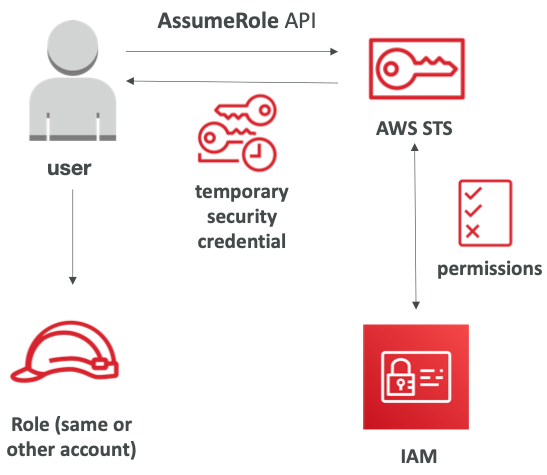

[#aws-saa]() [#AWS STS]()

## Identity Federation in AWS

- Federation lets users outside of AWS to assume temporary role for accessing AWS resources.

- These users assume identity provided access role.

  

- Federations can have many flavors: 

  - SAML 2.0

  - Custom Identity Broker

  - Web Identity Federation with Amazon Cognito

  - Web Identity Federation without Amazon Cognito

  - Single Sign On

  - Non-SAMLwithAWSMicrosoftAD

    

- **Using federation, you don’t need to create IAM users (user management is outside of AWS)**

  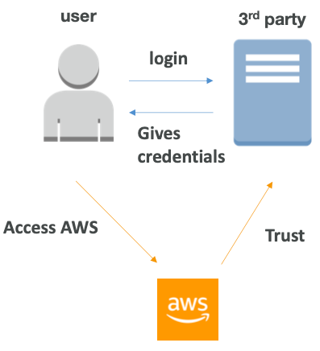

[#aws-saa]() [#Identity-Federation]()

## SAML 2.0 Federation

* To integrate Active Directory / ADFS with AWS (or any SAML 2.0)
* Provides access to AWS Console or CLI (through temporary creds)
* No need to create an IAM user for each of your employees

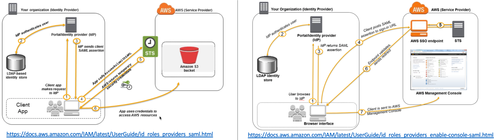

- Needs to setup a trust between AWS IAM and SAML (both ways)

- SAML 2.0 enables web-based, cross domain SSO

- Uses the STS API: AssumeRoleWithSAML

  

- Note federation through SAML is the “old way” of doing things

- **Amazon Single Sign On (SSO)** Federation is the new managed and simpler way

  - Read more here: https://aws.amazon.com/blogs/security/enabling-federation-to-aws-using-windows-active-directory-adfs-and-saml-2-0/

[#aws-saa]() [#Identity-Federation]() [#SAML]()

## AWS Directory Services

* **AWS Managed Microsoft AD**

  * Create your own AD in AWS, manage users

  * Establish “trust” connections with your on- premise AD

    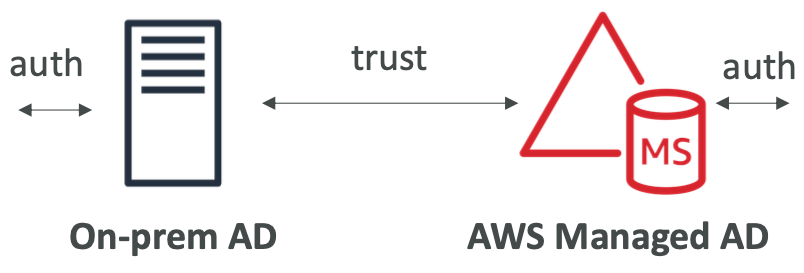

* **AD Connector** 

  * Directory Gateway (proxy) to redirect to on-premise AD

  * Users are managed on the on-premise AD

    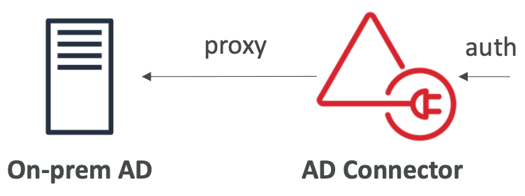

* **Simple AD**

  * AD-compatible managed directory on AWS

  * Cannot be joined with on-premise AD

    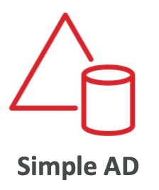

[#aws-saa]() [#Directory-Services]()

## AWS Organizations

- Global service
- Allows to manage multiple AWS accounts
- The main account is the master account – you can’t change it
- Other accounts are member accounts
- Member accounts can only be part of one organization
- Consolidated Billing across all accounts - single payment method
- Pricing benefits from aggregated usage (volume discount for EC2, S3...)
- API is available to automate AWS account creation

[#aws-saa]() [#Organizations]()

## Multi Account Strategies

- Create accounts per **department**, per **cost center**, per **dev / test / prod**, based on **regulatory restrictions** (using SCP), for **better resource isolation** (ex:VPC), to have **separate per-account service limits**, isolated account for **logging**

  

- Multi Account vs One Account Multi VPC

- Use tagging standards for billing purposes

- Enable CloudTrail on all accounts, send logs to central S3 account

- Send CloudWatch Logs to central logging account

- Establish Cross Account Roles for Admin purposes

[#aws-saa]() [#Organizations]()

## Service Control Policies (SCP)

- Whitelist or blacklist IAM actions
- Applied at the **OU** or **Account level**
- Does not apply to the Master Account
- SCP is applied to all the **Users and Roles** of the Account, including Root user
- The SCP does not affect service-linked roles
  - Service-linked roles enable other AWS services to integrate with AWS Organizations and can't be restricted by SCPs.
- SCP must have an explicit Allow (does not allow anything by default)
- Use cases:
  - Restrict access to certain services (for example: can’t use EMR)
  - Enforce PCI compliance by explicitly disabling services

[#aws-saa]() [#Service-Control-Policies]()

## IAM Conditions

* **aws:SourceIP:** restrict the client IP **from** which the API calls are being made

  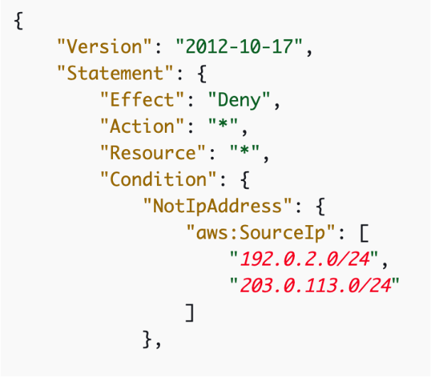

* **Aws:RequestedRegion:** restrict the region The API calls are made **to**

  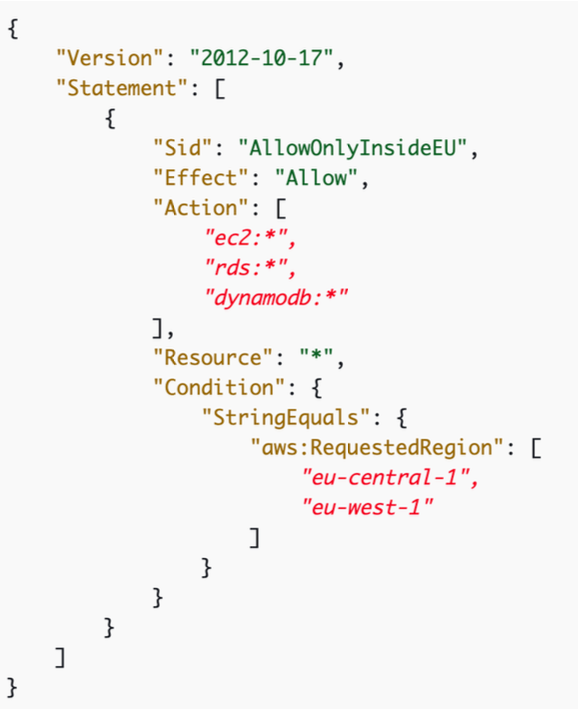

* **Restrict based on tags**

  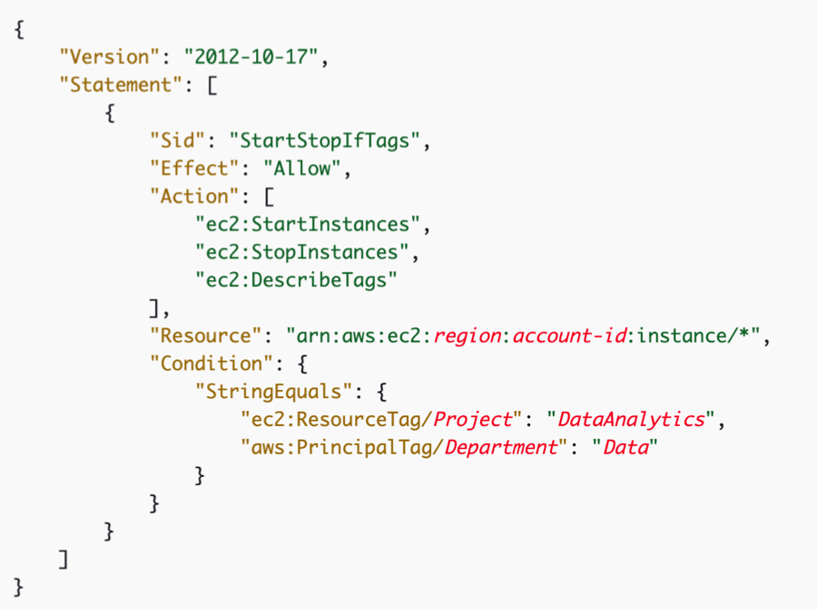

* **Force MFA**

  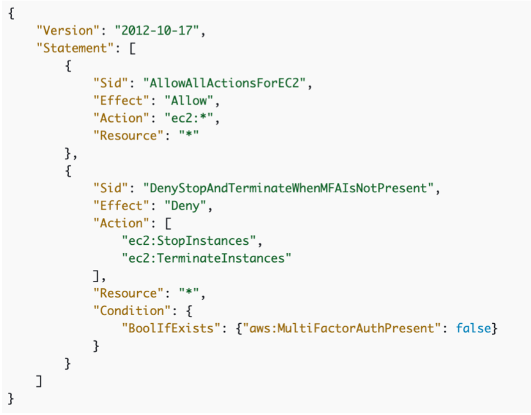

[#aws-saa]() [#IAM]()

## IAM for S3

- ListBucket permission applies to 

  `arn:aws:s3:::test`

- **=> bucket level permission**

  

- GetObject, PutObject, DeleteObject applies to 

  `arn:awn:s3:::test/*`

- **=> object level permission**

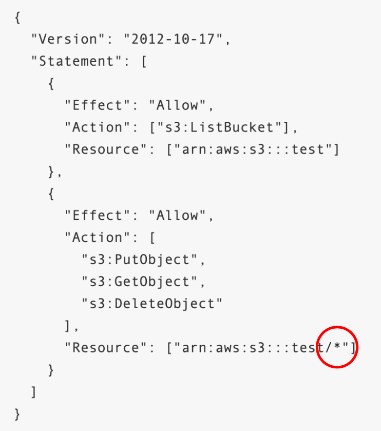

[#aws-saa]() [#IAM]()

## IAM Roles vs Resource Based Policies

* Attach a policy to a resource (example: S3 bucket policy) versus attaching of a using a role as a proxy

  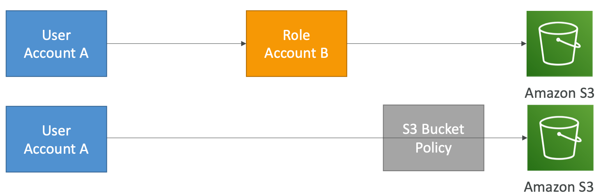

- **When you assume a role (user, application or service), you give up your original permissions and take the permissions assigned to the role**
- When using a resource based policy, the principal doesn’t have to give up his permissions
- <u>Example:</u> User in account A needs to scan a DynamoDB table in Account A and dump it in an S3 bucket in Account B.
- Suppor ted by: Amazon S3 buckets, SNS topics, SQS queues

[#aws-saa]() [#IAM]() [#Resource-Based-Poliecies]()

## IAM Permission Boundaries

* IAM Permission Boundaries are supported for users and roles (not groups)

* Advanced feature to use a managed policy to set the maximum permissions an IAM entity can get.

  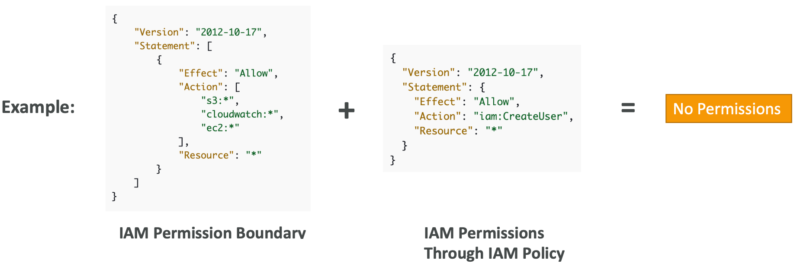

* Can be used in combinations of AWS Organizations SCP

  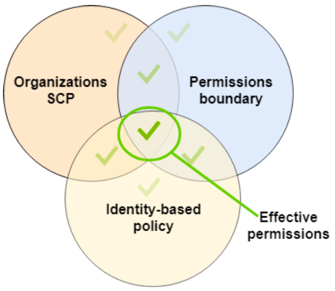

  https://docs.aws.amazon.com/IAM/latest/UserGuide/access_policies_boundaries.html

* <u>Use cases</u>

  - Delegate responsibilities to non administrators within their permission boundaries, for example create new IAM users
  - Allow developers to self-assign policies and manage their own permissions, while making sure they can’t “escalate” their privileges (= make themselves admin)
  - Useful to restrict one specific user (instead of a whole account using Organizations & SCP)

[#aws-saa]() [#IAM]() 

## AWS Resource Access Manager (RAM)

- Share AWS resources that you own with other AWS accounts
- Share with any account or within your Organization
- Avoid resource duplication!
- **VPC Subnets:**
  - allow to have all the resources launched in the same subnets
  - must be from the same AWS Organizations.
  - Cannot share security groups and default VPC
  - Participants can manage their own resources in there
  - Participants can't view, modify, delete resources that belong to other participants or the owner
- **AWS Transit Gateway**
- **Route53 Resolver Rules**
- **License Manager Configurations**

[#aws-saa]() [#Resource-Access-Manager]() 

## Resource Access Manager – VPC example

* **Each account...**
  * is responsible for its own
  * cannot view, modify or delete other resources in other accounts
* **Network is shared so...**
  * Anything deployed in the VPC can talk to other resources in the VPC
  * Applications are accessed easily across accounts, using private IP!
  * Security groups from other accounts can be referenced for maximum security

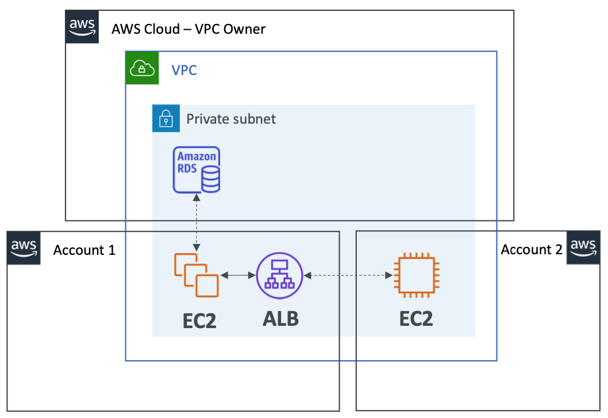

[#aws-saa]() [#Resource-Access-Manager]() 

## AWS Single Sign-On (SSO)

- Centrally manage Single Sign-On to access **multiple accounts and 3rd-party business applications**.
- Integrated with AWS Organizations

- **Supports SAML 2.0** markup
- Integration with on-premise **Active Directory**

- Centralized permission management
- Centralized auditing with CloudTrail

https://aws.amazon.com/blogs/security/introducing-aws-single-sign-on/

[#aws-saa]() [#Single Sign-On]() 

## SSO – vs AssumeRoleWithSAML

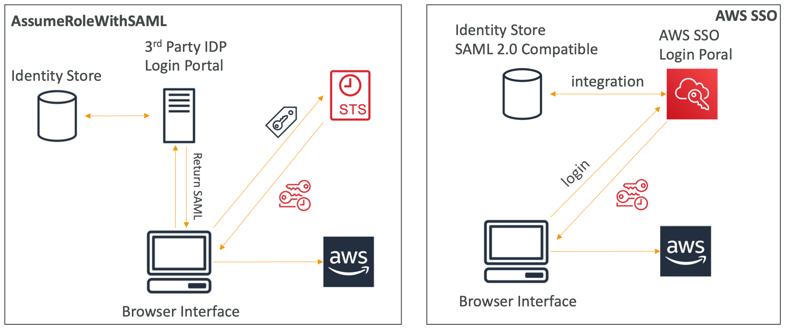

[#aws-saa]() [#Single Sign-On]() 