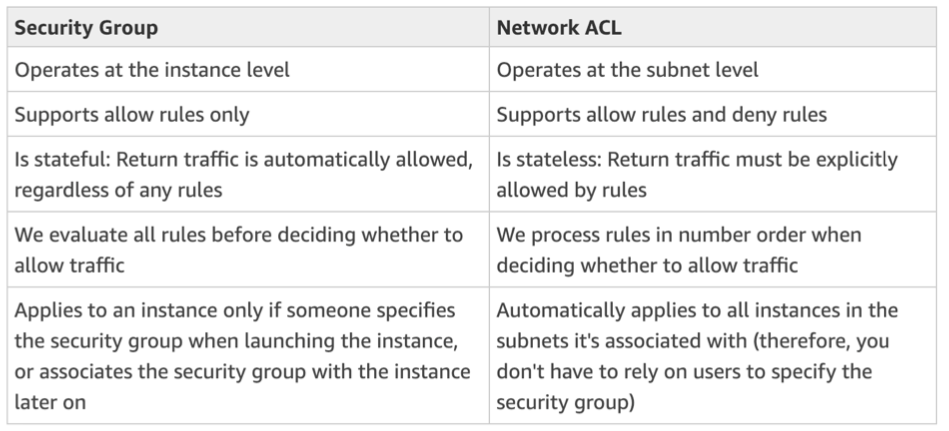
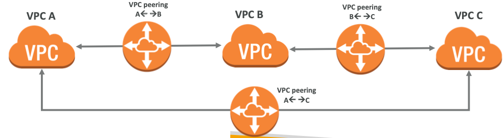
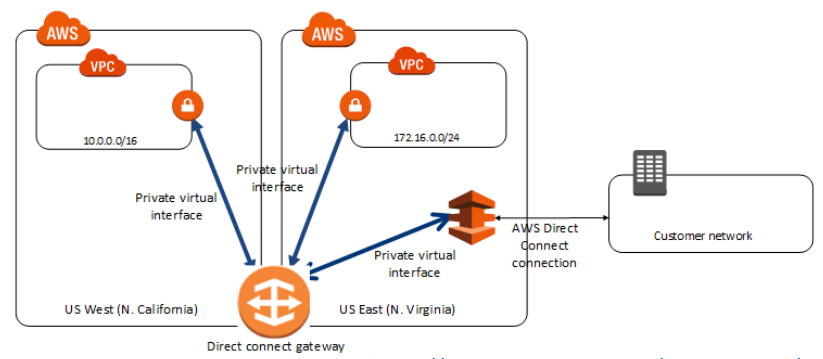
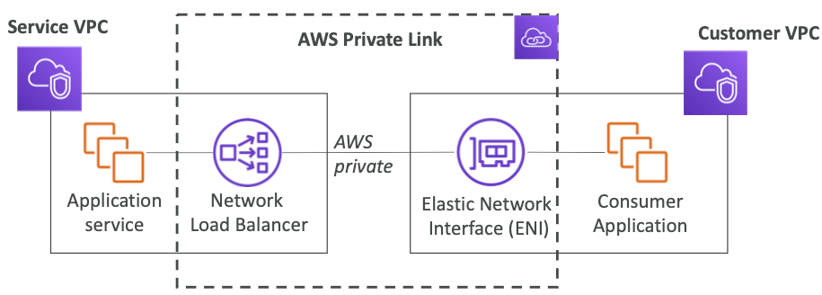
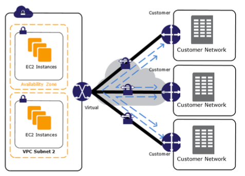
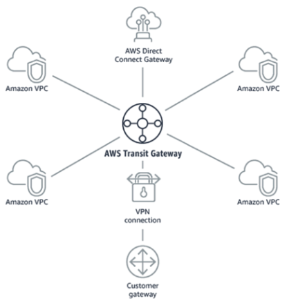
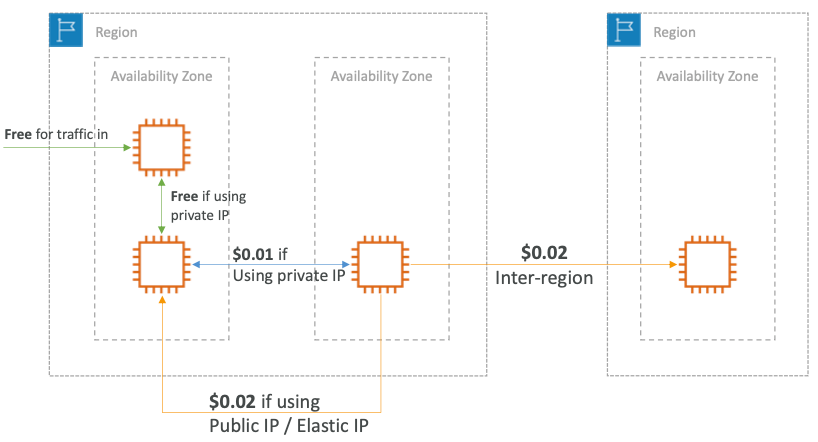

# Section 21: Networking - VPC

## CIDRs Subnet Masks

- Quick memo:
  - /32 – no IP number can change
  - /24 - last IP number can change
  - /16 – last IP two numbers can change
  - /8 – last IP three numbers can change
  - /0 – all IP numbers can change

[#aws-saa]() [#VPN]()

## Private vs Public IP (IPv4) Allowed ranges

- The Internet Assigned Numbers Authority (IANA) established certain blocks of IPV4 addresses for the use of private (LAN) and public (Internet) addresses.

  

- Private IP can only allow certain values

  - 10.0.0.0 – 10.255.255.255 (10.0.0.0/8) <= in big networks
  - 172.16.0.0 – 172.31.255.255 (172.16.0.0/12) <= default AWS one
  - 192.168.0.0 – 192.168.255.255 (192.168.0.0/16) <= example: home networks

- All the rest of the IP on the internet are public IP

[#aws-saa]() [#VPN]()

## VPC in AWS – IPv4

- VPC =Virtual Private Cloud
- You can have multiple VPCs in a region (max 5 per region – soft limit)
- Max CIDR per VPC is 5. For each CIDR:
  - Min size is /28 = 16 IP Addresses
  -  Max size is /16 = 65536 IP Addresses
- Because VPC is private, only the Private IP ranges are allowed:
  - 10.0.0.0 – 10.255.255.255 (10.0.0.0/8)
  - 172.16.0.0 – 172.31.255.255 (172.16.0.0/12)
  - 192.168.0.0 – 192.168.255.255 (192.168.0.0/16)
- **Your VPC CIDR should not overlap with your other networks (ex: corporate)**

[#aws-saa]() [#VPN]()

## Subnets - IPv4

- AWS reserves 5 IPs address (first 4 and last 1 IP address) in each Subnet
- These 5 IPs are not available for use and cannot be assigned to an instance
- Ex, if CIDR block 10.0.0.0/24, reserved IP are:
  - 10.0.0.0: Network address
  - 10.0.0.1: Reser ved by AWS for the VPC router
  - 10.0.0.2: Reserved by AWS for mapping to Amazon-provided DNS
  - 10.0.0.3: Reserved by AWS for future use
  - 10.0.0.255:Network broadcast address.AWS does not support broadcast in aVPC, therefore the address is reserved
- ExamTip:
  - If you need 29 IP addresses for EC2 instances, you can’t choose a Subnet of size /27 (32 IP)
  - You need at least 64 IP,Subnet size /26 (64-5 = 59 > 29,but 32-5 = 27 < 29)

## NAT Instances – Network Address Translation

- Allows instances in the private subnets to connect to the internet
- Must be launched in a public subnet
- Must disable EC2 flag: Source / Destination Check
- Must have Elastic IP attached to it
- Route table must be configured to route traffic from private subnets to NAT Instance

## NAT Gateway

- AWS managed NAT, higher bandwidth, better availability, no admin
- Pay by the hour for usage and bandwidth
- NAT is created in a specific AZ, uses an EIP
- Cannot be used by an instance in that subnet (only from other subnets)
- Requires an IGW (Private Subnet => NAT => IGW)
- 5 Gbps of bandwidth with automatic scaling up to 45 Gbps
- No security group to manage / required

## DNS Resolution in VPC

- **enableDnsSupport: (= DNS Resolution setting)**
  - DefaultTrue
  - Helps decide if DNS resolution is supported for theVPC
  - IfTrue,queriestheAWSDNSserverat169.254.169.253
- **enableDnsHostname: (= DNS Hostname setting)**
  - False by default for newly created VPC,True by default for Default VPC
  - Won’t do anything unless enableDnsSupport=true
  - IfTrue,Assign public hostname to EC2 instance if it has a public
- **If you use custom DNS domain names in a private zone in Route 53, you must set both these attributes to true**

## Network ACLs

- NACL are like a firewall which control traffic from and to subnet
- Default NACL allows everything outbound and everything inbound
- **One NACL per Subnet, new Subnets are assigned the Default NACL**
- Define NACL rules:
  - Rules have a number (1-32766) and higher precedence with a lower number
  - E.g. If you define #100 ALLOW <IP> and #200 DENY <IP> , IP will be allowed
  - Last rule is an asterisk (*) and denies a request in case of no rule match
  - AWS recommends adding rules by increment of 100
- Newly created NACL will deny everything
- NACL are a great way of blocking a specific IP at the subnet level

## Network ACLs vs Security Groups

https://docs.aws.amazon.com/vpc/latest/userguide/VPC_Security.html

## VPC Peering

- Connect two VPC, privately using AWS’ network
- Make them behave as if they were in the same network
- Must not have overlapping CIDR
- VPC Peering connection is not transitive (must be established for each VPC that need to communicate with one another)
- You can do VPC peering with another AWS account
- **You must update route tables in <u>each VPC’s subnets</u> to ensure instances can communicate**

## VPC Endpoints

- Endpoints allow you to connect to AWS Services using a private network instead of the public www network
- They scale horizontally and are redundant
- They remove the need of IGW, NAT, etc... to access AWS Services
- **<u>Interface</u>**: provisions an ENI (private IP address) as an entry point (must attach security group) – most AWS services
- **<u>Gateway</u>**: provisions a target and must be used in a route table – S3 and DynamoDB
- In case of issues:
  - Check DNS Setting Resolution in your VPC
  - CheckRouteTables

## Flow Logs

- Capture information about IP traffic going into your interfaces: 
  - VPC Flow Logs
  - Subnet Flow Logs
     Elastic Network Interface Flow Logs
- Helps to monitor & troubleshoot connectivity issues
- Flow logs data can go to S3 / CloudWatch Logs
- Captures network information from AWS managed interfaces too: ELB, RDS, ElastiCache, Redshift, WorkSpaces

## Site to Site VPN

* Virtual Private Gateway:
  * VPN concentrator on the AWS side of the VPN connection
  * VGW is created and attached to the VPC from which you want to create the Site-to- Site VPN connection
  * Possibility to customize the ASN
* Customer Gateway:
  * Software application or physical device on customer side of the VPN connection
  * https://docs.aws.amazon.com/vpc/latest/adminguide/Introduction.html#DevicesTested
  * IP Address:
    * Usestatic,internet-routableIPaddressforyourcustomergatewaydevice.
    * IfbehindaCGWbehindNAT(withNAT-T),usethepublicIPaddressoftheNAT

## Direct Connect

- Provides a dedicated <u>**private**</u> connection from a remote network to your VPC
- Dedicated connection must be setup between your DC and AWS Direct Connect locations
- You need to setup aVirtual Private Gateway on yourVPC
- Access public resources (S3) and private (EC2) on same connection
- Use Cases:
  - Increase bandwidth throughput - working with large data sets – lower cost
  - More consistent network experience - applications using real-time data feeds
  - Hybrid Environments (on prem + cloud)
- Supports both IPv4 and IPv6

## Direct Connect Gateway

If you want to setup a Direct Connect to one or more VPC in many different regions (same account), you must use a Direct Connect Gateway

https://docs.aws.amazon.com/directconnect/latest/UserGuide/direct-connect-gateways.html

## Direct Connect – Connection Types

* **Dedicated Connections:** 1Gbps and 10 Gbps capacity
  * Physical ethernet port dedicated to a customer
  * Request made to AWS first, then completed by AWS Direct Connect Partners

- **Hosted Connections**: 50Mbps, 500 Mbps, to 10 Gbps
  - Connection requests are made via AWS Direct Connect Partners
  - Capacity can be added or removed on demand
  - 1, 2, 5, 10 Gbps available at select AWS Direct Connect Partners
- Lead times are often longer than 1 month to establish a new connection

## Egress Only Internet Gateway

- Egress only Internet Gateway is for IPv6 only
- Similar function as a NAT, but a NAT is for IPv4
- Good to know: IPv6 are all public addresses
- Therefore all our instances with IPv6 are publicly accessibly
- Egress Only Internet Gateway gives our IPv6 instances access to the internet, but they won’t be directly reachable by the internet
- After creating an Egress Only Internet Gateway, edit the route tables

## AWS PrivateLink (VPC Endpoint Services)

- Most secure & scalable way to expose a service to 1000s ofVPC (own or other accounts)
- Does not require VPC peering, internet gateway, NAT, route tables...
- Requires a network load balancer (Service VPC) and ENI (Customer VPC)
- If the NLB is in multiple AZ, and the ENI in multiple AZ, the solution is fault tolerant!

## AWS VPN CloudHub

- Provide secure communication between sites, if you have multiple VPN connections
- Low cost hub-and-spoke model for primary or secondary network connectivity between locations
- It’s a VPN connection so it goes over the public internet

## Transit Gateway

- For having transitive peering between thousands of VPC and on-premises, hub-and-spoke (star) connection
- Regional resource, can work cross-region
- Share cross-account using Resource Access Manager (RAM)
- You can peer Transit Gateways across regions
- RouteTables:limitwhichVPCcantalkwithotherVPC
- Works with Direct Connect Gateway,VPN connections
- Supports IP Multicast (not supported by any other AWS ser vice)

## VPC Section Summary

- **CIDR**: IP Range
- **VPC**: Virtual Private Cloud => we define a list of IPv4 & IPv6 CIDR
- **Subnets**: Tied to an AZ, we define a CIDR
- **Internet Gateway**: at the VPC level, provide IPv4 & IPv6 Internet Access
- **Route Tables**: must be edited to add routes from subnets to the IGW,VPC Peering Connections,VPC Endpoints, etc...
- **NAT Instances**: gives internet access to instances in private subnets. Old, must be setup in a public subnet, disable Source / Destination check flag
- **NAT Gateway**: managed by AWS, provides scalable internet access to private instances, IPv4 only
- **Private DNS + Route 53**: enable DNS Resolution + DNS hostnames (VPC)
- **NACL**: Stateless, subnet rules for inbound and outbound, don’t forget ephemeral ports
- **Security Groups**: Stateful, operate at the EC2 instance level
- **VPC Peering**: Connect two VPC with non overlapping CIDR, non transitive
- **VPC Endpoints**: Provide private access to AWS Services (S3, DynamoDB, CloudFormation,
- **VPC Flow Logs**: Can be setup at the VPC / Subnet / ENI Level, for ACCEPT and REJECT traffic, helps identifying attacks, analyze using Athena or CloudWatch Log Insights
- **Bastion Host**: Public instance to SSH into, that has SSH connectivity to instances in private subnets
- **Site to SiteVPN**: setup a Customer Gateway on DC,aVirtual Private Gateway onVPC,and site-to-site VPN over public internet
- **Direct Connect**: setup aVirtual Private Gateway onVPC,and establish a direct private connection to an AWS Direct Connect Location
- **Direct Connect Gateway:** setup a Direct Connect to many VPC in different regions
- **Internet Gateway Egress**: like a NAT Gateway, but for IPv6

- **Private Link / VPC Endpoint Services**:
  - connect services privately from your service VPC to customers VPC
  - Doesn’t need VPC peering, public internet, NAT gateway, route tables
  - Must be used with Network Load Balancer & ENI
- **ClassicLink**: connect EC2-Classic instances privately to your VPC
- **VPN CloudHub:** hub-and-spoke VPN model to connect your sites
- **Transit Gateway**: transitive peering connections forVPC,VPN & DX

## Networking Costs in AWS per GB - Simplified

- Use Private IP instead of Public IP for good savings and better network performance
- Use same AZ for maximum savings (at the cost of high availability)

