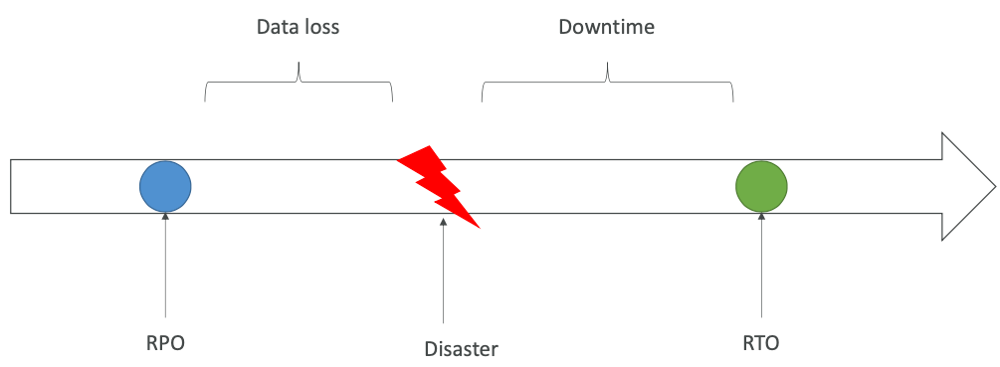
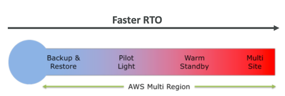
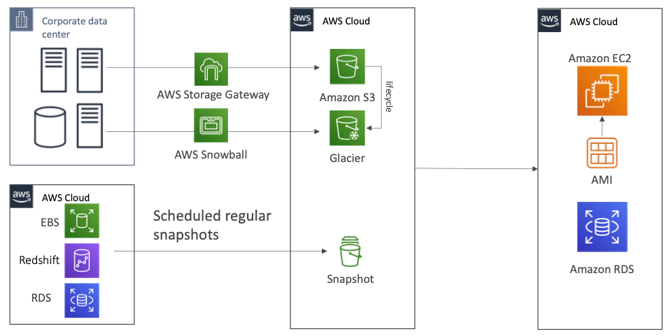
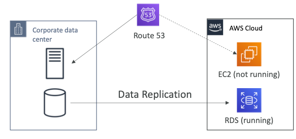
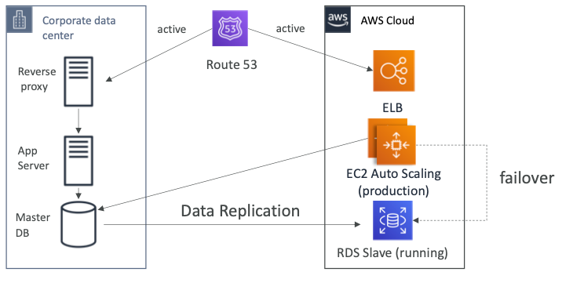
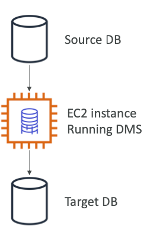
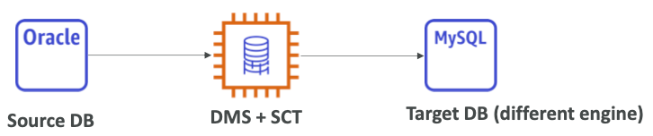
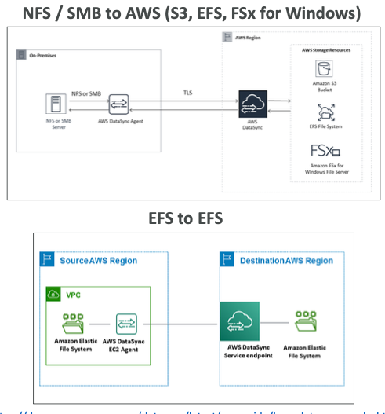

# Section 22: Disaster Recovery & Migrations

## Disaster Recovery Overview

- Any event that has a negative impact on a company’s business continuity or finances is a disaster
- Disaster recovery (DR) is about preparing for and recovering from a disaster
- What kind of disaster recovery?
  - On-premise => On-premise: traditional DR, and very expensive
  - On-premise => AWS Cloud: hybrid recovery
  - AWS Cloud Region A => AWS Cloud Region B
- Need to define two terms:
  - RPO: Recovery Point Objective
  - RTO: Recover y Time Objective

[#aws-saa]() [#DR]()

## RPO and RTO

[#aws-saa]() [#DR]()

## Disaster Recovery Strategy Types

- Backup and Restore

- Pilot Light

- Warm Standby

- Hot Site / Multi Site Approach

  

  

[#aws-saa]() [#DR]()

## Backup and Restore (High RPO)

[#aws-saa]() [#DR]()

## Disaster Recovery – Pilot Light

- A small version of the app is always running in the cloud

- Useful for the critical core (pilot light)

- Very similar to Backup and Restore

- Faster than Backup and Restore as critical systems are already up

  

[#aws-saa]() [#DR]()

## Disaster Recovery – Warm Standby

* Full system is up and running, but at minimum size
* Upon disaster, we can scale to production load

[#aws-saa]() [#DR]()

## Disaster Recovery – Multi Site / Hot Site Approach

* Very low RTO (minutes or seconds) – very expensive

* Full Production Scale is running AWS and On Premise

  

[#aws-saa]() [#DR]()

## Disaster Recovery Tips

- Backup
  - EBS Snapshots, RDS automated backups / Snapshots, etc...
  - Regular pushes to S3 / S3 IA / Glacier, Lifecycle Policy, Cross Region Replication
  - From On-Premise: Snowball or Storage Gateway
- High Availability
  - Use Route53 to migrate DNS over from Region to Region
  - RDS Multi-AZ, ElastiCache Multi-AZ, EFS, S3
  - Site to Site VPN as a recover y from Direct Connect
- Replication
  - RDS Replication (Cross Region), AWS Aurora + Global Databases
  - Database replication from on-premise to RDS
  - Storage Gateway
- Automation
  - CloudFormation / Elastic Beanstalk to re-create a whole new environment
  - Recover / Reboot EC2 instances with CloudWatch if alarms fail
  - AWS Lambda functions for customized automations
- Chaos
  - Netflix has a “simian-army” randomly terminating EC2

[#aws-saa]() [#DR]()

## DMS – Database Migration Service

- Quickly and securely migrate databases to AWS, resilient, self healing

- The source database remains available during the migration

- Supports:

  - Homogeneous migrations: ex Oracle to Oracle
  - Heterogeneous migrations: ex Microsoft SQL Server to Aurora

- Continuous Data Replication using CDC

- You must create an EC2 instance to perform the replication tasks

  

[#aws-saa]() [#Migration]()

## AWS Schema ConversionTool (SCT)

* Convert your Database’s Schema from one engine to another

* Example OLTP: (SQL Server or Oracle) to MySQL, PostgreSQL, Aurora

* Example OLAP: (Teradata or Oracle) to Amazon Redshift

  

* You do not need to use SCT if you are migrating the same DB engine • Ex: On-Premise PostgreSQL => RDS PostgreSQL
* The DB engine is still PostgreSQL (RDS is the platform)

[#aws-saa]() [#Migration]()

## On-Premise strategy with AWS

* Ability to download Amazon Linux 2 AMI as a VM (.iso format)
  * VMWare, KVM,VirtualBox (Oracle VM), Microsoft Hyper-V
* VM Import / Export
  * Migrate existing applications into EC2
  * Create a DR repository strategy for your on-premiseVMs
  * Can expor t back the VMs from EC2 to on-premise

* AWS Application Discovery Service
  * Gather information about your on-premise servers to plan a migration
  * Server utilization and dependency mappings
  * Track with AWS Migration Hub

  • AWS Database Migration Service (DMS)

- replicate On-premise => AWS , AWS => AWS, AWS => On-premise
- Works with various database technologies (Oracle, MySQL, DynamoDB, etc..)
  * AWS Server Migration Service (SMS)

* Incremental replication of on-premise live servers to AWS

[#aws-saa]() [#Migration]()

## AWS DataSync

- Move large amount of data from on- premise to AWS

  - Can synchronize to: **Amazon S3, Amazon EFS, Amazon FSx for Windows**

- Move data from your NAS or file system via **NFS** or **SMB**

- Replication tasks can be scheduled hourly, daily, weekly

- Leverage the DataSync agent to connect to your systems

  

[#aws-saa]() [#Migration]()

## Transferring large amount of data into AWS

- <u>Example</u>: transfer 200 TB of data in the cloud. We have a 100 Mbps internet connection.
- **Over the internet / Site-to-Site VPN:**
  * Immediate to setup
  * Will take 200(TB)*1000(GB)*1000(MB)*8(Mb)/100 Mbps = 16,000,000s = 185d
- **Over direct connect 1Gbps:**
  * Long for the one-time setup (over a month)
  * Will take 200 (TB)*1000(GB)*8(Gb)/1 Gbps = 1,600,000s = 18.5d
- **Over Snowball:**
  * Will take 2 to 3 snowballs in parallel
  * Takes about 1 week for the end-to-end transfer
  * Can be combined with DMS
- **For on-going replication / transfers:** Site-to-SiteVPN or DX with DMS or DataSync

[#aws-saa]() [#Migration]()