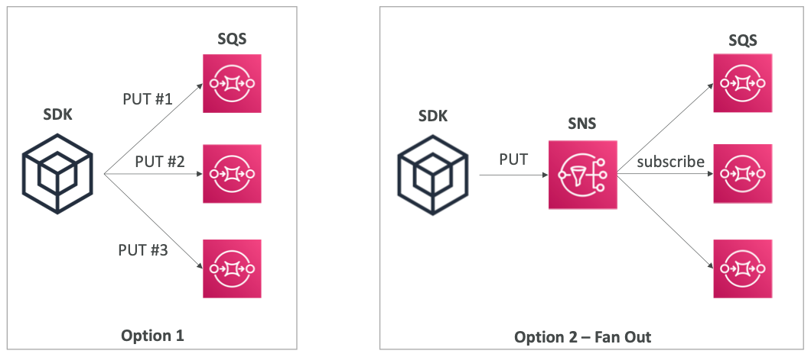
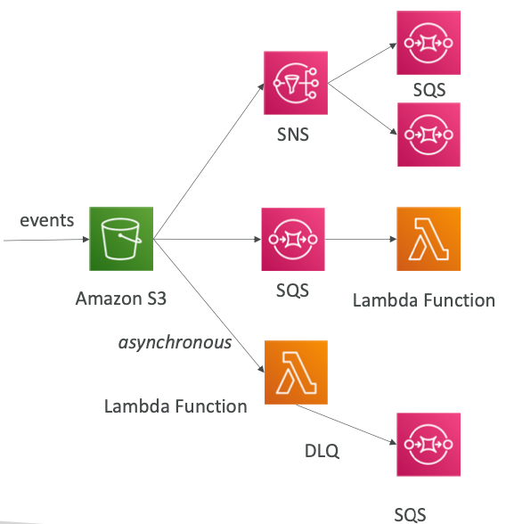
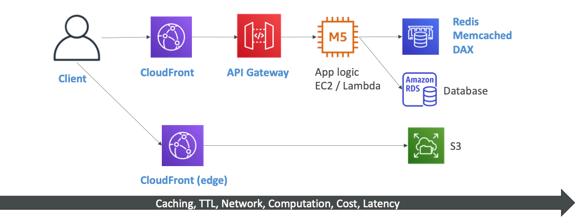

# Section 23: More Solution Architectures

## Fan Out Pattern: deliver to multiple SQS

## S3 Events

- S3:ObjectCreated,S3:ObjectRemoved, S3:ObjectRestore, S3:Replication...
- Objectnamefilteringpossible(*.jpg)
- <u>Usecase</u>: generate thumbnails of images
- **Can create as many “S3events” as desired**

- S3 event notifications typically deliver events in seconds but can sometimes take a minute or longer
- If two writes are made to a single non-versioned object at the same time, it is possible that only a single event notification will be sent
- If you want to ensure that an event notification is sent for every successful write, you can enable versioning on your bucket.

## Caching Strategies

## High Performance Computing (HPC)

- The cloud is the perfect place to perform HPC
- You can create a very high number of resources in no time
- You can speed up time to results by adding more resources
- You can pay only for the systems you have used
- Perform genomics, computational chemistry, financial risk modeling, weather prediction, machine learning, deep learning, autonomous driving

## Data Management & Transfer

- **AWS Direct Connect:**
  - Move GB/s of data to the cloud, over a private secure network
- **Snowball & Snowmobile**
  - Move PB of data to the cloud
- **AWS DataSync**
  - Move large amount of data between on-premise and S3, EFS, FSx for Windows

