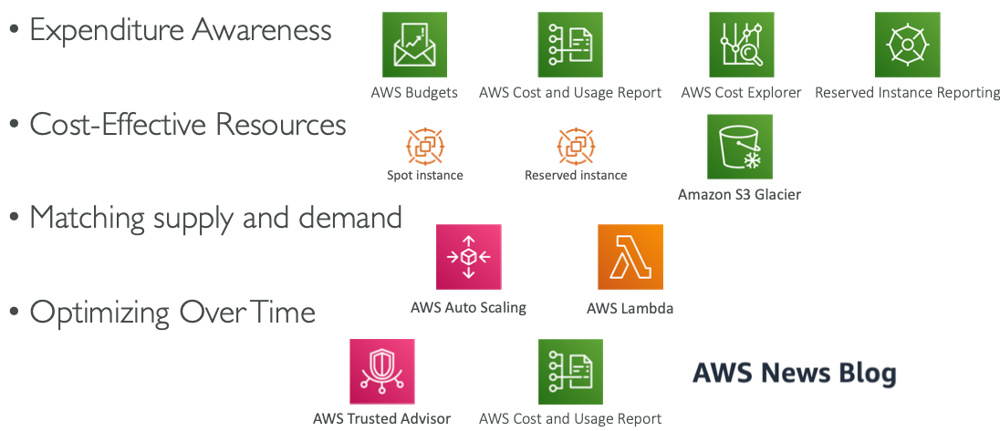

# Section 25: WhitePapers and Architectures - AWS Certified Solutions Architect Associate

## Well Architected Framework General Guiding Principles

- Stop guessing your capacity needs
- Test systems at production scale
- Automate to make architectural experimentation easier
- Allow for evolutionary architectures
  - Design based on changing requirements
- Drive architectures using data
- Improve through game days
  - Simulate applications for flash sale days

## Well Architected Framework 5 Pillars

1. Operational Excellence

2. Security

3. Reliability

4. Performance Efficiency

5. Cost Optimization

    

* <u>**They are not something to balance, or trade-offs, they’re a synergy**</u>

## Well Architected Framework - 1) Operational Excellence

* Includes the ability to run and monitor systems to deliver business value and to continually improve supporting processes and procedures

* Design Principles
  * **Perform operations as code** - Infrastructure as code
  * **Annotate documentation** - Automate the creation of annotated documentation after every build
  * **Make frequent, small, reversible changes** - So that in case of any failure, you can reverse it
  * **Refine operations procedures frequently** - And ensure that team members are familiar with it
  * **Anticipate failure**
  * **Learn from all operational failures**

## Operational Excellence - AWS Services

## Well Architected Framework - 2) Security

* Includes the ability to protect information, systems, and assets while delivering business value through risk assessments and mitigation strategies

* Design Principles
  * **Implement a strong identity foundation** - Centralize privilege management and reduce (or even eliminate) reliance on long-term credentials - Principle of least privilege - IAM
  * **Enable traceability** - Integrate logs and metrics with systems to automatically respond and take action
  * **Apply security at all layers** - Like edge network,VPC, subnet, load balancer, every instance, operating system, and application
  * **Automate security best practices**
  * **Protect data in transit and at rest** - Encryption, tokenization, and access control
  * **Keep people away from data** - Reduce or eliminate the need for direct access or manual processing of data
  * **Prepare for security events** - Run incident response simulations and use tools with automation to increase your speed for detection, investigation, and recovery

## Security AWS Services

## Well Architected Framework - 3) Reliability

* Ability of a system to recover from infrastructure or service disruptions, dynamically acquire computing resources to meet demand, and mitigate disruptions such as misconfigurations or transient network issues

* Design Principles
  * **Test recovery procedures** - Use automation to simulate different failures or to recreate scenarios that led to failures before
  * **Automatically recover from failure** - Anticipate and remediate failures before they occur
  * **Scale horizontally to increase aggregate system availability** - Distribute requests across multiple, smaller resources to ensure that they don't share a common point of failure
  * **Stop guessing capacity** - Maintain the optimal level to satisfy demand without over or under provisioning - Use Auto Scaling
  * **Manage change in automation** - Use automation to make changes to infrastructure

## Reliability AWS Services

## Well Architected Framework - 4) Performance Efficiency

* Includes the ability to use computing resources efficiently to meet system requirements, and to maintain that efficiency as demand changes and technologies evolve

* Design Principles
  * **Democratize advanced technologies** - Advance technologies become services and hence you can focus more on product development
  * **Go global in minutes** - Easy deployment in multiple regions
  * **Use serverless architectures** - Avoid burden of managing servers
  * **Experiment more often** - Easy to carry out comparative testing
  * **Mechanical sympathy -** Be aware of all AWS services

## Performance Efficiency AWS Services

## Well Architected Framework - 5) Cost Optimization

- Includes the ability to run systems to deliver business value at the lowest price point
- Design Principles
  - **Adopt a consumption mode** - Pay only for what you use
  - **Measure overall efficiency** - Use CloudWatch
  - **Stop spending money on data center operations** - AWS does the infrastructure part and enables customer to focus on organization projects
  - **Analyze and attribute expenditure** - Accurate identification of system usage and costs, helps measure return on investment (ROI) - Make sure to use tags
  - **Use managed and application level services to reduce cost of ownership** - As managed services operate at cloud scale, they can offer a lower cost per transaction or service

## Cost Optimization AWS Services

