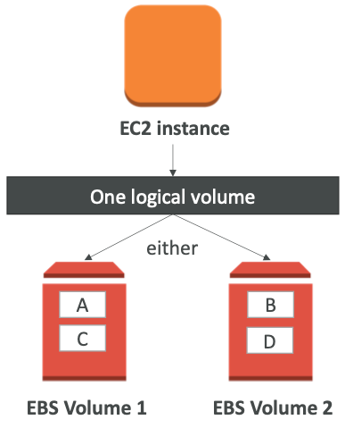
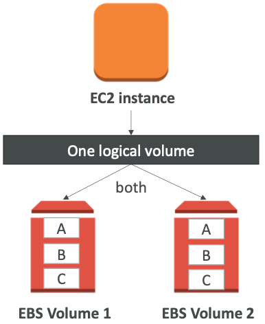
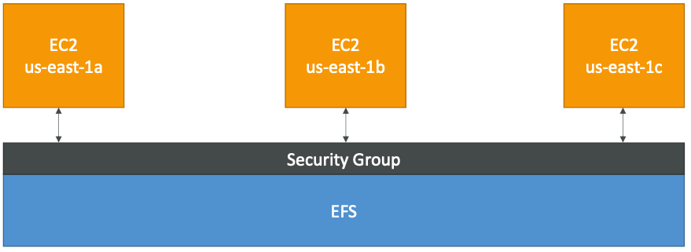

# Section 5: EC2 Storage - EBS & EFS

## EBS Volume

*  It’s a network drive (i.e. not a physical drive)
  * It uses the network to communicate the instance, which means there might be a bit of latency
  * It can be detached from an EC2 instance and attached to another one quickly
* It’s locked to an Availability Zone (AZ)
  * An EBS Volume in us-east-1a cannot be attached to us-east-1b
  * To move a volume across, you first need to snapshot it
* Have a provisioned capacity (size in GBs, and IOPS)
  * You get billed for all the provisioned capacity
  * You can increase the capacity of the drive over time

[#aws-saa]() [#EBS]() 

## EBS Volume Types 

* **gp2: General Purpose Volumes (cheap)**
  * 3 IOPS / GiB, minimum 100 IOPS, burst to 3000 IOPS, max 16000 IOPS
  * 1 GiB – 16 TiB ,+1TB = +3000 IOPS
* **io1: Provisioned IOPS (expensive)**
  * Min 100 IOPS, Max 64000 IOPS (Nitro) or 32000 (other)
  * 4 GiB - 16 TiB. Size of volume and IOPS are independent
* **st1: Throughput Optimized HDD**
  * 500 GiB – 16 TiB , 500 MiB /s throughput
* **sc1: Cold HDD, Infrequently accessed data**
  * 500 GiB – 16 TiB , 250 MiB /s throughput

[#aws-saa]() [#EBS]() 

## EBS Volume Types Use cases GP2 (from AWS doc)

* Recommended for most workloads
* System boot volumes
* Virtual desktops
* Low-latency interactive apps
* Development and test environments

* 1 GiB - 16TiB
* Small gp2 volumes can burst IOPS to 3000
* Max IOPS is 16,000...
* 3 IOPS per GB, means at 5,334GB we are at the max IOPS

[#aws-saa]() [#EBS]() 

## EBS Volume Types Use cases IO1 (from AWS doc)

- Critical business applications that require sustained IOPS performance, or more than 16,000 IOPS per volume (gp2 limit)

- Large database workloads, such as:

- MongoDB, Cassandra, Microsoft SQL Server, MySQL, PostgreSQL, Oracle

  

- 4 GiB - 16TiB

- IOPS is provisioned (PIOPS) – MIN 100 - MAX 64,000 (Nitro instances) else MAX 32,000 (other instances)

- The maximum ratio of provisioned IOPS to requested volume size (in GiB) is 50:1

[#aws-saa]() [#EBS]() 

# EBS Volume Types Use cases ST1 (from AWS doc)

* Streaming workloads requiring consistent, fast throughput at a low price. 
* Big data, Data warehouses, Log processing
* Apache Kafka
* Cannot be a boot volume

* 500 GiB - 16TiB
* Max IOPS is 500
* Max throughput of 500 MiB/s – can burst

[#aws-saa]() [#EBS]() 

## EBS Volume Types Use cases SC1 (from AWS doc)

- Throughput-oriented storage for large volumes of data that is infrequently accessed

- Scenarios where the lowest storage cost is important

- Cannot be a boot volume

  

- 500 GiB - 16TiB

- Max IOPS is 250

- Max throughput of 250 MiB/s – can burst

[#aws-saa]() [#EBS]() 

## EBS Snapshots

- Incremental – only backup changed blocks
- EBS backups use IO and you shouldn’t run them while your application is handling a lot of traffic
- Snapshots will be stored in S3 (but you won’t directly see them)
- Not necessary to detach volume to do snapshot, but recommended
- Max 100,000 snapshots
- Can copy snapshots across AZ or Region
- Can make Image (AMI) from Snapshot
- EBS volumes restored by snapshots need to be pre-warmed (using fio or dd command to read the entire volume)
- Snapshots can be automated using Amazon Data Lifecycle Manager

[#aws-saa]() [#EBS]() [#Snapshots]()

## EBS Migration

* EBS Volumes are only locked to a specific AZ

* To migrate it to a different AZ (or region):

  1. Snapshot the volume

  2. (optional) Copy the volume to a different region

  3. Create a volume from the snapshot in the AZ of your choice

[#aws-saa]() [#EBS]() 

## EBS Encryption

- When you create an encrypted EBS volume, you get the following:
  - Data at rest is encrypted inside the volume
  - All the data in flight moving between the instance and the volume is encrypted
  - All snapshots are encrypted
  - All volumes created from the snapshot
- Encryption and decryption are handled transparently (you have nothing to do)
- Encryption has a minimal impact on latency
- EBS Encryption leverages keys from KMS (AES-256)
- Copying an unencrypted snapshot allows encryption
- Snapshots of encrypted volumes are encrypted

[#aws-saa]() [#EBS]() 

## EBS vs Instance Store

* Some instance do not come with Root EBS volumes
* Instead, they come with “Instance Store” (= ephemeral storage)
* Instance store is physically attached to the machine (EBS is a network drive)

* Pros:
  * Better I/O performance (EBS gp2 has an max IOPS of 16000, io1 of 64000)
  * Good for buffer / cache / scratch data / temporary content
  * Data survives reboots

* Cons:
  * On stop or termination, the instance store is lost
  * You can’t resize the instance store
  * Backups must be operated by the user

[#aws-saa]() [#EBS]() 

## EBS RAID Options

* RAID is possible as long as your OS supports it

* Some RAID options are: 
  * RAID 0
  * RAID 1
  * RAID 5 (not recommended for EBS – see documentation)
  * RAID 6 (not recommended for EBS – see documentation)
* Read https://docs.aws.amazon.com/AWSEC2/latest/UserGuide/raid-config.html

[#aws-saa]() [#EBS]() 

## RAID 0 (increase performance)

- Combining 2 or more volumes and getting the total disk space and I/O

- But one disk fails, all the data is failed

- Use cases would be:

  - An application that needs a lot of IOPS and doesn’t need fault-tolerance
  - A database that has replication already built-in

- Using this, we can have a very big disk with a lot of IOPS

- For example:

  - two 500 GiB Amazon EBS io1 volumes with 4,000 provisioned IOPS each will create a...

  - 1000 GiB RAID 0 array with an available bandwidth of 8,000 IOPS and 1,000 MB/s of throughput

    

[#aws-saa]() [#EBS]() 

## RAID 1 (increase fault tolerance)

- RAID 1 = Mirroring a volume to another

- If one disk fails, our logical volume is still working

- We have to send the data to two EBS volume at the same time (2x network)

- Use case:

  - Application that need increase volume fault tolerance
  - Application where you need to service disks

- For example:

  - two 500 GiB Amazon EBS io1 volumes with 4,000 provisioned IOPS each will create a...

  - 500 GiB RAID 1 array with an available bandwidth of 4,000 IOPS and 500 MB/s of throughput

    

[#aws-saa]() [#EBS]() 

## EFS – Elastic File System

* Managed NFS (network file system) that can be mounted on many EC2
* EFS works with EC2 instances in multi-AZ
* Highly available, scalable, expensive (3x gp2), pay per use

* **Use cases:** content management, web serving, data sharing, Wordpress 

* Uses NFSv4.1 protocol

* Uses security group to control access to EFS

* **Compatible with Linux based AMI (not Windows)**

* Encryption at rest using KMS

  

* POSIX file system (~Linux) that has a standard file API

* File system scales automatically, pay-per-use, no capacity planning!

  

[#aws-saa]() [#EFS]() 

## EFS – Performance & Storage Classes

* **EFS Scale**
  * 1000s of concurrent NFS clients, 10 GB+ /s throughput
  * Grow to Petabyte-scale network file system, automatically

* **Performance mode (set at EFS creation time)**
  *  General purpose (default): latency-sensitive use cases (web server, CMS, etc...)
  *  Max I/O – higher latency, throughput, highly parallel (big data, media processing)

* **StorageTiers (lifecycle management feature – move file after N days)**
  * Standard: for frequently accessed files
  * Infrequent access (EFS-IA): cost to retrieve files, lower price to store

[#aws-saa]() [#EFS]()

