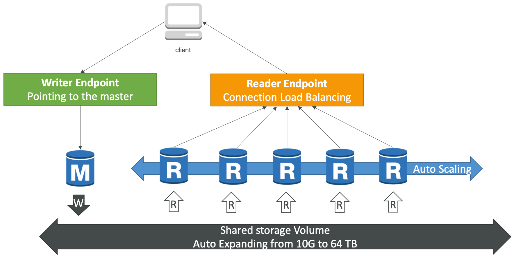

# Section 6: AWS Fundamentals: RDS + Aurora + ElastiCache

## RDS Backups

*  Backups are automatically enabled in RDS

* Automated backups:
  * Daily full backup of the database (during the maintenance window)
  * Transaction logs are backed-up by RDS every 5 minutes
  * => ability to restore to any point in time (from oldest backup to 5 minutes ago)
  * 7 days retention (can be increased to 35 days)

* DB Snapshots:
  * Manually triggered by the user
  * Retention of backup for as long as you want

[#aws-saa]() [#RDS]() 

## RDS Read Replicas for read scalability

- Up to 5 Read Replicas

- Within AZ, Cross AZ or Cross Region

- Replication is ASYNC, so reads are eventually consistent

- Replicas can be promoted to their own DB

- Applications must update the connection string to leverage read replicas

  

[#aws-saa]() [#RDS]() 

## RDS Read Replicas – Network Cost

* In AWS there’s a network cost when data goes from one AZ to another
* To reduce the cost, you can have your Read Replicas in the same AZ

[#aws-saa]() [#RDS]() 

## RDS Multi AZ (Disaster Recovery)

- **SYNC** replication

- One DNS name – automatic app failover to standby

- Increase **availability**

- Failover in case of loss of AZ, loss of network, instance or storage failure

- No manual intervention in apps

- Not used for scaling

  

- <u>Note</u>:The Read Replicas be setup as Multi AZ for Disaster Recovery (DR)

[#aws-saa]() [#RDS]() 

## RDS Security - Encryption

* At rest encryption
  * Possibility to encrypt the master & read replicas with AWS KMS - AES-256 encryption
  * Encryption has to be defined at launch time
  * **If the master is not encrypted, the read replicas <u>cannot</u> be encrypted**
  * Transparent Data Encryption **(TDE) available for Oracle and SQL Server**

* In-flight encryption

  * SSL certificates to encrypt data to RDS in flight

  * Provide SSL options with trust certificate when connecting to database 

  * To <u>enforce</u> SSL:

    * **PostgreSQL:** `rds.force_ssl=1` in the AWS RDS Console (Parameter Groups)

    * **MySQL:** WithintheDB:

      `GRANT USAGE ON *.* TO 'mysqluser'@'%' REQUIRE SSL;`

[#aws-saa]() [#RDS]() 

## RDS Encryption Operations

* **Encrypting RDS backups**
  * Snapshots of un-encrypted RDS databases are un-encrypted 
  * Snapshots of encrypted RDS databases are encrypted
  * Can copy a snapshot into an encrypted one

* **To encrypt an un-encrypted RDS database:** 
  * Create a snapshot of the un-encrypted database
  * Copy the snapshot and enable encryption for the snapshot
  * Restore the database from the encrypted snapshot
  * Migrate applications to the new database, and delete the old database

[#aws-saa]() [#RDS]() 

## RDS Security – Network & IAM

* Network Security
  * RDS databases are usually deployed within a private subnet, not in a public one
  * RDS security works by leveraging security groups (the same concept as for EC2 instances) – it controls which IP / security group can **communicate** with RDS
* Access Management
  * IAM policies help control who can **manage** AWS RDS (through the RDS API)
  * Traditional Username and Password can be used to **login** into the database
  * IAM-based authentication can be used to login into RDS MySQL & PostgreSQL

[#aws-saa]() [#RDS]() 

## RDS - IAM Authentication

- IAM database authentication works with **MySQL and PostgreSQL**

- You don’t need a password, just an authentication token obtained through IAM & RDS API calls

- Auth token has a lifetime of 15 minutes

- Benefits:

  - Network in/out must be encrypted using SSL

  - IAM to centrally manage users instead of DB

  - Can leverage IAM Roles and EC2 Instance profiles for easy integration

    

[#aws-saa]() [#RDS]() 

## Amazon Aurora

- Aurora is a proprietary technology from AWS (not open sourced)

- Postgres and MySQL are both supported as Aurora DB (that means your drivers will work as if Aurora was a Postgres or MySQL database)

- Aurora is “AWS cloud optimized” and claims 5x performance improvement over MySQL on RDS, over 3x the performance of Postgres on RDS

- Aurora storage automatically grows in increments of 10GB, up to 64 TB.

- Aurora can have 15 replicas while MySQL has 5, and the replication process

  is faster (sub 10 ms replica lag)

- Failover in Aurora is instantaneous. It’s HA (High Availability) native.

- Aurora costs more than RDS (20% more) – but is more efficient

[#aws-saa]() [#RDS]() [#Aurora]() 

## Aurora High Availability and Read Scaling

- 6 copies of your data across **3 AZ**:
  * 4 copies out of 6 needed for writes
  * 3 copies out of 6 need for reads
  * Self healing with peer-to-peer replication
  * Storage is striped across 100s of volumes
- One Aurora Instance takes writes (master)
- Automated failover for master in less than 30 seconds
- Master + up to 15 Aurora Read Replicas serve reads
- **Support for Cross Region Replication**

[#aws-saa]() [#RDS]() [#Aurora]()

## Aurora DB Cluster

[#aws-saa]() [#RDS]() [#Aurora]()

## Features of Aurora

* Automatic fail-over
* Backup and Recovery
* Isolation and security
* Industry compliance
* Push-button scaling
* Automated Patching with Zero Downtime
* Advanced Monitoring
* Routine Maintenance
* Backtrack: restore data at any point of time without using backups

[#aws-saa]() [#RDS]() [#Aurora]()

## Aurora Security

* Similar to RDS because uses the same engines
* Encryption at rest using KMS
* Automated backups, snapshots and replicas are also encrypted
* Encryption in flight using SSL (same process as MySQL or Postgres)
* **Possibility to authenticate using IAM token (same method as RDS)**
* You are responsible for protecting the instance with security groups
* You can’t SSH

[#aws-saa]() [#RDS]() [#Aurora]()

## Aurora Serverless

- Automated database instantiation and auto- scaling based on actual usage
- Good for infrequent, intermittent or unpredictable workloads
- No capacity planning needed
- Pay per second, can be more cost-effective

[#aws-saa]() [#RDS]() [#Aurora]()

## Global Aurora

* **Aurora Cross Region Read Replicas:**
  * Useful for disaster recovery
  * Simple to put in place

* **Aurora Global Database (recommended):**
  * 1 Primary Region (read / write)
  * Up to 5 secondary (read-only) regions, replication lag is less than 1 second
  * Up to 16 Read Replicas per secondary region
  * Helps for decreasing latency
  * Promoting another region (for disaster recovery) has an RTO of < 1 minute

[#aws-saa]() [#RDS]() [#Aurora]()

## Amazon ElastiCache Overview

- The same way RDS is to get managed Relational Databases...
- ElastiCache is to get managed Redis or Memcached
- Caches are in-memory databases with really high performance, low latency
- Helps reduce load off of databases for read intensive workloads
- Helps make your application stateless
- AWS takes care of OS maintenance / patching, optimizations, setup, configuration, monitoring, failure recovery and backups
- **<u>Using ElastiCache involves heavy application code changes</u>**

[#aws-saa]() [#RDS]() [#ElasticCache]()

## ElastiCache – Redis vs Memcached

* **REDIS**

  * **Multi AZ** with Auto-Failover

  * **Read Replicas** to scale reads and have **high availability**

  * Data Durability using AOF persistence

  * **Backup and restore features**

    

  **MEMCACHED**

  * Multi-node for partitioning of data (sharding)

  * **Non persistent**

  * **No backup and restore**

  * Multi-threaded architecture

    

[#aws-saa]() [#RDS]() [#ElasticCache]()

## ElastiCache – Cache Security

* All caches in ElastiCache:
  * Support SSL in flight encryption
  * **<u>Do not support IAM authentication</u>**
  * IAM policies on ElastiCache are only used for AWS API-level security

* **Redis AUTH**
  * You can set a “password/token” when you create a Redis cluster
  * This is an extra level of security for your cache (on top of security groups)

* Memcached

  * Supports SASL-based authentication (advanced)

    

[#aws-saa]() [#RDS]() [#ElasticCache]()

## ElastiCache for Solutions Architects

* 3 Patterns for ElastiCache
  * **Lazy Loading:** all the read data is cached, data can become stale in cache
  * **Write Through:** adds or update data in the cache when written to a DB (no stale data)
  * **Session Store**: store temporary session data in a cache (using TTL features)

