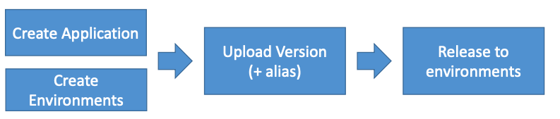

# Section 8: Classic Solutions Architecture Discussions

## AWS Elastic Beanstalk

- Elastic Beanstalk is a developer centric view of deploying an application on AWS

* Managed service
  * Instance configuration / OS is handled by Beanstalk
  * Deployment strategy is configurable but performed by Elastic Beanstalk

* Just the application code is the responsibility of the developer

* Three architecture models:
  * Single Instance deployment: good for dev
  * LB + ASG: great for production or pre-production web applications
  * ASG only: great for non-web apps in production (workers, etc..)

- Beanstalk is free but you pay for the underlying instances

[#aws-saa]() [#Beanstalk]() 

## AWS Elastic Beanstalk - Deploy applications

- Elastic Beanstalk has three components 

  - Application
  - Application version: each deployment gets assigned a version
  - Environment name (dev,test,prod...): free naming

- You deploy application versions to environments and can promote application versions to the next environment

- Rollback feature to previous application version

- Full control over lifecycle of environments

  

[#aws-saa]() [#Beanstalk]() 

## AWS Elastic Beanstalk -  Supported platforms

 Support for many platforms:

- Go

- Java SE

- Java withTomcat

- .NET on Windows Server with IIS

- Node.js

- PHP

- Python

- Ruby

- 

- Packer Builder

- Single Container Docker

- Multicontainer Docker

- Preconfigured Docker

  

* If not supported, you can write your custom platform (advanced)

[#aws-saa]() [#Beanstalk]() 

