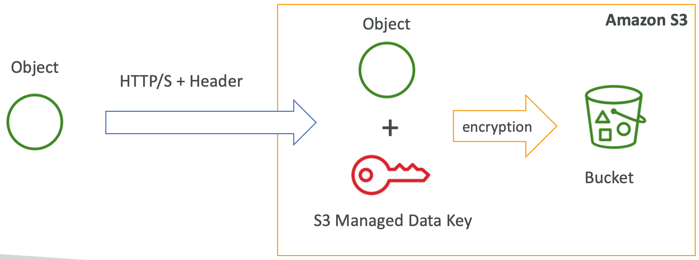
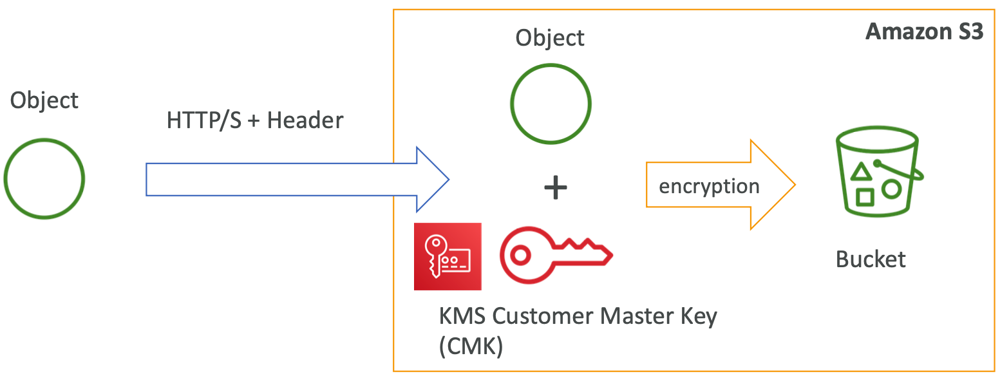
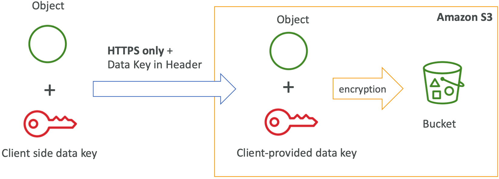
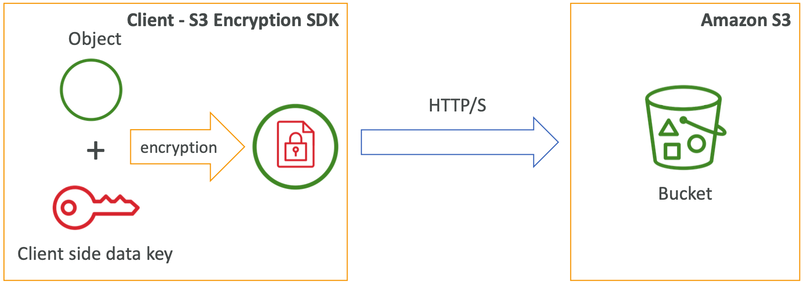
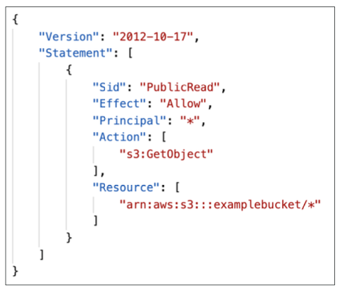
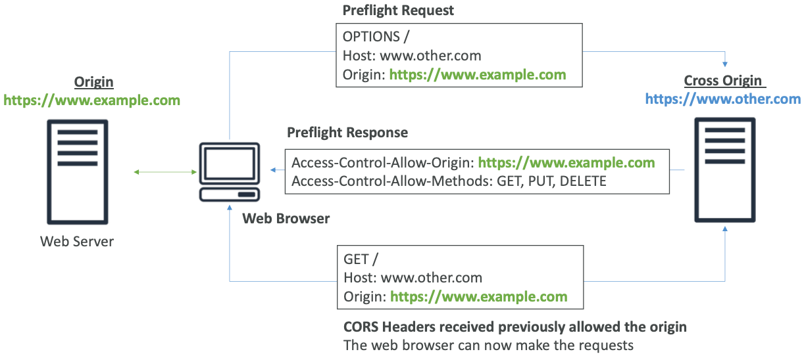
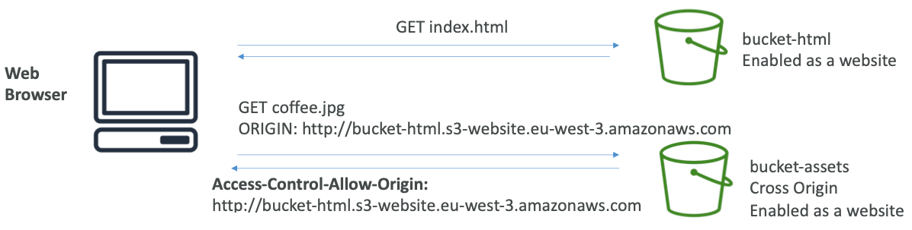

# Section 9: Amazon S3 Introduction

## Amazon S3 Overview - Buckets

* Amazon S3 allows people to store objects (files) in “buckets” (directories)
* Buckets must have a **globally unique name**
* Buckets are defined at the region level
* Naming convention
  * No uppercase
  * No underscore
  * 3-63 characters long
  * Not an IP
  * Must start with lowercase letter or number

[#aws-saa]() [#S3]() 

## Amazon S3 Overview - Objects

- Objects (files) have a Key
- The **key** is the **FULL** path:
  - s3://my-bucket/**my_file.txt**
  - s3://my-bucket/**my_folder1/another_folder/my_file.txt**
- The key is composed of ***prefix*** + **object name**
  - s3://my-bucket***/my_folder1/another_folder/*****my_file.txt**
- There’s no concept of “directories” within buckets (although the UI will trick you to think otherwise)
- Just keys with very long names that contain slashes (“/”)
- Object values are the content of the body:
  - Max Object Size is 5TB (5000GB)
  - If uploading more than 5GB, must use “multi-part upload”
- Metadata (list of text key / value pairs – system or user metadata)
- Tags (Unicode key / value pair – up to 10) – useful for security / lifecycle
- Version ID (if versioning is enabled)

[#aws-saa]() [#S3]() 

## Amazon S3 - Versioning

* You can version your files in Amazon S3
* It is enabled at the **bucket level**
* Same key overwrite will increment the “version”: 1, 2, 3....
* It is best practice to version your buckets
* Protect against unintended deletes (ability to restore a version)
* Easy roll back to previous version

* Notes:
  * Any file that is not versioned prior to enabling versioning will have version “null”
  * Suspending versioning does not delete the previous versions

[#aws-saa]() [#S3]() 

## S3 Encryption Methods for Objects

* There are 4 methods of encrypting objects in S3:
  1. SSE-S3: encrypts S3 objects using keys handled & managed by AWS
  2. SSE-KMS: leverage AWS Key Management Service to manage encryption keys 
  3. SSE-C: when you want to manage your own encryption keys
  4. Client Side Encryption

* It’s important to understand which ones are adapted to which situation for the exam

[#aws-saa]() [#S3]() 

## S3: SSE-S3

* SSE-S3: encryption using keys handled & managed by Amazon S3

* Object is encrypted server side

* AES-256 encryption type

* Must set header: “x-amz-server-side-encryption": "AES256"

  

[#aws-saa]() [#S3]() 

## S3: SSE-KMS

* SE-KMS: encryption using keys handled & managed by KMS

* KMS Advantages: user control + audit trail

* Object is encrypted server side

* Must set header: **“x-amz-server-side-encryption": ”aws:kms"**

  

[#aws-saa]() [#S3]() 

## S3: SSE-C

* SSE-C: server-side encryption using data keys fully managed by the customer outside of AWS

* Amazon S3 does not store the encryption key you provide

* **HTTPS must be used**

* Encryption key must provided in HTTP headers, for every HTTP request made

  

[#aws-saa]() [#S3]() 

## S3: Client Side Encryption

* Client library such as the Amazon S3 Encryption Client

* Clients must encrypt data themselves before sending to S3

* Clients must decrypt data themselves when retrieving from S3

* Customer fully manages the keys and encryption cycle

  

[#aws-saa]() [#S3]() 

## S3: Encryption in transit (SSL/TLS)

*  Amazon S3 exposes:

  * HTTP endpoint: non encrypted

  * HTTPS endpoint: encryption in flight

    

* You’re free to use the endpoint you want, but HTTPS is recommended

* Most clients would use the HTTPS endpoint by default

  

* HTTPS is mandatory for SSE-C

* Encryption in flight is also called SSL /TLS

[#aws-saa]() [#S3]() 

## S3 Security

* **User based**
  * IAM policies - which API calls should be allowed for a specific user from IAM console

* **Resource Based**
  * Bucket Policies - bucket wide rules from the S3 console - allows cross account
  * Object Access Control List (ACL) – finer grain
  * Bucket Access Control List (ACL) – less common

* **Note:** an IAM principal can access an S3 object if
  * the user IAM permissions allow it <u>OR</u> the resource policy ALLOWS it
  * <u>AND</u> there’s no explicit DENY

[#aws-saa]() [#S3]() 

## 3 Bucket Policies

* JSON based policies
  * Resources: buckets and objects
  * Actions: Set of API to Allow or Deny
  * Effect: Allow / Deny
  * Principal:The account or user to apply the policy to

* Use S3 bucket for policy to:
  * Grant public access to the bucket

  * Force objects to be encrypted at upload

  * Grant access to another account (Cross Account)

    

[#aws-saa]() [#S3]() 

## Bucket settings for Block Public Access

- Block public access to buckets and objects granted through
  - *new* access control lists (ACLs)
  - *any* access control lists (ACLs)
  - *new* public bucket or access point policies
- Block public and cross-account access to buckets and objects through *any* public bucket or access point policies
- **These settings were created to prevent company data leaks**
- If you know your bucket should never be public, leave these on
- Can be set at the account level

[#aws-saa]() [#S3]() 

## S3 Security: Networking

Networking:

* Supports VPC Endpoints (for instances inVPC without www internet)

[#aws-saa]() [#S3]() 

## S3 Security: Logging and Audit

Logging and Audit:

* S3 Access Logs can be stored in other S3 bucket
* API calls can be logged in AWS CloudTrail

[#aws-saa]() [#S3]() 

## S3 User Security

User Security:

- MFA Delete: MFA (multi factor authentication) can be required in versioned

  buckets to delete objects

- Pre-Signed URLs: URLs that are valid only for a limited time (ex: premium video service for logged in users)

[#aws-saa]() [#S3]() 

## S3 Websites

*  S3 can host static websites and have them accessible on the www

* The website URL will be:
  * <bucket-name>.s3-website-<AWS-region>.amazonaws.com OR
  * <bucket-name>.s3-website.<AWS-region>.amazonaws.com 

* If you get a 403 (Forbidden) error, make sure the bucket policy allows public reads!

[#aws-saa]() [#S3]() 

## CORS

- An origin is a scheme (protocol), host (domain) and port

  * E.g.: https://www.example.com (implied port is 443 for HTTPS, 80 for HTTP)

- CORS means Cross-Origin Resource Sharing

- **Web Browser** based mechanism to allow requests to other origins while visiting the main origin

- Same origin: **http://example.com**/app1 & **http://example.com**/app2

- Different origins: **http://www.example.com** & ***http://other.example.com***

- The requests won’t be fulfilled unless the other origin allows for the requests, using **CORS Headers (ex: Access-Control-Allow-Origin)**

  

[#aws-saa]() [#S3]() 

## S3 CORS

* If a client does a cross-origin request on our S3 bucket, we need to enable the correct CORS headers

* You can allow for a specific origin OR for * (all origins)

  

[#aws-saa]() [#S3]() 

## Amazon S3 - Consistency Model

* **Read after write consistency for PUTS of new objects**

  * As soon as a new object is written, we can retrieve it

    ex: (PUT 200 => GET 200)

  * This is true, **except** if we did a GET before to see if the object existed

    ex: (GET 404 => PUT 200 => GET 404) – eventually consistent

* **Eventual Consistency for DELETES and PUTS of existing objects**
  * If we read an object after updating, we might get the older version

    ex: (PUT 200 => PUT 200 => GET 200 (might be older version))

  * If we delete an object, we might still be able to retrieve it for a short time 

    ex: (DELETE 200 => GET 200)

    

* Note: there’s no way to request “strong consistency”

[#aws-saa]() [#S3]() 