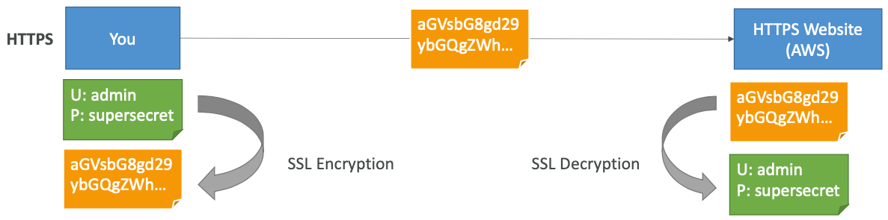
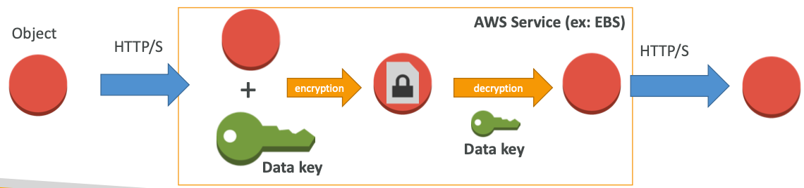
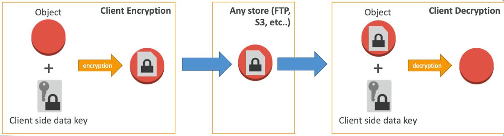
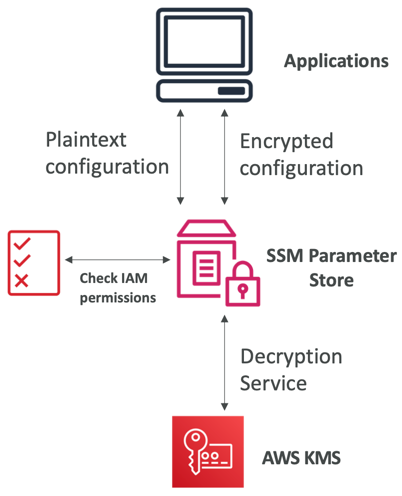
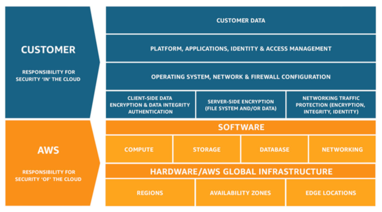

# Section 20: AWS Security & Encryption: KMS, SSM Parameter Store, CloudHSM, Shield, WAF

## Why encryption? Encryption in flight (SSL)

- Data is encrypted before sending and decrypted after receiving
- SSL certificates help with encryption (HTTPS)
- Encryption in flight ensures no MITM (man in the middle attack) can happen

[#aws-saa]() [#encryption]()

## Why encryption? Server side encryption at rest

- Data is encrypted after being received by the server
- Data is decrypted before being sent
- It is stored in an encrypted form thanks to a key (usually a data key)
- The encryption / decryption keys must be managed somewhere and the server must have access to it

[#aws-saa]() [#encryption]()

## Why encryption? Client side encryption

- Data is encrypted by the client and never decrypted by the server

- Data will be decrypted by a receiving client

- The server should not be able to decrypt the data

- Could leverage Envelope Encryption

  

[#aws-saa]() [#encryption]()

## AWS KMS (Key Management Service)

- Anytime you hear “encryption” for an AWS service, it’s most likely KMS
- Easy way to control access to your data, AWS manages keys for us
- Fully integrated with IAM for authorization
- Seamlessly integrated into:
- Amazon EBS: encrypt volumes
- Amazon S3: Server side encryption of objects
- Amazon Redshift: encryption of data
- Amazon RDS: encryption of data
- Amazon SSM: Parameter store
- Etc...
- But you can also use the CLI / SDK

[#aws-saa]() [#encryption]()

## KMS – Customer Master Key (CMK)Types

- **Symmetric (AES-256 keys)**

  - First offering of KMS, single encryption key that is used to Encrypt and Decrypt
  - AWS services that are integrated with KMS use Symmetric CMKs
  - Necessary for envelope encryption
  - You never get access to the Key unencrypted (must call KMS API to use)

- **Asymmetric (RSA & ECC key pairs)**

  * Public (Encrypt) and Private Key (Decrypt) pair

  - Used for Encrypt/Decrypt, or Sign/Verify operations
  - The public key is downloadable, but you access the Private Key unencrypted
  - Use case: encryption outside of AWS by users who can’t call the KMS API

[#aws-saa]() [#encryption]()[#KMS]()

## AWS KMS (Key Management Service)

- Able to fully manage the keys & policies:
  - Create
  - Rotation policies
  - Disable
  - Enable
- Able to audit key usage (using CloudTrail)
- Three types of Customer Master Keys (CMK):
  - AWS Managed Service Default CMK: **free**
  - User Keys created in KMS: **$1 / month**
  - User Keys imported (must be 256-bit symmetric key): **$1 / month**
- + pay for API call to KMS ($0.03 / 10000 calls)

[#aws-saa]() [#encryption]()[#KMS]()

## AWS KMS Overview

- Anytime you need to share sensitive information... use KMS
  - Database passwords
  - Credentials to external service
  - Private Key of SSL certificates
- The value in KMS is that the CMK used to encrypt data can never be retrieved by the user, and the CMK can be rotated for extra security

- **Never ever store your secrets in plaintext, especially in your code!**

- Encrypted secrets can be stored in the code / environment variables

- **KMS can only help in encrypting up to 4KB of data per call**

- If data > 4 KB, use envelope encryption

  

- To give access to KMS to someone:

  - Make sure the Key Policy allows the user
  - Make sure the IAM Policy allows the API calls

[#aws-saa]() [#encryption]()[#KMS]()

## KMS Key Policies

- Control access to KMS keys, “similar” to S3 bucket policies
- Difference: you cannot control access without them
- **Default KMS Key Policy:**
  - Created if you don’t provide a specific KMS Key Policy
  - Complete access to the key to the root user = entire AWS account
  - Gives access to the IAM policies to the KMS key
- **Custom KMS Key Policy:**
  - Define users, roles that can access the KMS key
  - Define who can administer the key
  - Useful for cross-account access of your KMS key

[#aws-saa]() [#encryption]()[#KMS]()

## SSM Parameter Store

- Secure storage for configuration and secrets
- Optional Seamless Encryption using KMS
- Serverless, scalable, durable, easy SDK
- Version tracking of configurations / secrets
- Configuration management using path & IAM
- Notifications with CloudWatch Events
- Integration with CloudFormation

[#aws-saa]() [#encryption]()[#SSM]()

## AWS Secrets Manager

- Newer service, meant for storing secrets

- Capability to force **rotation of secrets** every X days

- Automate generation of secrets on rotation (uses Lambda)

- Integration with **Amazon RDS** (MySQL, PostgreSQL, Aurora)

- Secrets are encrypted using KMS

  

- Mostly meant for RDS integration

[#aws-saa]() [#encryption]()[#Secrets Manager]()

## CloudHSM

- KMS => AWS manages the software for encryption
- CloudHSM => AWS provisions encryption **hardware**
- Dedicated Hardware (HSM = Hardware Security Module)
- You manage your own encryption keys entirely (not AWS)
- HSM device is tamper resistant, FIPS 140-2 Level 3 compliance
- **CloudHSM clusters are spread across Multi AZ (HA) – must setup**
- Supports both symmetric and **asymmetric** encryption (SSL/TLS keys)
- No free tier available
- Must use the CloudHSM Client Software
- Redshift supports CloudHSM for database encryption and key management
- Good option to use with SSE-C encryption

[#aws-saa]() [#encryption]()[#CloudHSM]()

## AWS Shield

* **AWS Shield Standard:**
  * Free service that is activated for every AWS customer
  * Provides protection from attacks such as SYN/UDP Floods, Reflection attacks and other layer 3/layer 4 attacks
* **AWS Shield Advanced:**
  * Optional DDoS mitigation service ($3,000 per month per organization)
  * Protect against more sophisticated attack on Amazon EC2, Elastic Load Balancing (ELB), Amazon CloudFront, AWS Global Accelerator, and Route 53
  * 24/7 access to AWS DDoS response team (DRP)
  * Protect against higher fees during usage spikes due to DDoS

[#aws-saa]() [#encryption]()[#Shield]()

## AWS WAF – Web Application Firewall

- Protects your web applications from common web exploits (Layer 7)

- **Layer 7 is HTTP (vs Layer 4 is TCP)**

- Deploy on **Application Load Balancer, API Gateway, CloudFront**

  

- Define Web ACL (Web Access Control List):

  - Rules can include: **IP addresses**, HTTP headers, HTTP body, or URI strings
  - Protects from common attack - **SQL injection** and **Cross-Site Scripting (XSS)**
  - Size constraints, **geo-match (block countries)**
  - Rate-based rules (to count occurrences of events) – **for DDoS protection**

[#aws-saa]() [#encryption]()[#WAF]()

## AWS Shared Responsibility Model

- **AWS responsibility - Security of the Cloud**

  - Protecting infrastructure (hardware, software, facilities, and networking) that runs all of the AWS services
  - Managed services like S3, DynamoDB, RDS etc

  

- **Customer responsibility - Security in the Cloud**

  - For EC2 instance, customer is responsible for management of the guest OS (including security patches and updates), firewall & network configuration, IAM etc
  
    

[#aws-saa]() [#encryption]()

