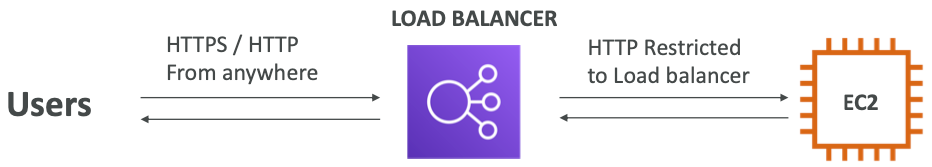

# Section 4: High Availability and Scalability: ELB & ASG

## Scalability & High Availability

- Scalability means that an application / system can handle greater loads by adapting.

- There are two kinds of scalability: 

  - Vertical Scalability
  - Horizontal Scalability (= elasticity)

- **Scalability is linked but different to High Availability**

  ---

- Let’s deep dive into the distinction, using a call center as an example

## Vertical Scalability

- Vertically scalability means increasing the size of the instance
- For example, your application runs on a t2.micro
- Scaling that application vertically means running it on a t2.large
- Vertical scalability is very common for non distributed systems, such as a database.
- RDS, ElastiCache are services that can scale vertically.
- There’s usually a limit to how much you can vertically scale (hardware limit)

## Horizontal Scalability

- Horizontal Scalability means increasing the number of instances / systems for your application
- Horizontal scaling implies distributed systems.
- This is very common for web applications / modern applications
- It’s easy to horizontally scale thanks the cloud offerings such as Amazon EC2

## High Availability

- High Availability usually goes hand in hand with horizontal scaling
- High availability means running your application / system in at least 2 data centers (== Availability Zones)
- The goal of high availability is to survive a data center loss
- The high availability can be passive (for RDS Multi AZ for example)
- The high availability can be active (for horizontal scaling)

## High Availability & Scalability For EC2

* Vertical Scaling: Increase instance size (= scale up / down) 
  * From: t2.nano - 0.5G of RAM, 1 vCPU
  * To: u-12tb1.metal – 12.3 TB of RAM, 448 vCPUs

* Horizontal Scaling: Increase number of instances (= scale out / in) 
  * Auto Scaling Group
  * Load Balancer

* High Availability: Run instances for the same application across multi AZ
  * Auto Scaling Group multi AZ
  * Load Balancer multi AZ

## What is load balancing?

* Load balancers are servers that forward internet traffic to multiple servers (EC2 Instances) downstream.

## Why use a load balancer?

* Spread load across multiple downstream instances
* Expose a single point of access (DNS) to your application 
* Seamlessly handle failures of downstream instances
* Do regular health checks to your instances
* Provide SSL termination (HTTPS) for your websites
* Enforce stickiness with cookies
* High availability across zones
* Separate public traffic from private traffic

## Why use an EC2 Load Balancer?

* An ELB (EC2 Load Balancer) is a managed load balancer 
  * AWS guarantees that it will be working
  * AWS takes care of upgrades, maintenance, high availability 
  * AWS provides only a few configuration knobs

* It costs less to setup your own load balancer but it will be a lot more effort on your end.

* It is integrated with many AWS offerings / services

## Health Checks

- Health Checks are crucial for Load Balancers
- They enable the load balancer to know if instances it forwards traffic to are available to reply to requests
- The health check is done on a port and a route (/health is common)
- If the response is not 200 (OK), then the instance is unhealthy

## Types of load balancer on AWS

- AWS has **3 kinds of managed Load Balancers**
- Classic Load Balancer (v1 - old generation) – 2009 
  - HTTP, HTTPS, TCP
- Application Load Balancer (v2 - new generation) – 2016 
  - HTTP, HTTPS, WebSocket
- Network Load Balancer (v2 - new generation) – 2017 
  - TCP, TLS (secure TCP) & UDP
- Overall, it is recommended to use the newer / v2 generation load balancers as they provide more features
- You can setup **internal** (private) or **external** (public) ELBs

## Load Balancer Security Groups

**Load Balancer Security Group:**

**Application Security Group: Allow traffic only from Load Balancer**

## Load Balancer Good to Know

* LBs can scale but not instantaneously – contact AWS for a “warm-up”

* Troubleshooting
  * 4xx errors are client induced errors
  * 5xx errors are application induced errors
  * Load Balancer Errors 503 means at capacity or no registered target
  * If the LB can’t connect to your application, check your security groups!

* Monitoring
  * ELB access logs will log all access requests (so you can debug per request)
  * CloudWatch Metrics will give you aggregate statistics (ex: connections count)

## Classic Load Balancers (v1)

- Suppor ts TCP (Layer 4), HTTP & HTTPS (Layer 7)
- Health checks are TCP or HTTP based
- Fixed hostname XXX.region.elb.amazonaws.com

## Application Load Balancer (v2)

- Application load balancers is Layer 7 (HTTP)
- Load balancing to multiple HTTP applications across machines (target groups)
- Load balancing to multiple applications on the same machine (ex: containers)
- Support for HTTP/2 and WebSocket
- Support redirects (from HTTP to HTTPS for example)

- Routing tables to different target groups:

  * Routing based on path in URL (example.com**/users** & example.com**/posts**)

  * Routing based on hostname in URL (**one.example.com** & **other.example.com**)

  * Routing based on Query String, Headers (example.com/users?i**d=123&order=false**)

    ---

- ALB are a great fit for micro services & container-based application (example: Docker & Amazon ECS)

- Has a port mapping feature to redirect to a dynamic port in ECS

- In comparison, we’d need multiple Classic Load Balancer per application

### Application Load Balancer (v2) HTTP Based Traffic

### Application Load Balancer (v2) Target Groups

* EC2 instances (can be managed by an Auto Scaling Group) – HTTP 

* ECS tasks (managed by ECS itself) – HTTP

* Lambda functions – HTTP request is translated into a JSON event

* IP Addresses – must be private IPs

  ---

* ALB can route to multiple target groups

* Health checks are at the target group level

### Application Load Balancer (v2) Good to Know

* Fixed hostname (XXX.region.elb.amazonaws.com)
* The application servers don’t see the IP of the client directly
  * The true IP of the client is inserted in the header **X-Forwarded-For**
  * We can also get Port (X-Forwarded-Port) and proto (X-Forwarded-Proto)

## Network Load Balancer (v2)

- Network load balancers (Layer 4) allow to
  - **Forward TCP & UDP traffic to your instances**
  
  - Handle millions of request per seconds
  
  - Less latency ~100 ms (vs 400 ms for ALB)
  
    ---
- NLB has <u>one static IP per AZ</u>, and supports assigning Elastic IP (helpful for whitelisting specific IP)
- NLB are used for extreme performance, TCP or UDP traffic
- Not included in the AWS free tier

### Network Load Balancer (v2) TCP (Layer 4) Based Traffic

## Load Balancer Stickiness

- It is possible to implement stickiness so that the same client is always redirected to the same instance behind a load balancer
- This works for Classic Load Balancers & Application Load Balancers
- The “cookie” used for stickiness has an expiration date you control
- Use case: make sure the user doesn’t lose his session data
- Enabling stickiness may bring imbalance to the load over the backend EC2 instances

## Cross-Zone Load Balancing

- With Cross Zone Load Balancing: each load balancer instance distributes evenly across all registered instances in all AZ
- Otherwise, each load balancer node distributes requests evenly across the registered instances in its Availability Zone only.

### Cross-Zone Load Balancing

* **Classic Load Balancer**
  * Disabled by default
  * No charges for inter AZ data if enabled

* **Application Load Balancer**
  * Always on (can’t be disabled)
  * No charges for inter AZ d ata

* **Network Load Balancer**
  * Disabled by default
  * You pay charges ($) for inter AZ data if enabled

## Elastic Load Balancer - SSL Certificates

### SSL/TLS - Basics

- An SSL Certificate allows traffic between your clients and your load balancer to be encrypted in transit (in-flight encryption)

  ---

- SSL refers to Secure Sockets Layer, used to encrypt connections

- TLS refers toTransport Layer Security,which is a newer version

- Nowadays, TLS certificates are mainly used, but people still refer as SSL

---

- Public SSL certificates are issued by Certificate Authorities (CA)

- Comodo, Symantec, GoDaddy, GlobalSign, Digicert, Letsencrypt, etc...

  ---

- SSL certificates have an expiration date (you set) and must be renewed

### Load Balancer - SSL Certificates

* The load balancer uses an X.509 certificate (SSL/TLS server certificate) 
* You can manage certificates using ACM (AWS Certificate Manager)
* You can create upload your own certificates alternatively

* HTTPS listener:
  * You must specify a default certificate
  * You can add an optional list of certs to support multiple domains
  * **Clients can use SNI (Server Name Indication) to specify the hostname they reach**
  * Ability to specify a security policy to support older versions of SSL /TLS (legacy clients)

### SSL – Server Name Indication (SNI)

- SNI solves the problem of loading **multiple SSL certificates** onto one web server (to serve multiple websites)
- It’s a “newer” protocol, and requires the client to **indicate** the hostname of the target server in the initial SSL handshake
- The server will then find the correct certificate, or return the default one

**Note:**

- Only works for ALB & NLB (newer generation), CloudFront
- Does not work for CLB (older gen)

### Elastic Load Balancers – SSL Certificates

* **Classic Load Balancer (v1)**
  * Support only one SSL certificate
  * Must use multiple CLB for multiple hostname with multiple SSL certificates

* **Application Load Balancer (v2)**
  * Supports multiple listeners with multiple SSL certificates 
  * Uses Server Name Indication (SNI) to make it work

* **Network Load Balancer (v2)**
  * Supports multiple listeners with multiple SSL certificates
  * Uses Server Name Indication (SNI) to make it work

### ELB – Connection Draining

- **Feature naming:**
   
   - CLB:ConnectionDraining

  - TargetGroup:DeregistrationDelay

     (for ALB & NLB)
   
   
   
- Time to complete “in-flight requests” while the instance is de-registering or unhealthy

- Stops sending new requests to the instance which is de-registering

- Between 1 to 3600 seconds, default is 300 seconds

- Can be disabled (set value to 0)

- Set to a low value if your requests are short

## Auto Scaling Groups (ASG) Overview

### What’s an Auto Scaling Group?

* In real-life, the load on your websites and application can change

* In the cloud, you can create and get rid of servers very quickly

  

* The goal of an Auto Scaling Group (ASG) is to:

  * Scale out (add EC2 instances) to match an increased load
  * Scale in (remove EC2 instances) to match a decreased load
  * Ensure we have a minimum and a maximum number of machines running
  * Automatically Register new instances to a load balancer

### Auto Scaling Group in AWS

### Auto Scaling Group in AWS With Load Balancer

### ASGs have the following attributes

* A launch configuration 
  * AMI + InstanceType
  * EC2 User Data 
  * EBSVolumes
  * Security Groups 
  * SSH Key Pair

* Min Size / Max Size / Initial Capacity
* Network + Subnets Information
* Load Balancer Information
* Scaling Policies

### Auto Scaling Alarms

* It is possible to scale an ASG based on CloudWatch alarms
* An Alarm monitors a metric (such as Average CPU)
* <u>Metrics are computed for the overall ASG instances</u>

* Based on the alarm:

  * We can create scale-out policies (increase the number of instances)

  * We can create scale-in policies (decrease the number of instances)

    

### Auto Scaling New Rules

* It is now possible to define ”better” auto scaling rules that are directly managed by EC2
  * Target Average CPU Usage
  * Number of requests on the ELB per instance
  * Average Network In
  * Average Network Out

* These rules are easier to set up and can make more sense

### Auto Scaling Custom Metric

- We can auto scale based on a custom metric (ex: number of connected users)

  

- 1. Send custom metric from application on EC2 to CloudWatch (PutMetric API)

- 2. Create CloudWatch alarm to react to low / high values

- 3. Use the CloudWatch alarm as the scaling policy for ASG

### ASG Brain Dump

- Scaling policies can be on CPU, Network... and can even be on custom metrics or based on a schedule (if you know your visitors patterns)
- ASGs use Launch configurations or Launch Templates (newer)
- To update an ASG, you must provide a new launch configuration / launch template
- IAM roles attached to an ASG will get assigned to EC2 instances
- ASG are free. You pay for the underlying resources being launched
- Having instances under an ASG means that if they get terminated for whatever reason, the ASG will automatically **create new ones as a replacement**. Extra safety!
- ASG can terminate instances marked as unhealthy by an LB (and hence replace them)

## Auto Scaling Groups – Scaling Policies

* **Target Tracking Scaling**
  * Most simple and easy to set-up
  * Example: I want the average ASG CPU to stay at around 40%

* **Simple / Step Scaling**
  * When a CloudWatch alarm is triggered (example CPU > 70%), then add 2 units
  * When a CloudWatch alarm is triggered (example CPU < 30%), then remove 1

* **Scheduled Actions**
  * Anticipate a scaling based on known usage patterns
  * Example: increase the min capacity to 10 at 5 pm on Fridays

## Auto Scaling Groups - Scaling Cooldowns

- **The cooldown period helps to ensure that your Auto Scaling group doesn't launch or terminate additional instances before the previous scaling activity takes effect.**

- In addition to default cooldown for Auto Scaling group, we can create cooldowns that apply to a specific **simple scaling policy**

- A scaling-specific cooldown period overrides the default cooldown period.

- One common use for scaling-specific cooldowns is with a scale-inpolicy—apolicy that terminates instances based on a specific criteria or metric. Because this policy terminates instances, Amazon EC2 Auto Scaling needs less time to determine whether to terminate additional instances.

- **If the default cooldown period of 300 seconds is too long — you can reduce costs by applying a scaling-specific cooldown period of 180 seconds to the scale-in policy.**

- If your application is scaling up and down multiple times each hour, modify the Auto Scaling Groups cool-down timers and the CloudWatch Alarm Period that triggers the scale in

  

​	https://docs.aws.amazon.com/autoscaling/ec2/userguide/Cooldown.html

## Auto Scaling Groups - for Solutions Architects

### ASG for Solutions Architects

* **ASG Default Termination Policy (simplified version):**
  * 1. Find the AZ which has the most number of instances
  * 2. If there are multiple instances in the AZ to choose from, delete the one with the oldest launch configuration

* **ASG tries the balance the number of instances across AZ by default**

  

### ASG for Solutions Architects Lifecycle Hooks

- By default as soon as an instance is launched in an ASG it’s in service.

- You have the ability to perform extra steps before the instance goes in service (Pending state)

- You have the ability to perform some actions before the instance is terminated (Terminating state)

  

  https://docs.aws.amazon.com/autoscaling/ec2/userguide/lifecycle-hooks.html

### ASG for Solutions Architect LaunchTemplate vs Launch Configuration

* **Both:**
  * ID of the Amazon Machine Image (AMI), the instance type, a key pair, security groups, and the other parameters that you use to launch EC2 instances (tags, EC2 user-data...) 
* **Launch Configuration (legacy)**
  * Must be re-created every time
* **Launch Template (newer):**
  * Can have multiple versions
  * Create parameters subsets (partial configuration for re-use and inheritance)
  * Provision using both On-Demand and Spot instances (or a mix)
  * Can use T2 unlimited burst feature
  * <u>Recommended by AWS going forward</u>