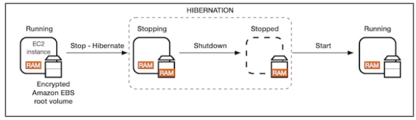

# AWS Certified Solutions Architect – Associate (SAA-C02)

[AWS Certification Hom page](https://aws.amazon.com/certification/?nc2=sb_ce_co)

[AWS Certified Solutions Architect – Associate Home Page](https://aws.amazon.com/certification/certified-solutions-architect-associate/)

Started: Jul 3, 2020

**Courses and tests** 

Stephane course  [udemy-saa-2020-cource-notes.md](udemy-saa-2020-cource-notes.md) 

tutorialsdojo links to all aws cheat sheets - https://tutorialsdojo.com/links-to-all-aws-cheat-sheets/

[practice exams jon-bonso-tdojo](https://portal.tutorialsdojo.com/courses/aws-certified-solutions-architect-associate-practice-exams/) 

[Reddit - Passed both CLF-C01 and SAA-C02!](https://www.reddit.com/r/AWSCertifications/comments/hi4sdu/passed_both_clfc01_and_saac02/)

How to book and take your aws certification exam online saa c02 https://tutorialsdojo.com/how-to-book-and-take-your-aws-certification-exam-online-saa-c02/

AWS SAA-C02 exam questions  https://od.lk/fl/NzZfMTc4NjI2OV8

[Just passed SAA-C02](https://www.reddit.com/r/AWSCertifications/comments/h8hr7p/just_passed_saac02/) (read again)

[SAA-C02. How to prepare](https://www.reddit.com/r/AWSCertifications/comments/gk3jxt/saac02_how_to_prepare/) (read again)

**Notes**

We will cover over 30 AWS Services

Important to setup AWS Budget

## AWS Fundamentals - Part 1 

Regions, IAM & EC2

### AWS Regions

* A region is a cluster of **data centers** 

* Each region has many availability zones (**AZ**)
  * usually 3, min is 2, max is 6

### IAM

* IAM (Identity and Access Management)
* AWS security is there:
  * Users
  * Groups
  * Roles
* Root account should never by used (and shared)
* Users must be created with proper permission
*  IAM is at the center of AWS and has a global view
* Policies are writtner in JSON
* **Least privelege principles**. It's best to give users the minimal aount of permissions they need to perform their job 

#### IAM Federation

* Big enterprises usually integrate their own repository of users with IAM
* This way, one can login into AWS using their company credentials
* Identity Federation uses the SAML standard (Active Directory)

#### IAM Brain Dump

* One IAM **User** per PHYSICAL PERSON
* One IAM **Role** per Application
* IAM credentials should NEVER BE SHARED
* Never, ever, ever, ever, write IAM credentials in code. EVER.
* **And even less, NEVER EVER EVER COMMIT YOUR IAM credentials • Never use the ROOT account except for initial setup.**
* **Never use ROOT IAM Credentials**

### EC2

#### What is EC2?

*  EC2 is one of most popular of AWS offering

* It mainly consists in the capability of :
  1. Renting virtual machines (EC2)
  2. Storing data on virtual drives (EBS)
  3. Distributing load across machines (ELB)
  4. Scaling the services using an auto-scaling group (ASG)

* Knowing EC2 is fundamental to understand how the Cloud works

### Security Groups

* Security groups are acting as a “firewall” on EC2 instances
* Security Groups regulate:
  * Access to Ports
  * Authorised IP ranges – IPv4 and IPv6
  * Control of inbound network (from other to the instance)
  * Control of outbound network (from the instance to other)

* **Good to know**:
  * Can be attached to multiple instances
  * Locked down to a region / VPC combination
  * Does live “outside” the EC2 – if traffic is blocked the EC2 instance won’t see it
  * **It’s good to maintain one separate security group for SSH access**
  * If your application is not accessible (time out), then it’s a security group issue
  * If your application gives a “connection refused“ error, then it’s an application error or it’s not launched
  * All inbound traffic is **blocked** by default
  * All outbound traffic is **authorised** by default

### Private vs Public IP (IPv4)

* Networking has two sorts of IPs. IPv4 and IPv6:
  * IPv4:**1.160.10.240**
  * IPv6:**3ffe:1900:4545:3:200:f8ff:fe21:67cf**
* IPv4 is still the most common format used online.
* IPv6 is newer and solves problems for the Internet of Things (IoT).
* IPv4 allows for 3.7 billion different addresses in the public space 
* IPv4: [0-255].[0-255].[0-255].[0-255].

#### Private vs Public IP (IPv4) Fundamental Differences

* Public IP:
  * Public IP means the machine can be identified on the internet (WWW)
  * Must be unique across the whole web (not two machines can have the same public IP).
  * Can be geo-located easily

* Private IP:
  * Private IP means the machine can only be identified on a private network only
  * The IP must be unique across the private network
  * BUT two different private networks (two companies) can have the same IPs.
  * Machines connect to WWW using a NAT + internet gateway (a proxy)
  * Only a specified range of IPs can be used as private IP

###  Elastic IP

- When you stop and then start an EC2 instance, it can change its public IP.
- If you need to have a fixed public IP for your instance, you need an Elastic IP
- An Elastic IP is a public IPv4 IP you own as long as you don’t delete it
- You can attach it to one instance at a time

- With an Elastic IP address, you can mask the failure of an instance or software by rapidly remapping the address to another instance in your account.
- You can only have 5 Elastic IP in your account (you can ask AWS to increase that).
- Overall, **try to avoid using** Elastic IP:
  - They often reflect poor architectural decisions
  - Instead, use a random public IP and register a DNS name to it
  - Or, as we’ll see later, use a Load Balancer and don’t use a public IP

### EC2 User Data

* It is possible to bootstrap our instances using an **EC2 User data** script.
* **bootstrapping** means launching commands when a machine starts
* That script is **only run once** at the instance **first start**
* EC2 user data is used to automate boot tasks such as:
  * Installing updates
  * Installing software
  * Downloading common files from the internet
  * Anything you can think of
* The EC2 User Data Script runs with the root user

### EC2 Instance LaunchTypes

* **On Demand Instances:** short workload, predictable pricing
* **Reserved:** (MINIMUM 1 year)
  *  **Reserved Instances**: long workloads
  * **Convertible Reserved Instances**: long workloads with flexible instances
  * **Scheduled Reserved Instances**: example – every Thursday between 3 and 6 pm
* **Spot Instances**: short workloads, for cheap, can lose instances (less reliable) • Dedicated Instances: no other customers will share your hardware
* **Dedicated Hosts**: book an entire physical server, control instance placement

#### EC2 On Demand

- Pay for what you use (billing per second, after the first minute)
- Has the highest cost but no upfront payment
- No long term commitment
- Recommended for short-term and un-interrupted workloads, where you can't predict how the application will behave.

#### EC2 Reserved Instances

* Up to 75% discount compared to On-demand
* Pay upfront for what you use with long term commitment
* Reservation period can be 1 or 3 years
* Reserve a specific instance type
* Recommended for steady state usage applications (think database)

* **Convertible Reserved Instance**
  * can change the EC2 instance type
  *  Up to 54% discount

* **Scheduled Reserved Instances**
  * launch within time window you reserve
  * When you require a fraction of day / week / month

#### EC2 Spot Instances

- Can get a discount of up to 90% compared to On-demand
- Instances that you can “lose” at any point of time if your max price is less than the current spot price
- The MOST cost-efficient instances in AWS
- **Useful for workloads that are resilient to failure**
  - Batch jobs
  - Data analysis
  - Image processing 
  - ...
- **Not great for critical jobs or databases**
- **Great combo: Reserved Instances for baseline + On-Demand & Spot for peaks**

#### EC2 Dedicated Hosts

- Physical dedicated EC2 server for your use

- Full control of EC2 Instance placement

- Visibility into the underlying sockets / physical cores of the hardware

- Allocated for your account for a 3 year period reservation

- More expensive

  

- Useful for software that have complicated licensing model (BYOL – Bring Your Own License)

- Or for companies that have strong regulatory or compliance needs © Stephane Maarek

- Instances running on hardware that’s dedicated to you
- May share hardware with other instances in same account
- No control over instance placement (can move hardware after Stop / Start)

### EC2 Spot Instance Requests

* Can get a discount of up to 90% compared to On-demand

----

* Define **max spot price** and get the instance while **current spot price < max**
  * The hourly spot price varies based on offer and capacity
  * If the current spot price > your max price you can choose to **stop** or **terminate** your instance with a 2 minutes grace period.
* Other strategy: **Spot Block**
* “block” spot instance during a specified time frame (1 to 6 hours) without interruptions
* In rare situations, the instance may be reclaimed

---

* **Used for batch jobs, data analysis, or workloads that are resilient to failures.**
* **Not great for critical jobs or databases**

#### How to terminate Spot Instances?

* You can only cancel Spot Instance requests that are **open, active, or disabled.** 
* <u>Cancelling a Spot Request does not terminate instances</u>
* You must first cancel a Spot Request, and then terminate the associated Spot Instances

### Spot Fleets

* Spot Fleets = set of Spot Instances + (optional) On-Demand Instances
* The Spot Fleet will try to meet the target capacity with price constraints 
  * Define possible launch pools: instance type (m5.large), OS, Availability Zone
  * Can have multiple launch pools, so that the fleet can choose
  * Spot Fleet stops launching instances when reaching capacity or max cost

* Strategies to allocate Spot Instances:
  * **lowestPrice**: from the pool with the lowest price (cost optimization, short workload)
  * **diversified**: distributed across all pools (great for availability, long workloads)
  * **capacityOptimized**: pool with the optimal capacity for the number of instances

* <u>Spot Fleets allow us to automatically request Spot Instances with the lowest price</u>

### EC2 InstanceTypes – Main ones

* **R**: applications that needs a lot of RAM – in-memory caches
* **C**: applications that needs good CPU – compute / databases
* **M**: applications that are balanced (think “medium”) – general / web app
* **I**: applications that need good local I/O (instance storage) – databases
* **G**: applications that need a GPU – video rendering / machine learning

----

* T2 / T3: burstable instances (up to a capacity)
* T2 / T3 - unlimited: unlimited burst

-----

* *Real-world tip*: use https://www.ec2instances.info

#### Burstable Instances (T2/T3)

- AWS has the concept of burstable instances (T2/T3 machines)
- Burst means that overall, the instance has OK CPU performance.
- When the machine needs to process something unexpected (a spike in load for example), it can burst, and CPU can be VERY good.
- If the machine bursts, it utilizes “burst credits”
- If all the credits are gone, the CPU becomes BAD
- If the machine stops bursting, credits are accumulated over time

* Burstable instances can be amazing to handle unexpected traffic and getting the insurance that it will be handled correctly

* If your instance consistently runs low on credit, you need to move to a different kind of non-burstable instance

#### T2/T3 Unlimited

- Nov 2017: It is possible to have an “unlimited burst credit balance”
- You pay extra money if you go over your credit balance, but you don’t lose in performance
- Overall, it is a new offering, so be careful, costs could go high if you’re not monitoring the health of your instances
- Read more here: https://aws.amazon.com/blogs/aws/new-t2-unlimited- going-beyond-the-burst-with-high-performance/

### EC2 AMI

#### What’s an AMI?

* As we saw, AWS comes with base images such as:
  * Ubuntu
  * Fedora
  * RedHat
  * Windows
  * Etc...

* These images can be customised at runtime using EC2 User data

  ---

* But what if we could create our own image, ready to go?

* That’s an AMI – an image to use to create our instances

* AMIs can be built for Linux or Windows machines

#### Why would you use a custom AMI?

* Using a custom built AMI can provide the following advantages:
  * Pre-installed packages needed
  * Faster boot time (no need for ec2 user data at boot time)
  * Machine comes configured with monitoring / enterprise software
  * Security concerns – control over the machines in the network
  * Control of maintenance and updates of AMIs over time
  * Active Directory Integration out of the box
  * Installing your app ahead of time (for faster deploys when auto-scaling)
  * Using someone else’s AMI that is optimised for running an app, DB, etc...

* **AMI are built for a specific AWS region (!)**

#### Using Public AMIs

* You can leverage AMIs from other people

* You can also pay for other people’s AMI by the hour
  * These people have optimised the software
  * The machine is easy to run and configure
  * You basically rent “exper tise” from the AMI creator

* AMI can be found and published on the Amazon Marketplace

* **Warning:**
  * Do not use an AMI you don’t trust!
  * Some AMIs might come with malware or may not be secure for your enterprise

#### AMI Storage

- Your AMI take space and they live in Amazon S3
- Amazon S3 is a durable, cheap and resilient storage where most of your backups will live (but you won’t see them in the S3 console)
- By default, your AMIs are private, and locked for your account / region
- You can also make your AMIs public and share them with other AWS accounts or sell them on the AMI Marketplace

#### AMI Pricing

- AMIs live in Amazon S3, so you get charged for the actual space in takes in Amazon S3
- Amazon S3 pricing in US-EAST-1:
  * First 50 TB / month: $0.023 per GB
  * Next 450 TB / month: $0.022 per GB
- Overall it is quite inexpensive to store private AMIs.
- Make sure to remove the AMIs you don’t use

#### Cross Account AMI Copy (FAQ + Exam Tip)

- You can share an AMI with another AWS account.

- Sharing an AMI does not affect the ownership of the AMI.

- If you copy an AMI that has been shared with your account, you are the owner of the target AMI in your account.

- To copy an AMI that was shared with you from another account, the owner of the source AMI must grant you read permissions for the storage that backs the AMI, either the associated EBS snapshot (for an Amazon EBS-backed AMI) or an associated S3 bucket (for an instance store-backed AMI).

- Limits:

  - You can't copy an encrypted AMI that was shared with you from another account. Instead, if the underlying snapshot and encryption key were shared with you, you can copy the snapshot while re-encrypting it with a key of your own. You own the copied snapshot, and can register it as a new AMI.
  - You can't copy an AMI with an associated `billingProduct` code that was shared with you from another account. This includes Windows AMIs and AMIs from the AWS Marketplace. To copy a shared AMI with a billingProduct code, launch an EC2 instance in your account using the shared AMI and then create an AMI from the instance.

  https://docs.aws.amazon.com/AWSEC2/latest/UserGuide/CopyingAMIs.html

  

### Placement Groups

* Sometimes you want control over the EC2 Instance placement strategy
* That strategy can be defined using placement groups
* When you create a placement group, you specify one of the following strategies for the group:
  * *Cluster*—clusters instances into a low-latency group in a single Availability Zone
  * *Spread*—spreads instances across underlying hardware (max 7 instances per group per AZ)
  * *Partition*—spreads instances across many different partitions (which rely on different sets of racks) within an AZ. Scales to 100s of EC2 instances per group (Hadoop, Cassandra, Kafka)

#### Placement Groups Cluster

* Pros: Great network (10 Gbps bandwidth between instances)

* Cons: If the rack fails, all instances fails at the same time
* Use case:
  * Big Data job that needs to complete fast
  * Application that needs extremely low latency and high network throughput

#### Placement Groups Spread

* Pros:
  * Can span across Availability
  * Reduced risk is simultaneous failure
  * EC2 Instances are on different physical hardware

* Cons:
  * Limited to 7 instances per AZ per placement group
* Use case:
  * Application that needs to maximize high availability
  * Critical Applications where each instance must be isolated from failure from each other

#### Placements Groups Partition

- Up to 7 partitions per AZ
- Up to 100s of EC2 instances
- The instances in a partition do not share racks with the instances in the other partitions
- A partition failure can affect many EC2 but won’t affect other partitions
- EC2 instances get access to the partition information as metadata
- <u>Use cases</u>: HDFS, HBase, Cassandra, Kafka

### Elastic Network Interfaces (ENI)

- Logical component in a VPC that represents a **virtual network card**
- The ENI can have the following attributes:
  - Primary private IPv4, one or more secondary IPv4 • One Elastic IP (IPv4) per private IPv4
  - One Public IPv4
  - One or more security groups
  - A MAC address
- You can create ENI independently and attach them on the fly (move them) on EC2 instances for failover
- Bound to a specific availability zone (AZ)
-  https://aws.amazon.com/blogs/aws/new-elastic-network-interfaces-in-the-virtual-private-cloud/ 

### EC2 Hibernate

* We know we can stop, terminate instances
  * Stop: the data on disk (EBS) is kept intact in the next start
  * Terminate: any EBS volumes (root) also set-up to be destroyed is lost

* On start, the following happens:
  * First start: the OS boots & the EC2 User Data script is run
  * Following starts: the OS boots up
  * Then your application starts, caches get warmed up, and that can take time!

Introducing **EC2 Hibernate:**

- The in-memory (RAM) state is preserved
- The instance boot is much faster! (the OS is not stopped / restarted)
- Under the hood: the RAM state is written to a file in the root EBS volume
- The root EBS volume must be encrypted
- **Use cases:**
  - long-running processing
  - saving the RAM state
  - services that take time to initialize

https://docs.aws.amazon.com/AWSEC2/latest/UserGuide/Hibernate.html

#### EC2 Hibernate – Good to know

* **Supported instance families** - C3, C4, C5, M3, M4, M5, R3, R4, and R5.
* **Instance RAM size** - must be less than 150 GB.
* **Instance size** - not supported for bare metal instances.
* **AMI**: Amazon Linux 2, Linux AMI, Ubuntu & Windows...

* **Root Volume:** must be EBS, encrypted, not instance store, and large 
* Available for On-Demand and Reserved Instances

* An instance cannot be hibernated more than 60 days

### EC2 for Solutions Architects

EC2 important things important for exam:

- EC2 instances are billed by the second, t2.micro is free tier
- On Linux / Mac we use SSH, on Windows we use Putty
- SSH is on port 22, lock down the security group to your IP
- Timeout issues => Security groups issues
- Permission issues on the SSH key => run “chmod 0400”
- Security Groups can reference other Security Groups instead of IP ranges (very popular exam question)
- Know the difference between Private, Public and Elastic IP
- You can customize an EC2 instance at boot time using EC2 User Data

* Know the 4 EC2 launch modes: 
  * On demand
  * Reserved
  * Spot instances
  * Dedicated Hosts

* Know the basic instance types: R,C,M,I,G,T2/T3
* You can create AMIs to pre-install software on your EC2 => faster boot
* AMI can be copied across regions and accounts

* EC2 instances can be started in placement groups:
  * Cluster
  * Spread

