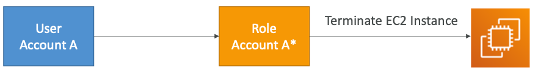

# Section 3: Identity & Federation

## IAM Policies Deep Dive

- Anatomy of a policy: JSON doc with Effect, Action, Resource, Conditions, Policy Variables
- Explicit DENY has precedence over ALLOW
- Best practice: use least privilege for maximum security
  - Access Advisor: See permissions granted and when last accessed
  - AccessAnalyzer:Analyzeresourcesthatare shared with external entity
- Navigate Examples at: https://docs.aws.amazon.com/IAM/latest/UserGuide/access_policies_examples.html

## IAM Policies Conditions

**Operators:**

- String (StringEquals, StringNotEquals, StringLike...)
  - "Condition": {"StringEquals": {"aws:PrincipalTag/job-category": "iamuser-admin"}}
  - "Condition": {"StringLike": {"s3:prefix": [ "", "home/", "home/${aws:username}/" ]}}
- Numeric (NumericEquals, NumericNotEquals, NumericLessThan...)
- Date (DateEquals, DateNotEquals, DateLessThan...)
- Boolean (Bool):
  * “Condition": {"Bool": {"aws:SecureTransport": "true"}}
  * "Condition": {"Bool": {"aws:MultiFactorAuthPresent": "true"}}
- (Not)IpAddress:
  - "Condition": {"IpAddress": {"aws:SourceIp": "203.0.113.0/24"}}
- ArnEquals, ArnLike
  - Null: "Condition":{"Null":{"aws:TokenIssueTime":"true"}}

## IAM Policies Variables and Tags

**Example: ${aws:username}**

* "Resource":["arn:aws:s3:::mybucket/${aws:username}/*"]

**AWS Specific:**

* aws:CurrentTime, aws:TokenIssueTime, aws:principaltype, aws:SecureTransport, aws:SourceIp, aws:userid, ec2:SourceInstanceARN

**Service Specific:**

* s3:prefix, s3:max-keys, s3:x-amz-acl, sns:Endpoint, sns:Protocol...

**Tag Based:**

* iam:ResourceTag/key-name, a ws:PrincipalTag/key-name...

## IAM Roles vs Resource Based Policies

* Attach a policy to a resource (example: S3 bucket policy) versus attaching of a using a role as a proxy

- **When you assume a role (user, application or service), you give up your original permissions and take the permissions assigned to the role**
- When using a resource based policy, the principal doesn’t have to give up any permissions
- <u>Example</u>: User in account A needs to scan a DynamoDB table in Account A and dump it in an S3 bucket in Account B.
- Suppor ted by: Amazon S3 buckets, SNS topics, SQS queues

 

## Using STS to Assume a Role

- Define an IAM Role within your account or cross-account
- Define which principals can access this IAM Role
- Use AWS STS (Security Token Service) to retrieve credentials and impersonate the IAM Role you have access to (AssumeRole API)
- Temporary credentials can be valid between 15 minutes to 1 hour

## Assuming a Role with STS

- Provide access for an IAM user in one AWS account that you own to access resources in another account that you own

- Provide access to IAM users in AWS accounts owned by third parties

- Provide access for services offered by AWS to AWS resources

- Provide access for externally authenticated users (identity federation)

- Ability to revoke active sessions and credentials for a role (by adding a policy using a time statement – AWSRevokeOlderSessions)

  

  **When you assume a role (user, application or service), you give up your original permissions and take the permissions assigned to the role**

## Providing Access to an IAM User in Your or Another AWS Account That You Own

* You can grant your IAM users permission to switch to roles within your AWS account or to roles defined in other AWS accounts that you own.

  

* Benefits:

  * You must explicitly grant your users permission to assume the role.

  - Your users must actively switch to the role using the AWS Management Console or assume the role using the AWS CLI or AWS API
  - You can add multi-factor authentication (MFA) protection to the role so that only users who sign in with an MFA device can assume the role
  - Least privilege + auditing using CloudTrail

## Cross account access with STS

## Providing Access to AWS Accounts Owned by Third Parties

- Zone of trust = accounts, organizations that you own
- Outside Zone of Trust = 3rd parties
- Use IAM Access Analyzer to find out which resources are exposed
- For granting access to a 3rd party:
  - The 3rd party AWS account ID
  - **An External ID** (secret between you and the 3rd party)
    - To uniquely associate with the role between you and 3rd party
    - Must be provided when defining the trust and when assuming the role
    - Must be chosen by the 3rd party
- Define permissions in the IAM policy

## The confused deputy

## STS Important APIs

- **AssumeRole**: access a role within your account or cross-account
- **AssumeRoleWithSAML**: return credentials for users logged with SAML
- **AssumeRoleWithWebIdentity**: return creds for users logged with an IdP
  - Example providers include Amazon Cognito, Login with Amazon, Facebook, Google, or any OpenID Connect-compatible identity provider
  - **AWS recommends using Cognito instead**
- **GetSessionToken:** for MFA, from a user or AWS account root user
- **GetFederationToken:** obtain temporary creds for a federated user, usually a proxy app that will give the creds to a distributed app inside a corporate network

## Identity Federation in AWS

- Federation lets users outside of AWS to assume temporary role for accessing AWS resources.

- These users assume identity provided access role.

  

- Federations can have many flavors: 

  - SAML 2.0
  - Custom Identity Broker
  - Web Identity Federation with Amazon Cognito
  - Web Identity Federation without Amazon Cognito
  - Single Sign On
  - Non-SAML with AWS Microsoft AD

  

  - **Using federation, you don’t need to create IAM users (user management is outside of AWS)**

    