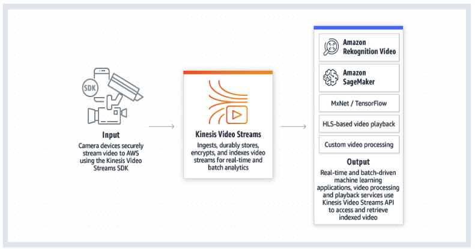
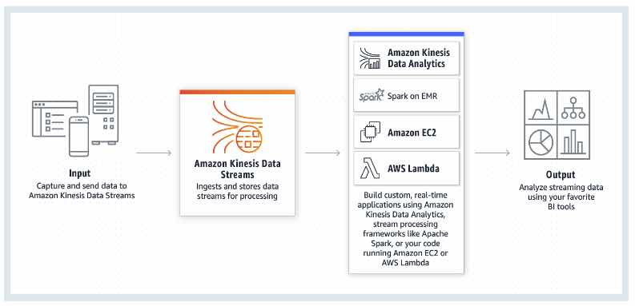
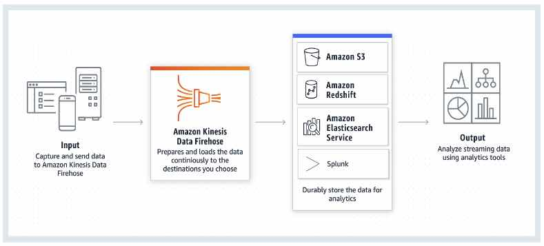
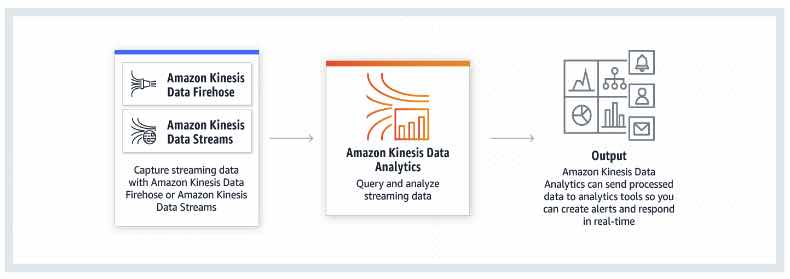

# Amazon Kinesis

- Makes it easy to collect, process, and analyze real-time, streaming data.
- Kinesis can ingest real-time data such as video, audio, application logs,  website clickstreams, and IoT telemetry data for machine learning,  analytics, and other applications.

### Kinesis Video Streams

- A fully managed AWS service that you can use to stream live video from  devices to the AWS Cloud, or build applications for real-time video  processing or batch-oriented video analytics.
- **How it works**

#### **Benefits**

- You can connect and stream from millions of devices.
- You can configure your Kinesis video stream to durably store media data for custom retention periods. Kinesis Video Streams also generates an index over the stored data based on producer-generated or service-side  timestamps.
- Kinesis Video Streams is serverless, so there is no infrastructure to set up or manage.
- You can build real-time and batch applications on data streams.
- Kinesis Video Streams enforces Transport Layer Security (TLS)-based encryption  on data streaming from devices, and encrypts all data at rest using AWS  KMS.

#### **Components**

- **Producer** – Any source that puts data into a Kinesis video stream.
- **Kinesis video stream** – A resource that enables you to transport live video data, optionally  store it, and make the data available for consumption both in real time  and on a batch or ad hoc basis.
  - **Time-encoded data** is any data in which the records are in a time series, and each record is related to its previous and next records.
  - A **fragment** is a self-contained sequence of frames. The frames belonging to a  fragment should have no dependency on any frames from other fragments.
  - Upon receiving the data from a producer, Kinesis Video Streams stores incoming media data as **chunks**. Each chunk consists of the actual media fragment, a copy of media  metadata sent by the producer, and the Kinesis Video Streams-specific  metadata such as the fragment number, and server-side and producer-side  timestamps.
- **Consumer** – Gets data, such as fragments and frames, from a Kinesis video stream  to view, process, or analyze it. Generally these consumers are called  Kinesis Video Streams applications.

#### **Kinesis Video Streams provides**

- APIs for you to create and manage streams and read or write media data to and from a stream. 
- A console that supports live and video-on-demand playback.
- A set of producer libraries that you can use in your application code to  extract data from your media sources and upload to your Kinesis video  stream.

#### **Video Playbacks**

- You can view a Kinesis video stream using either 
  - **HTTP Live Streaming** (HLS*)* – You can use HLS for live playback.
  - ***GetMedia*** **API** – You use the *GetMedia* API to build your own applications to process Kinesis video streams. *GetMedia* is a real-time API with low latency.

#### **Metadata**

- Metadata is a mutable key-value pair. You can use it to describe the content of  the fragment, embed associated sensor readings that need to be  transferred along with the actual fragment, or meet other custom needs.
- There are two modes in which the metadata can be embedded with fragments in a stream:
  - Nonpersistent: You can affix metadata on an ad hoc basis to fragments in a stream,  based on business-specific criteria that have occurred.
  - Persistent: You can affix metadata to successive, consecutive fragments in a stream based on a continuing need.

#### **Pricing**

- You pay only for the volume of data you ingest, store, and consume through the service.

 

### Kinesis Data Stream

- A massively scalable, highly durable data ingestion and processing  service optimized for streaming data. You can configure hundreds of  thousands of data producers to continuously put data into a Kinesis data stream.

- #### **How it works**

#### **Concepts**

- **Data Producer** – An application that typically emits data records as they are  generated to a Kinesis data stream. Data producers assign partition keys to records. Partition keys ultimately determine which shard ingests the data record for a data stream. 
- **Data Consumer** – A distributed Kinesis application or AWS service retrieving data from all shards in a stream as it is generated. Most data consumers are  retrieving the most recent data in a shard, enabling real-time analytics or handling of data. 
- **Data Stream** – A logical grouping of shards. There are no bounds on the number of  shards within a data stream. A data stream will retain data for **24 hours, or up to 7 days** when extended retention is enabled.
- **Shard** – The base throughput unit of a Kinesis data stream.
  - A shard is an append-only log and a unit of streaming capability. A shard contains an ordered sequence of records ordered by arrival time.
  - Add or remove shards from your stream dynamically as your data throughput changes.
  - One shard can ingest up to 1000 data records per second, or 1MB/sec. Add more shards to increase your ingestion capability.
  - When consumers use **enhanced fan-out**, one shard provides 1MB/sec data input and 2MB/sec data output for each data consumer registered to use enhanced fan-out.
  - When consumers do **no**t use **enhanced fan-out**, a shard provides 1MB/sec of input and 2MB/sec of data output, and this  output is shared with any consumer not using enhanced fan-out.
  - You will specify the number of shards needed when you create a stream and can change the quantity at any time.
- **Data Record**
  - A record is the unit of data stored in a Kinesis stream. A record is  composed of a sequence number, partition key, and data blob. 
  - A data blob is the data of interest your data producer adds to a stream. The maximum size of a data blob is 1 MB.
- **Partition Key**
  - A partition key is typically a meaningful identifier, such as a user ID  or timestamp. It is specified by your data producer while putting data  into a Kinesis data stream, and useful for consumers as they can use the partition key to replay or build a history associated with the  partition key. 
  - The partition key is also used to segregate and route data records to different shards of a stream.
- **Sequence Number**
  - A sequence number is a unique identifier for each data record. Sequence  number is assigned by Kinesis Data Streams when a data producer calls *PutRecord* or *PutRecords* API to add data to a Kinesis data stream.

- **Amazon Kinesis Agent** is a pre-built Java application that offers an easy way to collect and send data to your Amazon Kinesis data stream.

#### **Monitoring**

- You can monitor shard-level metrics in Kinesis Data Streams.
- You can monitor your data streams in Amazon Kinesis Data Streams using CloudWatch, Kinesis Agent, Kinesis libraries.
- Log API calls with CloudTrail.

#### **Security**

- Kinesis Data Streams can automatically encrypt sensitive data as a producer  enters it into a stream. Kinesis Data Streams uses AWS KMS master keys  for encryption.
- Use IAM for managing access controls.
- You can use an interface VPC endpoint to keep traffic between your Amazon  VPC and Kinesis Data Streams from leaving the Amazon network.

#### **Pricing**

- You are charged for each shard at an hourly rate.
- PUT Payload Unit is charged with a per million PUT Payload Units rate.
- When consumers use enhanced fan-out, they incur hourly charges per consumer-shard hour and per GB of data retrieved.
- You are charged for an additional rate on each shard hour incurred by your data stream once you enable extended data retention.

#### **Limits**

- - There is no upper limit on the number of shards you can have in a stream or account.
  - There is no upper limit on the number of streams you can have in an account.
  - A single shard can ingest up to 1 MiB of data per second (including partition keys) or 1,000 records per second for writes.
  - The default shard limit is 500 shards for the following AWS Regions: US  East (N. Virginia), US West (Oregon), and EU (Ireland). For all other  Regions, the default shard limit is 200 shards.
  - **Each shard can support up to five read transactions per second.**

 

### **Kinesis Data Firehose**

- The easiest way to load streaming data into data stores and analytics tools.

- It is a fully managed service that automatically scales to match the throughput of your data.

- It can also batch, compress, and encrypt the data before loading it.

- #### **How it works**

#### **Features**

- It can capture, transform, and load streaming data into S3, Redshift,  Elasticsearch Service, and Splunk, enabling near real-time analytics  with existing business intelligence tools and dashboards being used  today.
- You can specify a batch size or batch interval to control how quickly data  is uploaded to destinations. Additionally, you can specify if data  should be compressed. 
- Once launched, your delivery streams automatically scale up and down to  handle gigabytes per second or more of input data rate, and maintain  data latency at levels you specify for the stream.
- Kinesis Data Firehose can convert the format of incoming data from JSON to Parquet or ORC formats before storing the data in S3.
- You can configure Kinesis Data Firehose to prepare your streaming data  before it is loaded to data stores. Kinesis Data Firehose provides  pre-built Lambda blueprints for converting common data sources such as  Apache logs and system logs to JSON and CSV formats. You can use these  pre-built blueprints without any change, or customize them further, or  write your own custom functions.

#### **Concepts**

- **Kinesis Data Firehose Delivery Stream** – The underlying entity of Kinesis Data Firehose. You use Kinesis Data  Firehose by creating a Kinesis Data Firehose delivery stream and then  sending data to it.
- **Record** – The data of interest that your data producer sends to a Kinesis Data  Firehose delivery stream. A record can be as large as 1,000 KB.
- **Data Producer** – Producers send records to Kinesis Data Firehose delivery streams.
- **Buffer Size and Buffer Interval** – Kinesis Data Firehose buffers incoming streaming data to a certain  size or for a certain period of time before delivering it to  destinations. Buffer Size is in MBs and Buffer Interval is in seconds.

#### **Stream Sources**

- You can send data to your Kinesis Data Firehose Delivery stream using different types of sources: 
  - a Kinesis data stream,
  - the Kinesis Agent, 
  - or the Kinesis Data Firehose API using the AWS SDK. 
- You can also use CloudWatch Logs, CloudWatch Events, or AWS IoT as your data source. 
- Some AWS services can only send messages and events to a Kinesis Data Firehose delivery stream that is in the same Region.

#### **Data Delivery and Transformation**

- Kinesis Data Firehose can invoke your Lambda function to transform incoming  source data and deliver the transformed data to destinations.
- Kinesis Data Firehose buffers incoming data up to 3 MB by default.
- If your Lambda function invocation fails because of a network timeout or  because you’ve reached the Lambda invocation limit, Kinesis Data  Firehose retries the invocation three times by default.
- Kinesis Data Firehose can convert the format of your input data from JSON to  Apache Parquet or Apache ORC before storing the data in S3. Parquet and  ORC are columnar data formats that save space and enable faster queries  compared to row-oriented formats like JSON.
- Data delivery format:
  - **For data delivery to S3**, Kinesis Data Firehose concatenates multiple incoming records based on  buffering configuration of your delivery stream. It then delivers the  records to S3 as an S3 object.
  - **For data delivery to Redshift**, Kinesis Data Firehose first delivers incoming data to your S3 bucket in the format described earlier. Kinesis Data Firehose then issues an  Redshift *COPY* command to load the data from your S3 bucket to your Redshift cluster.
  - **For data delivery to ElasticSearch**, Kinesis Data Firehose buffers incoming records based on buffering  configuration of your delivery stream. It then generates an  Elasticsearch bulk request to index multiple records to your  Elasticsearch cluster.
  - **For data delivery to Splunk**, Kinesis Data Firehose concatenates the bytes that you send.
- Data delivery frequency
  - The frequency of data delivery to S3 is determined by the **S3 Buffer size** and **Buffer interval** value that you configured for your delivery stream.
  - The frequency of data *COPY* operations from S3 to Redshift is determined by how fast your Redshift cluster can finish the *COPY* command.
  - The frequency of data delivery to ElasticSearch is determined by the **Elasticsearch Buffer size** and **Buffer interval** values that you configured for your delivery stream.
  - Kinesis Data Firehose buffers incoming data before delivering it to Splunk. The buffer size is 5 MB, and the buffer interval is 60 seconds.

#### **Monitoring**

- Kinesis Data Firehose exposes several metrics through the console, as well as CloudWatch for monitoring.
- Kinesis Agent publishes custom CloudWatch metrics, and helps assess whether the agent is healthy, submitting data into Kinesis Data Firehose as  specified, and consuming the appropriate amount of CPU and memory  resources on the data producer.
- Log API calls with CloudTrail.

#### **Security**

- Kinesis Data Firehose provides you the option to have your data automatically  encrypted after it is uploaded to the destination. 
- Manage resource access with IAM.

#### **Pricing**

- You pay only for the volume of data you transmit through the service. You  are billed for the volume of data ingested into Kinesis Data Firehose,  and if applicable, for data format conversion to Apache Parquet or ORC.

#### **Limits**

- By default, each account can have up to 50 Kinesis Data Firehose delivery streams per Region.
- The maximum size of a record sent to Kinesis Data Firehose, before base64-encoding, is 1,000 KiB.

 

### **Kinesis Data Analytics**

- Analyze streaming data, gain actionable insights, and respond to your business  and customer needs in real time. You can quickly build SQL queries and  Java applications using built-in templates and operators for common  processing functions to organize, transform, aggregate, and analyze data at any scale.

- #### How it works

#### **General Features**

- Kinesis Data Analytics is **serverless** and takes care of everything required to continuously run your application.
- Kinesis Data Analytics elastically scales applications to keep up with any volume of data in the incoming data stream.
- Kinesis Data Analytics delivers sub-second processing latencies so you can  generate real-time alerts, dashboards, and actionable insights.

#### **SQL Features**

- Kinesis Data Analytics supports standard ANSI SQL.
- Kinesis Data Analytics integrates with Kinesis Data Streams and Kinesis Data  Firehose so that you can readily ingest streaming data.
- SQL applications in Kinesis Data Analytics support two types of inputs:
  - A **streaming data source** is continuously generated data that is read into your application for processing.
  - A **reference data source** is static data that your application uses to enrich data coming in from streaming sources. 
- Kinesis Data Analytics provides an easy-to-use schema editor to discover and  edit the structure of the input data. The wizard automatically  recognizes standard data formats such as JSON and CSV.
- Kinesis Data Analytics offers functions optimized for stream processing so that you can easily perform advanced analytics such as anomaly detection and top-K analysis on your streaming data.

#### **Java Features**

- Kinesis Data Analytics includes open source libraries based on Apache Flink.  Apache Flink is an open source framework and engine for building highly  available and accurate streaming applications.
- You can use the Kinesis Data Analytics Java libraries to integrate with multiple AWS services.
- You can create and delete durable application backups through a simple API  call. You can immediately restore your applications from the latest  backup after a disruption, or you can restore your application to an  earlier version.
- Java applications in Kinesis Data Analytics enable you to build applications whose processed records affect the results exactly once, referred to as **exactly once processing**.
- The service stores previous and in-progress computations, or state, in  running application storage. State is always encrypted and incrementally saved in running application storage.

- An **application** is the primary resource in Kinesis Data Analytics. Kinesis data  analytics applications continuously read and process streaming data in  real time. 
  - You write application code using SQL to process the incoming streaming data and produce output. Then, Kinesis Data Analytics writes the output to a configured destination.
  - You can also process and analyze streaming data using Java.

#### **Components**

- Input is the streaming source for your application. In the input  configuration, you map the streaming source to an in-application data  stream(s).
- **Application code** is a series of SQL statements that process input and produce output. 
- You can create one or more in-application streams to store the **output**. You can then optionally configure an application output to persist data from specific in-application streams to an external destination. 

- An **in-application data stream** is an entity that continuously stores data in your application for you to perform processing.
- Kinesis Data Analytics provisions capacity in the form of **Kinesis Processing Units (KPU)**. A single KPU provides you with the memory (4 GB) and corresponding computing and networking.
- For Java applications using Apache Flink, you build your application  locally, and then make your application code available to the service by uploading it to an S3 bucket. 
- Kinesis Data Analytics for Java applications provides your application 50 GB of running application storage per Kinesis Processing Unit. Kinesis Data  Analytics scales storage with your application.
- Running application storage is used for **saving application state using checkpoints**. It is also accessible to your application code to use as **temporary disk for caching data** or any other purpose.

#### **Pricing**

- You are charged an hourly rate based on the average number of Kinesis  Processing Units (or KPUs) used to run your stream processing  application.
- For Java applications, you are charged a single additional KPU per  application for application orchestration. Java applications are also  charged for running application storage and durable application backups.

#### **Limits**

- The SQL code in an application is limited to 100 KB.
- The services (for both SQL and Java) are only available in specific AWS Regions.
- You can create up to 50 Kinesis Data Analytics applications per AWS Region in your account.
- The number of Kinesis processing units (KPU) is limited to eight.

 

**High Performance Data Streaming with Amazon Kinesis: Best Practices and Common Pitfalls**

https://youtu.be/MELPeni0p04

**Amazon Kinesis-related Cheat Sheets:**

- [Kinesis Scaling, Resharding and Parallel Processing](https://tutorialsdojo.com/kinesis-scaling-resharding-and-parallel-processing/)

# Sources

 https://aws.amazon.com/kinesis/
 https://docs.aws.amazon.com/kinesisvideostreams/latest/dg
 https://aws.amazon.com/kinesis/video-streams/features/
 https://aws.amazon.com/kinesis/video-streams/pricing/
 https://aws.amazon.com/kinesis/video-streams/faqs/
 https://docs.aws.amazon.com/streams/latest/dev/
 https://aws.amazon.com/kinesis/data-streams/pricing/
 https://aws.amazon.com/kinesis/data-streams/faqs/
 https://docs.aws.amazon.com/firehose/latest/dev/
 https://aws.amazon.com/kinesis/data-firehose/pricing/
 https://aws.amazon.com/kinesis/data-firehose/faqs/
 https://docs.aws.amazon.com/kinesisanalytics/latest/dev
 https://docs.aws.amazon.com/kinesisanalytics/latest/java
 https://aws.amazon.com/kinesis/data-analytics/features/
 https://aws.amazon.com/kinesis/data-analytics/pricing/
 https://aws.amazon.com/kinesis/data-analytics/faqs/