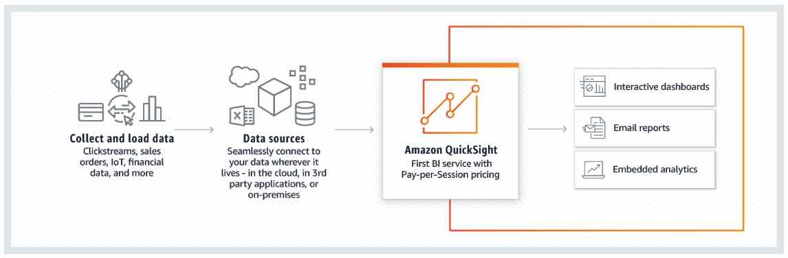

# Amazon QuickSight

Amazon  QuickSight is a cloud-powered business analytics service that makes it  easy to build visualizations, perform ad-hoc analysis, and quickly get  business insights from their data, anytime, on any device.

## Features

- Provides **ML Insights** for discovering hidden trends and outliers, identify key business  drivers, and perform powerful what-if analysis and forecasting.
- Has a wide library of visualizations, charts, and tables; You can add  interactive features like drill-downs and filters, and perform automatic data refreshes to build interactive dashboards.
- Allows you to schedule automatic email-based reports, so you can get key insights delivered to your inbox.
- QuickSight allows users to connect to data sources, create/edit datasets, create  visual analyses, invite co-workers to collaborate on analyses, and  publish dashboards and reports.
- Has a super-fast, parallel, in-memory, calculation engine (SPICE), allowing you to achieve blazing fast performance at scale.
- Allows you to directly connect to and import data from a wide variety of cloud and on-premises data sources.

## SPICE

- Uses a combination of columnar storage, in-memory technologies.
- Data in SPICE is persisted until it is explicitly deleted by the user. 
- SPICE also automatically replicates data for high availability and enables QuickSight to scale easily.

## Concepts

- A **QuickSight Author** is a user who can connect to data sources (within AWS or outside),  create interactive dashboards using advanced QuickSight capabilities,  and publish dashboards with other users in the account.
- A **QuickSight Reader** is a user who uses interactive dashboards. Readers can log in via  QuickSight username/password, SAML portal or AD auth, view shared  dashboards, filter data, drill down to details or export data as a CSV  file.
  - Readers can be easily upgraded to authors via the QuickSight user management options.
  - Readers with pay-per-session pricing only exist in Enterprise Edition. Standard Edition accounts can be easily upgraded to Enterprise.
- A  **QuickSight Admin** is a user who can manage QuickSight users and account-level  preferences, as well as purchase SPICE capacity and annual subscriptions for the account.
  - Admins have all QuickSight authoring capabilities. 
  - Admins can also upgrade Standard Edition accounts to Enterprise Edition.
  - QuickSight Authors and Readers can be upgraded to Admins at any time.
- A **QuickSight Reader session** has a 30-minute duration and is renewed at 30-minute intervals. The  session starts with a user-initiated action (login, dashboard load, page refresh, drill-down or filtering).
- **Dashboards** are a collection of visualizations, tables, and other visual displays arranged and visible together.
- **Stories** are guided tours through specific views of an analysis. They are used to  convey key points, a thought process, or the evolution of an analysis  for collaboration.

### Data Management

- *Data preparation* is the process of transforming raw data for use in an analysis.
- You can upload XLSX, CSV, TSV, CLF, XLF data files directly from Amazon  QuickSight website, or to an Amazon S3 bucket and point Quicksight to  the bucket.
- You can also connect Amazon QuickSight to an Amazon EC2 or on-premises database.

### Data Visualization and Analysis

- A *visual*, also known as a data visualization, is a graphical representation of a  data set using a type of diagram, chart, graph, or table. All visuals  begin in AutoGraph mode, which automatically selects a visualization  based on the fields you select.
- A *data analysis* is the basic workspace for creating and interacting with visuals, which are graphical representations of your data. Each analysis contains a  collection of visuals that you assemble and arrange for your purposes.
- To create a visualization, start by selecting the data fields you want to  analyze, or drag the fields directly on to the visual canvas, or a  combination of both actions. Amazon QuickSight will automatically select the appropriate visualization to display based on the data you’ve  selected.
- Amazon QuickSight has a feature called **AutoGraph** that allows it to select the most appropriate visualizations based on  the properties of the data, such as cardinality and data type.
- You can perform typical arithmetic and comparison functions; conditional  functions such as if,then; and date, numeric, and string calculations.

### Machine Learning Insights

- Using machine learning and natural language capabilities, Amazon QuickSight Enterprise Edition launches you into **forecasting** and **decision-making**.
- You can select from a list of customized context-sensitive narratives, called *auto-narratives*, and add them to your analysis. In addition to choosing auto-narratives, you can choose to view forecasts, anomalies, and factors contributing  to these.
- Major features
  - ML-powered anomaly detection – continuously analyze all your data to detect anomalies.
  - ML-powered forecasting – forecast key business metrics.
  - Auto-narratives – build rich dashboards with embedded narratives to tell the story of your data in plain language.

## Security

- Offers role-based access control, Active Directory integration, CloudTrail  auditing, single sign-on, private VPC subnets, and data backup.
- FedRamp, HIPAA, PCI PSS, ISO, and SOC compliant.
- Row-level security enables QuickSight dataset owners to control access to data at row granularity based on permissions associated with the user  interacting with the data. 

## Pricing

- Quicksight has a pay-per-session model for dashboard readers, users who consume dashboards others have created.

Sources:
 https://aws.amazon.com/quicksight/resources/faqs/