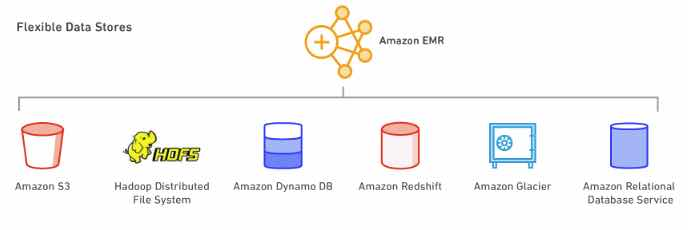

# Amazon EMR

- A managed cluster platform that simplifies running big data frameworks,  such as Apache Hadoop and Apache Spark, on AWS to process and analyze  vast amounts of data.
- You can process data for analytics purposes and business intelligence  workloads using EMR together with Apache Hive and Apache Pig.
- You can use EMR to transform and move large amounts of data into and out of other AWS data stores and databases.

### **Features**

- EMR Notebooks provide a managed environment, based on Jupyter Notebooks, to help users prepare and visualize data, collaborate with peers, build  applications, and perform interactive analysis using EMR clusters.
- EMR enables you to quickly and easily provision as much capacity as you  need, and automatically or manually add and remove capacity.
- You can leverage multiple data stores, including S3, the Hadoop Distributed File System (HDFS), and DynamoDB.

- EMR supports powerful and proven *Hadoop* tools such as *Hive, Pig, HBase*, and *Impala*. Additionally, it can run distributed computing frameworks besides *Hadoop MapReduce* such as *Spark* or *Presto* using bootstrap actions. You can also use *Hue* and *Zeppelin* as GUIs for interacting with applications on your cluster.

### **Components**

- **Clusters** – A collection of EC2 instances. You can create two types of clusters:
  - a **transient cluster** that auto-terminates after steps complete.
  - a **long-running cluster** that continues to run until you terminate it deliberately.
- **Nodes** – Each EC2 instance in a cluster is called a node.
- **Node Type** – Each node has a role within the cluster, referred to as the node type. The node types are:
  - **Master node**: A node that manages the cluster by running software components to  coordinate the distribution of data and tasks among other nodes for  processing. The master node tracks the status of tasks and monitors the  health of the cluster. Every cluster has a master node, and it’s  possible to create a single-node cluster with only the master node. Does not support automatic failover. 
  - **Core node**: A node with software components that run tasks and store data in the  Hadoop Distributed File System (HDFS) on your cluster. Multi-node  clusters have at least one core node. EMR is fault tolerant for slave  failures and continues job execution if a slave node goes down.
  - **Task node**: A node with software components that only runs tasks and does not store data in HDFS. Task nodes are optional.

### **EMR Architecture**

- **Storage** – this layer includes the different file systems that are used with your cluster.
  - Hadoop Distributed File System (HDFS) – a distributed, scalable file system for Hadoop.
    - HDFS distributes the data it stores across instances in the cluster, storing multiple copies of data on different instances to ensure that no data  is lost if an individual instance fails.
    - HDFS is ephemeral storage.
    - HDFS is useful for caching intermediate results during MapReduce processing or for workloads that have significant random I/O.
  - EMR File System (EMRFS) – With EMRFS, EMR extends Hadoop to directly be  able to access data stored in S3 as if it were a file system.
  - Local File System – refers to a locally connected disk. 
    - Each EC2 node in your cluster comes with a pre-configured instance store,  which persists only on the lifetime of the EC2 instance.
- **Cluster Resource Management** – this layer is responsible for managing cluster resources and scheduling the jobs for processing data.
  - By default, Amazon EMR uses YARN, which is a component introduced in  Apache Hadoop 2.0 to centrally manage cluster resources for multiple  data-processing frameworks.
  - EMR has an agent on each node that administers YARN components, keeps the cluster healthy, and communicates with EMR.
- **Data Processing Frameworks** – this layer is the engine used to process and analyze data.
  - Hadoop MapReduce – an open-source programming model for distributed computing. 
  - Apache Spark – a cluster framework and programming model for processing big data workloads.

### **Data Processing**

- Ways to process data in your EMR cluster:
  - **Submitting Jobs Directly to Applications** – Submit jobs and interact directly with the software that is installed in your EMR cluster. To do this, you connect to the master node over a  secure connection and access the interfaces and tools that are available for the software that runs directly on your cluster.
  - **Running Steps to Process Data** – Submit one or more ordered steps to an EMR cluster. Each step is a  unit of work that contains instructions to manipulate data for  processing by software installed on the cluster.

### **Scaling**

- There are two main options for adding or removing capacity:
  - **Deploy multiple clusters**: If you need more capacity, you can easily launch a new cluster and  terminate it when you no longer need it. There is no limit to how many  clusters you can have.
  - **Resize a running cluster**: You may want to scale out a cluster to temporarily add more processing  power to the cluster, or scale in your cluster to save on costs when you have idle capacity. When adding instances to your cluster, EMR can now  start utilizing provisioned capacity as soon it becomes available. When  scaling in, EMR will proactively choose idle nodes to reduce impact on  running jobs.

### **Deployment**

- Choose the instance size and type that best suits the processing needs for your cluster
  - Batch processing
  - Low-latency queries
  - Streaming data
  - Large data storage
- In addition to the standard software and applications that are available  for installation on your cluster, you can use bootstrap actions to  install custom software.

### **EMR Notebooks**

- A serverless Jupyter notebook.
- An EMR cluster is required to execute the code and queries within an EMR  notebook, but the notebook is not locked to the cluster.
- Runs Apache Spark.

### **Managing Clusters**

- A **cluster step** is a user-defined unit of processing, mapping roughly to one algorithm that manipulates the data.
- When creating a cluster, typically you should select the Region where your data is located.
- You can connect to the master node only while the cluster is running. When  the cluster terminates, the EC2 instance acting as the master node is  terminated and is no longer available. 
- By default, the *ElasticMapReduce-master* security group does not permit inbound SSH access.
- You can set termination protection on a cluster.
- You can adjust the number of EC2 instances available to an EMR cluster  automatically or manually in response to workloads that have varying  demands.
- The EMR File System (EMRFS) is an implementation of HDFS that all EMR  clusters use for reading and writing regular files from EMR directly to  S3. It provides the convenience of storing persistent data in S3 for use with Hadoop while also providing features like consistent view and data encryption.
- You can add tags to your clusters.
- You can launch an EMR cluster with three master nodes to enable high  availability for EMR applications. Amazon EMR automatically fails over  to a standby master node if the primary master node fails or if critical processes.

### **High Availability**

- You can launch an EMR cluster with three master nodes and support high  availability for HBase clusters on EMR. Amazon EMR automatically fails  over to a standby master node if the primary master node fails or if  critical processes such as Resource Manager or Name Node crash. 
- In the event of a failover, Amazon EMR automatically replaces the failed  master node with a new master node with the same configuration and  boot-strap actions.

### **Monitoring**

- EMR integrates with CloudTrail to log information about requests made by or on behalf of your AWS account.
- You can monitor and interact with your cluster by forming a secure  connection between your remote computer and the master node by using  SSH.
- EMR provides the ability to archive log files in S3 so you can store logs  and troubleshoot issues even after your cluster terminates.
- EMR also provides an optional debugging tool.
- EMR integrates with CloudWatch to track performance metrics for the cluster and jobs within the cluster.

### **Security**

- EMR integrates with IAM to manage permissions. You define permissions using IAM policies, which you attach to IAM users or IAM groups. The  permissions that you define in the policy determine the actions that  those users or members of the group can perform and the resources that  they can access.
- EMR uses IAM roles for the EMR service itself and the EC2 instance profile  for the instances. These roles grant permissions for the service and  instances to access other AWS services on your behalf. There is a  default role for the EMR service and a default role for the EC2 instance profile. 
- EMR uses security groups to control inbound and outbound traffic to your  EC2 instances. When you launch your cluster, EMR uses a security group  for your master instance and a security group to be shared by your  core/task instances.
- EMR supports optional S3 server-side and client-side encryption with EMRFS to help protect the data that you store in S3.
- EMR supports launching clusters in a VPC.
- EMR release version 5.10.0 and later supports *Kerberos*, which is a network authentication protocol 

### **Pricing**

- You pay a per-second rate for every second for each node you use, with a one-minute minimum.
- The EMR price is in addition to the EC2 price (the price for the underlying servers) and EBS price (if attaching EBS volumes).

Sources:

* https://docs.aws.amazon.com/emr/latest/ManagementGuide
* https://aws.amazon.com/emr/features
* https://aws.amazon.com/emr/pricing
* https://aws.amazon.com/emr/faqs