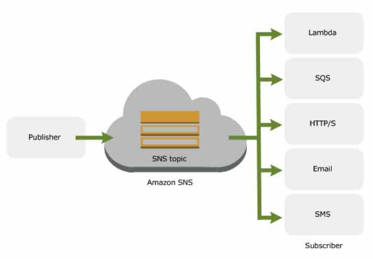

# Amazon SNS

- A web service that makes it easy to set up, operate, and send notifications from the cloud. SNS follows the **“publish-subscribe” (pub-sub)** **messaging** paradigm, with notifications being delivered to clients using a **“push”** mechanism rather than to periodically check or “poll” for new information and updates.

### **Features**

- SNS is an **event-driven** computing hub that has native integration with a wide variety of AWS  event sources (including EC2, S3, and RDS) and AWS event destinations  (including SQS, and Lambda). 
  - **Event-driven computing** is a model in which subscriber services automatically perform work in  response to events triggered by publisher services. It can automate  workflows while decoupling the services that collectively and  independently work to fulfil these workflows.
- **Message filtering** allows a subscriber to create a filter policy, so that it only gets the notifications it is interested in.
- **Message fanout** occurs when a message is sent to a topic and then replicated and pushed to multiple endpoints. Fanout provides asynchronous event  notifications, which in turn allows for parallel processing.
- **SNS mobile notifications** allows you to fanout mobile push notifications to iOS, Android, Fire  OS, Windows and Baidu-based devices. You can also use SNS to fanout text messages (SMS) to 200+ countries and fanout email messages (SMTP).
- **Application and system alerts** are notifications, triggered by predefined thresholds, sent to specified users by SMS and/or email.
- **Push email** and **text messaging** are two ways to transmit messages to individuals or groups via email and/or SMS.
- SNS provides durable storage of all messages that it receives. When SNS receives your *Publish* request, it stores multiple copies of your message to disk. Before SNS  confirms to you that it received your request, it stores the message in  multiple Availability Zones within your chosen AWS Region.
- SNS allows you to set a TTL (Time to Live) value for each message. When the TTL expires for a given message that was not delivered and read by an  end user, the message is deleted. 

SNS provides simple APIs and easy integration with applications.

### **Publishers and Subscribers**

- Publishers communicate asynchronously with subscribers by producing and sending a  message to a topic, which is a logical access point and communication  channel.
- Subscribers consume or receive the message or notification over one of the  supported protocols when they are subscribed to the topic.

- Publishers create topics to send messages, while subscribers subscribe to topics to receive messages.
- SNS does not support forwarding messages to SQS FIFO queues. You can use SNS to forward messages to standard queues.

### **SNS Topics**

- Instead of including a specific destination address in each message, a publisher sends a message to a **topic**. SNS matches the topic to a list of subscribers who have subscribed to  that topic, and delivers the message to each of those subscribers.
- Each topic has a unique name that identifies the SNS endpoint for publishers to post messages and subscribers to register for notifications.
- A topic can support subscriptions and notification deliveries over multiple transports.

The SNS service will attempt to deliver messages from the publisher in the  order they were published into the topic, so no guarantee.

SNS also logs the the delivery status of notification messages sent to topics with the following SNS endpoints:

- Application
- HTTP
- Lambda
- SQS

### **Message Attributes**

- Amazon SNS supports delivery of *message attributes*. Message attributes allow you to provide structured metadata items (such as time stamps, geospatial data, signatures, and identifiers) about the message. Message attributes are optional and separate from, but sent  along with, the message body. 
- You can use message attributes to help structure the push notification  message for mobile endpoints. The attributes are not delivered to the  mobile endpoint, as they are when sending messages with message  attributes to SQS endpoints.
- You can also use message attributes to make your messages filterable with *subscription filter policies*. You apply filter policies to topic subscriptions.
- Message attributes contain a name, type, and value that must not be empty or  null. The message body should not be empty or null also.

### **Message Filtering**

- A filter policy is a simple JSON object.
- By default, a subscriber of an SNS topic receives every message published  to the topic. The filter policy contains attributes that define which  messages the subscriber receives.

### **Raw Message Delivery**

- By default, messages are delivered encoded in JSON that provides metadata about the message and topic.
- You can send large payload messages using AWS SDK that supports AWS Signature Version 4 signing. 
- You can also enable raw message delivery for messages delivered to either SQS endpoints or HTTP/S endpoints.

### **System to System Messaging**

- When a message is published to an SNS topic that has a **Lambda function** subscribed to it, the Lambda function is invoked with the payload of  the published message. The Lambda function receives the message payload  as an input parameter and can manipulate the information in the message, publish the message to other SNS topics, or send the message to other  AWS services.
- When you subscribe a **SQS queue** to a SNS topic, you can publish a message to the topic and SNS sends a  SQS message to the subscribed queue. The SQS message contains the  subject and message that were published to the topic along with metadata about the message in a JSON document. 
- When you subscribe an **HTTP/s endpoint** to a topic, you can publish a notification to the topic and SNS sends  an HTTP POST request delivering the contents of the notification to the  subscribed endpoint. When you subscribe the endpoint, you select whether SNS uses HTTP or HTTPS to send the POST request to the endpoint.

### **User Notifications**

- You have the ability to send **push notification messages** directly to apps on mobile devices. Push notification messages sent to a mobile endpoint can appear in the mobile app as message alerts, badge  updates, or even sound alerts.
- *Direct addressing* allows you to deliver notifications directly to a single endpoint,  rather than sending identical messages to all subscribers of a topic.  This is useful if you want to deliver precisely targeted messages to  each recipient. 
- You can use SNS to send **text messages**, or SMS messages, to SMS-enabled devices. You can send a message  directly to a phone number, or you can send a message to multiple phone  numbers at once by subscribing those phone numbers to a topic and  sending your message to the topic.
- You can use the **Delivery Status** feature to get information on the final disposition of your SMS message. 
- SMS messages that are of high priority to your business should be marked as *Transactional*. This ensures that messages such as those that contain one-time  passwords or PINs get delivered over routes with the highest delivery  reliability.
- SMS messages that carry marketing messaging should be marked *Promotional*. Amazon SNS ensures that such messages are sent over routes that have a  reasonable delivery reliability but are substantially cheaper than the  most reliable routes.

### **SNS Delivery Retries**

- All messages sent to SNS are processed and delivered immediately. If a  message cannot be successfully delivered on the first attempt, SNS  implements a 4-phase retry policy: 

 1) retries with no delay in between attempts

 2) retries with some minimum delay between attempts

 3) retries with some back-off model (linear or exponential)

 4) retries with some maximum delay between attempts

### **Monitoring**

- Monitoring SNS topics using CloudWatch
- Logging SNS API calls using CloudTrail

### **Security**

- SNS provides encrypted topics to protect your messages from unauthorized  and anonymous access. The encryption takes place on the server side.
- SNS supports VPC Endpoints via AWS PrivateLink. You can use VPC Endpoints  to privately publish messages to SNS topics, from a VPC, without  traversing the public internet.
- Using access control policies, you have detailed control over which endpoints a topic allows, who is able to publish to a topic, and under what  conditions.
- You can  enable AWS X-Ray for your messages passing through Amazon SNS, making it easier to trace and analyze messages as they travel through to the  downstream services.

### **Pricing**

- You pay based on the number of notifications you publish, the number of  notifications you deliver, and any additional API calls for managing  topics and subscriptions. Delivery pricing varies by endpoint type.

### **Limits**

- By default, SNS offers 10 million subscriptions per topic, and 100,000 topics per account.
- A single SMS message can contain a maximum of 140 bytes of information.
- With the exception of SMS messages, SNS messages can contain up to 256 KB of text data.

Sources:
 https://docs.aws.amazon.com/sns/latest/dg
 https://aws.amazon.com/sns/features/
 https://aws.amazon.com/sns/pricing/
 https://aws.amazon.com/sns/faqs/