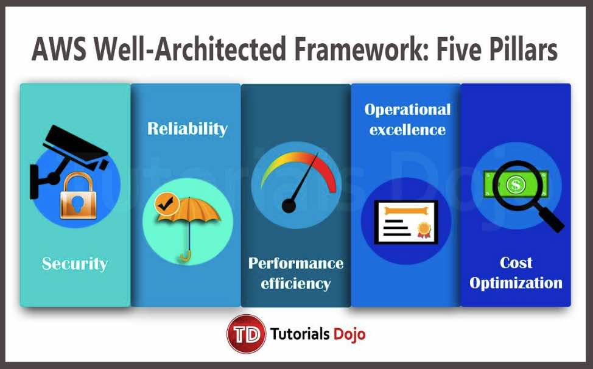

## **AWS Well-Architected Framework – Five Pillars**

Having well-architected systems greatly increases the plausibility of business success which is why AWS created the AWS Well-Architected Framework.  This framework is composed of five pillars that help you understand the  pros and cons of decisions you make while building cloud architectures  and systems on the AWS platform. You will learn the architectural best  practices for designing and operating reliable, efficient,  cost-effective and secure systems in the cloud by using the framework.  It also provides a way to consistently measure your architectures  against best practices and identify areas for improvement. 

### **1. Operational Excellence** 

- The ability to run and monitor systems to deliver business value and to continually improve supporting processes and procedures.
- There are three best practice areas and tools for operational excellence in the cloud:
  - **Prepare** – AWS Config
  - **Operate** – Amazon CloudWatch 
  - **Evolve** – Amazon Elasticsearch Service 
- Key AWS service:
  - **AWS CloudFormation** for creating templates. (See AWS Management Tools Cheat Sheet)

### **2. Security** 

- - The ability to protect information, systems, and assets while delivering  business value through risk assessments and mitigation strategies.
  - There are five best practice areas and tools for security in the cloud:
    - **Identity and Access Management** – IAM, Multi-Factor Authentication, AWS Organizations
    - **Detective Controls** – AWS CloudTrail, AWS Config, Amazon GuardDuty
    - **Infrastructure Protection** – Amazon VPC, Amazon CloudFront with AWS Shield, AWS WAF
    - **Data Protection** – ELB, Amazon Elastic Block Store (Amazon EBS), Amazon S3, and Amazon  Relational Database Service (Amazon RDS) encryption, Amazon Macie, AWS  Key Management Service (AWS KMS)
    - **Incident Response** – IAM, Amazon CloudWatch Events
  - Key AWS service:
    - **AWS Identity and Access Management (IAM)**

### **3. Reliability** 

- - The ability of a system to recover from infrastructure or service  disruptions, dynamically acquire computing resources to meet demand, and mitigate disruptions such as misconfigurations or transient network  issues.
  - There are three best practice areas and tools for reliability in the cloud:
    - **Foundations** – IAM, Amazon VPC, AWS Trusted Advisor, AWS Shield
    - **Change Management** – AWS CloudTrail, AWS Config, Auto Scaling, Amazon CloudWatch
    - **Failure Management** – AWS CloudFormation, Amazon S3, AWS KMS, Amazon Glacier
  - Key AWS service:
    - **Amazon CloudWatch**

### **4. Performance Efficiency** 

- - The ability to use computing resources efficiently to meet system  requirements, and to maintain that efficiency as demand changes and  technologies evolve.
  - There are four best practice areas for performance efficiency in the cloud:
    - **Selection** – Auto Scaling for Compute, Amazon EBS and S3 for Storage, Amazon RDS  and DynamoDB for Database, Route53, VPC, and AWS Direct Connect for  Network
    - **Review** – AWS Blog and What’s New section of the website
    - **Monitoring** –  Amazon CloudWatch
    - **Tradeoffs** – Amazon Elasticache, Amazon CloudFront, AWS Snowball, Amazon RDS read replicas.
  - Key AWS service:
    - **Amazon CloudWatch**

### **5. Cost Optimization**

- - The ability to avoid or eliminate unneeded cost or suboptimal resources.
  - There are four best practice areas and tools for cost optimization in the cloud:
    - **Cost-Effective Resources** – Cost Explorer, Amazon CloudWatch and Trusted Advisor, Amazon Aurora for RDS, AWS Direct Connect with Amazon CloudFront
    - **Matching supply and demand** – Auto Scaling
    - **Expenditure Awareness** –  AWS Cost Explorer, AWS Budgets
    - **Optimizing Over Time** – AWS News Blog and the What’s New section on the AWS website, AWS Trusted Advisor
  - Key AWS service:
    - **Cost Explorer**

Source:
 https://d1.awsstatic.com/whitepapers/architecture/AWS_Well-Architected_Framework.pdf