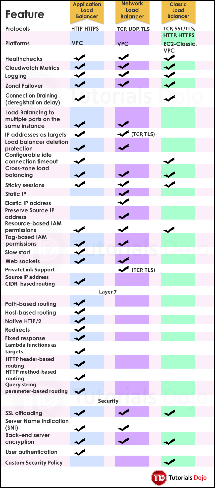

# Application Load Balancer vs Network Load Balancer vs Classic Load Balancer

Common features between the three load balancers

- Has instance health check features
- Has built-in CloudWatch monitoring
- Logging features
- Support zonal failover
- Support connection draining when deregistering targets/instances
- Support cross-zone load balancing (evenly distributes traffic across registered instances in enabled AZs)
- Support SSL offloading/termination
- Backend server encryption
- Resource-based IAM permission policies

**Source:**

* https://aws.amazon.com/elasticloadbalancing/features/