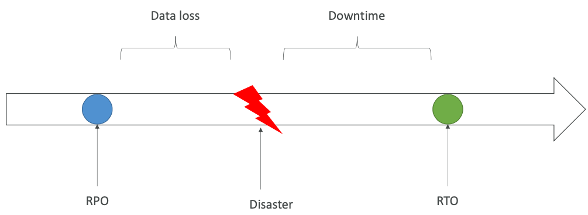
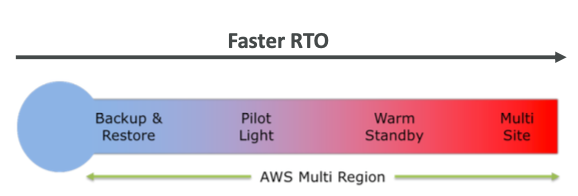
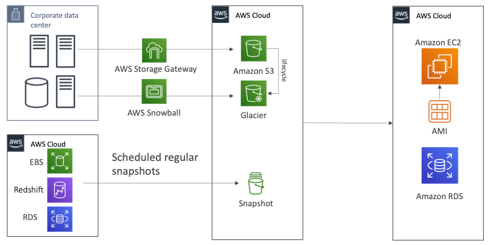
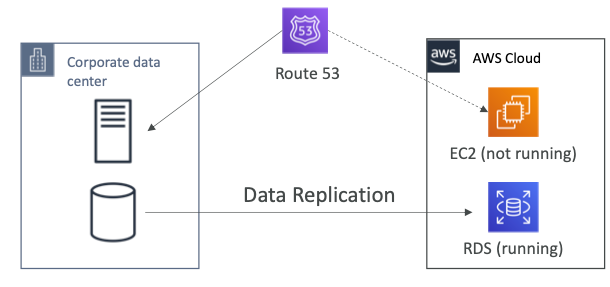
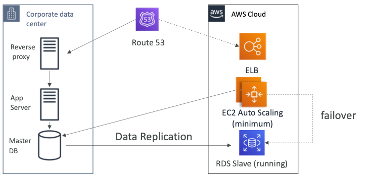

# Backup and Restore vs Pilot Light vs Warm Standby vs Multi-site

- Any event that has a negative impact on a company’s business continuity or finances is a disaster
- Disaster recovery (DR) is about preparing for and recovering from a disaster
- What kind of disaster recovery?
  - On-premise => On-premise: traditional DR, and very expensive
  - On-premise => AWS Cloud: hybrid recovery
  - AWS Cloud Region A => AWS Cloud Region B
- Need to define two terms:
  - RPO: Recovery Point Objective
  - RTO: Recovery Time Objective

* You should select the most appropriate DR plan to meet your company RTO and RPO. Consider also your budget and which system elements are most  critical for your business.

## RPO and RTO

## Disaster Recovery Strategy Types

- Backup and Restore

- Pilot Light

- Warm Standby

- Hot Site / Multi Site Approach

  

### Backup and Restore (High RPO)

### Backup Restore

* This is DR plan provides the slowest system restoration after a DR event.
* You take frequent snapshots of your data such as those in Amazon EBS Volumes and Amazon RDS databases, and you store then in a durable and secure storage location such as Amazon S3.
* There are many ways for you to move data in and out of S3:
  * Transfer over the network via S3 Transfer Acceleration
  * Transfer over a dedicated network line using AWS Direct Connect
  * Transfer using transport hardware such as AWS Snowball and Snowmobile

### Pilot Light

- A small version of the app is always running in the cloud

- Useful for the critical core (pilot light)

- Very similar to Backup and Restore

- Faster than Backup and Restore as critical systems are already up

  

### Warm Standby

* Full system is up and running, but at minimum size
* Upon disaster, we can scale to production load

### Multi Site / Hot Site Approach

* Very low RTO (minutes or seconds) – very expensive

* Full Production Scale is running AWS and On Premise

  

## Disaster Recovery Tips

- **Backup**
  - EBS Snapshots, RDS automated backups / Snapshots, etc...
  - Regular pushes to S3 / S3 IA / Glacier, Lifecycle Policy, Cross Region Replication
  - From On-Premise: Snowball or Storage Gateway
- **High Availability**
  - Use Route53 to migrate DNS over from Region to Region
  - RDS Multi-AZ, ElastiCache Multi-AZ, EFS, S3
  - Site to Site VPN as a recover y from Direct Connect
- **Replication**
  - RDS Replication (Cross Region), AWS Aurora + Global Databases
  - Database replication from on-premise to RDS
  - Storage Gateway
- **Automation**
  - CloudFormation / Elastic Beanstalk to re-create a whole new environment
  - Recover / Reboot EC2 instances with CloudWatch if alarms fail
  - AWS Lambda functions for customized automations
- **Chaos**
  - Netflix has a “simian-army” randomly terminating EC2

## Multi-site

 

**References:**

* https://www.slideshare.net/AmazonWebServices/disaster-recovery-options-with-aws

