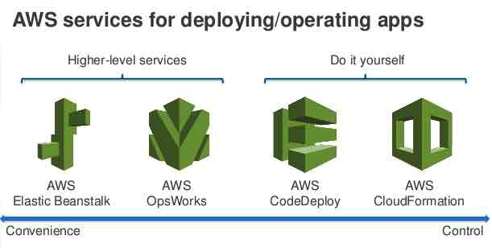

# Elastic Beanstalk vs CloudFormation vs OpsWorks vs CodeDeploy

 

**Additional Notes:**

- Elastic Beanstalk, CloudFormation, or OpsWorks are particularly useful for **blue-green deployment method** as they provide a simple way to clone your running application stack.
- CloudFormation and OpsWorks are best suited for the **prebaking AMIs**.
- CodeDeploy and OpsWorks are best suited for performing **in-place application upgrades**. For **disposable upgrades**, you can set up a cloned environment with Elastic Beanstalk, CloudFormation, and OpsWorks.

 

**References:**

* https://aws.amazon.com/cloudformation/faqs/
* https://aws.amazon.com/elasticbeanstalk/faqs/
* https://d1.awsstatic.com/whitepapers/overview-of-deployment-options-on-aws.pdf
* https://aws.amazon.com/about-aws/whats-new/2014/03/03/aws-cloudformation-supports-aws-opsworks/
* https://aws.amazon.com/codedeploy/faqs/