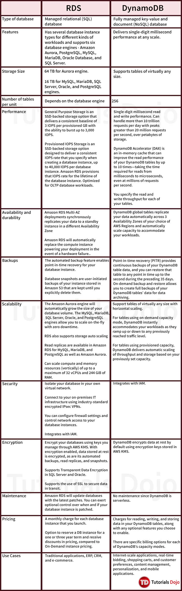

## Amazon RDS vs DynamoDB

 

Additional notes:

- DynamoDB has built-in support for ACID transactions.
- DynamoDB uses filter expressions because it does not support complex queries.
- Multi-AZ deployments for the MySQL, MariaDB, Oracle, and PostgreSQL engines  utilize synchronous physical replication. Multi-AZ deployments for the  SQL Server engine use synchronous logical replication.
- An Oracle Database is limited to one database per instance. An SQL Server  is limited to 30 databases per instance. Other RDS engines have no  limits.