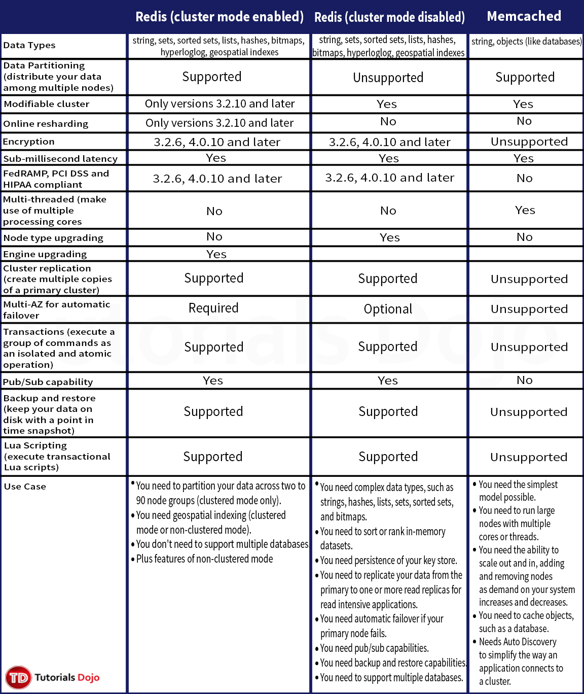
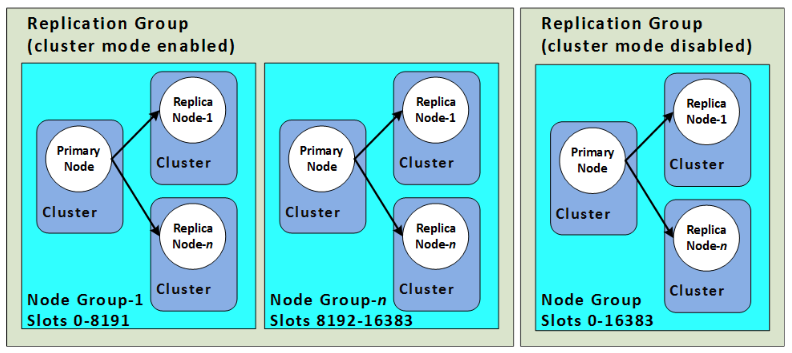

# Redis (cluster mode enabled vs disabled) vs Memcached

 

# References

https://docs.aws.amazon.com/AmazonElastiCache/latest/mem-ug/SelectEngine.html
 https://aws.amazon.com/elasticache/redis-vs-memcached/
 https://docs.aws.amazon.com/AmazonElastiCache/latest/red-ug/Replication.Redis-RedisCluster.html