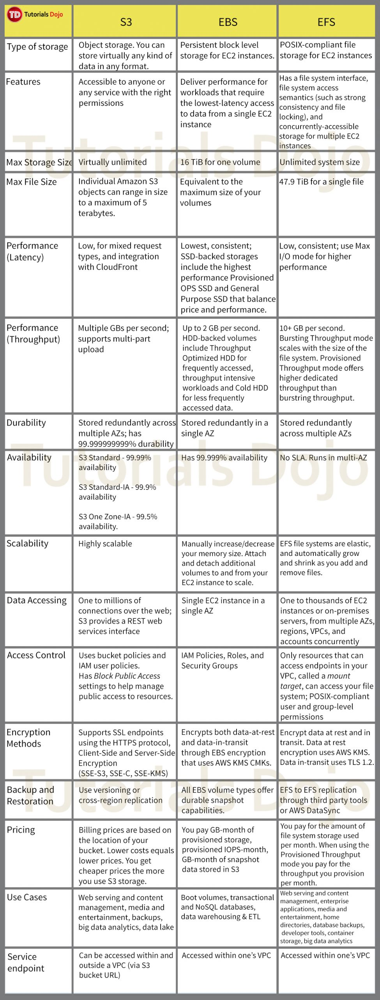

# Amazon S3 vs Amazon EBS vs Amazon EFS

 

Additional notes

- S3 is cheaper than EBS and EFS in pure storage costs
- EBS and EFS has higher performance than S3
- EBS is meant to be used as volumes for EC2 instances
- S3 does not have a hierarchy (flat environment) for files unlike EFS
- S3 has a built-in query feature
- S3 offers eventual consistency for overwrite PUTS and DELETES in all regions.

***