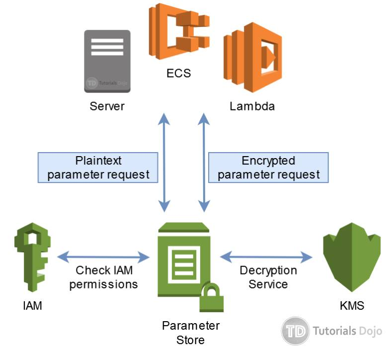
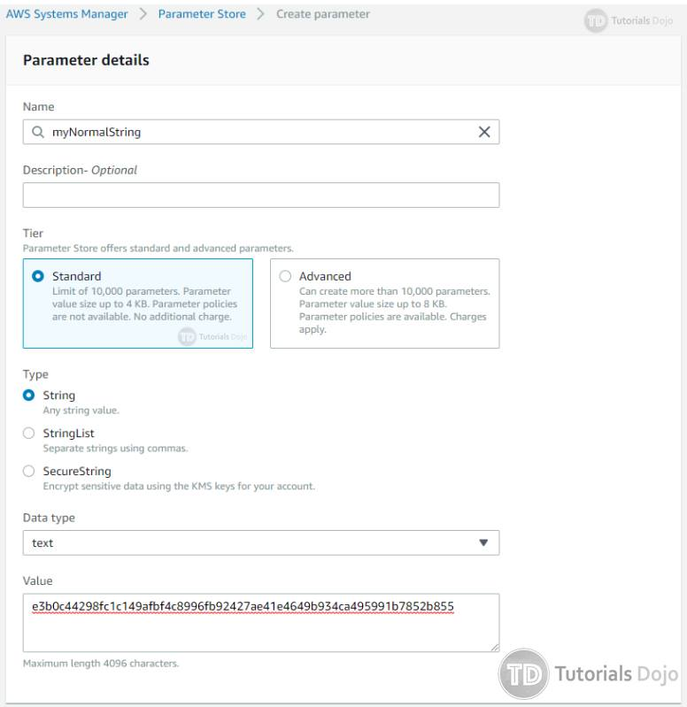
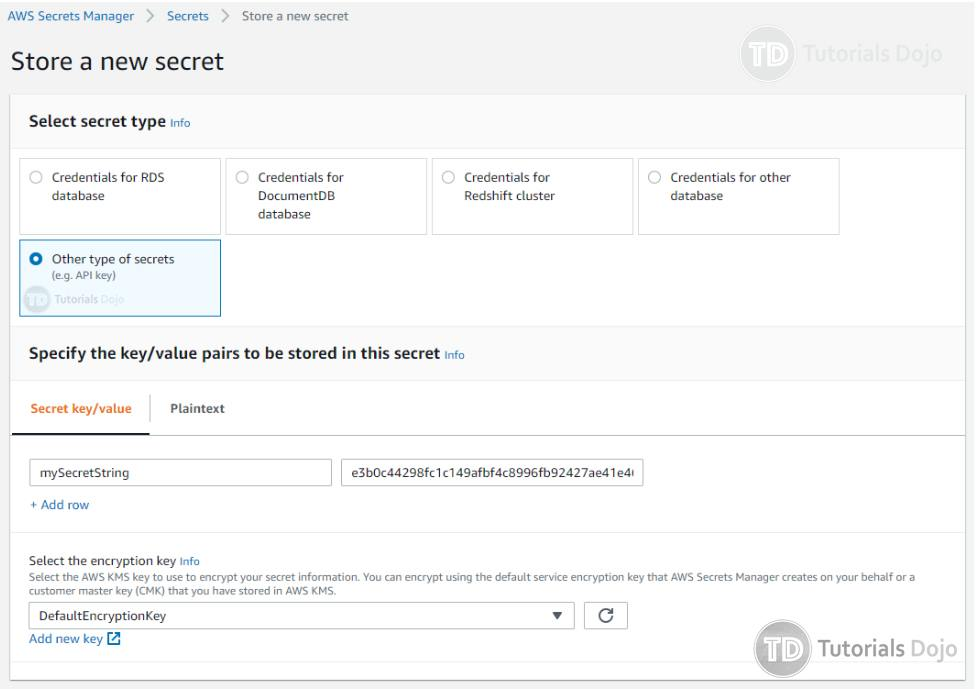

## **AWS Secrets Manager vs Systems Manager Parameter Store**

Managing the security of your applications is an integral part of any  organization especially for infrastructures deployed in the cloud. One  aspect of application security is how the parameters such as environment variables, database passwords, API keys, product keys, etc. are stored  and retrieved. As a best practice, secret information should not be  stored in plain text and not be embedded inside your source code. It is  also recommended to set up an automated system to rotate passwords or  keys regularly (which is easy to forget when you manage keys manually).

Managing and securing these types of data can be troublesome so Amazon provides  the AWS Systems Manager Parameter Store and AWS Secrets Manager services for this purpose. Parameter Store and Secrets Manager are two distinct  services but offer similar functionalities that allow you to centrally  manage and secure your secret information. 

In this post, we’ll take a look at the similarities and differences  between the two services to help you understand and choose what best  fits your given security requirements. 

**AWS Systems Manager Parameter Store**

[Parameter Store](https://docs.aws.amazon.com/systems-manager/latest/userguide/systems-manager-parameter-store.html) is part of the application management tools offered by the AWS Systems  Manager (SSM) service. Parameter Store allows you to create key-value  parameters to save your application configurations, custom environment  variables, product keys, and credentials on a single interface. 

Parameter Store allows you to secure your data by encryption which is integrated with AWS KMS.

After you create your parameters in Parameter Store you can then have these  parameters retrieved by your SSM Run Command, SSM State Manager, or  reference them on your application running on EC2, ECS, and Lambda or  even on applications running your on-premises data center. This  eliminates the need to hardcode variables or embed plain text  credentials on your code. Parameter Store makes it easy to update these  variables without modifying your source code, as well as eliminate the  need to embed confidential information such as database passwords in  your code.

Here’s an overview of how applications can retrieve information on Parameter Store.

- Your application (on-premises servers, EC2, ECS, Lambda, etc.) sends a parameter request to SSM Parameter Store. 
- If this is a plaintext parameter request, Parameter Store checks with IAM  if the user/role is allowed to retrieve the parameter. 
- If this is an encrypted parameter request, Parameter Store checks with IAM if the user/role is allowed to both retrieve and decrypt the parameter  with AWS KMS. Decryption requires that the IAM has KMS Decrypt  permission.
- If IAM verification is successful, Parameter Store sends back the parameter value to the application.

**AWS Secrets Manager**

[AWS Secrets Manager](https://aws.amazon.com/secrets-manager/) (released April, 2018) is a relatively newer offering from AWS compared to AWS Systems Manager Parameter Store. Secrets Manager enables you to  rotate, manage, and retrieve database credentials, API keys and other  secrets throughout their lifecycle. It also makes it really easy for you to follow security best practices such as encrypting secrets and  rotating these regularly. 

If you are a security administrator responsible for storing and managing  secrets, and ensuring that your organization follows regulatory and  compliance requirements, you can use Secrets Manager to perform these  tasks from one central location. Secrets Manager can offload the  management of secrets from developers such as database passwords or API  keys, so they don’t have to worry about where to store these  credentials. 

AWS Secret  Manager also follows the same process flow like Parameter Store shown  above. With descriptions laid out for both services, we’ll take a look  at their similarities and differences next. 

**Similarities and Differences**

Both services offer similar web interfaces on which you can declare key-values pairs for your parameters and secrets.

*Creating a parameter in SSM Parameter Store web interface.* 

*Creating a secret in AWS Secrets Manager web interface.* 

Both services accept values of up to 4096 characters (4KB size) for each  entry. And they both offer the option to encrypt these values.  Encryption for both services is integrated on AWS KMS, so your  application referencing these parameters or secrets needs to have KMS  Decrypt permission when retrieving encrypted values.

However, Parameter Store was designed to cater to a wider use case, not just  secrets or passwords, but also application configuration variables like  URLs, DB hostnames, custom settings, product keys, etc. which is why the default selection for creating a parameter is a plain text String  value. You can enable encryption if you explicitly choose to. 

Secrets Manager was designed specifically for confidential information that  needs to be encrypted so the creation of a secret entry has encryption  enabled by default. You can also choose to store in plaintext if you  explicitly want to.

Secrets Manager also provides a built-in password generator through the use of  AWS CLI. This can be helpful when you want to create an RDS instance  with a CloudFormation template, you can create a randomly itemized  password and later reference it on your RDS configuration.

Both services have a versioning feature. This allows you to view previous  versions of your parameters of secret in case you needed them. You can  choose to restore the older version of the parameter. Parameter Store  only allows one version of the parameter active at any given time.  Secrets Manager on the other hand, allows you to have multiple items  active at the same time. Secrets Manager distinguishes between different versions by the staging labels. You can check out staging labels [here](https://docs.aws.amazon.com/secretsmanager/latest/userguide/terms-concepts.html#term_staging-label).

The next point of difference is the ability to rotate the secret. AWS  Secrets Manager offers the ability to switch secrets at any given time  and can be configured to regularly rotate depending on your  requirements.

Another  feature available for Secrets Manager is cross-account access. Secrets  can be accessed from another AWS account. For example, you can have an  application with an IAM role to retrieve secrets from another AWS  account. This is useful if your secrets are centrally managed from  another AWS account. 

One  advantage of SSM Parameter is that it costs nothing. You can store up  to 10,000 parameters and you won’t get billed. AWS Secret Manager costs  $0.40 for every secret per month and $0.05 in every 10,000 API calls.

|                                         | **SSM Parameter Store** | **AWS Secrets Manager** |
| --------------------------------------- | ----------------------- | ----------------------- |
| **Store values up to 4096 Characters**  | Yes                     | Yes                     |
| **Values can be encrypted with KMS**    | Yes                     | Yes                     |
| **Can be referenced in CloudFormation** | Yes                     | Yes                     |
| **Built-in password generator**         |                         | Yes                     |
| **Automated secret rotation**           |                         | Yes                     |
| **Cross-account access**                |                         | Yes                     |
| **Additional Cost**                     | Free                    | Yes                     |

As an additional note, Parameter Store is now integrated with Secrets  Manager so that you can retrieve Secrets Manager secrets when using  other AWS services that already support references to Parameter Store  parameters. This is helpful if your application is configured to use  Parameter Store APIs, but you want your secrets to be stored in Secrets  Manager. 

This integration  further blurs the line between the use of SSM Parameter Store and AWS  Secrets Manager. To learn more on how to reference your AWS Secrets  Manager secrets from Parameter Store parameters, you can check this [documentation](https://docs.aws.amazon.com/systems-manager/latest/userguide/integration-ps-secretsmanager.html) on the AWS site.

**Sources:**

https://aws.amazon.com/secrets-manager/
 https://docs.aws.amazon.com/systems-manager/latest/userguide/systems-manager-parameter-store.html
 https://aws.amazon.com/about-aws/whats-new/2018/07/aws-systems-manager-parameter-store-integrates-with-aws-secrets-manager-and-adds-parameter-version-labeling/
 https://docs.aws.amazon.com/systems-manager/latest/userguide/integration-ps-secretsmanager.html
 https://docs.aws.amazon.com/AmazonECS/latest/developerguide/specifying-sensitive-data-secrets.html
 https://docs.aws.amazon.com/AmazonECS/latest/developerguide/specifying-sensitive-data-parameters.html