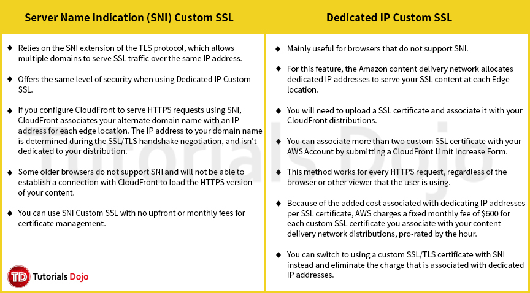

# SNI Custom SSL vs Dedicated IP Custom SSL

 

**References:**

https://aws.amazon.com/cloudfront/custom-ssl-domains/
https://docs.aws.amazon.com/AmazonCloudFront/latest/DeveloperGuide/cnames-https-dedicated-ip-or-sni.html
https://docs.aws.amazon.com/AmazonCloudFront/latest/DeveloperGuide/cnames-and-https-switch-dedicated-to-sni.html