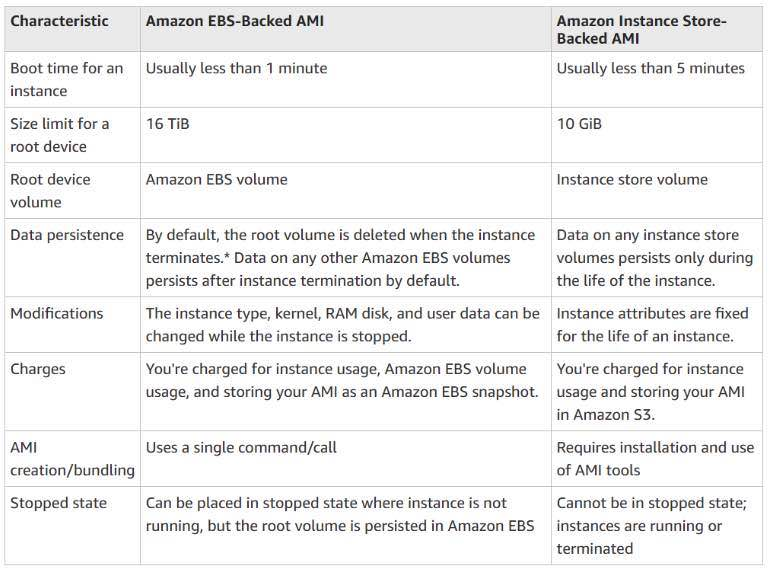
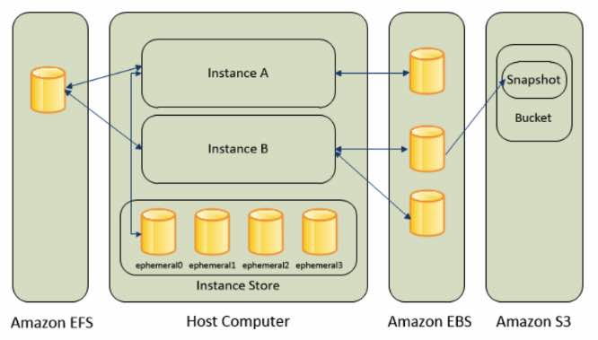

# Amazon Elastic Compute Cloud ( Amazon EC2 )

- A Linux-based/Windows-based virtual server that you can provision.
- You are limited to running On-Demand Instances per your vCPU-based  On-Demand Instance limit, purchasing 20 Reserved Instances, and  requesting Spot Instances per your dynamic Spot limit per region.

## Features

- The **AWS Nitro System** is the underlying platform of the next generation of EC2 instances.  Traditionally, hypervisors protect the physical hardware and bios,  virtualize the CPU, storage, networking, and provide a rich set of  management capabilities. With the Nitro System, these functions are  offloaded to dedicated hardware and software, thereby reducing costs of  your instances in the process. Hence, the Nitro Hypervisor delivers  performance that is indistinguishable from bare metal and performs  better than its predecessor: the Xen Hypervisor.

- Server environments called **instances**.

- Package OS and additional installations in a reusable template called **Amazon Machine Images.**

- Various configurations of CPU, memory, storage, and networking capacity for your instances, known as **instance types**:

  - t-type and m-type for general purpose

  - c-type for compute optimized

  - r-type, x-type and z-type for memory optimized

  - d-type, h-type and i-type for storage optimized

  - f-type, g-type and p-type for accelerated computing

    

  - T2 / T3: burstable instances (up to a capacity)

  - T2 / T3 - unlimited: unlimited burst

    

  - Real-world tip: use https://www.ec2instances.info

- Secure login information for your instances using **key pairs**
- Storage volumes for temporary data that are deleted when you STOP or TERMINATE your instance, known as **instance store volumes.** Take note that you can stop an EBS-backed instance but not an Instance  Store-backed instance. You can only either start or terminate an  Instance Store-backed instance.
- Persistent storage volumes for your data using **Elastic Block Store volumes** (see aws storage services).
- Multiple physical locations for deploying your resources, such as instances and EBS volumes, known as **regions** and **Availability Zones** (see AWS overview)**.**
- A firewall that enables you to specify the protocols, ports, and source IP ranges that can reach your instances using **security groups** (see aws networking and content delivery).
- Static IPv4 addresses for dynamic cloud computing, known as **Elastic IP addresses** (see aws networking and content delivery).
- Metadata, known as **tags**, that you can create and assign to your EC2 resources
- Virtual networks you can create that are logically isolated from the rest of  the AWS cloud, and that you can optionally connect to your own network,  known as **virtual private clouds** or **VPC**s (see aws networking and content delivery).
- Add a script that will be run on instance boot called **user-data**.
- **Host Recovery for Amazon EC2** automatically restarts your instances on a new host in the event of an unexpected hardware failure on a Dedicated Host.
- **EC2 Hibernation** is available for On-Demand and Reserved Instances running on freshly  launched M3, M4, M5, C3, C4, C5, R3, R4, and R5 instances running Amazon Linux and Ubuntu 18.04 LTS. You can enable hibernation for your  EBS-backed instances at launch. You can then hibernate and resume your  instances through the AWS Management Console, or though the AWS SDK and  CLI using the existing stop-instances and start-instances commands.  Hibernation requires an EC2 instance to be an encrypted EBS-backed  instance.

## EC2 Instance LaunchTypes

* **On Demand Instances**: short workload, predictable pricing, reliable

- **Spot Instances:** short workloads, for cheap, can lose instances (not reliable)
- **Reserved:** (MINIMUM 1 year)
  - **Reserved Instances**: long workloads
  - **Convertible Reserved Instances**: long workloads with flexible instances
  - **Scheduled Reserved Instances**: example – everyThursday between 3 and 6 pm
- **Dedicated Instances**: no other customers will share your hardware
- **Dedicated Hosts**: book an entire physical server, control instance placement
  - Great for software licenses that operate at the core, or CPU socket level
  - Can define **host affinity** so that instance reboots are kept on the same host

## Instance states

- **Start** – run your instance normally. You are continuously billed while your instance is running.
- **Stop** – is just a normal instance shutdown. You may restart it again anytime. All EBS volumes remain attached, but data in instance store volumes are deleted. You won’t be charged for usage while instance is stopped. You  can attach or detach EBS volumes. You can also create an AMI from the  instance, and change the kernel, RAM disk, and instance type while in  this state.
- **Terminate** – instance performs a normal shutdown and gets deleted. You won’t be  able to restart an instance once you terminate it. The root device  volume is deleted by default, but any attached EBS volumes are preserved by default. Data in instance store volumes are deleted.
- To prevent accidental termination, enable termination protection.

## Root Device Volumes

- The root device volume contains the image used to boot the instance.
- Instance Store-backed Instances
  - Any data on the instance store volumes is deleted when the instance is  terminated (instance store-backed instances do not support the Stop  action) or if it fails (such as if an underlying drive has issues).
  - You should also back up critical data from your instance store volumes to persistent storage on a regular basis.

- Amazon EBS-backed Instances
  - An Amazon EBS-backed instance can be stopped and later restarted without affecting data stored in the attached volumes.
  - When in a stopped state, you can modify the properties of the instance,  change its size, or update the kernel it is using, or you can attach  your root volume to a different running instance for debugging or any  other purpose.
  - By default, the root device volume for an AMI backed by Amazon EBS is deleted when the instance terminates.
  - Previously, to launch an encrypted EBS-backed EC2 instance from an unencrypted AMI, you would first need to create an encrypted copy of the AMI and use  that to launch the EC2 instance. Now, you can **[launch encrypted EBS-backed EC2 instances](https://aws.amazon.com/about-aws/whats-new/2019/05/launch-encrypted-ebs-backed-ec2-instances-from-unencrypted-amis-in-a-single-step/)** from unencrypted AMIs directly.

## AMI

- Includes the following:
  - A template for the root volume for the instance (OS, application server, and applications)
  - Launch permissions that control which AWS accounts can use the AMI to launch instances
  - A block device mapping that specifies the volumes to attach to the instance when it’s launched

 

- Backed by Amazon EBS – root device for an instance launched from the AMI is an Amazon EBS volume. AMIs backed by Amazon EBS snapshots can use EBS  encryption.
- Backed by Instance Store – root device for an instance launched from the AMI  is an instance store volume created from a template stored in S3.

- You can copy AMIs to different regions.

## Pricing

- On-Demand  – pay for the instances that you use by the second, with no long-term commitments or upfront payments.
- Reserved – make a low, one-time, up-front payment for an instance, reserve it for a one – or  three-year term, and pay a significantly lower hourly rate for these instances. It has two offering classes: Standard and Convertible. 
  - The Standard class provides the most significant discount but you can only  modify some of its attributes during the term. It can also be sold in  the Reserved Instance Marketplace. 
  - The Convertible class provides a lower discount than Standard Reserved  Instances, but can be exchanged for another Convertible Reserved  Instance with different instance attributes. However, this one cannot be sold in the Reserved Instance Marketplace.

- Spot – request unused EC2 instances, which can lower your costs significantly. 

  Spot Instances are available at up to a 90% discount compared to On-Demand prices.

  - Spot Instances with a defined duration (also known as **Spot blocks**) are designed not to be interrupted and will run continuously for the  duration you select. This makes them ideal for jobs that take a finite  time to complete, such as batch processing, encoding and rendering,  modeling and analysis, and continuous integration.
  - A **Spot Fleet** is a collection of Spot Instances and optionally On-Demand Instances.  The service attempts to launch the number of Spot Instances and  On-Demand Instances to meet your specified target capacity. The request  for Spot Instances is fulfilled if there is available capacity and the  maximum price you specified in the request exceeds the current Spot  price. The Spot Fleet also attempts to maintain its target capacity  fleet if your Spot Instances are interrupted.
  - A **Spot Instance pool** is a set of unused EC2 instances with the same instance type, operating system, Availability Zone, and network platform.
  - You can start and stop your Spot Instances backed by Amazon EBS at will.
  - Allocation strategy for Spot Instances
    - **LowestPrice** – The Spot Instances come from the pool with the lowest price. This is the default strategy.
    - **Diversified** – The Spot Instances are distributed across all pools.
    - **CapacityOptimized** – The Spot Instances come from the pool with optimal capacity for the number of instances that are launching.

- Dedicated Hosts – pay for a physical host that is fully dedicated to  running your instances, and bring your existing per-socket, per-core, or per-VM software licenses to reduce costs.
- Dedicated Instances – pay, by the hour, for instances that run on single-tenant hardware.
- There is a data transfer charge when copying AMI from one region to another
- EBS pricing is different from instance pricing. (see AWS storage services)
- AWS imposes a small hourly charge if an Elastic IP address is not  associated with a running instance, or if it is associated with a  stopped instance or an unattached network interface.
- You are charged for any additional Elastic IP addresses associated with an instance.
- If data is transferred between these two instances, it is charged at “Data Transfer Out from EC2 to Another AWS Region” for the first instance and at “Data Transfer In from Another AWS Region” for the second instance. 

## Security

- Use IAM to control access to your instances (see AWS Security and Identity Service).

  - IAM policies
  - IAM roles

- Restrict access by only allowing trusted hosts or networks to access ports on your instance.

- A  **security group** acts as a virtual firewall that controls the traffic for one or more instances. 

  - Create different security groups to deal with instances that have different security requirements. 
  - You can add rules to each security group that allow traffic to or from its associated instances.
  - You can modify the rules for a security group at any time.
  - New rules are automatically applied to all instances that are associated with the security group.
  - Evaluates all the rules from all the security groups that are associated with an  instance to decide whether to allow traffic or not.
  - By default, security groups allow **all outbound traffic**.
  - Security group rules are **always permissive**; you can’t create rules that deny access.
  - Security groups are **stateful**

- If you don’t specify a security group when you launch an instance, the instance is automatically associated with the 

  default security group

   for the VPC, which has the following rules:

  - Allows all inbound traffic from other instances associated with the default security group
  - Allows all outbound traffic from the instance.

- Disable password-based logins for instances launched from your AMI, since passwords can be cracked or found.

- You can replicate the network traffic from an EC2 instance within your  Amazon VPC and forward that traffic to security and monitoring  appliances for content inspection, threat monitoring, and  troubleshooting.

## Networking

- An **Elastic IP address** is a static IPv4 address designed for dynamic cloud computing. With it, you can mask the failure of an instance or software by rapidly  remapping the address to another instance in your account.
- If you have not enabled auto-assign public IP address for your instance,  you need to associate an Elastic IP address with your instance to enable communication with the internet.
- An Elastic IP address is for use in a specific region only.
- By default, all AWS accounts are limited to five (5) Elastic IP addresses  per region, because public (IPv4) internet addresses are a scarce public resource.
- By default EC2 instances come with a private IP.
- An elastic **network interface** is a logical networking component in a VPC that represents a virtual network card, which directs traffic to your instance
- Every instance in a VPC has a default network interface, called the **primary network interface** (eth0). You cannot detach a primary network interface from an instance. 
- You can create and attach additional network interfaces. The maximum number of network interfaces that you can use varies by instance type.
- You can attach a network interface to an instance in a different subnet as long as its within the same AZ
- Default interfaces are terminated with instance termination.
- Scale with **EC2 Scaling Groups** and distribute traffic among instances using **Elastic Load Balancer**.
- You can configure EC2 instances as **bastion hosts** (aka jump boxes) in order to access your VPC instances for management, using SSH or RDP protocols
- **Enhanced Networking – It provides higher bandwidth, higher packet per second (PPS)  performance, and consistent lower inter-instance latencies, which is  being used in Placement Groups. It uses single root I/O virtualization  (SR-IOV) to provide high-performance networking capabilities. SR-IOV is a method of device virtualization that provides higher I/O performance  and lower CPU utilization when compared to traditional virtualized  network interfaces.** 
- **Elastic Fabric Adapter (EFA) –** This is a network device that you can attach to your EC2 instance to  significantly accelerate machine learning applications and High  Performance Computing (HPC). It empowers your computing resources to  achieve the application performance of an on-premises HPC cluster, with  the elasticity and scalability provided by AWS. Compared with a TCP  transport that is traditionally used in cloud-based HPC systems, EFA  provides lower and more consistent latency and higher throughput as it  enhances the performance of inter-instance communication.

## Monitoring

* EC2 included metrics
  * <u>CPU</u>: CPU Utilization + Credit Usage / Balance

  * <u>Network</u>: Network In / Out

  * <u>Status Check</u>:

    - Instance status = check the EC2 VM
    - System status = check the underlying hardware

  * <u>Disk</u>: Read / Write for Ops / Bytes (only for instance store)

    

  * <u>RAM is NOT included in the AWS EC2 metrics</u>

* Automated monitoring tools include:
  * System Status Checks – monitor the AWS systems required to use your instance  to ensure they are working properly. These checks detect problems with  your instance that require AWS involvement to repair.
  * Instance Status Checks – monitor the software and network configuration of your  individual instance. These checks detect problems that require your  involvement to repair.
  * Amazon CloudWatch Alarms – watch a single metric over a time period you  specify, and perform one or more actions based on the value of the  metric relative to a given threshold over a number of time periods.
  * Amazon CloudWatch Events – automate your AWS services and respond automatically to system events.
  * Amazon CloudWatch Logs – monitor, store, and access your log files from Amazon EC2 instances, AWS CloudTrail, or other sources.

* Monitor your EC2 instances with CloudWatch. By default, EC2 sends metric data to CloudWatch in 5-minute periods.

## Instance Metadata and User Data

- **Instance metadata** is data about your instance that you can use to configure or manage the running instance. 
- Instance metadata and user data are not protected by cryptographic methods.
- View all categories of instance metadata from within a running instance at **http://169.254.169.254/latest/meta-data/**
- You can pass two types of user data to EC2: shell scripts and cloud-init directives.
- User data is limited to 16 KB.
- If you stop an instance, modify its user data, and start the instance, the updated user data is not executed when you start the instance.
- Retrieve user data from within a running instance at **http://169.254.169.254/latest/user-data**

## Placement Groups

* Control the EC2 Instance placement strategy using **placement groups**

* Group Strategies:
  * *Cluster*—clusters instances into a low-latency group in a single Availability Zone
  * *Spread*—spreads instances across underlying hardware (max 7 instances per group per AZ) – critical applications
  * *Partition*—spreads instances across many different partitions (which rely on different sets of racks) within an AZ. Scales to 100s of EC2 instances per group (Hadoop, Cassandra, Kafka)
* **You can move** an instance into or out of a placement group
  * Your first need to **stop** it
  * You then need to use the CLI (modify-instance-placement)
  * You can then start your instance

### Placement Groups: Cluster

* Pros: Great network (10 Gbps bandwidth between instances)
* Cons: If the rack fails, all instances fails at the same time
* Note: choose than instance type that has **Enhanced Networking**
* Use case:
  * Big Data job that needs to complete fast
  * Application that needs extremely low latency and high network throughput

### Placement Groups: Spread

* Pros:
  * Can span across Availability Zone (AZ)
  * Reduced risk is simultaneous failure
  * EC2 Instances are on different physical hardware

* Cons:
  * Limited to 7 instances per AZ per placement group
* Use case:
  * Application that needs to maximize high availability
  * Critical Applications where each instance must be isolated from failure from each other

### Placements Groups: Partition

- Up to 7 partitions per AZ
- Up to 100s of EC2 instances
- The instances in a partition do not share racks with the instances in the other partitions
- A partition failure can affect many EC2 but won’t affect other partitions
- EC2 instances get access to the partition information as metadata
- <u>Use cases</u>: HDFS, HBase, Cassandra, Kafka

## Rules

- The name you specify for a placement group must be unique within your AWS account for the region.
- You can’t merge placement groups.
- An instance can be launched in one placement group at a time; it cannot span multiple placement groups.
- Instances with a tenancy of host cannot be launched in placement groups.

## Storage

### 

- **EBS** (see AWS Storage Services)
  - Provides durable, block-level storage volumes that you can attach to a running instance. 
  - Use as a primary storage device for data that requires frequent and granular updates.
  - To keep a backup copy of your data, create a snapshot of an EBS volume,  which is stored in S3. You can create an EBS volume from a snapshot, and attach it to another instance.
- **Instance Store**
  - Provides temporary block-level storage for instances. 
  - The data on an instance store volume persists only during the life of the  associated instance; if you stop or terminate an instance, any data on  instance store volumes is lost.

- **Elastic File System (EFS)** (see AWS Storage Services)
  - Provides scalable file storage for use with Amazon EC2. You can create an EFS  file system and configure your instances to mount the file system.
  - You can use an EFS file system as a common data source for workloads and applications running on multiple instances. 

- **S3** (see AWS Storage Services)

  - Provides access to reliable and inexpensive data storage infrastructure.
  - Storage for EBS snapshots and instance store-backed AMIs.

- **Resources and Tagging**

  - EC2 resources include images, instances, volumes, and snapshots. When you create a resource, AWS assigns the resource a *unique resource ID*.

  - Some resources can be used in all regions (global), and some resources are  specific to the region or Availability Zone in which they reside.

    

| **Resource**                    | **Type**           | **Description**                                              |
| ------------------------------- | ------------------ | ------------------------------------------------------------ |
| AWS account                     | Global             | You can use the same AWS account in all regions.             |
| Key pairs                       | Global or Regional | The key pairs that you create using EC2 are tied to the region where you  created them. You can create your own RSA key pair and upload it to the  region in which you want to use it; therefore, you can make your key  pair globally available by uploading it to each region. |
| Amazon EC2 resource identifiers | Regional           | Each resource identifier, such as an AMI ID, instance ID, EBS volume ID, or  EBS snapshot ID, is tied to its region and can be used only in the  region where you created the resource. |
| User-supplied resource names    | Regional           | Each resource name, such as a security group name or key pair name, is tied  to its region and can be used only in the region where you created the  resource. Although you can create resources with the same name in  multiple regions, they aren’t related to each other. |
| AMIs                            | Regional           | An AMI is tied to the region where its files are located within S3. You can copy an AMI from one region to another. |
| Elastic IP addresses            | Regional           | An Elastic IP address is tied to a region and can be associated only with an instance in the same region. |
| Security groups                 | Regional           | A security group is tied to a region and can be assigned only to  instances in the same region. You can’t enable an instance to  communicate with an instance outside its region using security group  rules. |
| EBS snapshots                   | Regional           | An EBS snapshot is tied to its region and can only be used to create  volumes in the same region. You can copy a snapshot from one region to  another. |
| EBS volumes                     | Availability Zone  | An EBS volume is tied to its Availability Zone and can be attached only to instances in the same Availability Zone. |
| Instances                       | Availability Zone  | An instance is tied to the Availability Zones in which you launched it. However, its instance ID is tied to the region. |

- - You can optionally assign your own metadata to each resource with **tags**, which consists of a key and an optional value that you both define.

 

## Amazon EC2 Overview from AWS re:Invent

https://youtu.be/vXBeO9vQAI8

**Amazon EC2-related Cheat Sheets:**

- [EC2 Instance Health Check vs ELB Health Check vs Auto Scaling and Custom Health Check](https://tutorialsdojo.com/ec2-instance-health-check-vs-elb-health-check-vs-auto-scaling-and-custom-health-check/)
- [EC2 Container Service (ECS) vs Lambda](../amazon-elastic-compute-cloud-amazon-ec2.md)