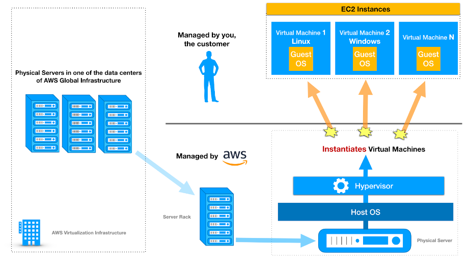

# AWS Cheat Sheets – Compute Services

AWS provides a variety of cost-effective and flexible computing services to meet the needs of your organization such as Amazon Elastic Compute  Cloud (EC2), Amazon Elastic Container Service (ECS), Amazon Elastic  Container Service for Kubernetes (EKS), Amazon Lightsail, AWS Batch, and AWS Lambda to name a few. For some services like Amazon EC2, you have  extensive control of the underlying resources while for others, AWS has  full control. 

With these  computing services in AWS, you can dynamically provision a number of  resources and pay only the computing resources you actually consume.  This significantly reduces the upfront capital investment required and  replaces it with lower variable costs. Instead of the traditional  long-term contracts or up-front commitments, you can opt to pay your  compute resources in AWS using an On-Demand or Spot pricing option to  easily discontinue your cloud resources if you don’t need them,  effectively reducing your operating expenses. Amazon EC2 is a commonly  used AWS service which you can integrate with various features and  services like Amazon Machine Image, Instance Store, Elastic Block Store, Elastic Network Interface, Elastic IP, Auto Scaling, Elastic Load  Balancer, Placements Groups, Enhanced Networking, Security Groups and so much more. 

Have you ever heard people say “Amazon Linux EC2 **Instance**” instead of “Amazon Linux EC2 **Server**” when they launch a compute resource in AWS? It is because AWS is programmatically creating a new virtual machine (VM) **instance**, rather than providing you with an actual physical **server**, when you launch an EC2 Instance. AWS has a powerful virtualization  infrastructure that is composed of physical servers that they manage.  Each physical server has a host operating system that runs a virtual  machine monitor (VMM), also known as a hypervisor, which instantiates  multiple VM “instances” that you can use. These instances use guest  operating systems that you can manage. 

AWS manages, operates, and controls the components from the host operating  system and virtualization layer down to the physical security of the  facilities in which the service operates. Conversely, the customer is  responsible for the management of the guest operating system such as  installing patches and doing the necessary security configuration.

You can also use these compute services in AWS to run your High Performance Computing (HPC) applications. Basically, HPC requires a higher storage I/O and large amounts of memory to perform a complex task. Moving your  HPC workloads to AWS eliminates the unnecessary wait times and long job  queues that are associated with limited on-premises HPC resources. Since there are no upfront capital expenditures or lengthy procurement  cycles, you can get significant cost savings whenever you process  time-flexible, stateless workloads.

[Amazon Elastic Compute Cloud (EC2)](https://tutorialsdojo.com/amazon-elastic-compute-cloud-amazon-ec2/)

[Amazon Elastic Container Registry (ECR)](https://tutorialsdojo.com/amazon-elastic-container-registry-amazon-ecr/)

[Amazon Elastic Container Service (ECS)](https://tutorialsdojo.com/amazon-elastic-container-service-amazon-ecs/)

[Amazon Lightsail](https://tutorialsdojo.com/amazon-lightsail/)

[AWS Batch](https://tutorialsdojo.com/aws-batch/)

[AWS Elastic Beanstalk](https://tutorialsdojo.com/aws-elastic-beanstalk/)

[AWS Lambda](https://tutorialsdojo.com/aws-lambda/)

[AWS ParallelCluster](https://tutorialsdojo.com/aws-parallelcluster/)

[AWS Serverless Application Model](https://tutorialsdojo.com/aws-serverless-application-model-sam/)

**Other Compute-related Notes**

[Amazon EC2 Auto Scaling Lifecycle Hooks](https://tutorialsdojo.com/amazon-ec2-auto-scaling-lifecycle-hooks/)

[Configuring Notifications for Amazon EC2 Auto Scaling Lifecycle Hooks](https://tutorialsdojo.com/configuring-notifications-for-amazon-ec2-auto-scaling-lifecycle-hooks/)

[Step Scaling vs Simple Scaling Policies in Amazon EC2](https://tutorialsdojo.com/step-scaling-vs-simple-scaling-policies-in-amazon-ec2/)

[Elastic Fabric Adapter](https://tutorialsdojo.com/elastic-fabric-adapter-efa/)

[ECS Task Placement Strategies](https://tutorialsdojo.com/ecs-task-placement-strategies/)