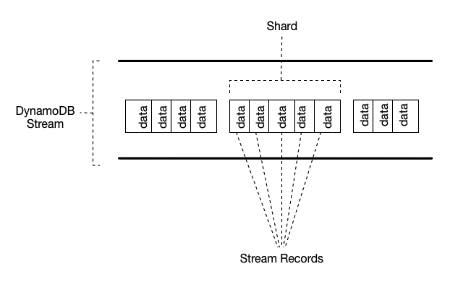
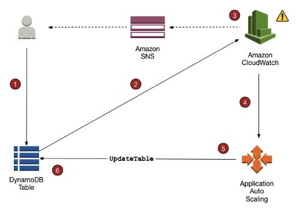
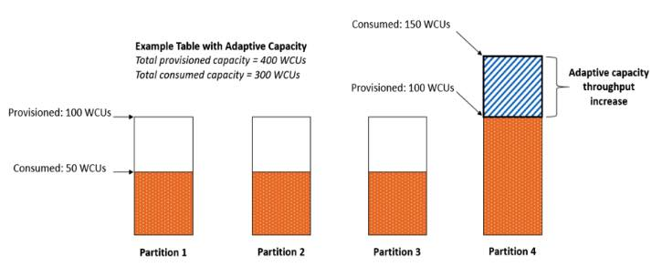

# Amazon DynamoDB

- NoSQL database service that provides fast and predictable performance with seamless scalability.
- Offers encryption at rest.
- You can create database tables that can store and retrieve any amount of data, and serve any level of request traffic. 
- You can scale up or scale down your tables’ throughput capacity without  downtime or performance degradation, and use the AWS Management Console  to monitor resource utilization and performance metrics.
- Provides on-demand backup capability as well as enable point-in-time recovery  for your DynamoDB tables. With point-in-time recovery, you can restore  that table to any point in time during the **last 35 days**.
- All of your data is stored in partitions, backed by solid state disks  (SSDs) and automatically replicated across multiple AZs in an AWS  region, providing built-in high availability and data durability.
- You can create tables that are automatically replicated across two or more  AWS Regions, with full support for multi-master writes.
- AWS now specifies the IP address ranges for Amazon DynamoDB endpoints. You  can use these IP address ranges in your routing and firewall policies to control outbound application traffic. You can also use these ranges to  control outbound traffic for applications in your Amazon Virtual Private Cloud, behind AWS Virtual Private Network or AWS Direct Connect.

### **Core Components**

- **Tables** – a collection of items
  - DynamoDB stores data in a table, which is a collection of data.
  - Are schemaless.
  - There is an initial limit of 256 tables per region.
- **Items** – a collection of attributes
  - DynamoDB uses **primary keys** to uniquely identify each item in a table and **secondary indexes** to provide more querying flexibility.
  - Each table contains zero or more items.
- **Attributes** – a fundamental data element
  - DynamoDB supports nested attributes up to 32 levels deep.
- **Primary Key** – uniquely identifies each item in the table, so that no two items can have the same key. Must be scalar.
  - **Partition key** – a simple primary key, composed of one attribute.
  - **Partition key and sort key** (*composite primary key*) – composed of two attributes.
  - DynamoDB uses the partition key value as input to an internal hash function. The output from the hash function determines the partition in which the  item will be stored. All items with the same partition key are stored  together, in sorted order by sort key value. If no sort key is used, no  two items can have the same partition key value.
- **Secondary Indexes** – lets you query the data in the table using an alternate key, in addition to queries against the primary key.
  - You can create one or more secondary indexes on a table.
  - Two kinds of indexes:
    - **Global secondary index** – An index with a partition key and sort key that can be different from those on the table.
    - **Local secondary index** – An index that has the same partition key as the table, but a different sort key.
  - You can define up to 20 global secondary indexes and 5 local secondary indexes per table.
- **DynamoDB Streams** – an optional feature that captures data modification events in DynamoDB tables. 
  - The naming convention for DynamoDB Streams endpoints is *streams.dynamodb..amazonaws.com*
  - Each event is represented by a *stream record*, and captures the following events:
    - A new item is added to the table: captures an image of the entire item, including all of its attributes.
    - An item is updated: captures the “before” and “after” image of any attributes that were modified in the item.
    - An item is deleted from the table: captures an image of the entire item before it was deleted.
  - Each stream record also contains the name of the table, the event timestamp, and other metadata. 
  - Stream records are organized into groups, or ***shards***. Each shard acts as a container for multiple stream records, and  contains information required for accessing and iterating through these  records. 
  - Stream records have a lifetime of 24 hours; after that, they are automatically removed from the stream.
  - You can use DynamoDB Streams together with AWS Lambda to create a *trigger*, which is a code that executes automatically whenever an event of interest appears in a stream.
  - DynamoDB Streams enables powerful solutions such as data replication within and  across Regions, materialized views of data in DynamoDB tables, data  analysis using Kinesis materialized views, and much more.

### **Data Types for Attributes**

- **Scalar Types** – A scalar type can represent exactly one value. The scalar types are  number, string, binary, Boolean, and null. Primary keys should be scalar types.
- **Document Types** – A document type can represent a complex structure with nested  attributes—such as you would find in a JSON document. The document types are list and map.
- **Set Types** – A set type can represent multiple scalar values. The set types are string set, number set, and binary set.

### **Other Notes:**

- When you read data from a DynamoDB table, the response might not reflect the results of a recently completed write operation. The response might  include some stale data, but you should **eventually have consistent reads**.
- When you request a **strongly consistent read**, DynamoDB returns a response with the most up-to-date data, reflecting  the updates from all prior write operations that were successful. A  strongly consistent read might not be available if there is a network  delay or outage.
- DynamoDB does not support strongly consistent reads across AWS regions
- When you create a table or index in DynamoDB, you must specify your  throughput capacity requirements for read and write activity in terms  of:
  - One **read capacity unit** represents one strongly consistent read per second, or two eventually  consistent reads per second, for an item up to 4 KB in size. If you need to read an item that is larger than 4 KB, DynamoDB will need to consume additional read capacity units.
  - One **write capacity unit** represents one write per second for an item up to 1 KB in size. If you  need to write an item that is larger than 1 KB, DynamoDB will need to  consume additional write capacity units. 
- *Throttling* prevents your application from consuming too many capacity units.  DynamoDB can throttle read or write requests that exceed the throughput  settings for a table, and can also throttle read requests exceeds for an index.
- When a request is throttled, it fails with an **HTTP 400** code (Bad Request) and a *ProvisionedThroughputExceededException*.

### **Throughput Management**

- Provisioned throughput – manually defined maximum amount of capacity that an  application can consume from a table or index. If your application  exceeds your provisioned throughput settings, it is subject to request  throttling. Free tier eligible.
  - DynamoDB auto scaling
    - Define a range (upper and lower limits) for **read and write capacity units**, and define a target utilization percentage within that range.
    - A table or a global secondary index can increase its **provisioned read and write capacity** to handle sudden increases in traffic, without request throttling.
    - DynamoDB auto scaling can decrease the throughput when the workload decreases so that you don’t pay for unused provisioned capacity.
  - Reserved capacity – with reserved capacity, you pay a one-time upfront fee and  commit to a minimum usage level over a period of time, for cost-saving  solutions.
- Amazon DynamoDB on-demand is a flexible capacity mode for DynamoDB capable of  serving thousands of requests per second without capacity planning. When you choose on-demand capacity mode, DynamoDB instantly accommodates  your workloads as they ramp up or down to any previously reached traffic level. If a workload’s traffic level hits a new peak, DynamoDB adapts  rapidly to accommodate the workload. DynamoDB on-demand offers simple  pay-per-request pricing for read and write requests so that you only pay for what you use, making it easy to balance costs and performance.

### **Capacity Unit Consumption**

- CUC for Reads –  strongly consistent read request consumes one read  capacity unit, while an eventually consistent read request consumes 0.5  of a read capacity unit.
  - GetItem – reads a single item from a table.
  - BatchGetItem – reads up to 100 items, from one or more tables.
  - Query – reads multiple items that have the same partition key value.
  - Scan – reads all of the items in a table
- CUC for Writes
  - PutItem – writes a single item to a table.
  - UpdateItem – modifies a single item in the table.
  - DeleteItem – removes a single item from a table.
  - BatchWriteItem – writes up to 25 items to one or more tables.
- - Calculating the Required Read and Write Capacity Unit for Your DynamoDB table: https://tutorialsdojo.com/calculating-the-required-read-and-write-capacity-unit-for-your-dynamodb-table/

### **DynamoDB Auto Scaling**

- When you use the AWS Management Console to create a new table, DynamoDB auto scaling is enabled for that table by default.
- Uses the AWS Application Auto Scaling service to dynamically adjust  provisioned throughput capacity on your behalf, in response to actual  traffic patterns.
- You create a *scaling policy* for a table or a global secondary index. The scaling policy specifies  whether you want to scale read capacity or write capacity (or both), and the minimum and maximum provisioned capacity unit settings for the  table or index. The scaling policy also contains a *target utilization*, which is the percentage of consumed provisioned throughput at a point in time.

- DynamoDB auto scaling doesn’t prevent you from manually modifying provisioned throughput settings.
- If you enable DynamoDB auto scaling for a table that has one or more  global secondary indexes, AWS highly recommends that you also apply auto scaling uniformly to those indexes.

### **Tagging**

- Tags can help you:
  - Quickly identify a resource based on the tags you’ve assigned to it.
  - See AWS bills broken down by tags.
- Each DynamoDB table can have only one tag with the same key. If you try to  add an existing tag (same key), the existing tag value will be updated  to the new value.
- Maximum number of tags per resource: 50

### **DynamoDB Items**

- You can use the *UpdateItem* operation to implement an **atomic counter** – a numeric attribute that is incremented, unconditionally, without interfering with other write requests.
- DynamoDB optionally supports conditional writes for these operations: *PutItem, UpdateItem, DeleteItem*. A conditional write will succeed only if the item attributes meet one or more expected conditions. 
- Conditional writes can be *idempotent* if the conditional check is on the same attribute that is being  updated. DynamoDB performs a given write request only if certain  attribute values in the item match what you expect them to be at the  time of the request.
- Expressions
  - To get only a few attributes of an item, use a **projection expression**.
  - An **expression attribute** **name** is a placeholder that you use in an expression, as an alternative to an  actual attribute name. An expression attribute name must begin with a #, and be followed by one or more alphanumeric characters.
  - **Expression attribute values** are substitutes for the actual values that you want to compare — values that you might not know until runtime. An expression attribute value  must begin with a :, and be followed by one or more alphanumeric  characters.
  - For *PutItem, UpdateItem* and *DeleteItem* operations, you can specify a **condition expression** to determine which items should be modified. If the condition  expression evaluates to true, the operation succeeds; otherwise, the  operation fails.
  - An **update expression** specifies how *UpdateItem* will modify the attributes of an item—for example, setting a scalar value, or removing elements from a list or a map.

### **Time To Live (TTL)**

- Allows you to define when items in a table expire so that they can be automatically deleted from the database.

### **DynamoDB Queries**

- The *Query* operation finds items based on primary key values. You can query any  table or secondary index that has a composite primary key (a partition  key and a sort key).
- A key condition expression is a search criteria that determines the items to be read from the table or index.
- You must specify the partition key name and value as an equality condition.
- You can optionally provide a second condition for the sort key. The sort  key condition must use one of the following comparison operators: =,  <, <=, >, >=, BETWEEN, AND
- A single *Query* operation can retrieve a maximum of 1 MB of data.
- For further refining of Query results, you can optionally provide a **filter expression**, to determine which items within the Query results should be returned to you. All of the other results are discarded.
- The Query operation allows you to limit the number of items that it returns in the result by setting the **Limit** parameter to the maximum number of items that you want.
- DynamoDB paginates the results from Query operations, where Query results are  divided into “pages” of data that are 1 MB in size (or less).
- **ScannedCount** is the number of items that matched the key condition expression, before a filter expression (if present) was applied.
- **Count** is the number of items that remain, after a filter expression (if present) was applied.

### **DynamoDB Scans**

- A *Scan* operation reads every item in a table or a secondary index. By default, a Scan operation returns all of the data attributes for every item in  the table or index. 
- Scan always returns a result set. If no matching items are found, the result set will be empty.
- A single Scan request can retrieve a maximum of 1 MB of data.
- You can optionally provide a filter expression.
- You can limit the number of items that is returned in the result. 
- DynamoDB paginates the results from Scan operations.
- ScannedCount is the number of items evaluated, before any ScanFilter is applied.
- Count is the number of items that remain, after a filter expression (if present) was applied.
- A Scan operation performs eventually consistent reads, by default.
- By default, the Scan operation processes data sequentially.

### **On-Demand Backup and Restore**

- You can use IAM to restrict DynamoDB backup and restore actions for some resources.
- All backup and restore actions are captured and recorded in AWS CloudTrail.
- Backups
  - Each time you create an on-demand backup, the entire table data is backed up.
  - All backups and restores in DynamoDB work without consuming any provisioned throughput on the table.
  - DynamoDB backups do not guarantee causal consistency across items; however, the  skew between updates in a backup is usually much less than a second.
  - You can restore backups as new DynamoDB tables in other regions.
  - Included in the backup are:
    - Database data
    - Global secondary indexes
    - Local secondary indexes
    - Streams
    - Provisioned read and write capacity
  - While a backup is in progress, you can’t do the following:
    - Pause or cancel the backup operation.
    - Delete the source table of the backup.
    - Disable backups on a table if a backup for that table is in progress.
- Restore
  - You cannot overwrite an existing table during a restore operation.
  - You restore backups to a new table.
  - For tables with even data distribution across your primary keys, the  restore time is proportional to the largest single partition by item  count and not the overall table size.
  - If your source table contains data with significant skew, the time to restore may increase.

### **DynamoDB Transactions**

- Amazon DynamoDB transactions simplify the developer experience of making  coordinated, all-or-nothing changes to multiple items both within and  across tables. 
- Transactions provide atomicity, consistency, isolation, and durability (ACID) in  DynamoDB, helping you to maintain data correctness in your applications.
- You can group multiple Put, Update, Delete, and ConditionCheck actions. You can then submit the actions as a single TransactWriteItems operation that either succeeds or fails as a unit. 
- You can group and submit multiple Get actions as a single TransactGetItems operation.
- Amazon DynamoDB supports up to 25 unique items and 4 MB of data per transactional request.

### **Global Tables**

- Global tables provide a solution for deploying a multi-region, multi-master  database, without having to build and maintain your own replication  solution.
- You specify the AWS regions where you want the table to be available.  DynamoDB performs all tasks to create identical tables in these regions, and propagate ongoing data changes to all of them.
- Replica Table (Replica, for short)
  - A single DynamoDB table that functions as a part of a global table. 
  - Each replica stores the same set of data items. 
  - Any given global table can only have one replica table per region.
  - You can add new or delete replicas from global tables.
- To ensure eventual consistency, DynamoDB global tables use a “*last writer wins*” reconciliation between concurrent updates, where DynamoDB makes a best effort to determine the last writer.
- If a single AWS region becomes isolated or degraded, your application can  redirect to a different region and perform reads and writes against a  different replica table. DynamoDB also keeps track of any writes that  have been performed, but have not yet been propagated to all of the  replica tables.
- Requirements for adding a new replica table
  - The table must have the same partition key as all of the other replicas.
  - The table must have the same write capacity management settings specified.
  - The table must have the same name as all of the other replicas.
  - The table must have DynamoDB Streams enabled, with the stream containing both the new and the old images of the item.
  - None of the replica tables in the global table can contain any data.
- If global secondary indexes are specified, then the following conditions must also be met:
  - The global secondary indexes must have the same name.
  - The global secondary indexes must have the same partition key and sort key (if present).

### **Security**

- Encryption

  - Encrypts your data at rest using an AWS Key Management Service (AWS KMS) managed encryption key for DynamoDB.
  - Encryption at rest can be enabled only when you are creating a new DynamoDB table.
  - After encryption at rest is enabled, it can’t be disabled.
  - Uses AES-256 encryption.
  - The following are encrypted:
    - DynamoDB base tables
    - Local secondary indexes
    - Global secondary indexes

  - Authentication and Access Control
    - Access to DynamoDB requires credentials.
    - Aside from valid credentials, you also need to have permissions to create or access DynamoDB resources.
    - Types of Identities
      - **AWS account root user**
      - **IAM user**
      - **IAM role**
  - You can create indexes and streams only in the context of an existing DynamoDB table, referred to as *subresources*.
  - Resources and subresources have unique Amazon Resource Names (**ARNs**) associated with them.
  - A *permissions policy* describes who has access to what.
    - Identity-based Policies
      - Attach a permissions policy to a user or a group in your account
      - Attach a permissions policy to a role (grant cross-account permissions)

- - - Policy Elements
      - Resource – use an ARN to identify the resource that the policy applies to.
      - Action – use action keywords to identify resource operations that you want to allow or deny.
      - Effect – specify the effect, either allow or deny, when the user requests the specific action.
      - Principal – the user that the policy is attached to is the implicit principal.

- - Web Identity Federation – Customers can sign in to an identity provider and then obtain temporary security credentials from AWS Security Token  Service (AWS STS). 

### **Monitoring**

- Automated tools:
  - **Amazon CloudWatch Alarms** – Watch a single metric over a time period that you specify, and  perform one or more actions based on the value of the metric relative to a given threshold over a number of time periods.
  - **Amazon CloudWatch Logs** – Monitor, store, and access your log files from AWS CloudTrail or other sources. 
  - **Amazon CloudWatch Events** – Match events and route them to one or more target functions or  streams to make changes, capture state information, and take corrective  action.
  - **AWS CloudTrail Log Monitoring** – Share log files between accounts, monitor CloudTrail log files in  real time by sending them to CloudWatch Logs, write log processing  applications in Java, and validate that your log files have not changed  after delivery by CloudTrail.
- Using the information collected by CloudTrail, you can determine the request  that was made to DynamoDB, the IP address from which the request was  made, who made the request, when it was made, and additional details.

### **DynamoDB Accelerator (DAX)** 

- DAX is a fully managed, highly available, in-memory cache for DynamoDB.
- **DynamoDB Accelerator (DAX)** delivers microsecond response times for accessing eventually consistent data.
- It requires only minimal functional changes to use DAX with an existing application since it is API-compatible with DynamoDB.
- For read-heavy or bursty workloads, DAX provides increased throughput and  potential cost savings by reducing the need to overprovision read  capacity units.
- DAX lets you scale on-demand.
- DAX is fully managed. You no longer need to do hardware or software  provisioning, setup and configuration, software patching, operating a  reliable, distributed cache cluster, or replicating data over multiple  instances as you scale.
- DAX is not recommended if you need strongly consistent reads
- DAX is useful for read-intensive workloads, but not write-intensive ones.
- DAX supports server-side encryption but not TLS.
- Use Cases
  - Applications that require the fastest possible response time for reads.
  - Applications that read a small number of items more frequently than others. For  example, limited-time on-sale items in an ecommerce store.
  - Applications that are read-intensive, but are also cost-sensitive. Offload read  activity to a DAX cluster and reduce the number of read capacity units  that you need to purchase for your DynamoDB tables.
  - Applications that require repeated reads against a large set of data. This will  avoid eating up all your DynamoDB resources which are needed by other  applications.
- To achieve high availability for your application, provision your DAX  cluster with at least three nodes, then place the nodes in multiple  Availability Zones within a Region.
- There are two options available for scaling a DAX cluster:
  - **Horizontal scaling**, where you add read replicas to the cluster. A single DAX cluster  supports up to 10 read replicas, and you can add or remove replicas  while the cluster is running.
  - **Vertical scaling**, where you select different node types. Larger nodes enable the cluster  to store more data in memory, reducing cache misses and improving  overall application performance. You can’t modify the node types on a  running DAX cluster. Instead, you must create a new cluster with the  desired node type.

### **Best Practices**

- Know the Differences Between Relational Data Design and NoSQL

| **Relational database systems (RDBMS)**                      | **NoSQL database**                                           |
| ------------------------------------------------------------ | ------------------------------------------------------------ |
| In RDBMS, data can be queried flexibly, but queries are relatively expensive and don’t scale well in high-traffic situations. | In a NoSQL database such as DynamoDB, data can be queried efficiently in a limited number of ways, outside of which queries can be expensive and  slow. |
| In RDBMS, you design for flexibility without worrying about implementation details or performance. Query optimization generally doesn’t affect  schema design, but normalization is very important. | In DynamoDB, you design your schema specifically to make the most common  and important queries as fast and as inexpensive as possible. Your data  structures are tailored to the specific requirements of your business  use cases. |
| For an RDBMS, you can go ahead and create a normalized data model without  thinking about access patterns. You can then extend it later when new  questions and query requirements arise. You can organize each type of  data into its own table. | For DynamoDB, by contrast, you shouldn’t start designing your schema until  you know the questions it will need to answer. Understanding the  business problems and the application use cases up front is essential.You should maintain as few tables as possible in a DynamoDB application. Most well designed applications require **only one** table. |
|                                                              | It is important to understand three fundamental properties of your application’s access patterns:Data size: Knowing how much data will be stored and requested at one time  will help determine the most effective way to partition the data.Data shape: Instead of reshaping data when a query is processed, a NoSQL  database organizes data so that its shape in the database corresponds  with what will be queried.Data velocity: DynamoDB scales by increasing the number of physical  partitions that are available to process queries, and by efficiently  distributing data across those partitions. Knowing in advance what the  peak query loads might be helps determine how to partition data to best  use I/O capacity. |

 

- Design and Use Partition Keys Effectively
  - DynamoDB provides some flexibility in your per-partition throughput provisioning by providing **burst capacity**.
  - To better accommodate uneven access patterns, **DynamoDB adaptive capacity** enables your application to continue reading and writing to ‘hot’  partitions without being throttled,  by automatically increasing  throughput capacity for partitions that receive more traffic.

- - Amazon DynamoDB now applies adaptive capacity in real time in response to  changing application traffic patterns, which helps you maintain  uninterrupted performance indefinitely, even for imbalanced workloads.  In addition, instant adaptive capacity helps you provision read and  write throughput more efficiently instead of overprovisioning to  accommodate uneven data access patterns. Instant adaptive capacity is on by default at no additional cost for all DynamoDB tables and global  secondary indexes.
  - The optimal usage of a table’s provisioned throughput depends not only on  the workload patterns of individual items, but also on the partition-key design. In general, you will use your provisioned throughput more  efficiently as the ratio of partition key values accessed to the total  number of partition key values increases.
  - Structure the primary key elements to avoid one heavily requested partition key value that slows overall performance.
  - Distribute loads more evenly across a partition key space by adding a random  number to the end of the partition key values. Then you randomize the  writes across the larger space.
  - A randomizing strategy can greatly improve write throughput, but it’s  difficult to read a specific item because you don’t know which suffix  value was used when writing the item. Instead of using a random number  to distribute the items among partitions, use a number that you can  calculate based upon something that you want to query on.
  - Distribute write activity efficiently during data upload by using the sort key to  load items from each partition key value, keeping more DynamoDB servers  busy simultaneously and improving your throughput performance.

- Use Sort Keys to Organize Data
  - Well-designed sort keys gather related information together in one place where it can be queried efficiently.
  - Composite sort keys let you define hierarchical (one-to-many) relationships in  your data that you can query at any level of the hierarchy.

- Use indexes efficiently by keeping the number of indexes to a minimum and  avoid indexing tables that experience heavy write activity.
- Choose Projections Carefully.
- Optimize Frequent Queries to Avoid Fetches.
- Be Aware of Item-Collection Size Limits When Creating Local Secondary Indexes.
- For Querying and Scanning Data
  - Performance considerations for scans
  - Avoiding sudden spikes in read activity
  - Taking advantage of parallel scans

### **Pricing**

- DynamoDB charges per GB of disk space that your table consumes. The first 25 GB consumed per month is free.
- DynamoDB charges for Provisioned Throughput —- WCU and RCU, Reserved Capacity and Data Transfer Out.
- You should round up to the nearest KB when estimating how many capacity units to provision.
- There are additional charges for DAX, Global Tables, On-demand Backups (per  GB), Continuous backups and point-in-time recovery (per GB), Table  Restorations (per GB), and Streams (read request units).

 

#### **AWS re:Invent – Amazon DynamoDB Deep Dive**

https://youtu.be/HaEPXoXVf2k

 

**Other Amazon DynamoDB-related Cheat Sheets:** 

- [Amazon RDS vs DynamoDB](../comparison-of-aws-services/rds-vs-dynamodb.md)
- [DynamoDB Scan vs Query](../database-services/dynamodb-scan-vs-query.md)
- [AWS Lambda Integration with Amazon DynamoDB Streams](../database-services/lambda-integration-with-amazon-dynamodb-streams.md)
- [Calculating the Required Read and Write Capacity Unit for your DynamoDB Table](../database-services/calculating-the-required-read-and-write-capacity-unit-for-your-dynamodb-table.md)

 

**Sources**

* https://docs.aws.amazon.com/amazondynamodb/latest/developerguide/Introduction.html?shortFooter=true
* https://aws.amazon.com/dynamodb/faqs/

