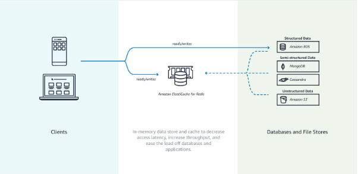
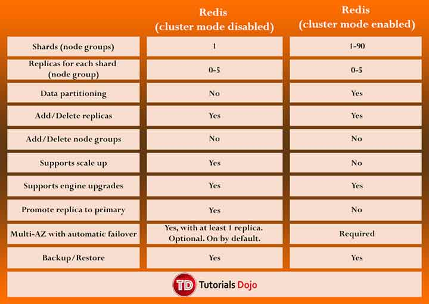
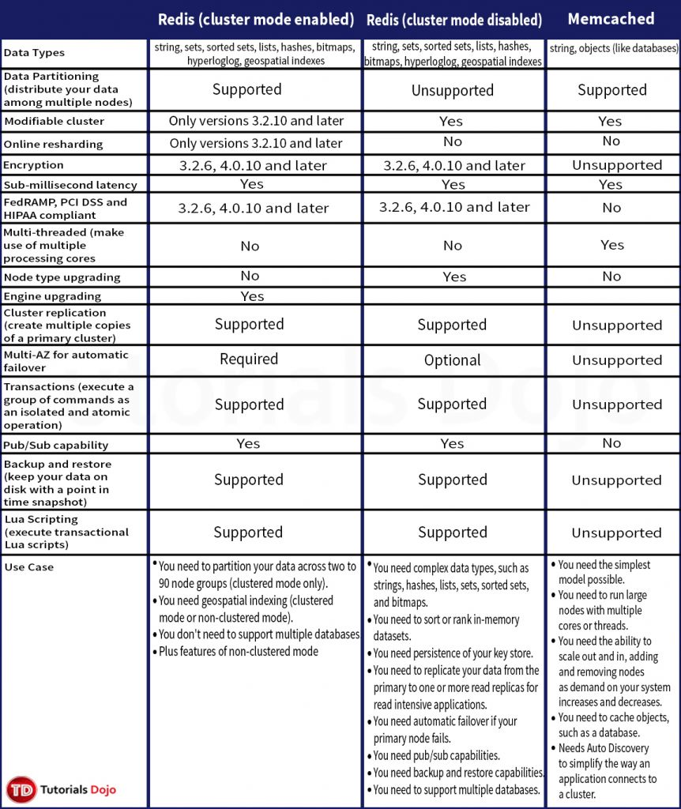

# Amazon ElastiCache

- ElastiCache is a distributed **in-memory cache** environment in the AWS Cloud.
- ElastiCache works with both the **Redis** and **Memcached** engines.

- ### Components

  - ElastiCache Nodes
    - A **node** is a fixed-size chunk of secure, network-attached RAM. A node can exist in isolation from or in some relationship to other nodes.
    - Every node within a cluster is the same instance type and runs the same cache engine. Each cache node has its own Domain Name Service (DNS) name and  port.

- If a maintenance event is scheduled for a given week, it will be initiated and completed at some point during the 60 minute maintenance window you specify.

- Elasticache can be used for storing session state.

- ElastiCache Redis

  - Existing applications that use Redis can use ElastiCache with almost no modification.
  -  Features
    - Automatic detection and recovery from cache node failures.
    - Multi-AZ with automatic failover of a failed primary cluster to a read replica in Redis clusters that support replication.
    - Redis (cluster mode enabled) supports partitioning your data across up to 250 shards.
    - Redis supports in-transit and at-rest encryption with authentication so you can build HIPAA-compliant applications.
    - Flexible Availability Zone placement of nodes and clusters for increased fault tolerance.
    - Data is persistent.
    - Can be used as a datastore.
    - Not multi-threaded.
    - Amazon ElastiCache for Redis supports self-service updates, which allows you  to apply service updates at the time of your choosing and track the  progress in real-time.
  - Cache data if:
    - It is slow or expensive to acquire when compared to cache retrieval.
    - It is accessed with sufficient frequency.
    - It is relatively static, or if rapidly changing, staleness is not a significant issue.
  - **Redis sorted sets** guarantee both uniqueness and element ordering. Each time a new element is added to the sorted set it’s reranked in real time. It’s then added  to the set in its appropriate numeric position.
  - In the **Redis publish/subscribe** paradigm, you send a message to a specific channel not knowing who, if  anyone, receives it.  Recipients of the message are those who are  subscribed to the channel.
  - **Redis hashes** are hashes that map string names to string values.
  - Components
    - Redis Shard – a grouping of one to six related nodes. A Redis (cluster mode  disabled) cluster always has one shard. A Redis (cluster mode enabled)  cluster can have 1–90 shards.
      - A *multiple node shard* implements replication by have one read/write primary node and 1–5 replica nodes.
      - If there is more than one node in a shard, the shard supports replication  with one node being the read/write primary node and the others read-only replica nodes.
    - **Redis Cluster – a logical grouping of one or more ElastiCache for Redis Shards. Data  is partitioned across the shards in a Redis (cluster mode enabled)  cluster.**
  - For improved fault tolerance, have at least two nodes in a Redis cluster and enabling **Multi-AZ with automatic failover**.
  - Replica nodes use asynchronous replication mechanisms to keep synchronized with the primary node.
  - If any primary has no replicas and the primary fails, you lose all that primary’s data.
  - You can use backup and restore to **migrate** to Redis (cluster mode enabled) and resize your Redis (cluster mode enabled).
  - Redis (cluster mode disabled) vs Redis (cluster mode enabled)

- - You can vertically scale up or scale down your sharded Redis Cluster on  demand. Amazon ElastiCache resizes your cluster by changing the node  type, while the cluster continues to stay online and serve incoming  requests. 
  - You can set up automatic snapshots or initiate manual backups, and then  seed new ElastiCache for Redis clusters. You can also export your  snapshots to an S3 bucket of your choice for disaster recovery, analysis or cross-region backup and restore.
  -  Endpoints
    - **Single Node Redis** (**cluster mode disabled**) Endpoints – used to connect to the cluster for both reads and writes.
    - **Multi-Node Redis** (**cluster mode disabled**) Endpoints – use the primary endpoint for all writes to the cluster. The read endpoint points to your read replicas.
    - **Redis** (**cluster mode enabled**) Endpoints – has a single configuration endpoint. By connecting to the  configuration endpoint, your application is able to discover the primary and read endpoints for each shard in the cluster.
  - Parameter Groups
    - **Cache parameter group** is a named collection of engine-specific parameters that you can apply to a cluster.
    - Parameters are used to control memory usage, eviction policies, item sizes, and more.
  - Redis Security
    - ElastiCache for Redis node access is restricted to applications running on  whitelisted EC2 instances. You can control access of your cluster by  using subnet groups or security groups. By default, network access to  your clusters is turned off.
    - By default, all new ElastiCache for Redis clusters are launched in a VPC  environment. Use subnet groups to grant cluster access from Amazon EC2  instances running on specific subnets.
    - ElastiCache for Redis supports TLS and in-place encryption for nodes running  specified versions of the ElastiCache for Redis engine.
    - You can use your own customer managed customer master keys (CMKs) in AWS  Key Management Service to encrypt data at rest in ElastiCache for Redis.
  - Redis Backups
    - A point-in-time copy of a Redis cluster.
    - Backups consist of all the data in a cluster plus some metadata.
  - Global Datastore
    - A new feature that provides fully managed, secure cross-region  replication. You can now write to your ElastiCache for Redis cluster in  one region and have the data available for reading in two other  cross-region replica clusters.
    - In the unlikely event of regional degradation, one of the healthy  cross-region replica clusters can be promoted to become the primary  cluster with full read/write capabilities.

- ### ElastiCache Memcached

  - #### Features

    - Automatic detection and recovery from cache node failures.
    - Automatic discovery of nodes within a cluster enabled for automatic discovery, so that no changes need to be made to your application when you add or  remove nodes.
    - Flexible Availability Zone placement of nodes and clusters.
    - **ElastiCache Auto Discovery** feature for Memcached lets your applications identify all of the nodes in a cache cluster and connect to them.
    - ElastiCache node access is restricted to applications running on whitelisted EC2  instances. You can control the instances that can access your cluster by using subnet groups or security groups.
    - It is not persistent.
    - Supports large nodes with multiple cores or threads.
    - Does not support multi-AZ failover or replication
    - Does not support snapshots

  - #### Components

    - **Memcached cluster** – a logical grouping of one or more ElastiCache Nodes. Data is partitioned across the nodes in a Memcached cluster.
      - Memcached supports up to 100 nodes per customer for each Region with each cluster having 1–20 nodes.
      - When you partition your data, use *consistent hashing*.
    - **Endpoint** – the unique address your application uses to connect to an ElastiCache node or cluster.
      - Each node in a Memcached cluster has its own endpoint. 
      - The cluster also has an endpoint called the *configuration endpoint*.
    - **ElastiCache parameter group** – a named collection of engine-specific parameters that you can apply  to a cluster. Parameters are used to control memory usage, eviction  policies, item sizes, and more.
    - ElastiCache allows you to control access to your clusters using **security groups**. By default, network access to your clusters is turned off.
    - A **subnet group** is a collection of subnets that you can designate for your clusters  running in a VPC environment. If you create a cluster in a VPC, then you must specify a *cache subnet group*. ElastiCache uses that cache subnet group to choose a subnet and IP  addresses within that subnet to associate with your cache nodes.

  - #### Mitigating Failures

    - Node Failures
      - Spread your cached data over more nodes. Because Memcached does not support  replication, a node failure will always result in some data loss from  your cluster.
    - Availability Zone Failure
      - Locate your nodes in as many Availability Zones as possible. In the unlikely  event of an AZ failure, you will lose the data cached in that AZ, not  the data cached in the other AZs.

  - ElastiCache uses DNS entries to allow client applications to locate servers  (nodes). The DNS name for a node remains constant, but the IP address of a node can change over time.

- ### Caching Strategies

  - **Lazy Loading** – a caching strategy that loads data into the cache only when necessary.
    - Only requested data is cached.
    - Node failures are not fatal.
    - There is a cache miss penalty.
    - Stale data.
  - **Write Through** – adds data or updates data in the cache whenever data is written to the database.
    - Data in the cache is never stale.
    - Write penalty vs. Read penalty. Every write involves two trips: A write to the cache and a write to the database.
    - Missing data.
    - Cache churn.
  - By adding a time to live (TTL) value to each write, we are able to enjoy  the advantages of each strategy and largely avoid cluttering up the  cache with superfluous data.

- ### Scaling ElastiCache for Memcached Clusters

  - Scaling Memcached Horizontally
    - The Memcached engine supports partitioning your data across multiple nodes. Because of this, Memcached clusters scale horizontally easily. A  Memcached cluster can have 1 to 20 nodes. To horizontally scale your  Memcached cluster, just add or remove nodes.
  - Scaling Memcached Vertically
    - When you scale your Memcached cluster up or down, you must create a new  cluster. Memcached clusters always start out empty unless your  application populates it.

- ### Monitoring

  - The service continuously monitors the health of your instances. In case a  node experiences failure or a prolonged degradation in performance,  ElastiCache will automatically restart the node and associated  processes.
  - ElastiCache provides both host-level metrics and metrics that are specific to the  cache engine software. These metrics are measured and published for each Cache node in 60-second intervals.
  - Monitor events with **ElastiCache Events**. When significant events happen on a cache cluster, including failure to add a node, success in adding a node, the modification of a security  group, and others, ElastiCache sends a notification to a specific SNS  topic.
  - Monitor costs with tags.

- ### Redis VS Memcached

  - Memcached is designed for **simplicity** while Redis offers a **rich set of features** that make it effective for a wide range of use cases. 

- ### Pricing

  - With on-demand nodes you pay only for the resources you consume by the hour without any long-term commitments.
  - With Reserved Nodes, you can make a low, one-time, up-front payment for each node you wish to reserve for a 1 or 3 year term. In return, you receive a significant discount off the ongoing hourly usage rate for the  Node(s) you reserve.
  - ElastiCache provides storage space for one snapshot free of charge for each active  ElastiCache for Redis cluster. Additional backup storage is charged.
  - EC2 Regional Data Transfer charges apply when transferring data between an  EC2 instance and an ElastiCache Node in different Availability Zones of  the same Region.

- ### Limits

| **Resource**                                                 | **Default Limit** | **Description**                                              |
| ------------------------------------------------------------ | ----------------- | ------------------------------------------------------------ |
| Nodes per region                                             | 100               | The maximum number of nodes across all clusters in a region. You can have  up to 100 reserved nodes and 100 non-reserved nodes in the same region. |
| Nodes per cluster (Memcached)                                | 20                | The maximum number of nodes in an individual Memcached cluster. |
| Nodes per cluster  per instance type (Redis cluster mode enabled) | 250               | The maximum number of nodes in an individual Redis cluster. You must also specify the instance type with your request. |
| Nodes per shard (Redis)                                      | 6                 | The maximum number of nodes in an individual Redis shard (node group). One  node is the read/write Primary. All other nodes are read-only Replicas. |
| Shards per Cluster (Redis cluster mode disabled)             | 1                 | The maximum number of shards (node groups) in a Redis (cluster mode disabled) cluster. |
| Parameter groups per region                                  | 20                | The maximum number of parameters groups you can create in a region. |
| Subnet groups per region                                     | 50                | The maximum number of subnet groups you can create in a region. |
| Subnets per subnet group                                     | 20                | The maximum number of subnets you can define for a subnet group. |

 

**Free Amazon ElastiCache Tutorials on YouTube:
** https://www.youtube.com/user/AmazonWebServices/search?query=elasticache

 

**Amazon ElastiCache-related Cheat Sheets:**

- [Redis (cluster mode enabled vs disabled) vs Memcached](../comparison-of-aws-services/redis-cluster-mode-enabled-vs-disabled-vs-memcached.md)
- [Redis Append-Only Files vs Redis Replication](../comparison-of-aws-services/redis-append-only-files-vs-redis-replication.md)

 

# Sources

 https://docs.aws.amazon.com/AmazonElastiCache/latest/red-ug/
 https://aws.amazon.com/elasticache/redis-details/
 https://docs.aws.amazon.com/AmazonElastiCache/latest/mem-ug/
 https://aws.amazon.com/elasticache/redis-vs-memcached/
 https://aws.amazon.com/elasticache/features/
 https://aws.amazon.com/elasticache/pricing/