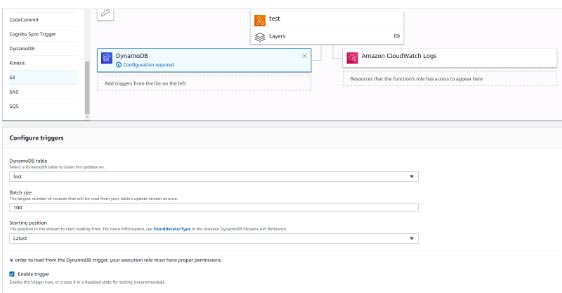
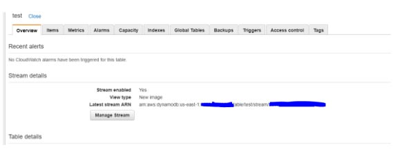
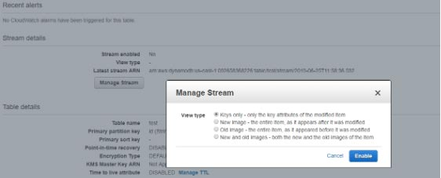

# AWS Lambda Integration with Amazon DynamoDB Streams

- Amazon DynamoDB is integrated with AWS Lambda so that you can create *triggers*, which are pieces of code that automatically respond to events in  DynamoDB Streams. With triggers, you can build applications that react  to data modifications in DynamoDB tables.

- After you enable DynamoDB Streams on a table, associate the DynamoDB table  with a Lambda function. AWS Lambda polls the stream and invokes your  Lambda function synchronously when it detects new stream records.

-  Configure the StreamSpecification you want for your DynamoDB Streams:
  - StreamEnabled (Boolean) – indicates whether DynamoDB Streams is enabled (true) or disabled (false) on the table.
  - StreamViewType (string) – when an item in the table is modified, StreamViewType determines what information is written to the stream for this table. Valid values for  StreamViewType are:
    - KEYS_ONLY – Only the key attributes of the modified items are written to the stream.
    - NEW_IMAGE – The entire item, as it appears after it was modified, is written to the stream.
    - OLD_IMAGE – The entire item, as it appeared before it was modified, is written to the stream.
    - NEW_AND_OLD_IMAGES – Both the new and the old item images of the items are written to the stream.

 

Sources:

https://docs.aws.amazon.com/amazondynamodb/latest/developerguide/Streams.Lambda.html
https://docs.aws.amazon.com/amazondynamodb/latest/APIReference/API_StreamSpecification.html