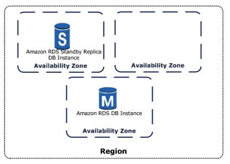
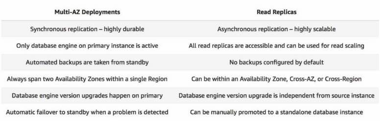

# Amazon Relational Database Service ( Amazon RDS )

- Industry-standard relational database
- RDS manages backups, software patching, automatic failure detection, and recovery.
- You can have automated backups performed when you need them, or manually  create your own backup snapshot. You can use these backups to restore a  database. 
- Supports **Aurora**, **MySQL, MariaDB, PostgreSQL, Oracle, Microsoft SQL Server**.
- You can get high availability with a primary instance and a synchronous  secondary instance that you can fail over to when problems occur. You  can also use MySQL, MariaDB, or PostgreSQL Read Replicas to increase  read scaling.
- Basic building block of RDS is the **DB instance**, which is an isolated database environment in the cloud.
- You can have up to 40 Amazon RDS DB instances.
- Each DB instance runs a **DB engine**.
- You can select the computation and memory capacity of a DB instance, determined by its **DB instance class**. If your needs change over time, you can change DB instances.
- Each DB instance has minimum and maximum storage requirements depending on the storage type and the database engine it supports.
- You can run your DB instance in several AZs, an option called a **Multi-AZ deployment**. Amazon automatically provisions and maintains a secondary standby DB  instance in a different AZ. Your primary DB instance is **synchronously** replicated across AZs to the secondary instance to provide data redundancy, failover support, eliminate I/O freezes, and minimize  latency spikes during system backups.

 

### **DB Engines**

- MySQL DB instance:
  - You’re limited to 10,000 tables if you are either using Provisioned IOPS or  General Purpose storage and the DB instance is 200 GiB or larger in  size.
  - You’re limited to 1000 tables if you are either using Standard or General  Purpose storage and the DB instance is less than 200 GiB in size.
  - MySQL database instances can be launched with up to 64 TiB of storage and provisioned I/O performance of up to 80,000 IOPS.
  - The Point-In-Time Restore and snapshot restore features of Amazon RDS for  MySQL require a crash-recoverable storage engine and are supported for  the InnoDB storage engine only.
  - InnoDB is the recommended and supported storage engine for MySQL DB instances on Amazon RDS.
  - The **database name** is the name of a database hosted in your DB instance. Databases hosted  by the same DB instance must have a unique name within that instance.
  - You can now enforce password policies in your Amazon RDS for MySQL databases using the MySQL *validate_password* plugin. This improves the security of your databases by defining minimum password length, required characters, and other rules.
- MariaDB instance:
  - The point-in-time restore and snapshot restore features of Amazon RDS for MariaDB require a crash-recoverable storage engine.
  - MariaDB database instances can be launched with up to 64 TiB of storage and provisioned I/O performance of up to 80,000 IOPS.
  - The **database name** is the name of a database hosted in your DB instance. Databases hosted  by the same DB instance must have a unique name within that instance.
- PostgreSQL instance:
  - You can improve performance with PostgreSQL on Amazon RDS when loading data into a DB instance and when using the PostgreSQL autovacuum feature.
  - PostgreSQL database instances can be launched with up to 64 TiB of storage and provisioned I/O performance of up to 80,000 IOPS.
  - The **database name** is the unique name of a database hosted in your DB instance, and is not required when creating a DB instance.
- Microsoft SQL Server instance:
  - Up to 10 can be SQL Server DB instances under the “License Included”  model. You can have 40 DB instances for SQL Server under the “BYOL”  licensing model.
  - The  maximum number of databases supported on a DB instance depends on the  instance class type and the availability mode—Single-AZ, Multi-AZ  Database Mirroring (DBM), or Multi-AZ Availability Groups (AGs). The  Microsoft SQL Server system databases don’t count toward this limit.

| **Instance Class Type**      | **Single-AZ** | **Multi-AZ with DBM** | **Multi-AZ with Always On AGs** |
| ---------------------------- | ------------- | --------------------- | ------------------------------- |
| db.*.micro to db.*.medium    | 30            | N/A                   | N/A                             |
| db.*.large                   | 30            | 30                    | 30                              |
| db.*.xlarge to db.*.16xlarge | 100           | 50                    | 75                              |
| db.*.24xlarge                | 100           | 50                    | 100                             |

- - For Multi-AZ enabled instances:
    - Use Amazon RDS DB events to monitor failovers.
    - If your application caches DNS values, set time to live (TTL) to less than 30 seconds. 
    - AWS recommends to NOT enable Simple Recover, Offline, or Read-only modes  because they turn off transaction logging, which is required for  Multi-AZ.
    - Test to determine how long it takes for your DB instance to failover.
    - Deploy your applications in all Availability Zones.
  - **Database name** is not a supported parameter.
- Oracle instance:
  - Up to 10 can be Oracle instances under the “License Included” model. You  can have 40 DB instances for Oracle under the “BYOL” licensing model.
  - **Database name** is used to set the value of ORACLE_SID, which must be supplied when connecting to the Oracle RDS instance.
  - You can now create Amazon RDS for Oracle database instances with up to 64  TiB of storage (32 TiB originally) and provisioned I/O performance of up to 80,000 IOPS.

### **DB Instance**

- Class Types

  - Standard
  - Memory Optimized
  - Burstable Performance

- You can change the CPU and memory available to a DB instance by changing  its DB instance class. Specify the following processor features to  optimize your DB instance for specific workloads or business needs:

  - Number of CPU cores
  - Threads per core

- Endpoint: rds.*<region>*.amazonaws.com

- Storage

  - Amazon RDS for MySQL, MariaDB, PostgreSQL, Oracle, and Microsoft SQL Server use Amazon EBS volumes for database and log storage.

  - Storage types :

    - General Purpose SSD (gp2)
      - MySQL, MariaDB, Oracle, and PostgreSQL DB instances: 20 GiB–64 TiB storage size
      - SQL Server for Enterprise, Standard, Web, and Express editions: 20 GiB–16 TiB storage size
    - Provisioned IOPS SSD (io1)

    | **Database Engine**                          | **Range of Provisioned IOPS**                           | **Range of Storage** |
    | -------------------------------------------- | ------------------------------------------------------- | -------------------- |
    | MariaDB                                      | 1,000–80,000                                            | 100 GiB–64 TiB       |
    | SQL Server, Enterprise and Standard editions | 1000–32,000 or 64,000 for Nitro-based m5 instance types | 20 GiB–16 TiB        |
    | SQL Server, Web and Express editions         | 1000–32,000 or 64,000 for Nitro-based m5 instance types | 100 GiB–16 TiB       |
    | MySQL                                        | 1,000–80,000                                            | 100 GiB–64 TiB       |
    | Oracle                                       | 1,000–80,000                                            | 100 GiB–64 TiB       |
    | PostgreSQL                                   | 1,000–80,000                                            | 100 GiB–64 TiB       |

    - For production OLTP use cases, use 

      Multi-AZ deployments

       for enhanced fault tolerance with Provisioned IOPS storage for fast and predictable performance.

      - You can use PIOPS storage with Read Replicas for MySQL, MariaDB or PostgreSQL.

    - Magnetic

      - Doesn’t allow you to scale storage when using the SQL Server database engine.
      - Doesn’t support elastic volumes.
      - Limited to a maximum size of 3 TiB.
      - Limited to a maximum of 1,000 IOPS.

- Instance Lifecycle – includes creating, modifying, maintaining and upgrading,  performing backups and restores, rebooting, and deleting the instance. 
  - You can’t stop an **Amazon RDS for SQL Server DB** instance in a Multi-AZ configuration.
  - You can stop a DB instance for up to seven days. If you do not manually  start your DB instance after seven days, your DB instance is  automatically started.
  - You can’t stop a DB instance that has a Read Replica, or that is a Read Replica.
  - You can’t modify a stopped DB instance.
  - To delete a DB instance, you must specify the name of the instance and whether to take a final DB snapshot of the instance.
  - You can enable **deletion protection** so that users can’t delete a database. Deletion protection is disabled by default.

### **RDS Storage Auto Scaling**

- RDS Storage Auto Scaling automatically scales storage capacity in response to growing database workloads, with zero downtime.
- Amazon RDS for MariaDB, Amazon RDS for MySQL, Amazon RDS for PostgreSQL,  Amazon RDS for SQL Server and Amazon RDS for Oracle support RDS Storage  Auto Scaling. 
- RDS Storage Auto Scaling continuously monitors actual storage consumption,  and scales capacity up automatically when actual utilization approaches  provisioned storage capacity. 
- Auto Scaling works with new and existing database instances.

### **Security**

- Security Groups

  - **DB Security Groups** – controls access to a DB instance that is not in a VPC. By default,  network access is turned off to a DB instance. This SG is for the  EC2-Classic platform.
  - **VPC Security Groups** – controls access to a DB instance inside a VPC. This SG is for the EC2-VPC platform.
  - **EC2 Security Groups** – controls access to an EC2 instance and can be used with a DB instance.

- Practices

  - Assign an individual **IAM** account to each person who manages RDS resources. Do not use AWS root credentials to manage RDS resources.
  - Grant each user the minimum set of permissions required to perform his or her duties.
  - Use IAM groups to effectively manage permissions for multiple users.
  - Rotate your IAM credentials regularly.
  - Use **security groups** to control what IP addresses or Amazon EC2 instances can connect to your databases on a DB instance.
  - Run your DB instance in an Amazon Virtual Private Cloud (**VPC**) for the greatest possible network access control.
  - Use **Secure Socket Layer (SSL) connections** with DB instances running the MySQL, MariaDB, PostgreSQL, Oracle, or Microsoft SQL Server database engines.
  - Use RDS encryption to secure your RDS instances and snapshots at rest.
  - Use the security features of your DB engine to control who can log in to the databases on a DB instance.

- A *resource owner* is the AWS account that created a resource. That is, the resource owner is the AWS account of the *principal entity* (the root account, an IAM user, or an IAM role) that authenticates the request that creates the resource. 

- A *permissions policy* describes who has access to what. Policies attached to an IAM identity are *identity-based policies* (IAM policies) and policies attached to a resource are *resource-based policies*. Amazon RDS supports only identity-based policies (IAM policies).

- MySQL and PostgreSQL both support **IAM database authentication**.

- Encryption

  - At rest and in-transit.
  - Manage keys used for encrypted DB instances using the AWS KMS. KMS encryption  keys are specific to the region that they are created in.
  - RDS encryption is currently available for all database engines and storage  types. RDS encryption is available for most DB instance classes.
  - You can’t have an encrypted Read Replica of an unencrypted DB instance or  an unencrypted Read Replica of an encrypted DB instance.
  - You can’t restore an unencrypted backup or snapshot to an encrypted DB instance.
  - You can use **SSL** from your application to encrypt a connection to a DB instance running MySQL, MariaDB, SQL Server, Oracle, or PostgreSQL.

- Amazon RDS supports the following scenarios for accessing a DB instance in a VPC:

  

| **DB Instance**                           | **Accessed By**                 |
| ----------------------------------------- | ------------------------------- |
| In a VPC                                  | An EC2 Instance in the Same VPC |
| An EC2 Instance in a Different VPC        |                                 |
| An EC2 Instance Not in a VPC              |                                 |
| A Client Application Through the Internet |                                 |
| Not in a VPC                              | An EC2 Instance in a VPC        |
| An EC2 Instance Not in a VPC              |                                 |
| A Client Application Through the Internet |                                 |

 

- Working with a DB Instance in a VPC
  - Your VPC must have **at least two subnets**. These subnets must be in two **different Availability Zones** in the region where you want to deploy your DB instance.
  - If you want your DB instance in the VPC to be publicly accessible, you must enable the VPC attributes *DNS hostnames* and *DNS resolution*.
  - Your VPC must have a DB subnet group that you create.
  - Your VPC must have a VPC security group that allows access to the DB instance.
  - The CIDR blocks in each of your subnets must be large enough to accommodate spare IP addresses for Amazon RDS to use during maintenance activities, including failover and compute scaling.
  - When an option group is assigned to a DB instance, it is linked to the  supported platform the DB instance is on, either VPC or EC2-Classic.
  - If you restore a DB instance into a different VPC or onto a different  platform, you must either assign the default option group to the DB  instance, assign an option group that is linked to that VPC or platform, or create a new option group and assign it to the DB instance.

### **Tagging**

- An RDS tag is a **name-value pair** that you define and associate with an RDS resource. The name is  referred to as the key. Supplying a value for the key is optional.
- All Amazon RDS resources can be tagged.
- Use tags to organize your AWS bill to reflect your own cost structure.
- A *tag set* can contain as many as 10 tags, or it can be empty. 

 

### **High Availability using Multi-AZ** 

- Multi-AZ deployments for **Oracle, PostgreSQL, MySQL, and MariaDB** DB instances use **Amazon’s failover technology**. **SQL Server DB** instances use **SQL Server Mirroring**.
- **Amazon RDS for SQL Server** offers **Always On Availability Groups** for the Multi-AZ configuration in all AWS Regions
- You can modify a DB instance in a Single-AZ deployment to a Multi-AZ deployment.
- The primary DB instance switches over automatically to the standby replica if any of the following conditions occur:
  - An Availability Zone outage
  - The primary DB instance fails
  - The DB instance’s server type is changed
  - The operating system of the DB instance is undergoing software patching
  - A manual failover of the DB instance was initiated using **Reboot with failover**

### **Read Replicas**

- Updates made to the source DB instance are asynchronously copied to the Read Replica. 
- You can reduce the load on your source DB instance by routing read queries from your applications to the Read Replica. 
- You can elastically scale out beyond the capacity constraints of a single DB instance for read-heavy database workloads.
- You can create a Read Replica that has a different storage type from the source DB instance.
- A source DB instance can have cross-region Read Replicas in multiple  regions. Due to the limit on the number of access control list (ACL)  entries for a VPC, cannot have more than five cross-region Read Replica  instances.
- PostgreSQL does **physical replication**. MySQL and MariaDB do **logical replication**.
- You can create a manual snapshot of a PostgreSQL Read Replica, but you  can’t enable automatic backups. You can enable automatic backups on a  MySQL or MariaDB Read Replica.
- When creating a Read Replica, there are a few things to consider.
  - Enable automatic backups on the source DB instance by setting the backup retention period to a value other than 0.
  - Automatic backups are supported only for Read Replicas running MySQL 5.6 and later.
- Oracle supports Read Replicas with Active Data Guard for customers who are using the **Bring Your Own License model with Oracle Database Enterprise Edition and have licensed the Active Data Guard Option**. This feature allows RDS Oracle customers to offload their read workload from the primary DB Instance, and also supports the scalability of read workloads over a farm of up to **five read replicas**.
- You can promote a Read Replica to become a standalone DB instance.

### **Backups and Restores**

- Your DB instance must be in the **ACTIVE state** for automated backups to occur. Automated backups and automated  snapshots don’t occur while a copy is executing in the same region for  the same DB instance.
- The first snapshot of a DB instance contains the data for the full DB  instance. Subsequent snapshots of the same DB instance are incremental.
- The default backup retention period is one day if you create the DB  instance using the RDS API or the AWS CLI, or seven days if you used the AWS Console.
- Manual snapshot limits are limited to 100 per region.
- You can copy a snapshot within the same AWS Region, you can copy a snapshot across AWS Regions, and you can copy a snapshot across AWS accounts.
- When you restore a DB instance to a point in time, the default DB parameter  and default DB security group is applied to the new DB instance.
- When you restore an Oracle DB instance to a point in time, you can specify a different Oracle DB engine, license model, and DBName to be used. 
- When you restore a SQL Server DB instance to a point in time, each database  within that instance is restored to a point in time within 1 second of  each other database within the instance.
- You can retain Amazon RDS automated backups (system snapshots and transaction logs) when you delete a database instance.
- You can export Amazon RDS or Amazon Aurora snapshots to Amazon S3 as Apache Parquet.

### **Monitoring**

- Amazon CloudWatch

- RDS Events

  - An Amazon RDS event is created when the reboot is completed.
  - Be notified when changes occur with a DB instance, DB snapshot, DB parameter group, or DB security group.
  - Uses the Amazon Simple Notification Service (SNS) to provide notification when an Amazon RDS event occurs.

- Database log files

- Using enhanced monitoring to identify operating system issues for the following:

  - MariaDB
  - Microsoft SQL Server
  - MySQL version 5.5 or later
  - Oracle
  - PostgreSQL

- Enhanced monitoring is available for all DB instance classes except for  db.m1.small. Enhanced Monitoring is available in all regions except for  AWS GovCloud (US).

- Enhance monitoring metrics include:

  - IOPS – the number of I/O operations completed each second. 
  - Latency – the elapsed time between the submission of an I/O request and its completion.
  - Throughput – the number of bytes each second that are transferred to or from disk.
  - Queue Depth – the number of I/O requests in the queue waiting to be serviced.

- CloudWatch gathers metrics about CPU utilization **from the hypervisor** for a DB instance, and Enhanced Monitoring gathers its metrics **from an agent** on the instance.

- Instance Status – indicates the health of the instance. Here are some statuses:

  

| **DB Instance Status** | **Billed**         | **Description**                                              |
| ---------------------- | ------------------ | ------------------------------------------------------------ |
| available              | Billed             | The instance is healthy and available.                       |
| backing-up             | Billed             | The instance is currently being backed up.                   |
| creating               | Not billed         | The instance is being created. The instance is inaccessible while it is being created. |
| deleting               | Not billed         | The instance is being deleted.                               |
| failed                 | Not billed         | The instance has failed and Amazon RDS can’t recover it. Perform a  point-in-time restore to the latest restorable time of the instance to  recover the data. |
| maintenance            | Billed             | Amazon RDS is applying a maintenance update to the DB instance. This status is used for instance-level maintenance that RDS schedules well in advance. |
| rebooting              | Billed             | The instance is being rebooted because of a customer request or an Amazon  RDS process that requires the rebooting of the instance. |
| starting               | Billed for storage | The DB instance is starting.                                 |
| stopped                | Billed for storage | The DB instance is stopped.                                  |
| stopping               | Billed for storage | The DB instance is being stopped.                            |
| storage-full           | Billed             | The instance has reached its storage capacity allocation. This is a  critical status, and we recommend that you fix this issue immediately.  To do so, scale up your storage by modifying the DB instance. To avoid  this situation, set Amazon CloudWatch alarms to warn you when storage  space is getting low. |

 

- RDS **Performance Insights** monitors your DB instance load so that you can analyze and troubleshoot your database performance. You can visualize the database load and  filter the load by waits, SQL statements, hosts, or users.
- CloudTrail captures all API calls for RDS as events.

### **Pricing**

- With Amazon RDS, you pay only for the RDS instances that are active.
- The data transferred for cross-region replication incurs RDS data transfer charges.
- Instances are billed for DB instance hours (per second), Storage (per GiB per  month), I/O requests (per 1 million requests per month), Provisioned  IOPS (per IOPS per month), Backup storage (per GiB per month), and Data  transfer (per GB).
  - Amazon RDS is billed in one-second increments for database instances and  attached storage. Pricing is still listed on a per-hour basis, but bills are now calculated down to the second and show usage in decimal form.  There is a 10 minute minimum charge when an instance is created,  restored or started.
- RDS purchasing options:
  - **On-Demand Instances** – Pay by the hour for the DB instance hours that you use.
  - **Reserved Instances** – Reserve a DB instance for a one-year or three-year term and receive a significant discount compared to the on-demand DB instance pricing.
- You are charged for using Enhanced Monitoring.
- Amazon RDS is now billed in one-second increments for database instances and  attached storage. Pricing is still listed on a per-hour basis, but bills are now calculated down to the second and show usage in decimal form.  There is a 10 minute minimum charge when an instance is created,  restored or started.

### **Best Practices**

- Monitor your memory, CPU, and storage usage.
- Scale up your DB instance when you are approaching storage capacity limits.
- Enable automatic backups and set the backup window to occur during the daily low in write IOPS.
- If your database workload requires more I/O than you have provisioned,  recovery after a failover or database failure will be slow. Increase the I/O capacity of a DB instance by:
  - Migrate to a DB instance class with High I/O capacity.
  - Convert from standard storage to either General Purpose or Provisioned IOPS  storage, depending on how much of an increase you need.
  - If you convert to Provisioned IOPS storage, make sure you also use a DB instance class that is optimized for Provisioned IOPS..
  - If you are already using Provisioned IOPS storage, provision additional throughput capacity.
- If your client application is caching the Domain Name Service (DNS) data  of your DB instances, set a time-to-live (TTL) value of less than 30  seconds.
- Test failover for your DB instance.

### **Limits**

- The following table lists the resources and their limits per region.

  

| **Resource**                         | **Default Limit**      |
| ------------------------------------ | ---------------------- |
| Clusters                             | 40                     |
| Cluster parameter groups             | 50                     |
| Cross-region snapshots copy requests | 5                      |
| DB Instances                         | 40                     |
| Event subscriptions                  | 20                     |
| Manual snapshots                     | 100                    |
| Manual cluster snapshots             | 100                    |
| Option groups                        | 20                     |
| Parameter groups                     | 50                     |
| Read replicas per master             | 5                      |
| Reserved instances                   | 40                     |
| Rules per DB security group          | 20                     |
| Rules per VPC security group         | 50 inbound 50 outbound |
| DB Security groups                   | 25                     |
| VPC Security groups                  | 5                      |
| Subnet groups                        | 50                     |
| Subnets per subnet group             | 20                     |
| Tags per resource                    | 50                     |
| Total storage for all DB instances   | 100 TiB                |

 

- For MySQL DB and MariaDB DB instances, the maximum provisioned storage  limit constrains the size of a table to a maximum size of 16 TB when  using InnoDB file-per-table tablespaces.

**Amazon RDS Tutorial on YouTube:**

https://youtu.be/igRfulrrYCo

**Amazon RDS-related Cheat Sheets:**

- [Amazon RDS vs DynamoDB](../comparison-of-aws-services/rds-vs-dynamodb.md)