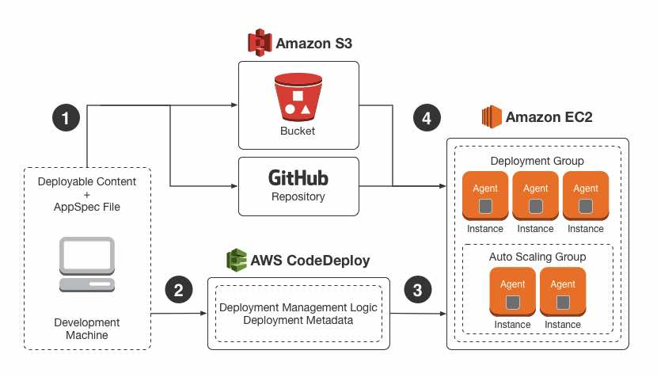
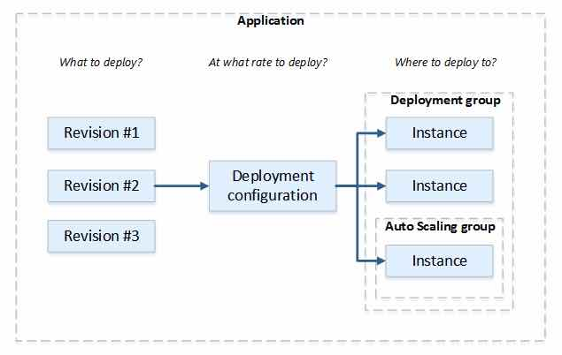
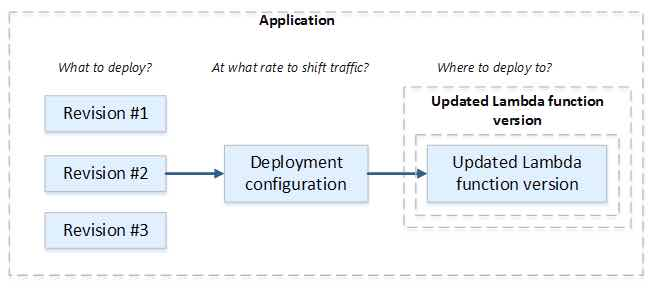
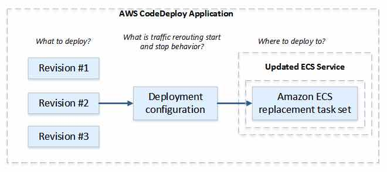
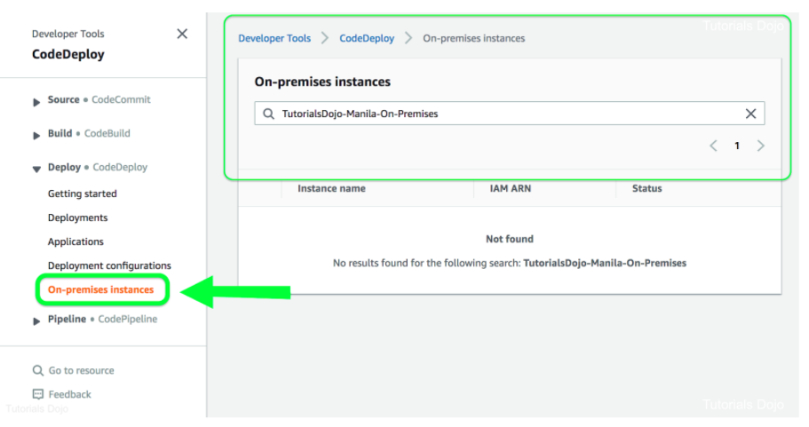

# AWS CodeDeploy

- A **fully managed deployment service** that automates software deployments to a variety of compute services  such as Amazon EC2, AWS Fargate, AWS Lambda, and your on-premises  servers.
- Concepts
  - An **Application** is a name that uniquely identifies the application you want to deploy.  CodeDeploy uses this name, which functions as a container, to ensure the correct combination of revision, deployment configuration, and  deployment group are referenced during a deployment.
  - **Compute platform** is the platform on which CodeDeploy deploys an application (EC2, ECS, Lambda, On-premises servers).
  - **Deployment configuration** is a set of deployment rules and deployment success and failure conditions used by CodeDeploy during a deployment.
  - **Deployment group** contains individually tagged instances, Amazon EC2 instances in Amazon EC2 Auto Scaling groups, or both.
    - In an Amazon ECS deployment, a deployment group specifies the Amazon ECS service, load balancer, *optional* test listener, and two target groups. It also specifies when to reroute traffic to the replacement task set and when to terminate the original  task set and ECS application after a successful deployment.
    - In an AWS Lambda deployment, a deployment group defines a set of  CodeDeploy configurations for future deployments of an AWS Lambda  function.
    - In an EC2/On-Premises deployment, a deployment group is a set of individual instances targeted for a deployment. 
      - In an in-place deployment, the instances in the deployment group are updated with the latest application revision.
      - In a blue/green deployment, traffic is rerouted from one set of instances  to another by deregistering the original instances from a load balancer  and registering a replacement set of instances that typically has the  latest application revision already installed.
  - A **Revision**
    - for an AWS Lambda deployment is a YAML- or JSON-formatted application specification file (**AppSpec file**) that specifies information about the Lambda function to deploy. The revision can be stored in Amazon S3 buckets.
    - for an Amazon ECS deployment is a YAML- or JSON-formatted file that  specifies the Amazon ECS task definition used for the deployment, a  container name and port mapping used to route traffic, and optional  Lambda functions run after deployment lifecycle events.
    - for an EC2/On-Premises deployment is an archive file that contains source  content (source code, webpages, executable files, and deployment  scripts) and an application specification file. The revision can be  stored in Amazon S3 buckets or GitHub repositories.
  - **Target revision** is the most recent version of the application revision that you have  uploaded to your repository and want to deploy to the instances in a  deployment group.
  - A deployment goes through a set of predefined phases called **deployment lifecycle events**. A deployment lifecycle event gives you an opportunity to run code as part of the deployment. 
    1. ApplicationStop
    2. DownloadBundle
    3. BeforeInstall
    4. Install
    5. AfterInstall
    6. ApplicationStart
    7. ValidateService

- - Features

    - CodeDeploy protects your application from downtime during deployments through **rolling updates** and **deployment health tracking**.

    - AWS CodeDeploy tracks and stores the recent history of your deployments.

    - CodeDeploy is platform and language agnostic.

    - CodeDeploy uses a **file and command-based install** model, which enables it to deploy any application and reuse existing setup  code. The same setup code can be used to consistently deploy and test  updates across your environment release stages for your servers or  containers.

    - CodeDeploy integrates with Amazon Auto Scaling, which allows you to scale EC2  capacity according to conditions you define such as traffic spikes.  Notifications are then sent to AWS CodeDeploy to initiate an application deployment onto new instances before they are placed behind an  Elastic Load Balancing load balancer.

    - When using AWS CodeDeploy with on-premises servers, make sure that they can connect to AWS public endpoints.

    - AWS CodeDeploy offers two types of deployments:

      - With **in-place deployments**, the application on each instance in the deployment group is stopped,  the latest application revision is installed, and the new version of the application is started and validated. Only deployments that use the  EC2/On-Premises compute platform can use in-place deployments.

        

      - With **blue/green deployments**, once the new version of your application is tested and declared ready,  CodeDeploy can shift the traffic from your old version (blue) to your  new version (green) according to your specifications.

    - **Deployment groups** are used to match configurations to specific environments, such as a  staging or production environments. An application can be deployed to  multiple deployment groups.

    - You can integrate AWS CodeDeploy with your continuous integration and  deployment systems by calling the public APIs using the AWS CLI or AWS  SDKs.

  - Application Specification Files

    - The AppSpec file is a YAML-formatted or JSON-formatted file that is used to manage each deployment as a series of lifecycle event hooks.
    - For ECS Compute platform, the file specifies
      - The name of the ECS service and the container name and port used to direct traffic to the new task set.
      - The functions to be used as validation tests.
    - For Lambda compute platform, the file specifies
      - The AWS Lambda function version to deploy.
      - The functions to be used as validation tests.
    - For EC2/On-Premises compute platform, the file is always written in YAML and is used to
      - Map the source files in your application revision to their destinations on the instance.
      - Specify custom permissions for deployed files.
      - Specify scripts to be run on each instance at various stages of the deployment process.

  - Deployments

    - You can use the CodeDeploy console or the create-deployment command to deploy the function revision specified in the AppSpec file to the deployment group.

    - You can use the CodeDeploy console or the 

      stop-deployment

       command to stop a deployment. When you attempt to stop the deployment, one of three things happens:

      - The deployment stops, and the operation returns a status of succeeded.
      - The deployment does not immediately stop, and the operation returns a  status of pending. After the pending operation is complete, subsequent  calls to stop the deployment return a status of succeeded.
      - The deployment cannot stop, and the operation returns an error.

    - With Lambda functions and EC2 instances, CodeDeploy implements **rollbacks by redeploying**, as a new deployment, a previously deployed revision.

    - With ECS services, CodeDeploy implements **rollbacks by rerouting traffic** from the replacement task set to the original task set.

    - The **CodeDeploy agent** is a software package that, when installed and configured on an  EC2/on-premises instance, makes it possible for that instance to be used in CodeDeploy deployments. The agent is not required for deployments  that use the Amazon ECS or AWS Lambda.

    - CodeDeploy monitors the health status of the instances in a deployment group. For  the overall deployment to succeed, CodeDeploy must be able to deploy to  each instance in the deployment and deployment to at least one instance  must succeed. 

    - You can specify a minimum number of healthy instances as a number of  instances or as a percentage of the total number of instances required  for the deployment to be successful.

    - CodeDeploy assigns two health status values to each instance: 

      - Revision health – based on the application revision currently installed on the instance. Values include *Current, Old* and *Unknown*.
      - Instance health – based on whether deployments to an instance have been successful. Values include *Healthy* and *Unhealthy.*

  - Blue/Green Deployments

    - EC2/On-Premises compute platform

      - You must have one or more Amazon EC2 instances with identifying Amazon EC2 tags or an Amazon EC2 Auto Scaling group.

      - Each Amazon EC2 instance must have the correct IAM instance profile attached.

      - The CodeDeploy agent must be installed and running on each instance.

      - During replacement, you can either

        - use the Amazon EC2 Auto Scaling group you specify as a template for the replacement environment; or

        - specify the instances to be counted as your replacement using EC2 instance tags, EC2 Auto Scaling group names, or both.

          

      - AWS Lambda platform

        - You must choose one of the following deployment configuration types to  specify how traffic is shifted from the original Lambda function version to the new version:

          - Canary: Traffic is shifted in two increments. You can choose from predefined canary options that specify the  percentage of traffic shifted to your updated Lambda function version in the first increment and the interval, in minutes, before the remaining  traffic is shifted in the second increment.

          - Linear: Traffic is shifted in equal increments with an equal number of minutes between each increment. You can choose from predefined linear options that specify the  percentage of traffic shifted in each increment and the number of  minutes between each increment.

          - All-at-once: All traffic is shifted from the original Lambda function to the updated Lambda function version all at once.

            

        - With Amazon ECS, production traffic shifts from your ECS service’s original task set to a replacement task set all at once.

          

  - Advantages of using Blue/Green Deployments vs In-Place Deployments

    - An application can be installed and tested in the new replacement  environment and deployed to production simply by rerouting traffic.
    - If you’re using the EC2/On-Premises compute platform, switching back to  the most recent version of an application is faster and more reliable.  Traffic can just be routed back to the original instances as long as  they have not been terminated. With an in-place deployment, versions  must be rolled back by redeploying the previous version of the  application.
    - If you’re using the EC2/On-Premises compute platform, new instances are  provisioned and contain the most up-to-date server configurations. 
    - If you’re using the AWS Lambda compute platform, you control how traffic  is shifted from your original AWS Lambda function version to your new  AWS Lambda function version.

  - Deployment Configurations

    - This is a set of rules and success and failure conditions used by CodeDeploy during a deployment.

    - For EC2/On-Premises Compute Platform

      - The deployment configuration specifies the number or percentage of  instances that must remain available at any time during a deployment.

      - You can use one of the three predefined deployment configurations provided by AWS or create a custom deployment configuration.

        

        | **Deployment Configuration**      | **Description**                                              |
        | --------------------------------- | ------------------------------------------------------------ |
        | **CodeDeployDefault.AllAtOnce**   | **In-place deployments**:Attempts to deploy an application revision to as many instances as possible at  once. The status of the overall deployment is displayed as **Succeeded** if the application revision is deployed to one or more of the instances. The status of the overall deployment is displayed as **Failed** if the application revision is not deployed to any of the instances.**Blue/green deployments**:Deployment to replacement environment: Follows the same deployment rules as  CodeDeployDefault.AllAtOnce for in-place deployments.Traffic rerouting: Routes traffic to all instances in the replacement  environment at once. Succeeds if traffic is successfully rerouted to at  least one instance. Fails after rerouting to all instances fails. |
        | **CodeDeployDefault.HalfAtATime** | **In-place deployments**:Deploys to up to half of the instances at a time (fractions rounded down). The  overall deployment succeeds if the application revision is deployed to  at least half of the instances (fractions rounded up). Otherwise, the  deployment fails.**Blue/green deployments**:Deployment to replacement environment: Follows the same deployment rules as  CodeDeployDefault.HalfAtATime for in-place deployments.Traffic rerouting: Routes traffic to up to half the instances in the  replacement environment at a time. Succeeds if rerouting to at least  half of the instances succeeds. Otherwise, fails. |
        | **CodeDeployDefault.OneAtATime**  | **In-place deployments**:Deploys the application revision to only one instance at a time.For deployment groups that contain only one instance, the overall  deployment is successful only if deployment to the single instance is  successful.For deployment groups that contain more than one instance:The overall deployment succeeds if the application revision is deployed to  all of the instances. An exception is if deployment to the last instance fails, the overall deployment still succeeds. This is because  CodeDeploy allows only one instance at a time to be taken offline with  the CodeDeployDefault.OneAtATime configuration.The overall deployment fails as soon as the application revision fails to be deployed to any but the last instance.**Blue/green deployments**:Deployment to replacement environment: Follows same deployment rules as CodeDeployDefault.OneAtATime for in-place deployments.Traffic rerouting: Routes traffic to one instance in the replacement  environment at a time. Succeeds if traffic is successfully rerouted to  all replacement instances. Fails after the very first rerouting failure. An exception is if the last instance fails to register, the overall  deployment still succeeds. |

        

      - If you don’t specify a deployment configuration, CodeDeploy uses the CodeDeployDefault.OneAtATime deployment configuration.

    - For ECS Compute Platform

      - There are three ways traffic can be shifted during a deployment:

        - **Canary**: Traffic is shifted in two increments. You can choose from predefined  canary options that specify the percentage of traffic shifted to your  updated Amazon ECS task set in the first increment and the interval, in  minutes, before the remaining traffic is shifted in the second  increment.
        - **Linear**: Traffic is shifted in equal increments with an equal number of minutes  between each increment. You can choose from predefined linear options  that specify the percentage of traffic shifted in each increment and the number of minutes between each increment.
        - **All-at-once**: All traffic is shifted from the original Amazon ECS task set to the updated Amazon ECS task set all at once.

      - You can also create your own custom canary or linear deployment configuration 

        | **Deployment Configuration**                                 | **Description**                                              |
        | ------------------------------------------------------------ | ------------------------------------------------------------ |
        | **CodeDeployDefault.ECSLinear10PercentEveryXMinutes (Values of X :1, 3)** | Shifts 10 percent of traffic every X minutes until all traffic is shifted. |
        | **CodeDeployDefault.ECSCanary10PercentXMinutes (Values of X: 5,15)** | Shifts 10 percent of traffic in the first increment. The remaining 90 percent is deployed X minutes later. |
        | **CodeDeployDefault.ECSAllAtOnce**                           | Shifts all traffic to the updated Amazon ECS container at once. |

        

      - For Lambda Compute Platform

        | **Deployment Configuration**                                 | **Description**                                              |
        | ------------------------------------------------------------ | ------------------------------------------------------------ |
        | **CodeDeployDefault.LambdaCanary10PercentXMinutes (Values of X: 5, 10, 15, 30)** | Shifts 10 percent of traffic in the first increment. The remaining 90 percent is deployed X minutes later. |
        | **CodeDeployDefault.LambdaLinear10PercentEveryXMinutes (Values of X: 1, 2, 3, 10)** | Shifts 10 percent of traffic every X minutes until all traffic is shifted. |
        | **CodeDeployDefault.LambdaAllAtOnce**                        | Shifts all traffic to the updated Lambda functions at once.  |

         

- With AWS CodeDeploy, you can also deploy your applications to your on-premises data centers.

- Monitoring
  - In CodeDeploy, you should at the minimum monitor the following items
    - Deployment events and status
    - Instance events and status
  - Tools and Services
    - Amazon CloudWatch Alarms, Events and Logs
    - AWS CloudTrail
    - Amazon SNS
    - AWS CodeDeploy console
- Pricing
  - There is no additional charge for code deployments to Amazon EC2 or AWS Lambda.
  - You are charged per on-premises instance update using AWS CodeDeploy.

 

**How do I install the CodeDeploy Agent on my EC2 Windows Instance?**

https://youtu.be/P4K3HB8TNJo

**AWS CodeDeploy-related Cheat Sheets:**

- [Elastic Beanstalk vs CloudFormation vs OpsWorks vs CodeDeploy](../comparison-of-aws-services/elastic-beanstalk-vs-cloudformation-vs-opsworks-vs-codedeploy.md)

  

Sources:

* https://aws.amazon.com/codedeploy/features/?nc=sn&loc=2
* https://docs.aws.amazon.com/codedeploy/latest/userguide/welcome.html
* https://aws.amazon.com/codedeploy/faqs/?nc=sn&loc=6