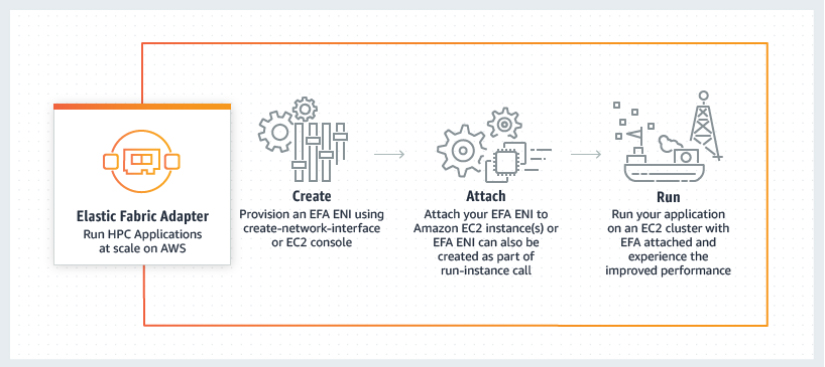
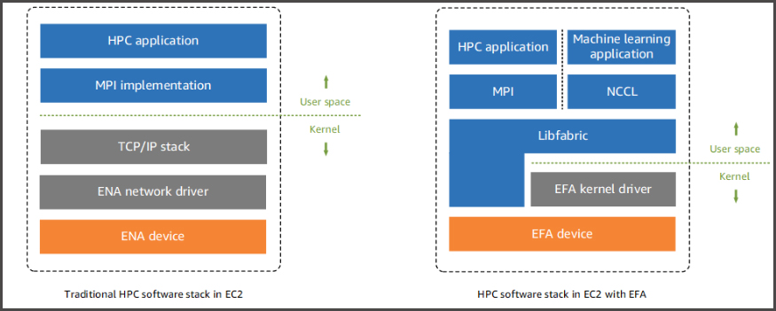

# Elastic Fabric Adapter

- An **Elastic Fabric Adapter** (EFA) is a **network device** that you can attach to your Amazon **EC2 instance** to accelerate High Performance Computing (HPC) and machine learning applications.
- An EFA is an Elastic Network Adapter (ENA) with an additional OS-bypass functionality. 
- How It Works

- EFA integrates with 
  - Libfabric 1.9.0 and it supports Open MPI 4.0.2 and Intel MPI 2019 Update 6 for HPC applications, and 
  - Nvidia Collective Communications Library (NCCL) for machine learning applications.

- With an EFA, HPC applications use Intel Message Passing Interface (MPI) or Nvidia Collective Communications Library (NCCL) to interface with the **Libfabric API**. The Libfabric API bypasses the operating system kernel and communicates directly with the EFA device to place packets on the network.
- Supported AMIs
  - Amazon Linux
  - Amazon Linux 2
  - RHEL 7.6 and RHEL 7.7
  - CentOS 7
  - Ubuntu 16.04 and Ubuntu 18.04

- Examples of HPC Applications
  - computational fluid dynamics (CFD)
  - crash simulations
  - weather simulations

- Limitations
  - You can attach only **one** EFA per instance.
  - EFA OS-bypass traffic is **limited to a single subnet**. EFA traffic cannot be sent from one subnet to another. Normal IP traffic from the EFA can be sent from one subnet to another.
  - EFA OS-bypass traffic is **not routable**. Normal IP traffic from the EFA remains routable.
  - The EFA must be a member of a security group that allows all inbound and outbound traffic to and from the security group itself.

- Pricing

EFA is available as an optional EC2 networking feature that you can enable on any supported EC2 instance at no additional cost.

**References:**

https://aws.amazon.com/hpc/efa/
https://aws.amazon.com/hpc/faqs/
https://docs.aws.amazon.com/AWSEC2/latest/UserGuide/efa.html

