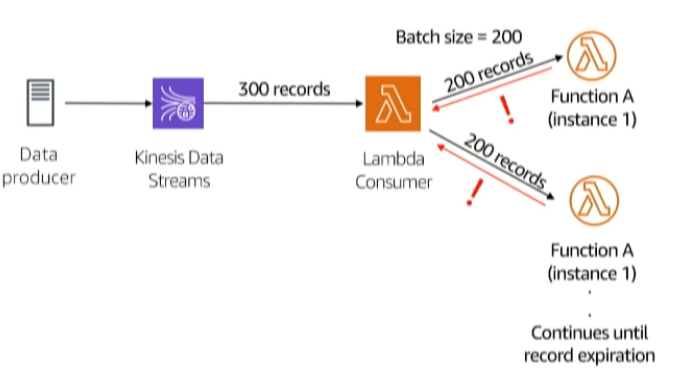
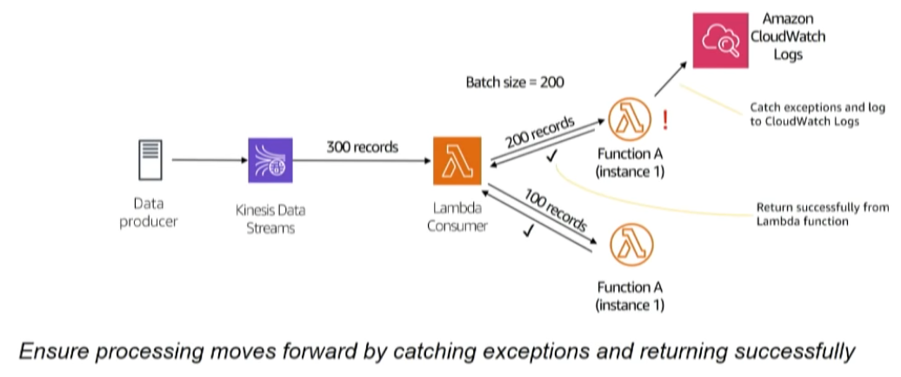
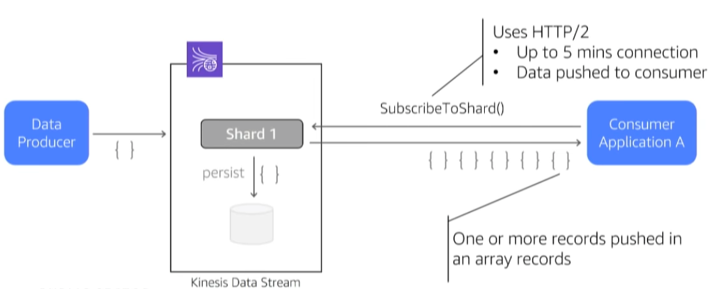
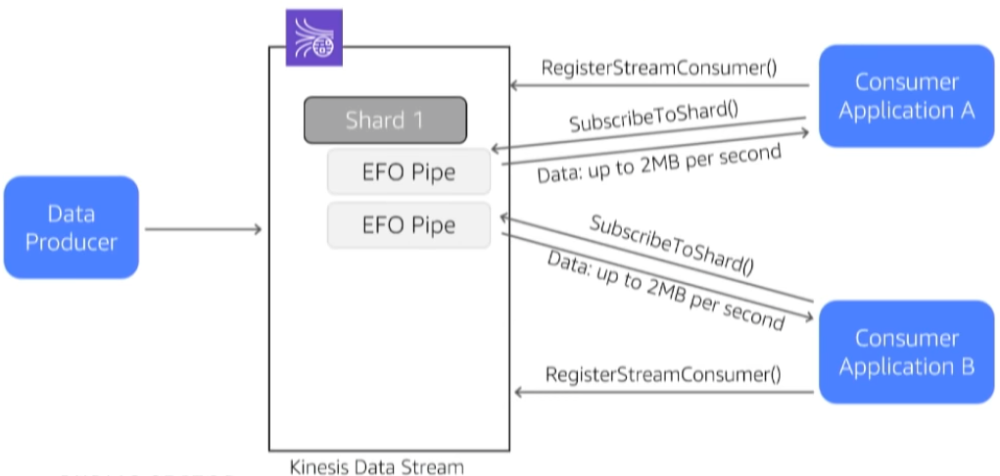

# Amazon Kinesis

## Streaming Data Overview

High volume data produced continuously from a large variety of sources at a high velocity:

* Mobile apps
* Metering records 
* Web clickstream
* IoT sensors 
* Application logs
* Smart building 

_Challenges of data streaming:_

* Difficult to setup
* Hard to achieve high availability
* Error prone and complex to manage
* Tricky to scale
* Integration requires development
* Expensive to maintain

## Introduction to Amazon Kinesis

Kinesis tools: 1. _Kinesis Data Streams_. Collect and store data streams for analytics 2. _Kinesis Data Firehose_. Load data streams into AWS data stores 3. _Kinesis Data Analytics_. Analyse data stream with SQL or Java 4. _Kinesis Video Streams_. Capture and store video streams for analytics

_Benefits of Kinesis for Streaming:_ 1. No infrastructure provisioning, no management 2. Automatically scales during re-shard operations 3. No stream consumptions costs when no new records to process 4. Hight availability and secure

_Streaming Ingestion:_ 1. AWS Toolkits/Libraries: 1. AWS SDK 2. Kinesis Producer Library 3. AWS Mobile SDK 4. Kinesis Agent 2. AWS Services Integrations: 1. AWS IoT 2. Amazon CloudWatch. Events and Logs 3. Amazon Database. Migration services 3. 3rd party Offerings: 1. LOG4J 2. Flume 3. Fluentd

_Streaming Processing:_ 1. Kinesis: 1. SQL 2. Flink 3. Kinesis Client Library + Connection Library 2. AWS Services 1. AWS Lambda 2. Amazon EMR 3. 3rd party offering: 1. Spark Streaming 2. Storm 3. MongoDB 4. Splunk 5. …

_Create Kinesis Stream_

* Kinesis stream name
  * Number of shard
  * Total stream capacity 

### Kinesis Data Stream: Standard consumers

  

Beware poison messages

* Lambda checkpoints upon the success of each batch.
* Failed batches are retried indefinitely \(until the bad record expires from the shard\) 

* Catch exceptions and log for online analysis

 

Note: Kinesis data is base64 encoded so need to decode

Kinesis Data Streams: Enhanced fan-out consumers

* Consumers do not pull. Messages are pushed to the consumer as they arrive. 
* Each consumer app gets dedicated 2MB per second egress, per shard. 

Create Kinesis Consumer

* Register consumer with the CLI
* Kinesis trigger:
  * Kinesis stream name
  * Consumer 
  * Batch size
  * Starting position 

When to use standard consumers:

* Total number of consuming appositions is low \(&lt;3\)
* Consumers are not latency-sensitive
* Minimize cost

When to use enhanced fan-out consumers:

* Multiple consumer apps for the same Kinesis Data Stream
  * Default limit of 5 registered consuming apps
  * More can be supported with a service limit increase request.
* Low-latency requirements for data processing
  * Messages are typically delivered to a consumer in less than 70 ms

## Amazon Kinesis Data Firehose

Persistence layer store options:

* Amazon S3
* Amazon Redshift
* Amazon Elasticsearch Service 
* Splunk

Kinesis Data Firehose features:

* Enrich streaming data
* Filter streaming data
* Convert streaming data
* Record format conversion. 

Note: Amazon Kinesis Data Firehose can convert data using columnar schema: Parquet or ORC.

* Source Record S3 Backup
  * Raw data backup to your DataLake
  * You can filter, enrich, and convert records while maintaining the raw incoming records

    

Serverless Data Lake Ingestion Architecture

* Kinesis Data Firehose conversion, aggregation, and persistence to you Data Lake

  

References: [High Performance Data Streaming with Amazon Kinesis: Best Practices and Common Pitfalls, Jun 20, 2019](https://www.youtube.com/watch?v=MELPeni0p04)

## Data schemas

* \[Amazon Kinesis Analytics can now discover data schemas from sample S3 objects, Posted On: Oct 4, 2017\]\(

  [https://aws.amazon.com/about-aws/whats-new/2017/10/amazon-kinesis-analytics-can-now-discover-data-schemas-from-sample-s3-objects/](https://aws.amazon.com/about-aws/whats-new/2017/10/amazon-kinesis-analytics-can-now-discover-data-schemas-from-sample-s3-objects/)\)

_How does Kinesis support Avro?_

Separately, writing lots of little Avro files, each with their own schema, for "gluing records together" in Kinesis is certainly not a very good use of storage space, so I think the Kinesis model combined with Avro isn't the right choice here. [https://stackoverflow.com/questions/50263992/how-does-kinesis-support-avro](https://stackoverflow.com/questions/50263992/how-does-kinesis-support-avro)

## Kinesis vs. Kafka

References:

* [AWS Kinesis vs Kafka comparison: Which is right for you?, POSTED on: Dec 2, 2019 by SoftKraft](https://medium.com/softkraft/aws-kinesis-vs-kafka-comparison-which-is-right-for-you-8e81374d8166)
* [Streaming Platforms: Apache Kafka vs. AWS Kinesis. POSTED on: January 21, 2019, by L. Peng](http://www.itcheerup.net/2019/01/kafka-vs-kinesis/)
* [Kinesis vs. Kafka, Posted on: May 5, 2017](http://cloudurable.com/blog/kinesis-vs-kafka/index.html)
* [Apache Kafka VS AWS Kinesis. Amit Kumar Yadav, Posted on: 2019 Jun 10. 6 min read](https://medium.com/faun/apache-kafka-vs-apache-kinesis-57a3d585ef78)
* [GitHub - ingestion\_benchmark. This project compares two ingestion technologies: Kafka and AWS Kinesis.](https://github.com/thomas-schreiter/ingestion_benchmark)

### Additional

References:

* [kinesis-kafka-connector](https://github.com/awslabs/kinesis-kafka-connector)
* [awesome-aws\#kinesis](https://github.com/donnemartin/awesome-aws#kinesis)
* [Analyzing Data Streams in Real Time with Amazon Kinesis](https://www.slideshare.net/AmazonWebServices/bda307-analyzing-data-streams-in-real-time-with-amazon-kinesis) Posted on Apr 7, 2018 
* [Kinesis vs-kafka-and-kafka-deep-dive](https://www.slideshare.net/uprush/kinesis-vskafkaandkafkadeepdive-53191809). Posted on Sep 25, 2015.
* [Analyzing Data Streams in Real Time with Amazon Kinesis: PNNL's Serverless Data Lake Ingestion](https://www.youtube.com/watch?v=dNp1emFFGbU). Posted on Jun 29, 2018
* [AWS Kinesis: Introduction and How to Upload Data](https://www.youtube.com/watch?v=k38tZ-M9o50). Posted on Jun 5, 2018
* [How Netflix Uses Kinesis Streams to Monitor Applications and Analyze Billions of Traffic Flows](https://www.youtube.com/watch?v=8tsIqfvizpU). Posted on Aug 2, 2017

