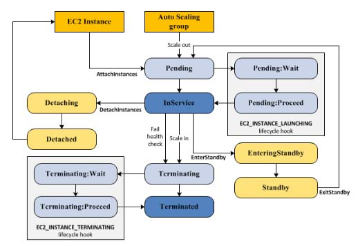
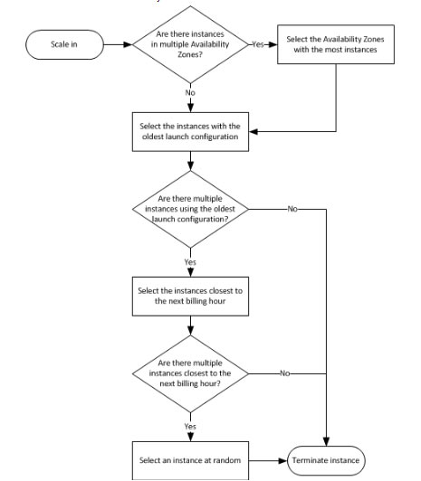

# Amazon Auto Scaling 

- Configure automatic scaling for the AWS resources quickly through a scaling plan that uses **dynamic scaling** and **predictive scaling**.
- Optimize for availability, for cost, or a balance of both.
- Scaling in means decreasing the size of a group while scaling out means increasing the size of a group.
- Useful for
  - Cyclical traffic such as high use of resources during regular business hours and low use of resources overnight
  - On and off traffic patterns, such as batch processing, testing, or periodic analysis
  - Variable traffic patterns, such as software for marketing campaigns with periods of spiky growth
- It is a region specific service. 

## Features

- Launch or terminate EC2 instances in an Auto Scaling group.
- Launch or terminate instances from an EC2 Spot Fleet request, or automatically replace instances that get interrupted for price or capacity reasons.
- Adjust the ECS service desired count up or down in response to load variations.
- Enable a DynamoDB table or a global secondary index to increase or decrease its provisioned read and write capacity to handle increases in traffic without throttling.
- Dynamically adjust the number of Aurora read replicas provisioned for an Aurora DB cluster to handle changes in active connections or workload.
- Use **Dynamic Scaling** to add and remove capacity for resources to maintain resource utilization at the specified target value.
- Use **Predictive Scaling** to forecast your future load demands by analyzing your historical records for a metric. It also allows you to schedule scaling actions that proactively add and remove resource capacity to reflect the load forecast, and control maximum capacity behavior. Only available for EC2 Auto Scaling groups.
- AWS Auto Scaling scans your environment and automatically discovers the scalable cloud resources underlying your application, so you don’t have to manually identify these resources one by one through individual service interfaces.
- You can suspend and resume any of your AWS Application Auto Scaling actions.

## Amazon EC2 Auto Scaling

- Ensuring you have the correct number of EC2 instances available to handle your application load using **Auto Scaling Groups**.
- An **Auto Scaling group** contains a collection of EC2 instances that share similar characteristics and are treated as a logical grouping for the purposes of instance scaling and management.
- You specify the minimum, maximum and desired number of instances in each Auto Scaling group.
- Key Components

| Groups                | Your EC2 instances are organized into *groups* so that they are treated as a logical unit for scaling and management. When you create a group, you can specify its minimum, maximum, and desired number of EC2 instances. |
| --------------------- | ------------------------------------------------------------ |
| Launch configurations | Your group uses a *launch configuration* as a template for its EC2 instances. When you create a launch configuration, you can specify information such as the AMI ID, instance type, key pair, security groups, and block device mapping for your instances. |
| Scaling options       | How to scale your Auto Scaling groups.                       |

- Auto Scaling Lifecycle

- - You can add a **lifecycle hook** to your Auto Scaling group to perform custom actions when instances launch or terminate.

  - Scaling Options

    - Scale to maintain current instance levels at all times
    - Manual Scaling
    - Scale based on a schedule
    - Scale based on a demand

  - Scaling Policy Types

    - **Target tracking scaling**—Increase or decrease the current capacity of the group based on a target value for a specific metric.
    - **Step scaling**—Increase or decrease the current capacity of the group based on a set of scaling adjustments, known as step adjustments, that vary based on the size of the alarm breach.
    - **Simple scaling**—Increase or decrease the current capacity of the group based on a single scaling adjustment.

  - The 

    cooldown period

     is a configurable setting that helps ensure to not launch or terminate additional instances before previous scaling activities take effect.

    - EC2 Auto Scaling supports cooldown periods when using simple scaling policies, but not when using target tracking policies, step scaling policies, or scheduled scaling.

  - Amazon EC2 Auto Scaling marks an instance as unhealthy if the instance is in a state other than *running*, the system status is *impaired*, or Elastic Load Balancing reports that the instance failed the health checks.

  - Termination of Instances

    - When you configure automatic scale in, you must decide which instances should terminate first and set up a **termination policy**. You can also use **instance protection** to prevent specific instances from being terminated during automatic scale in.
    - Default Termination Policy

- - - Custom Termination Policies
      - *OldestInstance* – Terminate the oldest instance in the group.
      - *NewestInstance* – Terminate the newest instance in the group.
      - *OldestLaunchConfiguration* – Terminate instances that have the oldest launch configuration.
      - *ClosestToNextInstanceHour* – Terminate instances that are closest to the next billing hour.

- You can create **launch templates** that specifies instance configuration information when you launch EC2 instances, and allows you to have multiple versions of a template.

- A launch configuration

   is an instance configuration template that an Auto Scaling group uses to launch EC2 instances, and you specify information for the instances.

  - You can specify your launch configuration with multiple Auto Scaling groups.
  - You can only specify one launch configuration for an Auto Scaling group at a time, and you can’t modify a launch configuration after you’ve created it.
  - When you create a VPC, by default its tenancy attribute is set to *default*. You can launch instances with a tenancy value of *dedicated* so that they run as single-tenancy instances. Otherwise, they run as shared-tenancy instances by default.
  - If you set the tenancy attribute of a VPC to *dedicated*, all instances launched in the VPC run as single-tenancy instances.
  - When you create a launch configuration, the default value for the instance placement tenancy is *null* and the instance tenancy is controlled by the tenancy attribute of the VPC.

| Launch Configuration Tenancy | VPC Tenancy = default   | VPC Tenancy = dedicated |
| ---------------------------- | ----------------------- | ----------------------- |
| not specified                | shared-tenancy instance | Dedicated Instance      |
| default                      | shared-tenancy instance | Dedicated Instance      |
| dedicated                    | Dedicated Instance      | Dedicated Instance      |

- - If you are launching the instances in your Auto Scaling group in EC2-Classic, you can link them to a VPC using *ClassicLink*.

## Application Auto Scaling

- Allows you to configure automatic scaling for the following resources:
  - Amazon ECS services
  - Spot Fleet requests
  - Amazon EMR clusters
  - AppStream 2.0 fleets
  - DynamoDB tables and global secondary indexes
  - Aurora replicas
  - Amazon SageMaker endpoint variants
  - Custom resources provided by your own applications or services.
- Features
  - **Target tracking scaling**—Scale a resource based on a target value for a specific CloudWatch metric.
  - **Step scaling**— Scale a resource based on a set of scaling adjustments that vary based on the size of the alarm breach.
  - **Scheduled scaling**—Scale a resource based on the date and time.
- Target tracking scaling
  - You can have multiple target tracking scaling policies for a scalable target, provided that each of them uses a different metric.
  - You can also optionally disable the scale-in portion of a target tracking scaling policy.
- Step scaling
  - Increase or decrease the current capacity of a scalable target based on a set of scaling adjustments, known as **step adjustments**, that vary based on the size of the alarm breach.
- Scheduled scaling
  - Scale your application in response to predictable load changes by creating *scheduled actions*, which tell Application Auto Scaling to perform scaling activities at specific times.
- The *scale out cooldown period* is the amount of time, in seconds, after a scale out activity completes before another scale out activity can start.
- The *scale in cooldown period* is the amount of time, in seconds, after a scale in activity completes before another scale in activity can start.

- You can attach one or more classic ELBs to your existing Auto Scaling Groups. The ELBs must be in the same region.
- Auto Scaling rebalances by launching new EC2 instances in the AZs that have fewer instances first, only then will it start terminating instances in AZs that had more instances

## Monitoring

- **Health checks** – identifies any instances that are unhealthy
  - Amazon EC2 status checks (default)
  - Elastic Load Balancing health checks
  - Custom health checks.
- Auto scaling does not perform health checks on instances in the ***standby*** state. Standby state can be used for performing updates/changes/troubleshooting without health checks being performed or replacement instances being launched.
- **CloudWatch metrics** – enables you to retrieve statistics about Auto Scaling-published data points as an ordered set of time-series data, known as *metrics*. You can use these metrics to verify that your system is performing as expected.
- **CloudWatch Events – Auto Scaling can submit events to CloudWatch Events when your Auto Scaling groups launch or terminate instances, or when a lifecycle action occurs.**
- **SNS notifications – Auto Scaling can send Amazon SNS notifications when your Auto Scaling groups launch or terminate instances.**
- CloudTrail logs – enables you to keep track of the calls made to the Auto Scaling API by or on behalf of your AWS account, and stores the information in log files in an S3 bucket that you specify.

- ### Security

  - Use IAM to help secure your resources by controlling who can perform AWS Auto Scaling actions.
  - By default, a brand new IAM user has NO permissions to do anything. To grant permissions to call Auto Scaling actions, you attach an IAM policy to the IAM users or groups that require the permissions it grants.

- ### Limits

  - Scaling plans: 100
  - Target tracking configurations per instruction: 10
  - Target tracking configurations per scaling plan: 500
  - Scalable targets: 500
  - Scaling policies per scalable target: 50
  - Scheduled actions per scalable target: 200
  - Step adjustments per scaling policy: 20
  - You can request a limit increase for all the limits mentioned above.



**Capacity Management Made Easy with Amazon EC2 Auto Scaling:**

**AWS Auto Scaling-related Cheat Sheets:**

- [EC2 Instance Health Check vs ELB Health Check vs Auto Scaling and Custom Health Check](https://tutorialsdojo.com/ec2-instance-health-check-vs-elb-health-check-vs-auto-scaling-and-custom-health-check/)

 

**Reference:** 

http://docs.aws.amazon.com/autoscaling/latest/userguide/as-instance-termination.html

 

