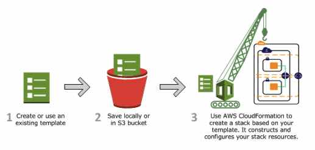

# AWS CloudFormation

- A service that gives developers and businesses an easy way to create a  collection of related AWS resources and provision them in an orderly and predictable fashion.

### **Features**

- CloudFormation allows you to model your entire infrastructure in a text file called a **template**. You can use JSON or YAML to describe what AWS resources you want to  create and configure. If you want to design visually, you can use *AWS CloudFormation Designer*.
- CloudFormation automates the provisioning and updating of your infrastructure in a safe and controlled manner. You can use **Rollback Triggers** to specify the CloudWatch alarm that CloudFormation should monitor  during the stack creation and update process. If any of the alarms are  breached, CloudFormation rolls back the entire stack operation to a  previously deployed state.
- **CloudFormation Change Sets** allow you to preview how proposed changes to a stack might impact your running resources.
- **AWS StackSets** lets you provision a common set of AWS resources across multiple  accounts and regions with a single CloudFormation template. StackSets  takes care of automatically and safely provisioning, updating, or  deleting stacks in multiple accounts and across multiple regions.
- CloudFormation enables you to build custom extensions to your stack template using AWS Lambda.

### **CloudFormation vs Elastic Beanstalk**

- Elastic Beanstalk provides an **environment** to easily **deploy and run** applications in the cloud.
- CloudFormation is a convenient **provisioning mechanism** for a broad range of AWS resources.

### **Concepts**

- Templates
  - A JSON or YAML formatted text file.
  - CloudFormation uses these templates as blueprints for building your AWS resources.
- Stacks
  - Manage related resources as a single unit.
  - All the resources in a stack are defined by the stack’s CloudFormation template.
- Change Sets
  - Before updating your stack and making changes to your resources, you can  generate a change set, which is a summary of your proposed changes.
  - Change sets allow you to see how your changes might impact your running  resources, especially for critical resources, before implementing them.

- With AWS CloudFormation and AWS CodePipeline, you can use continuous  delivery to automatically build and test changes to your CloudFormation  templates before promoting them to production stacks.

- CloudFormation artifacts

   can include a stack template file, a template configuration file, or  both. AWS CodePipeline uses these artifacts to work with CloudFormation  stacks and change sets.

  - **Stack Template File** – defines the resources that CloudFormation provisions and configures. You can use YAML or JSON-formatted templates.
  - **Template Configuration File** – a JSON-formatted text file that can specify template parameter  values, a stack policy, and tags. Use these configuration files to  specify parameter values or a stack policy for a stack.

- Through the AWS PrivateLink, you can use CloudFormation APIs inside of your  Amazon VPC and route data between your VPC and CloudFormation entirely  within the AWS network.

### **Stacks**

- If a resource cannot be created, CloudFormation rolls the stack back and  automatically deletes any resources that were created. If a resource  cannot be deleted, any remaining resources are retained until the stack can be successfully deleted.

- Stack update methods

  - Direct update
  - Creating and executing change sets

- Drift detection

   enables you to detect whether a stack’s actual configuration differs,  or has drifted, from its expected configuration. Use CloudFormation to  detect drift on an entire stack, or on individual resources within the  stack.

  - A resource is considered to have drifted if any if its actual property values differ from the expected property values.
  - A stack is considered to have drifted if one or more of its resources have drifted.

- To share information between stacks, export a stack’s output values. Other stacks that are in the same AWS account and region can import the  exported values.

- You can nest stacks.

### **Templates**

- Templates include several major sections. The Resources section is the only required section.
- **CloudFormation Designer** is a graphic tool for creating, viewing, and modifying CloudFormation  templates. You can diagram your template resources using a drag-and-drop interface, and then edit their details using the integrated JSON and  YAML editor.
- Custom resources enable you to write custom provisioning logic in templates  that CloudFormation runs anytime you create, update (if you changed the  custom resource), or delete stacks.
- Template macros enable you to perform custom processing on templates, from  simple actions like find-and-replace operations to extensive  transformations of entire templates.

### **StackSets**

- CloudFormation StackSets allow you to roll out CloudFormation stacks over multiple AWS accounts and in multiple Regions with just a couple of clicks.  StackSets is commonly used together with AWS Organizations to centrally  deploy and manage services in different accounts.
- Administrator and target accounts – An *administrator account* is the AWS account in which you create stack sets. A stack set is  managed by signing in to the AWS administrator account in which it was  created. A *target account* is the account into which you create, update, or delete one or more stacks in your stack set.
- Stack sets – A *stack set* lets you create stacks in AWS accounts across regions by using a single CloudFormation template. All the resources included in each stack are  defined by the stack set’s CloudFormation template. A stack set is a  regional resource.
- Stack instances – A *stack instance* is a reference to a stack in a target account within a region. A stack instance can exist without a stack; for example, if the stack could not be created for some reason, the stack instance shows the reason for stack creation failure. A stack instance can be associated with only one stack set.
- Stack set operations – Create stack set, update stack set, delete stacks, and delete stack set.
- Tags – You can add tags during stack set creation and update operations by specifying key and value pairs.

### **DeletionPolicy attribute**

* You can preserve or (in some cases) backup a resource when its stack is deleted. 
* You specify a  DeletionPolicy attribute for each resource that you want to control. 
* If a resource has no DeletionPolicy attribute, AWS CloudFormation deletes  the resource by default.
  * The default policy is `Snapshot` for `AWS::RDS::DBCluster` resources and for `AWS::RDS::DBInstance`                                           resources that don't specify the `DBClusterIdentifier` property.
* To keep a resource when its stack is deleted, specify `Retain` for that resource. You can use retain for any resource. 
  * For example, you can retain a nested stack, Amazon S3 bucket, or EC2 instance so that you can continue to use or modify those resources after you delete their stacks.
* For resources that support snapshots, such as `AWS::EC2::Volume`, specify `Snapshot` to have AWS CloudFormation create a snapshot before deleting the resource.                                 

### **Monitoring**

- CloudFormation is integrated with AWS CloudTrail, a service that provides a record of  actions taken by a user, role, or an AWS service in CloudFormation.  CloudTrail captures all API calls for CloudFormation as events,  including calls from the CloudFormation console and from code calls to  the CloudFormation APIs.

### **Security**

- You can use IAM with CloudFormation to control what users can do with AWS  CloudFormation, such as whether they can view stack templates, create  stacks, or delete stacks.
- A *service role* is an IAM role that allows CloudFormation to make calls to resources in a stack on your behalf. You can specify an IAM role that allows  CloudFormation to create, update, or delete your stack resources.
- You can improve the security posture of your VPC by configuring CloudFormation to use an interface VPC endpoint.

### **Pricing**

- No additional charge for CloudFormation. You pay for AWS resources created using CloudFormation in the same manner as if you created them  manually.

### **Limits**

| **Limit**                     | **Description**                                              | **Value**      |
| ----------------------------- | ------------------------------------------------------------ | -------------- |
| Resources                     | Maximum number of resources that you can declare in your CloudFormation template. | 200 resources  |
| Stacks                        | Maximum number of CloudFormation stacks that you can create. | 200 stacks     |
| StackSets                     | Maximum number of CloudFormation stack sets you can create in your administrator account. | 100 stack sets |
| Stack instances per stack set | The number of stack instances you can have per stack set     | 2000           |

 

**AWS CloudFormation Deep Dive and Recent Enhancements:**

https://youtu.be/d6SJPMdBShI

**AWS CloudFormation-related Cheat Sheets:**

- [Elastic Beanstalk vs CloudFormation vs OpsWorks vs CodeDeploy](https://tutorialsdojo.com/elastic-beanstalk-vs-cloudformation-vs-opsworks-vs-codedeploy/)

 

Sources:

* https://docs.aws.amazon.com/AWSCloudFormation/latest/UserGuide/
* https://aws.amazon.com/cloudformation/features/
* https://aws.amazon.com/cloudformation/pricing/
* https://aws.amazon.com/cloudformation/faqs/