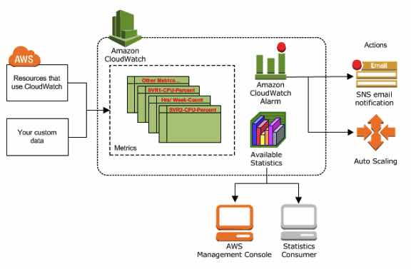
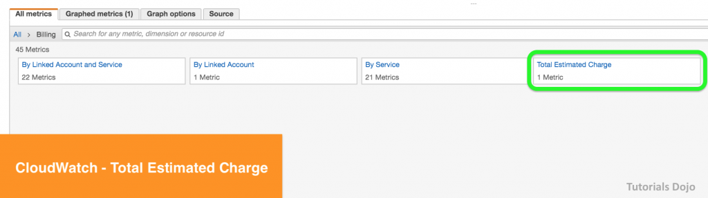
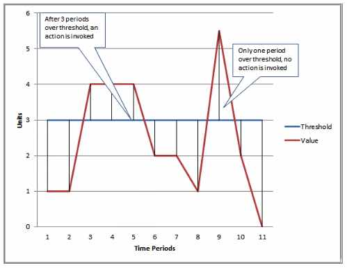

# Amazon CloudWatch

- Monitoring tool for your AWS resources and applications.
- Display metrics and create alarms that watch the metrics and send notifications or automatically make changes to the resources you are monitoring when a threshold is breached.

- CloudWatch is basically a metrics repository. An AWS service, such as Amazon EC2,  puts metrics into the repository and you retrieve statistics based on  those metrics. If you put your own custom metrics into the repository,  you can retrieve statistics on these metrics as well.

- CloudWatch does not aggregate data across regions. Therefore, metrics are completely separate between regions.

- **CloudWatch Concepts**

  - #### **Namespaces** – a container for CloudWatch metrics.

    - There is no default namespace.
    - The AWS namespaces use the following naming convention: AWS/*service*.

  - #### **Metrics** – represents a time-ordered set of data points that are published to CloudWatch.

    - Exists only in the region in which they are created.
    - Cannot be deleted, but they automatically expire after 15 months if no new data is published to them.
    - As new data points come in, data older than 15 months is dropped.
    - Each metric data point must be marked with a *timestamp*. The timestamp can be up to two weeks in the past and up to two hours  into the future. If you do not provide a timestamp, CloudWatch creates a timestamp for you based on the time the data point was received.
    - By default, several services provide free metrics for resources. You can also enable **detailed monitoring**, or publish your own application metrics.
    - **Metric math** enables you to query multiple CloudWatch metrics and use math expressions to create new time series based on these metrics.
    - **Important note for EC2 metrics:** CloudWatch does not collect memory utilization and disk space usage  metrics right from the get go. You need to install CloudWatch Agent in  your instances first to retrieve these metrics.

  - #### **Dimensions** – a name/value pair that uniquely identifies a metric.

    - You can assign up to 10 dimensions to a metric.
    - Whenever you add a unique dimension to one of your metrics, you are creating a new variation of that metric.

  - #### **Statistics** – metric data aggregations over specified periods of time.

- - - Each statistic has a unit of measure. Metric data points that specify a unit of measure are aggregated separately.
    - You can specify a unit when you create a custom metric. If you do not specify a unit, CloudWatch uses *None* as the unit. 
    - A *period* is the length of time associated with a specific CloudWatch statistic. The default value is 60 seconds.
    - CloudWatch aggregates statistics according to the period length that you specify when retrieving statistics.
    - For large datasets, you can insert a pre-aggregated dataset called a *statistic set*.

| **Statistic** | **Description**                                              |
| ------------- | ------------------------------------------------------------ |
| Minimum       | The lowest value observed during the specified period. You can use this  value to determine low volumes of activity for your application. |
| Maximum       | The highest value observed during the specified period. You can use this  value to determine high volumes of activity for your application. |
| Sum           | All values submitted for the matching metric added together. Useful for determining the total volume of a metric. |
| Average       | The value of Sum / SampleCount during the specified period. By comparing  this statistic with the Minimum and Maximum, you can determine the full  scope of a metric and how close the average use is to the Minimum and  Maximum. This comparison helps you to know when to increase or decrease  your resources as needed. |
| SampleCount   | The count (number) of data points used for the statistical calculation. |
| pNN.NN        | The value of the specified percentile. You can specify any percentile,  using up to two decimal places (for example, p95.45). Percentile  statistics are not available for metrics that include any negative  values. |

- #### **Percentiles** – indicates the relative standing of a value in a dataset. Percentiles  help you get a better understanding of the distribution of your metric  data.

- #### **Alarms** – watches a single metric over a specified time period, and performs  one or more specified actions, based on the value of the metric relative to a threshold over time.

  - You can create an alarm for monitoring CPU usage and load balancer latency, for managing instances, and for billing alarms.
  - When an alarm is on a dashboard, it turns red when it is in the *ALARM* state.
  - Alarms invoke actions for sustained state changes only.
  - Alarm States
    - **OK**—The metric or expression is within the defined threshold.
    - **ALARM**—The metric or expression is outside of the defined threshold.
    - **INSUFFICIENT_DATA**—The alarm has just started, the metric is not available, or not enough data is available for the metric to determine the alarm state.
  - You can also monitor your estimated AWS charges by using Amazon CloudWatch Alarms. However, take note that you can only track the estimated AWS charges in CloudWatch and not the  actual utilization of your resources. Remember that you can only set  coverage targets for your reserved EC2 instances in AWS Budgets or Cost  Explorer, but not in CloudWatch.

- - When you create an alarm, you specify three settings:
    - **Period** is the length of time to evaluate the metric or expression to create  each individual data point for an alarm. It is expressed in seconds.
    - **Evaluation Period** is the number of the most recent periods, or data points, to evaluate when determining alarm state.
    - **Datapoints to Alarm** is the number of data points within the evaluation period that must be  breaching to cause the alarm to go to the ALARM state. The breaching  data points do not have to be consecutive, they just must all be within  the last number of data points equal to **Evaluation Period**.

- - - For each alarm, you can specify CloudWatch to treat missing data points as any of the following:
      - *missing*—the alarm does not consider missing data points when evaluating whether to change state (default)
      - *notBreaching*—missing data points are treated as being within the threshold
      - *breaching*—missing data points are treated as breaching the threshold
      - *ignore*—the current alarm state is maintained
  - You can now create tags in CloudWatch alarms that let you define policy  controls for your AWS resources. This enables you to create resource  level policies for your alarms.
- **CloudWatch Dashboard**
  - Customizable home pages in the CloudWatch console that you can use to monitor your  resources in a single view, even those spread across different regions.
  - There is no limit on the number of CloudWatch dashboards you can create. 
  - All dashboards are **global**, not region-specific.
  - You can add, remove, resize, move, edit or rename a graph. You can metrics manually in a graph.
- **CloudWatch Events**
  - Deliver near real-time stream of system events that describe changes in AWS resources.
  - Events respond to these operational changes and take corrective action as  necessary, by sending messages to respond to the environment, activating functions, making changes, and capturing state information.
  - Concepts
    - **Events** – indicates a change in your AWS environment.
    - **Targets** – processes events.
    - **Rules** – matches incoming events and routes them to targets for processing.
- **CloudWatch Logs**
  - Features
    - Monitor logs from EC2 instances in real-time
    - Monitor CloudTrail logged events
    - By default, logs are kept indefinitely and never expire
    - Archive log data
    - Log Route 53 DNS queries
  - **CloudWatch Logs Insights** enables you to interactively search and analyze your log data in CloudWatch Logs using queries.
  - **CloudWatch Vended logs** are logs that are natively published by AWS services on behalf of the customer. **VPC Flow logs** is the first Vended log type that will benefit from this tiered model.
  - After the CloudWatch Logs agent begins publishing log data to Amazon  CloudWatch, you can search and filter the log data by creating one or  more metric filters. **Metric filters** define the terms and patterns to look for in log data as it is sent to CloudWatch Logs.
  - Filters **do not** retroactively filter data. Filters only publish the metric data points  for events that happen after the filter was created. Filtered results  return the first 50 lines, which will not be displayed if the timestamp  on the filtered results is earlier than the metric creation time.
  - Metric Filter Concepts
    - filter pattern – you use the pattern to specify what to look for in the log file.
    - metric name – the name of the CloudWatch metric to which the monitored log information should be published.
    - metric namespace – the destination namespace of the new CloudWatch metric.
    - metric value – the numerical value to publish to the metric each time a matching log is found.
    - default value – the value reported to the metric filter during a period when no matching logs are found. By setting this to 0, you ensure that data is  reported during every period.
  - 
- **CloudWatch Agent**
  - Collect more logs and system-level metrics from EC2 instances and your on-premises servers.
  - Needs to be installed.
- **Authentication and Access Control**
  - Use IAM users or roles for authenticating who can access
  - Use Dashboard Permissions, IAM identity-based policies, and service-linked roles for managing access control.
  - A **permissions policy** describes who has access to what.
    - Identity-Based Policies
    - Resource-Based Policies
  - There are no CloudWatch Amazon Resource Names (ARNs) for you to use in an IAM policy. Use an * (asterisk) instead as the resource when writing a  policy to control access to CloudWatch actions.
- **Pricing**
  - You are charged for the number of metrics you have per month
  - You are charged per 1000 metrics requested using CloudWatch API calls
  - You are charged per dashboard per month
  - You are charged per alarm metric (Standard Resolution and High Resolution)
  - You are charged per GB of collected, archived and analyzed log data
  - There is no Data Transfer IN charge, only Data Transfer Out.
  - You are charged per million custom events and per million cross-account events
  - Logs Insights is priced per query and charges based on the amount of ingested log data scanned by the query. 
- **Limits**

| **Resource**                   | **Default Limit**                                            |
| ------------------------------ | ------------------------------------------------------------ |
| Actions                        | 5/alarm. This limit cannot be changed.                       |
| Alarms                         | 10/month/customer for free. 5000 per region per account.     |
| API requests                   | 1,000,000/month/customer for free.                           |
| Custom metrics                 | No limit.                                                    |
| Dashboards                     | Up to 1000 dashboards per account.Up to 100 metrics per dashboard widget.Up to 500 metrics per dashboard, across all widgets.These limits cannot be changed. |
| Dimensions                     | 10/metric. This limit cannot be changed.                     |
| Amazon SNS email notifications | 1,000/month/customer for free.                               |

 

**Collect Metrics and Logs from Amazon EC2 instances with the CloudWatch Agent:**

**Amazon CloudWatch-related Cheat Sheets:**

- [CloudWatch Agent vs SSM Agent vs Custom Daemon Scripts](https://tutorialsdojo.com/cloudwatch-agent-vs-ssm-agent-vs-custom-daemon-scripts/)
- [AWS CloudTrail vs Amazon CloudWatch](https://tutorialsdojo.com/aws-cloudtrail-vs-amazon-cloudwatch/)

 Sources:
 https://docs.aws.amazon.com/AmazonCloudWatch/latest/monitoring
 https://aws.amazon.com/cloudwatch/features/
 https://aws.amazon.com/cloudwatch/pricing/
 https://aws.amazon.com/cloudwatch/faqs/