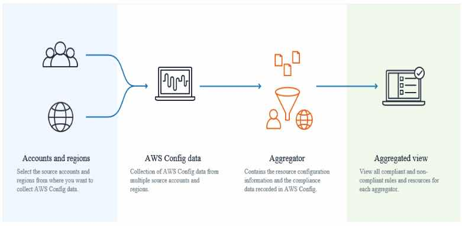

# AWS Config

- A fully managed service that provides you with an AWS resource inventory, configuration history, and configuration change notifications to enable security and governance.

### **Features**

- Multi-account, multi-region data aggregation gives you an enterprise-wide view of your ***Config rule\*** compliance status, and you can associate your AWS organization to quickly add your accounts.
- Provides you pre-built rules to evaluate your AWS resource configurations and configuration changes, or create your own custom rules in AWS Lambda that define your internal best practices and guidelines for resource configurations.
- **Config records** details of changes to your AWS resources to provide you with a  configuration history, and automatically deliver it to an S3 bucket you  specify.
- Receive a notification whenever a resource is created, modified, or deleted.
- Config enables you to record software configuration changes within your EC2  instances and servers running on-premises, as well as servers and  Virtual Machines in environments provided by other cloud providers. You  gain visibility into:
  - operating system configurations
  - system-level updates
  - installed applications
  - network configuration
- Config can provide you with a **configuration snapshot** – a point-in-time capture of all your resources and their configurations. 
- Config discovers, maps, and tracks AWS resource relationships in your account. 
   Ex. EC2 instances and associated security groups

### **Concepts**

- **Configuration History**
- - A collection of the configuration items for a given resource over any  time period, containing information such as when the resource was first  created, how the resource has been configured over the last month, etc.
  - Config automatically delivers a configuration history file for each resource  type that is being recorded to an S3 bucket that you specify.
  - A configuration history file is sent every six hours for each resource type that Config records.
- Configuration item
  - A record of the configuration of a resource in your AWS account. Config  creates a configuration item whenever it detects a change to a resource  type that it is recording.
  - The components of a configuration item include metadata, attributes, relationships, current configuration, and related events.
- **Configuration Recorder**
- - Stores the configurations of the supported resources in your account as configuration items.
  - By default, the configuration recorder records all supported resources in  the region where Config is running. You can create a customized  configuration recorder that records only the resource types that you  specify.
  - You can also have Config record supported types of *global resources* which are IAM users, groups, roles, and customer managed policies.
- **Configuration Snapshot**
- - A complete picture of the resources that are being recorded and their configurations.
  - Stored in an S3 bucket that you specify.
- **Configuration Stream**
- - An automatically updated list of all configuration items for the resources that Config is recording.
  - Helpful for observing configuration changes as they occur so that you can spot  potential problems, generating notifications if certain resources are  changed, or updating external systems that need to reflect the  configuration of your AWS resources.
- **Configuration Item**
- - The configuration of a resource at a given point-in-time. A CI consists of 5 sections:
    - Basic information about the resource that is common across different resource types.
    - Configuration data specific to the resource.
    - Map of relationships with other resources.
    - CloudTrail event IDs that are related to this state.
    - Metadata that helps you identify information about the CI, such as the version of this CI, and when this CI was captured.
- **Resource Relationship**
- - Config discovers AWS resources in your account and then creates a map of relationships between AWS resources.
- Config rule
  - Represents your desired configuration settings for specific AWS resources or for an entire AWS account.
  - Provides customizable, predefined rules. If a resource violates a rule, Config  flags the resource and the rule as noncompliant, and notifies you  through Amazon SNS.
  - Evaluates your resources either **in response to configuration changes** or **periodically**.

- Config deletes data older than your specified retention period. The default period is 7 years.
- Multi-Account Multi-Region Data Aggregation
  - An aggregator collects configuration and compliance data from the following:
    - Multiple accounts and multiple regions.
    - Single account and multiple regions.
    - An organization in AWS Organizations and all the accounts in that organization.

### **Monitoring**

- Use Amazon SNS to send you notifications every time a supported AWS  resource is created, updated, or otherwise modified as a result of user  API activity.
- Use Amazon CloudWatch Events to detect and react to changes in the status of AWS Config events.
- Use AWS CloudTrail to capture API calls to Config.

### **Security**

- Use IAM to create individual users for anyone who needs access to Config and grant different permissions to each IAM user.

### **Compliances**

- ISO
- PCI DSS
- HIPAA

### **Pricing**

- You are charged based on the number of configuration items recorded and on  the number of AWS Config rules evaluations recorded, instead of the  number of active rules in your account per region.. You are charged only once for recording the configuration item.

### **Limits**

- Max number of AWS Config rules per region in your account is 150.
- You can choose a retention period between a minimum of 30 days and a maximum of 7 years (2557 days).

 

Sources:
 https://docs.aws.amazon.com/config/latest/developerguide
 https://aws.amazon.com/config/features/
 https://aws.amazon.com/config/pricing/
 https://aws.amazon.com/config/faq/