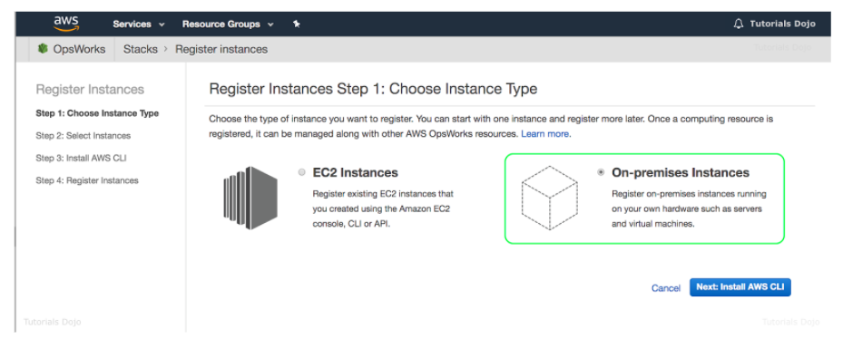
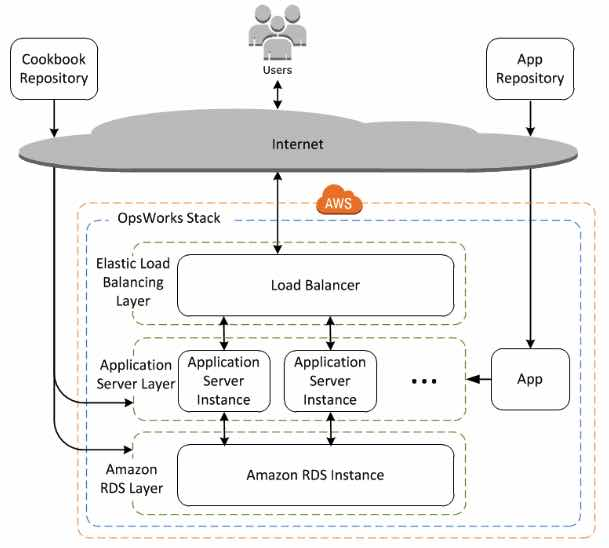

# AWS OpsWorks

- A configuration management service that helps you configure and operate applications in a cloud enterprise by using **Puppet** or **Chef**.
- AWS OpsWorks Stacks and AWS OpsWorks for Chef Automate (1 and 2) let you use Chef cookbooks and solutions for configuration management, while OpsWorks for Puppet Enterprise lets you configure a Puppet Enterprise  master server in AWS.
- Limits
  - Configuration management servers per region: 5
  - Automated backups per configuration management server: 30
  - Manual backups per configuration management server: 10
- With AWS OpsWorks, you can automate how nodes are configured, deployed, and  managed, whether they are Amazon EC2 instances or on-premises devices: 

### **OpsWorks for Puppet Enterprise**

- Provides a fully-managed Puppet master, a suite of automation tools that enable  you to inspect, deliver, operate, and future-proof your applications,  and access to a user interface that lets you view information about your nodes and Puppet activities.
- Does not support all regions.
- Uses puppet-agent software.
- Features
  - AWS manages the Puppet master server running on an EC2 instance. You retain control over the underlying resources running your Puppet master.
  - You can choose the weekly maintenance window during which OpsWorks for Puppet Enterprise will automatically install updates.
  - Monitors the health of your Puppet master during update windows and automatically rolls back changes if issues are detected.
  - You can configure automatic backups for your Puppet master and store them in an S3 bucket in your account.
  - You can register new nodes to your Puppet master by inserting a user-data script, provided in the *OpsWorks for Puppet Enterprise StarterKit*, into your Auto Scaling groups.
  - Puppet uses SSL and a certification approval process when communicating to  ensure that the Puppet master responds only to requests made by trusted  users.
- Deleting a server also deletes its events, logs, and any modules that were  stored on the server. Supporting resources are also deleted, along with  all automated backups.
- Pricing
  - You are charged based on the number of nodes (servers running the Puppet  agent) connected to your Puppet master and the time those nodes are  running on an hourly rate, and you also pay for the underlying EC2  instance running your Puppet master.

### **OpsWorks for Chef Automate**

- Lets you create AWS-managed Chef servers that include Chef Automate premium  features, and use the Chef DK and other Chef tooling to manage them.
- AWS OpsWorks for Chef Automate supports Chef Automate 2.
- Uses chef-client.
- **Features**
  - You can use Chef to manage both Amazon EC2 instances and on-premises servers running Linux or Windows.
  - You receive the full Chef Automate platform which includes premium features that you can use with Chef server, like Chef Workflow, Chef Visibility, and Chef Compliance.
  - You provision a managed Chef server running on an EC2 instance in your  account. You retain control over the underlying resources running your  Chef server and you can use Knife to SSH into your Chef server instance  at any time.
  - You can set a weekly maintenance window during which OpsWorks for Chef Automate will automatically install updates.
  - You can configure automatic backups for your Chef server and is stored in an S3 bucket.
  - You can register new nodes to your Chef server by inserting user-data code  snippets provided by OpsWorks for Chef Automate into your Auto Scaling  groups.
  - Chef uses SSL to ensure that the Chef server responds only to requests made  by trusted users. The Chef server and Chef client use bidirectional  validation of identity when communicating with each other.
- Deleting a server also deletes its events, logs, and any cookbooks that were  stored on the server. Supporting resources are deleted also, along with  all automated backups.
- **Pricing**
  - You are charged based on the number of nodes connected to your Chef server  and the time those nodes are running, and you also pay for the  underlying EC2 instance running your Chef server.

### **OpsWorks Stacks**

- Provides a simple and flexible way to create and manage stacks and applications.
- **Stacks** are group of AWS resources that constitute an full-stack application. By default, you can create up to 40 Stacks, and each stack can hold up to 40 layers, 40 instances, and 40 apps.
- You can create stacks that help you manage cloud resources in specialized groups called **layers**. A layer represents a set of EC2 instances that serve a particular  purpose, such as serving applications or hosting a database server. Layers depend on Chef recipes to handle tasks such as installing packages on instances, deploying apps, and running scripts.

- OpsWorks Stacks does NOT require or create Chef servers.

- **Features**

  - You can deploy EC2 instances from template configurations, including EBS volume creation.
  - You can configure the software on your instances on-demand or automatically based on lifecycle events, from bootstrapping the base OS image into a  working server to modifying running services to reflect changes.
  - OpsWorks Stacks can auto heal your stack. If an instance fails in your stack, OpsWorks Stacks can replace it with a new one.
  - You can adapt the number of running instances to match your load, with time-based or load-based auto scaling. 
  - You can use OpsWorks Stacks to configure and manage both Linux and Windows EC2 instances.
  - You can use AWS OpsWorks Stacks to deploy, manage, and scale your  application on any Linux server such as EC2 instances or servers running in your own data center.

- **Instance Types**

  - **24/7 instances** are started manually and run until you stop them.

  - **Time-based instances** are run by OpsWorks Stacks on a specified daily and weekly schedule.  They allow your stack to automatically adjust the number of instances to accommodate predictable usage patterns.

  - Load-based instances

     are automatically started and stopped by OpsWorks Stacks, based on  specified load metrics, such as CPU utilization. They allow your stack  to automatically adjust the number of instances to accommodate  variations in incoming traffic. 

    - Load-based instances are available only for Linux-based stacks.

- **Lifecycle Events**

  - You can run recipes manually, but OpsWorks Stacks also lets you automate  the process by supporting a set of five lifecycle events:
    - **Setup** occurs on a new instance after it successfully boots.
    - **Configure** occurs on all of the stack’s instances when an instance enters or leaves the online state.
    - **Deploy** occurs when you deploy an app.
    - **Undeploy** occurs when you delete an app.
    - **Shutdown** occurs when you stop an instance.

- **Monitoring**

  - OpsWorks Stacks sends all of your resource metrics to CloudWatch.
  - Logs are available for each action performed on your instances.
  - CloudTrail logs all API calls made to OpsWorks.

- **Security**

  - Grant IAM users access to specific stacks, making management of multi-user environments easier.
  - You can also set user-specific permissions for actions on each stack,  allowing you to decide who can deploy new application versions or create new resources.
  - Each EC2 instance has one or more associated *security groups* that govern the instance’s network traffic. A security group has one or more rules, each of which specifies a particular category of allowed  traffic.

- **Pricing**

  - You pay for AWS resources created using OpsWorks Stacks in the same manner as if you created them manually.

 

**How do I troubleshoot issues deleting instances when using AWS OpsWorks Stacks?**

https://youtu.be/LgncEGEf7d0

**AWS OpsWorks-related Cheat Sheets:**

- [Elastic Beanstalk vs CloudFormation vs OpsWorks vs CodeDeploy](../comparison-of-aws-services/elastic-beanstalk-vs-cloudformation-vs-opsworks-vs-codedeploy.md)

 

Sources:

* https://aws.amazon.com/opsworks/chefautomate/features
* https://aws.amazon.com/opsworks/chefautomate/pricing
* https://aws.amazon.com/opsworks/chefautomate/faqs
* https://aws.amazon.com/opsworks/puppetenterprise/feature
* https://aws.amazon.com/opsworks/puppetenterprise/pricing
* https://aws.amazon.com/opsworks/puppetenterprise/faqs
* https://aws.amazon.com/opsworks/stacks/features
* https://aws.amazon.com/opsworks/stacks/pricing
* https://aws.amazon.com/opsworks/stacks/faqs