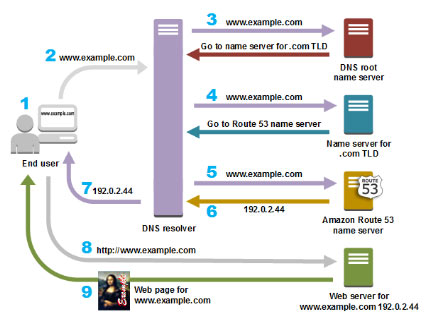

# Amazon Route 53

- A highly available and scalable Domain Name System (DNS) web service used for domain registration, DNS routing, and health checking.

### **Key Features**

- Resolver 
- Traffic flow
- Latency based routing
- Geo DNS
- Private DNS for Amazon VPC
- DNS Failover
- Health Checks and Monitoring
- Domain Registration
- CloudFront and S3 Zone Apex Support
- Amazon ELB Integration

### **Domain Registration**

- Choose a domain name and confirm that it’s available, then register the domain name with Route 53. The service automatically makes itself the DNS  service for the domain by doing the following:
  - Creates a hosted zone that has the same name as your domain.
  - Assigns a set of four name servers to the hosted zone. When someone uses a  browser to access your website, such as www.example.com, these name  servers tell the browser where to find your resources, such as a web  server or an S3 bucket. 
  - Gets the name servers from the hosted zone and adds them to the domain.
- If you already registered a domain name with another registrar, you can choose to transfer the domain registration to Route 53.

### **Routing Internet Traffic to your Website or Web Application**

- Use the Route 53 console to register a domain name and configure Route 53  to route internet traffic to your website or web application.
- After you register your domain name, Route 53 automatically creates a **public hosted zone** that has the same name as the domain.
- To route traffic to your resources, you create **records**, also known as *resource record sets*, in your hosted zone. 
- You can create special Route 53 records, called **alias records**, that route traffic to S3 buckets, CloudFront distributions, and other AWS resources.
- Each record includes information about how you want to route traffic for your domain, such as:
  - Name – name of the record corresponds with the domain name or subdomain name that you want Route 53 to route traffic for.
  - Type – determines the type of resource that you want traffic to be routed to.
  - Value
- How traffic is routed

 **Route 53 Health Checks**

- - How it works 

- - Create a health check and specify values that define how you want the health check to work, such as:
    - The IP address or domain name of the endpoint that you want Route 53 to monitor. 
    - The protocol that you want Route 53 to use to perform the check: HTTP, HTTPS, or TCP.
    - The **request interval** you want Route 53 to send a request to the endpoint.
    - How many consecutive times the endpoint must fail to respond to requests before Route 53 considers it unhealthy. This is the **failure threshold**.
  - You can configure a health check to check the health of one or more other health checks.
  - You can configure a health check to check the status of a CloudWatch alarm  so that you can be notified on the basis of a broad range of criteria.

### **Know the following Concepts**

- Domain Registration Concepts – domain name, domain registrar, domain registry, domain reseller, top-level domain
- DNS Concepts 
  - **Alias record** – a type of record that you can create to route traffic to AWS resources.
  - DNS query
  - DNS resolver
  - Domain Name System (DNS)
  - Private DNS
  - **Hosted zone** – a container for records, which includes information about how to route traffic for a domain and all of its subdomains.
  - **Name servers** – servers in the DNS that help to translate domain names into the IP  addresses that computers use to communicate with one another.
  - **Record** (DNS record) – an object in a hosted zone that you use to define how you want to route traffic for the domain or a subdomain.
  - **Routing policy**
  - **Subdomain**
  - Time to live (TTL)
- Health Checking Concepts
  - **DNS failover** – a method for routing traffic away from unhealthy resources and to healthy resources.
  - endpoint
  - health check

### **Routing Policies**

- **Simple routing policy** – route internet traffic to a single resource that performs a given  function for your domain. You can’t create multiple records that have  the same name and type, but you can specify multiple values in the same  record, such as multiple IP addresses.
- **Failover routing policy** – use when you want to configure active-passive failover.
- **Geolocation routing policy** – use when you want to route internet traffic to your resources based on the location of your users.
- **Geoproximity routing policy** – use when you want to route traffic based on the location of your  resources and, optionally, shift traffic from resources in one location  to resources in another.
  - You can also optionally choose to route more traffic or less to a given resource by specifying a value, known as a ***bias\***. A bias expands or shrinks the size of the geographic region from which traffic is routed to a resource.
  - The effect of changing the bias for your resources depends on a number of factors, including the following:
    - The number of resources that you have.
    - How close the resources are to one another.
    - The number of users that you have near the border area between geographic regions.
- **Latency routing policy** – use when you have resources in multiple locations and you want to  route traffic to the resource that provides the best latency.
- **Multivalue answer routing policy** – use when you want Route 53 to respond to DNS queries with up to eight healthy records selected at random.
- **Weighted routing policy** – use to route traffic to multiple resources in proportions that you specify.
- When you register a domain or transfer domain registration to Route 53, it  configures the domain to renew automatically. The automatic renewal  period is typically one year, although the registries for some top-level domains (TLDs) have longer renewal periods. 
- When you register a domain with Route 53, it creates a hosted zone that has  the same name as the domain, assigns four name servers to the hosted  zone, and updates the domain to use those name servers.

### **Hosted Zones**

- Route 53 automatically creates the Name Server (NS) and Start of Authority (SOA) records for the hosted zones.
- Route 53 creates a set of 4 unique name servers (a delegation set) within each hosted zone.
- Public hosted zone – route internet traffic to your resources
- Private hosted zone – route traffic within an Amazon VPC. You create a private  hosted zone, and specify the VPCs that you want to associate with the  hosted zone.
  - To use private hosted zones, you must set the following VPC settings to true:
    - *enableDnsHostnames*
    - enableDnsSupport
  - In a private hosted zone, you can associate Route 53 health checks only with weighted and failover records.
  - You can use the following routing policies when you create records in a private hosted zone:
    - Simple
    - Failover
    - Multivalue answer
    - Weighted

### **Records**

- Create records in a hosted zone. Records define where you want to route  traffic for each domain name or subdomain name. The name of each record  in a hosted zone must end with the name of the hosted zone.
- Alias Records
  - Route 53 **alias records** provide a Route 53–specific extension to DNS functionality. Alias  records let you route traffic to selected AWS resources. They also let  you route traffic from one record in a hosted zone to another record.
  - You can create an alias record at the top node of a DNS namespace, also known as the zone apex.
- CNAME Record
  - You cannot create an alias record at the top node of a DNS namespace using a CNAME record.
- Alias records vs CNAME records

| **CNAME Records**                                            | **Alias Records**                                            |
| ------------------------------------------------------------ | ------------------------------------------------------------ |
| You can’t create a CNAME record at the zone apex.            | You can create an alias record at the zone apex. Alias records must have the same type as the record you’re routing traffic to. |
| Route 53 charges for CNAME queries.                          | Route 53 doesn’t charge for alias queries to AWS resources.  |
| A CNAME record redirects queries for a domain name regardless of record type. | Route 53 responds to a DNS query only when the name and type of the alias record matches the name and type in the query. |
| A CNAME record can point to any DNS record that is hosted anywhere. | An alias record can only point to selected AWS resources or to another  record in the hosted zone that you’re creating the alias record in. |
| A CNAME record appears as a CNAME record in response to dig or Name Server (NS) lookup queries. | An alias record appears as the record type that you specified when you created the record, such as A or AAAA. |

### **Supported DNS Record Types**

- **A Record Type** – the value for an A record is an IPv4 address in dotted decimal notation.
- **AAAA Record Type** – the value for a AAAA record is an IPv6 address in colon-separated hexadecimal format.
- CAA Record Type – lets you specify which certificate authorities (CAs) are  allowed to issue certificates for a domain or subdomain.
- **CNAME Record Type** – a CNAME Value element is the same format as a domain name.
- **MX Record Type** – each value for an MX record actually contains two values, *priority* and *domain name*.
- NAPTR Record Type
- **NS Record Type** – identifies the name servers for the hosted zone. The value for an NS record is the domain name of a name server.
- PTR Record Type – is the same format as a domain name.
- **SOA Record Type** – provides information about a domain and the corresponding Amazon Route 53 hosted zone.
- SPF Record Type
- SRV Record Type
- TXT Record Type

### **DNS Domain Name Format**

- Names of domains, hosted zones, and records consist of a series of labels  separated by dots, which can be up to 63 bytes long. The total length of a domain name cannot exceed 255 bytes, including the dots.
- You can create hosted zones and records that include * in the name.

### **Using Traffic Flow to Route DNS Traffic**

- You use the visual editor to create a **traffic policy**. A **traffic policy**  includes information about the routing configuration that you want to create: 
  - the routing policies that you want to use 
  - resources that you want to route DNS traffic to, such as the IP address of each  EC2 instance and the domain name of each ELB load balancer.
- Create a policy record where you specify the hosted zone in which you want to  create the configuration that you defined in your traffic policy. It’s  also where you specify the DNS name that you want to associate the  configuration with.

### **Route 53 Resolvers**

- Resolver answers DNS queries for VPC domain names such as domain names for EC2  instances or ELB load balancers, and performs recursive lookups against  public name servers for all other domain names.
- DNS resolvers on your network can forward DNS queries to Resolver in a  specified VPC. You can also configure Resolver to forward queries that  it receives from EC2 instances in your VPCs to DNS resolvers on your  network.
- Resolver is **regional**.
- An **inbound endpoint** specifies the VPC that queries pass through on the way from your network to Resolver.
- To forward DNS queries that originate on EC2 instances in one or more VPCs to your network, you create an **outbound endpoint** and one or more rules.

### **Route 53 Health Checks and DNS Failover**

- Each health check that you create can monitor one of the following:
  - The health of a specified resource, such as a web server
  - The status of other health checks
  - The status of an Amazon CloudWatch alarm
- Each health checker evaluates the health of the endpoint based on two values:
  - Response time
  - Whether the endpoint responds to a number of consecutive health checks that you specify (the failure threshold)
- Types of health checks
  - **HTTP and HTTPS health checks** – Route 53 must be able to establish a TCP connection with the endpoint within four seconds. In addition, the endpoint must respond with an  HTTP status code of 2xx or 3xx within two seconds after connecting.
  - **TCP health checks** – Route 53 must be able to establish a TCP connection with the endpoint within ten seconds.
  - **HTTP and HTTPS health checks with string matching** – Route 53 must be able to establish a TCP connection with the endpoint within four seconds, and the endpoint must respond with an HTTP status  code of 2xx or 3xx within two seconds after connecting. After a Route 53 health checker receives the HTTP status code, it must receive the  response body from the endpoint within the next two seconds.
- Health-checking features to route traffic only to the healthy resources:
  - Check the health of EC2 instances and other resources (non-alias records)
  - Evaluate the health of an AWS resource (alias records)
- Two types of failover configurations
  - **Active-Active Failover** – all the records that have the same name, the same type, and the same  routing policy are active unless Route 53 considers them unhealthy. Use  this failover configuration when you want all of your resources to be  available the majority of the time. 
  - **Active-Passive Failover** – use this failover configuration when you want a primary resource or  group of resources to be available the majority of the time and you want a secondary resource or group of resources to be on standby in case all the primary resources become unavailable. When responding to queries,  Route 53 includes only the healthy primary resources.
- To create an **active-passive failover configuration** with one primary record and one secondary record, you just create the records and specify **Failover for the routing policy**. 
- To configure **active-passive failover** with multiple resources for the primary or secondary record, create  records with the same name, type, and routing policy for your primary  resources. If you’re using AWS resources that you can create alias  records for, specify **Yes** for **Evaluate Target Health**.
- You can also use weighted records for active-passive failover, with caveats.
- You can configure Amazon Route 53 to log information about the queries that Route 53 receives. Query logging is available only for public hosted  zones.

### **Authentication and Access Control**

- Authenticate with IAM before allowing to perform any operation on Route 53 resources.
- Every AWS resource is owned by an AWS account, and permissions to create or  access a resource are governed by permissions policies. A *permissions policy* specifies who has access to what.

### **Monitoring**

- The Route 53 dashboard provides detailed information about the status of your domain registrations, including:
  - Status of new domain registrations
  - Status of domain transfers to Route 53
  - List of domains that are approaching the expiration date
- You can use Amazon CloudWatch metrics to see the number of DNS queries  served for each of your Route 53 public hosted zones. With these  metrics, you can see at a glance the activity level of each hosted zone  to monitor changes in traffic.
- You can monitor your resources by creating Route 53 health checks, which  use CloudWatch to collect and process raw data into readable, near  real-time metrics.
- Log API calls with CloudTrail

### **Pricing**

- A hosted zone is charged at the time it’s created and on the first day of each subsequent month. To allow testing, a hosted zone that is deleted  within 12 hours of creation is not charged, however, any queries on that hosted zone will still incur charges.
- Billion queries / month
- Queries to Alias records are provided at no additional cost to current Route 53 customers when the records are mapped to the following AWS resource  types:
  - Elastic Load Balancers
  - Amazon CloudFront distributions
  - AWS Elastic Beanstalk environments
  - Amazon S3 buckets that are configured as website endpoints
- Traffic flow policy record / month
- Pricing for domain names varies by Top Level Domain (TLD)

### **Limits**

- 50 Domains per AWS account
- 500 Hosted Zones per AWS account
- No limit on private hosted zones that you can associate a VPC with
- 10,000 records per hosted zone, but you can request a higher limit
- 100 values per record
- 100 records that have the same name and type for geolocation, latency, multivalue answer, and weighted records
- 4 Route 53 Resolver endpoints per AWS account, but you can request a higher limit
- 6 IP addresses per endpoint
- 6 IP addresses per rule
- 1000 rules per AWS Region per AWS account, but you can request a higher limit
- 10,000 queries per second per IP address in an endpoint
- 200 active health checks per AWS account, but you can request a higher limit
- 50 traffic policies per AWS account, but you can request a higher limit

 

**Amazon Route 53 Tutorials on YouTube:
** https://www.youtube.com/user/AmazonWebServices/search?query=Route+53

Sources:
 https://docs.aws.amazon.com/Route53/latest/DeveloperGuide/Welcome.html
 https://aws.amazon.com/route53/features/
 https://aws.amazon.com/route53/pricing/

 