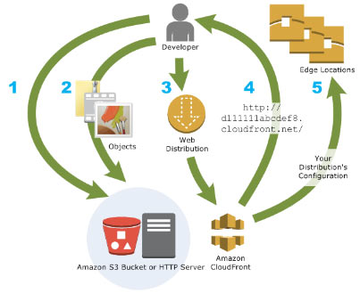

# Amazon CloudFront

- A web service that speeds up distribution of your static and dynamic web  content to your users. A Content Delivery Network (CDN) service.
- It delivers your content through a worldwide network of data centers called **edge locations**. When a user requests content that you’re serving with CloudFront, the  user is routed to the edge location that provides the lowest latency, so that content is delivered with the best possible performance.
  - If the content is already in the edge location with the lowest latency, CloudFront delivers it immediately.
  - If the content is not in that edge location, CloudFront retrieves it from an origin that you’ve defined

### How CloudFront Delivers Content

- You specify **origin servers**, like an S3 bucket or your own HTTP server, from which CloudFront gets  your files which will then be distributed from CloudFront edge locations all over the world.
- Upload your files to your origin servers. Your files, also known as **objects**.
- Create a **CloudFront distribution**, which tells CloudFront which origin servers to get your files from when users request the files through your web site or application. At the  same time, you specify details such as whether you want CloudFront to  log all requests and whether you want the distribution to be enabled as  soon as it’s created.
- CloudFront assigns a domain name to your new distribution that you can see in the CloudFront console.
- CloudFront sends your distribution’s configuration (but not your content) to all of its **edge locations**—collections of servers in geographically dispersed data centers where CloudFront caches copies of your objects.

- CloudFront supports the 

  WebSocket protocol

   as well as the 

  HTTP protocol

   with the following HTTP methods: 

  - GET
  - HEAD
  - POST
  - PUT
  - DELETE
  - OPTIONS
  - PATCH.

- Using **Lambda@Edge** with CloudFront enables a variety of ways to customize the content that CloudFront delivers. It can help you configure your CloudFront  distribution to serve private content from your own custom origin, as an option to using signed URLs or signed cookies.(See AWS Compute Services Lambda Lambda@Edge)

- CloudFront also has **regional edge caches** that bring more of your content closer to your viewers, even when the  content is not popular enough to stay at a CloudFront edge location, to  help improve performance for that content.

- You can use a zone apex name on CloudFront

- CloudFront supports wildcard CNAME

- Different CloudFront Origins

  - **Using S3 buckets for your origin** – you place any objects that you want CloudFront to deliver in an S3 bucket.
  - **Using S3 buckets configured as website endpoints for your origin**
  - **Using a mediastore container or a media package channel for your origin** – you can set up an S3 bucket that is configured as a MediaStore  container, or create a channel and endpoints with MediaPackage. Then you create and configure a distribution in CloudFront to stream the video.
  - **Using EC2 or other custom origins** – A custom origin is an HTTP server, for example, a web server.
  - **Using CloudFront Origin Groups for origin failover** – use origin failover to designate a primary origin for CloudFront plus a second origin that CloudFront automatically switches to when the  primary origin returns specific HTTP status code failure responses.

- Objects are cached for 24 hours by default. You can invalidate files in CloudFront edge caches even before they expire.

- You can configure CloudFront to automatically compress files of certain  types and serve the compressed files when viewer requests include *Accept-Encoding: gzip* in the request header.

- CloudFront can cache different versions of your content based on the values of query string parameters.

- CloudFront Distributions

  - You create a **CloudFront distribution** to tell CloudFront where you want content to be delivered from, and the details about how to track and manage content delivery.
  - You create a distribution and choose the configuration settings you want:
    - Your content origin—that is, the Amazon S3 bucket, MediaPackage channel, or  HTTP server from which CloudFront gets the files to distribute. You can  specify any combination of up to 25 S3 buckets, channels, and/or HTTP  servers as your origins.
    - Access—whether you want the files to be available to everyone or restrict access to some users.
    - Security—whether you want CloudFront to require users to use HTTPS to access your content.
    - Cookie or query-string forwarding—whether you want CloudFront to forward cookies or query strings to your origin.
    - Geo-restrictions—whether you want CloudFront to prevent users in selected countries from accessing your content.
    - Access logs—whether you want CloudFront to create access logs that show viewer activity.
  - You can use distributions to serve the following content over HTTP or HTTPS:
    - Static and dynamic download content.
    - Video on demand in different formats, such as Apple HTTP Live Streaming (HLS) and Microsoft Smooth Streaming. 
    - A live event, such as a meeting, conference, or concert, in real time.
  - Values that you specify when you create or update a distribution
    - Delivery Method – Web or RTMP.
    - Origin Settings – information about one or more locations where you store the original versions of your web content.
    - Cache Behavior Settings – lets you configure a variety of CloudFront  functionality for a given URL path pattern for files on your website.
    - Custom Error Pages and Error Caching
    - Restrictions – if you need to prevent users in selected countries from accessing  your content, you can configure your CloudFront distribution either to  allow users in a **whitelist** of specified countries to access your content or to not allow users in a **blacklist** of specified countries to access your content.

### Cache Behavior Settings

- The functionality that you can configure for each cache behavior includes:
  - The path pattern.
  - If you have configured multiple origins for your CloudFront distribution,  which origin you want CloudFront to forward your requests to.
  - Whether to forward query strings to your origin.
  - Whether accessing the specified files requires signed URLs.
  - Whether to require users to use HTTPS to access those files.
  - The minimum amount of time that those files stay in the CloudFront cache  regardless of the value of any Cache-Control headers that your origin  adds to the files.
- After creating your CloudFront distribution, you can invalidate its cached items by creating an invalidation request.

### Price Class

- Choose the price class that corresponds with the maximum price that you want  to pay for CloudFront service. By default, CloudFront serves your  objects from edge locations in all CloudFront regions.

### Performance and Availability

- CloudFront also allows you to set up multiple origins to enable redundancy with 

  Origin Failover

  . To set up origin failover, you must have a distribution with at least  two origins. Next, you create an origin group for your distribution that includes the two origins, setting one as the primary. Finally, you  define a cache behavior in which you specify the origin group as your  origin.

  - The two origins in the origin group can be any combination of the  following: AWS origins, like Amazon S3 buckets or Amazon EC2 instances,  or custom origins, like your own HTTP web server. 
  - When you create the origin group, you configure CloudFront to failover to  the second origin for GET, HEAD, and OPTIONS HTTP methods when the  primary origin returns specific status codes that you configure.

- CloudFront is optimized for both dynamic and static content, providing extensive  flexibility for optimizing cache behavior, coupled with network-layer  optimizations for latency and throughput.

### Using HTTPS with CloudFront

- You can choose HTTPS settings both for communication between viewers and CloudFront, and between CloudFront and your origin.
- If you want your viewers to use HTTPS and to use alternate domain names  for your files, you need to choose one of the following options for how  CloudFront serves HTTPS requests:
  - Use a dedicated IP address in each edge location
  - Use Server Name Indication (SNI)

### Monitoring

- The billing report is a high-level view of all of the activity for the AWS services that you’re using, including CloudFront.
- The usage report is a summary of activity for a service such as CloudFront, aggregated by hour, day, or month. It also includes usage charts that  provide a graphical representation of your CloudFront usage.
- CloudFront console includes a variety of reports based on the data in CloudFront access logs:
  - CloudFront Cache Statistics Reports
  - CloudFront Popular Objects Report
  - CloudFront Top Referrers Report
  - CloudFront Usage Reports
  - CloudFront Viewers Reports
- You can use AWS Config to record configuration changes for CloudFront distribution settings changes.
- CloudFront integrates with Amazon CloudWatch metrics so that you can monitor your website or application.
- Capture API requests with AWS CloudTrail. CloudFront is a global service. To  view CloudFront requests in CloudTrail logs, you must update an existing trail to include global services.

### Security

- CloudFront, AWS Shield, AWS WAF, and Route 53 work seamlessly together to create a  flexible, layered security perimeter against multiple types of attacks  including network and application layer DDoS attacks.
- You can deliver your content, APIs or applications via SSL/TLS, and advanced SSL features are enabled automatically.
- Through geo-restriction capability, you can prevent users in specific  geographic locations from accessing content that you’re distributing  through CloudFront. 
- With **Origin Access Identity** feature, you can restrict access to an S3 bucket to only be accessible from CloudFront.
- **Field-Level Encryption** is a feature of CloudFront that allows you to securely upload  user-submitted data such as credit card numbers to your origin servers.

### Pricing

- Charge for storage in an S3 bucket.
- Charge for serving objects from edge locations.
- Charge for submitting data to your origin.
  - Data Transfer Out
  - HTTP/HTTPS Requests
  - Invalidation Requests,
  - Dedicated IP Custom SSL certificates associated with a CloudFront distribution.
- You also incur a surcharge for HTTPS requests, and an additional surcharge  for requests that also have field-level encryption enabled.

### Compliance

- CloudFront has been validated as being compliant with Payment Card Industry (PCI) Data Security Standard (DSS).
- CloudFront is a HIPAA eligible service.
- CloudFront is compliant with SOC measures.

### Limits

- The maximum size of a single file that can be delivered through CloudFront is 20 GB.
- Data transfer rate per distribution limit is 40 Gbps.
- Files that you can serve per distribution is unlimited.

 

**Free Amazon CloudFront Tutorials on YouTube:**
https://www.youtube.com/user/AmazonWebServices/search?query=CloudFront

 

**Amazon CloudFront-related Cheat Sheets:**

- [S3 Pre-signed URLs vs CloudFront Signed URLs vs Origin Access Identity (OAI)](../comparison-of-aws-services/s3-pre-signed-urls-vs-cloudfront-signed-urls-vs-origin-access-identity-oai.md)
- [SNI Custom SSL vs Dedicated IP Custom SSL](../comparison-of-aws-services/sni-custom-ssl-vs-dedicated-ip-custom-ssl.md)

# Sources

 https://docs.aws.amazon.com/AmazonCloudFront/latest/DeveloperGuide
 https://aws.amazon.com/cloudfront/features/
 https://aws.amazon.com/cloudfront/pricing/
 https://aws.amazon.com/cloudfront/faqs/