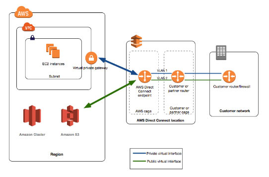

## **AWS Direct Connect**

- Using Direct Connect, data can now be delivered through a private network  connection between AWS and your datacenter or corporate network.
- Direct Connect links your internal network to a Direct Connect location over a standard Ethernet fiber-optic cable. One end of the cable is connected  to your router, the other to a Direct Connect router. With this  connection, you can create *virtual interfaces* directly to public AWS services or to Amazon VPC.
- 1Gbps and 10Gbps ports are available.
- Supports hosted connection capacities of 1, 2, 5 and 10 Gbps. 1, 2, 5 and 10  Gbps hosted connections will provide customers with higher capacities  that were previously only available via dedicated connections.
- Amazon Direct Connect also supports AWS Transit Gateway, aside from configuring Site-to-Site VPN connections. With this feature, customers can connect thousands of Amazon VPCs in  multiple AWS Regions to their on-premises networks using 1/2/5/10 Gbps  AWS Direct Connect connections.

- ### Beneficial Use Cases

  - When transferring large data sets.
  - When developing and using applications that use real-time data feeds.
  - When building hybrid environments that satisfy regulatory requirements requiring the use of private connectivity.

- ### Setting Up Methods

| **Port speed**   | **Method**                                                   |
| ---------------- | ------------------------------------------------------------ |
| 1 Gbps or higher | Connect directly to an AWS device from your router at an AWS Direct Connect location. |
| 1 Gbps or higher | Work with a partner in the AWS Partner Network or a network provider to  connect a router from your data center, office, or colocation  environment to an AWS Direct Connect location. The network provider does not have to be a member of the APN to connect you. |
| Less than 1 Gbps | Work with a partner in the AWS Partner Network who can create a hosted  connection for you. Sign up for AWS and then follow the instructions to  accept your hosted connection. |

- ### Components

  - **Connections** – Create a connection in an AWS Direct Connect location to establish a  network connection from your premises to an AWS Region. From Direct  Connect you can connect to all AZs within the region.
  - **Virtual interfaces** – Create a virtual interface to enable access to AWS services. A public virtual interface enables access to public services, such as S3. A  private virtual interface enables access to your VPC.

- To access public resources in a remote Region, you must set up a public virtual interface and establish a **Border Gateway Protocol** session.

- You can create a **Direct Connect gateway** in any public Region. Use it to connect your Direct Connect connection  over a private virtual interface to VPCs in your account that are  located in different Regions. 

- To provide for failover, request and configure two dedicated connections  to AWS. These connections can terminate on one or two routers in your  network. There are different configuration choices available:

  - **Active/Active (BGP multipath)** – This is the default configuration, where both connections are active. If one connection becomes unavailable, all traffic is routed through  the other connection.
  - **Active/Passive (failover)** – One connection is handling traffic, and the other is on standby. If  the active connection becomes unavailable, all traffic is routed through the passive connection. 

- **Autonomous System numbers (ASN)** are used to identify networks that present a clearly defined external routing policy to the Internet.

- ### Cross Connects

  - After you have downloaded your Letter of Authorization and Connecting  Facility Assignment (LOA-CFA), you must complete your cross-network  connection, also known as a **cross connect**.
  - If you already have equipment located in a Direct Connect location,  contact the appropriate provider to complete the cross connect. 
  - If you do not already have equipment located in a Direct Connect location, you can work with one of the partners in the AWS Partner Network to  help you to connect to an AWS Direct Connect location. 

- ### Virtual Interfaces

  - You must create a virtual interface to begin using your Direct Connect connection.
  - You can configure multiple virtual interfaces on a single AWS Direct Connect connection.
    - For private virtual interfaces, you need **one private virtual interface for each VPC** to connect to from the AWS Direct Connect connection, or you can use a **AWS Direct Connect gateway**.
  - Prerequisites
    - Connection: The Direct Connect connection or link aggregation group for which you are creating the virtual interface.
    - Virtual interface name: A name for the virtual interface.
    - Virtual interface owner
    - (Private virtual interface only) Connection to
    - VLAN: A unique virtual local area network tag that’s not already in use on your connection.
    - Address family: Whether the BGP peering session will be over IPv4 or IPv6.
    - Peer IP addresses: A virtual interface can support a BGP peering session for IPv4, IPv6, or one of each (dual-stack). You cannot create multiple BGP sessions for the same IP addressing family on the same virtual  interface
    - BGP information: A public or private Border Gateway Protocol Autonomous  System Number for your side of the BGP session, and an MD5 BGP  authentication key.
    - (Public virtual interface only) Prefixes you want to advertise: Public IPv4  routes or IPv6 routes to advertise over BGP. You must advertise at least one prefix using BGP.
  - The maximum transmission unit (MTU) of a network connection is the size, in bytes, of the largest permissible packet that can be passed over the  connection. The MTU of a virtual private interface can be either 1500 or 9001 (jumbo frames). The MTU of a transit virtual interface for VPC  Transit Gateways associated with Direct Connect gateways can be either  1500 or 8500 (jumbo frames). A public virtual interface doesn’t support  jumbo frames.
  - Jumbo frames  are supported on virtual private interfaces attached to a virtual  private gateway or a Direct Connect gateway. Jumbo frames apply only to  propagated routes from Direct Connect.

- ### Link Aggregation Groups (LAG)

  - A logical interface that uses the Link Aggregation Control Protocol to  aggregate multiple connections at a single Direct Connect endpoint,  allowing you to treat them as a single, managed connection.
  - All connections in the LAG must use the same bandwidth.
  - You can have a maximum of four connections in a LAG. Each connection in the LAG counts towards your overall connection limit for the Region.
  - All connections in the LAG must terminate at the same Direct Connect endpoint.
  - Can aggregate up to 4 Direct Connect ports into a single connection using LAG.
  - All connections in a LAG operate in Active/Active mode.
  - It will only be available for dedicated 1G and 10G connections.

- ### Direct Connect Gateways

  - Use a Direct Connect gateway to connect your Direct Connect connection over a private virtual interface to one or more VPCs in your account that  are located in the same or different Regions.
  - It is a globally available resource.
  - Direct Connect gateway also enables you to connect between your on-premises  networks and Amazon Virtual Private Cloud (Amazon VPC) in any commercial AWS Region except in China regions.
  - Prior to multi-account support, you could only associate Amazon VPCs with a  Direct Connect gateway in the same AWS account. With the launch of  multi-account support for Direct Connect gateway, you can associate up  to 10 Amazon VPCs from multiple accounts with a Direct Connect gateway.  The VPCs must be owned by AWS Accounts that belong to the same AWS payer account ID.

- ### Security

  - Use IAM for controlling access.

- ### Monitoring

  - You can optionally assign tags to your Direct Connect resources to  categorize or manage them. A tag consists of a key and an optional  value, both of which you define.
  - CloudTrail captures all API calls for AWS Direct Connect as events.
  - Set up CloudWatch alarms to monitor metrics.

- ### Pricing

  - You pay only for the network ports you use and the data you transfer over the connection.
  - Pricing is per port-hour consumed for each port type. Data transfer out over  AWS Direct Connect is charged per GB. Data transfer IN is $0.00 per GB  in all locations.

- ### Limits

| **Component**                                                | **Limit** | **Comments**                   |
| ------------------------------------------------------------ | --------- | ------------------------------ |
| Virtual interfaces per Direct Connect connection             | 50        | This limit cannot be increased |
| Active Direct Connect connections per Region per account     | 10        |                                |
| Routes per Border Gateway Protocol session on a private virtual interface | 100       | This limit cannot be increased |
| Routes per Border Gateway Protocol session on a public virtual interface | 1,000     | This limit cannot be increased |
| Connections per link aggregation group                       | 4         |                                |
| Link aggregation groups per Region                           | 10        |                                |
| Direct Connect gateways per account                          | 200       |                                |
| Virtual private gateways per Direct Connect gateway          | 10        | This limit cannot be increased |
| Virtual interfaces per Direct Connect gateway                | 30        |                                |

 

**AWS Direct Connect Deep Dive:**

https://youtu.be/DXFooR95BYc

**AWS Direct Connect-related Cheat Sheets:**

- [S3 Transfer Acceleration vs Direct Connect vs VPN vs Snowball vs Snowmobile](https://tutorialsdojo.com/aws-cheat-sheet-s3-transfer-acceleration-vs-direct-connect-vs-vpn-vs-snowball-vs-snowmobile/)

 

Sources:
 https://docs.aws.amazon.com/directconnect/latest/UserGuide
 https://aws.amazon.com/directconnect/features/
 https://aws.amazon.com/directconnect/pricing/
 https://aws.amazon.com/directconnect/faqs/

