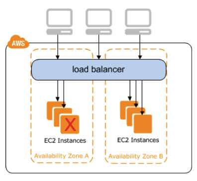

# AWS Elastic Load Balancing (ELB)

- Distributes incoming application or network traffic across multiple targets, such as **EC2 instances**, **containers (ECS)**, **Lambda functions,** and **IP addresses**, in multiple Availability Zones.
- When you create a load balancer, you must specify one public subnet from at  least two Availability Zones. You can specify only one public subnet per Availability Zone.

## General features

- Accepts incoming traffic from clients and routes requests to its registered targets.
- Monitors the health of its registered targets and routes traffic only to healthy targets.
- Enable deletion protection to prevent your load balancer from being deleted accidentally. Disabled by default.
- Deleting ELB won’t delete the instances registered to it.
- **Cross Zone Load Balancing** – when enabled, each load balancer node distributes traffic across the registered targets in all enabled AZs.
- Supports SSL Offloading which is a feature that allows the ELB to bypass the SSL termination by removing the SSL-based encryption from the incoming  traffic.

## Three Types of Load Balancers

### Application Load Balancer
- Functions at the application layer, the **seventh layer** of the Open Systems Interconnection (OSI) model.

- Allows HTTP and HTTPS.

- At least 2 subnets must be specified when creating this type of load balancer.

- Components:

  - A *load balancer* serves as the single point of contact for clients.

  - A *listener* checks for connection requests from clients. You must define a default  rule for each listener that specifies a target group, condition, and  priority.

  - *Target group* routes requests to one or more registered targets. You can register a  target with multiple target groups, and configure health checks on a per target group basis.

    

- Benefits

  - Support for path-based and host-based routing.
  - Support for routing requests to multiple applications on a single EC2 instance. 
  - Support for registering targets by IP address, including targets outside the VPC for the load balancer.
  - Support for containerized applications.
  - Support for monitoring the health of each service independently.

- Cross-zone load balancing is always enabled.

- If you specify targets using an **instance ID**, traffic is routed to instances using the primary private IP address  specified in the primary network interface for the instance. If you  specify targets using **IP addresses**, you can route traffic to an instance using any private IP address from one or more network interfaces.

- You can also specify Lambda functions are targets to serve HTTP(S) requests.

- Supports load balancer-generated cookies only for sticky sessions.

- HTTP/2 Support

- WebSockets Support

- Monitoring:

  - CloudWatch metrics – retrieve statistics about data points for your load balancers and targets as an ordered set of time-series data, known as *metrics*.
  - Access logs – capture detailed information about the requests made to your load balancer and store them as log files in S3.
  - Request tracing – track HTTP requests.
  - CloudTrail logs – capture detailed information about the calls made to the Elastic Load Balancing API and store them as log files in S3.

### Network Load Balancer 

- Functions at the **fourth layer** of the Open Systems Interconnection (OSI) model. Uses TCP and UDP connections.
- At least 1 subnet must be specified when creating this type of load balancer, but the recommended number is 2.
- Components:
  - A load balancer serves as the single point of contact for clients.
  - A listener checks for connection requests from clients.
  - A target group routes requests to one or more registered targets. You can register a target with multiple target groups. You can configure health checks on a per target group basis.
- Benefits
  - Ability to handle volatile workloads and scale to millions of requests per second.
  - Support for static IP addresses for the load balancer, or assign one Elastic IP address per subnet enabled for the load balancer.
  - Support for registering targets by IP address.
  - Support for routing requests to multiple applications on a single EC2 instance  (register each instance or IP address with the same target group using  multiple ports).
  - Support for containerized applications.
  - Support for monitoring the health of each service independently.
- Cross-zone load balancing is disabled by default.
- If you specify targets using an **instance ID**, the source IP addresses of the clients are preserved and provided to your applications. If you specify targets by **IP address**, the source IP addresses are the private IP addresses of the load balancer nodes.
- Network Load Balancers support connections from clients over inter-region VPC  peering, AWS managed VPN, and third-party VPN solutions.
- You can deploy services that rely on the UDP protocol, such as  Authentication and Authorization, Logging, DNS, and IoT, behind a  Network Load Balancer
- Offers multi-protocol listeners, allowing you to run applications such as DNS  that rely on both TCP and UDP protocols on the same port behind a  Network Load Balancer.
- You CANNOT enable or disable Availability Zones for a Network Load Balancer after you create it.
- Network Load Balancers use Proxy Protocol version 2 to send additional  connection information such as the source and destination.
- Preserves the client side source IP allowing the back-end to see the IP address  of the client. This can then be used by applications for further  processing.
- Automatically provides a static IP per Availability Zone (subnet) that can be used by applications as the front-end IP of the load balancer.
- Zonal Isolation
- In the event that your Network load balancer is unresponsive, integration  with Route 53 will remove the unavailable load balancer IP address from  service and direct traffic to an alternate Network Load Balancer in  another region.
- Supports  TLS termination on Network Load Balancers. Additionally, Network Load  Balancers preserve the source IP of the clients to the back-end  applications, while terminating TLS on the load balancer.
- Monitoring:
  - CloudWatch metrics – retrieve statistics about data points for your load balancers and targets as an ordered set of time-series data, known as *metrics*.
  - VPC Flow Logs – capture detailed information about the traffic going to and from your Network Load Balancer.
  - CloudTrail logs – capture detailed information about the calls made to the Elastic Load Balancing API and store them as log files in Amazon S3.

### Classic Load Balancer

- Distributes incoming application traffic across multiple EC2 instances in multiple Availability Zones.

- For use with EC2 classic only. Register instances with the load balancer.  AWS recommends using Application or Network load balancers instead.

  

- To ensure that your registered instances are able to handle the request  load in each AZ, keep approximately the same number of instances in each AZ registered with the load balancer.

- Benefits

  - Support for EC2-Classic
  - Support for TCP and SSL listeners
  - Support for sticky sessions using application-generated cookies

- An **Internet-facing load balancer** has a publicly resolvable DNS name, so it can route requests from  clients over the Internet to the EC2 instances that are registered with  the load balancer. Classic load balancers are always Internet-facing.

- Monitoring:

  - CloudWatch metrics – retrieve statistics about ELB-published data points as an ordered set of time-series data, known as *metrics*.
  - Access logs – capture detailed information for requests made to your load  balancer and stores them as log files in the S3 bucket that you specify.
  - CloudTrail logs – keep track of the calls made to the Elastic Load Balancing API by or on behalf of your AWS account

- **HTTP Headers**

  - Application Load Balancers and Classic Load Balancers support **X-Forwarded-For, X-Forwarded-Proto**, and **X-Forwarded-Port** headers.

- Choose whether to make an 

  internal load balancer

   or an 

  Internet-facing load balancer

  . Classic Load Balancer in EC2-Classic must be an Internet-facing load balancer.

  - The nodes of an Internet-facing load balancer have public IP addresses. 
  - The nodes of an internal load balancer have only private IP addresses.

- Public DNS name format for your load balancers

  - EC2-VPC : *name-1234567890*.*region*.elb.amazonaws.com (supports IPv4 addresses only)
  - EC2-Classic: (support both IPv4 and IPv6 addresses)
    - *name-123456789*.*region*.elb.amazonaws.com
    - ipv6.*name-123456789*.*region*.elb.amazonaws.com 
    - dualstack.*name-123456789*.*region*.elb.amazonaws.com

- **Load Balancer States**

  - **Provisioning** – The load balancer is being set up.
  - **Active** – The load balancer is fully set up and ready to route traffic.
  - **Failed** – The load balancer could not be set up.

- By default, ELB idle timeout value to **60 seconds**. If a target doesn’t send data at least every 60 seconds while the  request is in flight, the load balancer can close the front-end  connection. For back-end connections, enable the *HTTP keep-alive* option for your EC2 instances. 

- You can register each EC2 instance or IP address with the same target group multiple times using different ports, which enables the load balancer  to route requests to microservices.

- **Listeners** define the port and protocol to listen on. 

- Listener rules

   determine how the load balancer routes requests to the targets in one  or more target groups. You can add rules that specify different target  groups based on the content of the request. If no rules are found, the  default rule will be followed. Parts are:

  - Rule priority
  - Rule action
  - Rule conditions

- **Slow Start Mode** gives targets time to warm up before the load balancer sends them a full share of requests.

- **Sticky sessions** route requests to the same target in a target group. You enable sticky  sessions at the target group level. You can also set the duration for  the stickiness of the load balancer-generated cookie, in seconds. Useful if you have stateful applications.

- **Health checks** verify the status of your targets. The statuses for a registered target are:

| **Value** | **Description**                                              |
| --------- | ------------------------------------------------------------ |
| initial   | The load balancer is in the process of registering the target or performing the initial health checks on the target. |
| healthy   | The target is healthy.                                       |
| unhealthy | The target did not respond to a health check or failed the health check. |
| unused    | The target is not registered with a target group, the target group is not  used in a listener rule for the load balancer, or the target is in an  Availability Zone that is not enabled for the load balancer. |
| draining  | The target is deregistering and connection draining is in process. |

 

## Security, Authentication and Access Control

- Use IAM Policies to grant permissions
- Resource-level permissions
- Security groups that control the traffic allowed to and from your load balancer.
   Recommended rules for internet-facing load balancer:

| **Inbound**               |                     |
| ------------------------- | ------------------- |
| **Source**                | **Port Range**      |
| 0.0.0.0/0                 | *listener*          |
| **Outbound**              |                     |
| **Destination**           | ***Port Range\***   |
| *instance security group* | *instance listener* |
| *instance security group* | *health check*      |

For internal load balancer:

| **Inbound**               |                     |
| ------------------------- | ------------------- |
| **Source**                | **Port Range**      |
| *VPC CIDR*                | *listener*          |
| **Outbound**              |                     |
| **Destination**           | **Port Range**      |
| *instance security group* | *instance listener* |
| *instance security group* | *health check*      |

## Summary of Features

## Pricing

- You are charged for each hour or partial hour that an Application Load  Balancer is running and the number of Load Balancer Capacity Units (LCU) used per hour.
- You are charged for each hour or partial hour that a Network Load Balancer  is running and the number of Load Balancer Capacity Units (LCU) used by  Network Load Balancer per hour.
- You are charged for each hour or partial hour that a Classic Load Balancer  is running and for each GB of data transferred through your load  balancer.

**Best Practices on Elastic Load Balancing:**

https://youtu.be/VIgAT7vjol8

**AWS Elastic Load Balancing-related Cheat Sheets:**

- [Application Load Balancer vs Network Load Balancer vs Classic Load Balancer](https://tutorialsdojo.com/application-load-balancer-vs-network-load-balancer-vs-classic-load-balancer/)

**Sources:**

* https://docs.aws.amazon.com/elasticloadbalancing/latest/application/introduction.html
* https://docs.aws.amazon.com/elasticloadbalancing/latest/network/introduction.html
* https://docs.aws.amazon.com/elasticloadbalancing/latest/classic/introduction.html
* https://aws.amazon.com/elasticloadbalancing/features/
* https://aws.amazon.com/elasticloadbalancing/pricing/?nc=sn&loc=3